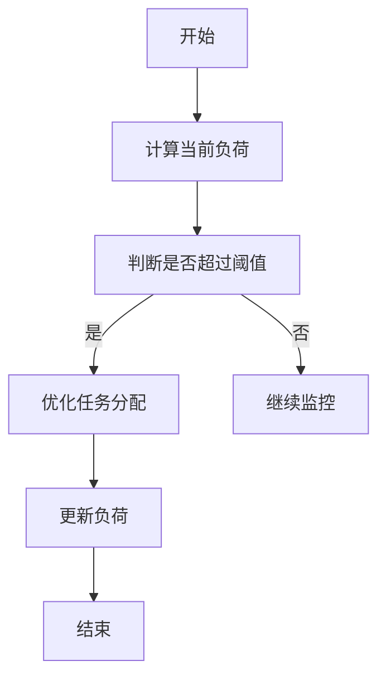
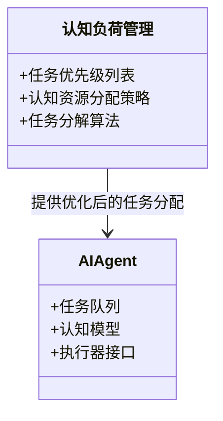
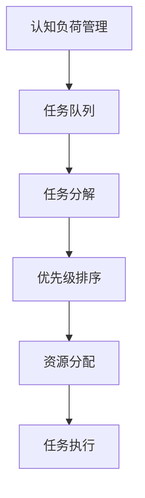
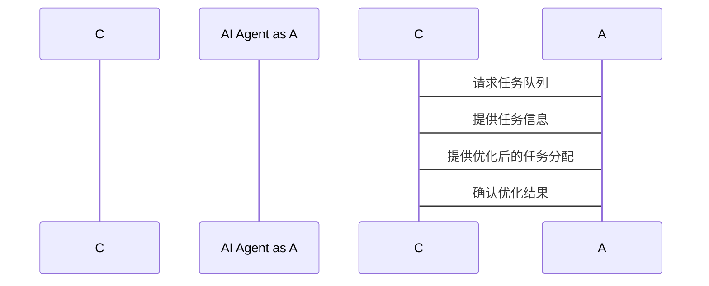

                 


# 从零构建AI Agent的认知负荷管理系统

> 关键词：认知负荷管理，AI Agent，任务分配算法，系统架构设计，优化算法，Python实现

> 摘要：认知负荷管理是优化AI Agent性能的关键技术。本文从背景、原理、算法到系统实现，全面解析认知负荷管理在AI Agent中的应用。通过系统化的分析与实战，提供可落地的解决方案。

---

# 第一部分: 认知负荷管理与AI Agent概述

## 第1章: 认知负荷管理与AI Agent背景介绍

### 1.1 问题背景与描述

#### 1.1.1 认知负荷管理的定义
认知负荷管理是指通过优化认知资源的分配，降低不必要的认知负担，从而提高任务效率和系统性能。在AI Agent中，认知负荷管理是实现高效任务处理的核心技术。

#### 1.1.2 AI Agent的基本概念
AI Agent是一种能够感知环境、自主决策并执行任务的智能实体。它通过传感器获取信息，利用推理机制做出决策，并通过执行器与环境交互。

#### 1.1.3 认知负荷管理在AI Agent中的重要性
在复杂的任务环境中，AI Agent需要处理大量信息，认知负荷过载可能导致决策失误、效率降低。通过有效的认知负荷管理，AI Agent可以更好地分配资源，提高任务完成的质量和效率。

### 1.2 问题解决与边界

#### 1.2.1 认知负荷管理的目标
- 优化认知资源分配，降低不必要的负荷。
- 提高任务处理效率和决策准确性。
- 实现多任务之间的平衡与协调。

#### 1.2.2 AI Agent的认知负荷问题
- 多任务处理时，认知负荷可能超出处理能力。
- 信息过载导致决策效率下降。
- 动态环境中的任务优先级变化需要快速调整。

#### 1.2.3 管理认知负荷的边界与外延
- 边界：认知负荷管理仅处理AI Agent内部的认知资源分配，不涉及外部环境的直接控制。
- 外延：认知负荷管理的结果可能影响AI Agent的行为策略和任务执行顺序。

### 1.3 概念结构与核心要素

#### 1.3.1 认知负荷管理的层次结构
认知负荷管理分为三个层次：感知层、决策层和执行层。感知层负责信息收集，决策层负责任务分配，执行层负责资源分配与优化。

#### 1.3.2 AI Agent的认知模型
AI Agent的认知模型包括感知、推理、决策和执行四个部分。认知负荷管理贯穿于整个认知过程，确保各部分协调工作。

#### 1.3.3 核心要素与关系分析
认知负荷管理的核心要素包括任务优先级、资源分配策略和任务分解方法。这些要素通过动态调整，实现认知负荷的优化。

---

## 第2章: 认知负荷管理的核心概念与联系

### 2.1 核心概念原理

#### 2.1.1 认知负荷管理的原理
认知负荷管理通过动态调整任务优先级和资源分配，优化AI Agent的认知资源利用。核心原理包括任务分解、优先级排序和资源分配。

#### 2.1.2 AI Agent的认知模型
AI Agent的认知模型包括感知、推理、决策和执行四个部分。认知负荷管理贯穿于整个认知过程，确保各部分协调工作。

#### 2.1.3 认知负荷与任务效率的关系
认知负荷过高会导致任务处理效率下降，而适度的负荷可以提高效率。通过优化认知负荷，可以在两者之间找到最佳平衡点。

### 2.2 概念属性特征对比

#### 2.2.1 认知负荷管理的特征分析
- 动态性：认知负荷随任务环境变化而变化。
- 层次性：管理过程分为感知、决策和执行三个层次。
- 目的性：以提高任务效率为目标。

#### 2.2.2 AI Agent的核心属性对比
| 属性       | 认知负荷管理 | AI Agent认知模型 |
|------------|--------------|------------------|
| 目标       | 优化认知资源 | 感知与决策       |
| 方法       | 动态调整     | 推理与执行       |
| 依赖       | 任务优先级   | 环境信息         |

#### 2.2.3 两者关系的对比表格
| 关系         | 认知负荷管理 | AI Agent认知模型 |
|--------------|--------------|------------------|
| 依赖关系     | 任务优先级   | 环境信息         |
| 资源分配     | 认知资源     | 执行资源         |
| 优化目标     | 降低负荷     | 提高效率         |

### 2.3 ER实体关系图

```mermaid
er
  actor 认知负荷管理
  actor AI Agent
  relation 实现
  relation 监控
```

---

## 第3章: 认知负荷管理的算法原理

### 3.1 算法原理概述

#### 3.1.1 认知负荷管理的算法
认知负荷管理算法包括任务分解、优先级排序和资源分配三个步骤。通过动态调整任务优先级，优化认知资源的利用。

#### 3.1.2 AI Agent的任务分配算法
任务分配算法根据任务的复杂度和紧急程度，动态调整任务优先级，确保AI Agent高效处理任务。

#### 3.1.3 负荷优化的数学模型
负荷优化的数学模型通过计算任务复杂度和资源分配权重，动态调整任务优先级，实现认知负荷的优化。

### 3.2 算法流程图



### 3.3 算法实现代码

```python
def calculate_cognitive_load(tasks):
    # 计算认知负荷
    load = sum(len(task) for task in tasks)
    return load

def optimize_task_allocation(tasks, load):
    # 优化任务分配
    optimized_tasks = []
    for task in tasks:
        if load < threshold:
            optimized_tasks.append(task)
    return optimized_tasks

# 示例代码
tasks = ["任务1", "任务2", "任务3"]
threshold = 5
load = calculate_cognitive_load(tasks)
optimized_tasks = optimize_task_allocation(tasks, load)
print(optimized_tasks)
```

### 3.4 数学模型与公式

#### 3.4.1 计算公式
$$\text{认知负荷} = \sum_{i=1}^{n} \text{任务复杂度}_i$$

#### 3.4.2 优化公式
$$\text{优化后负荷} = \sum_{i=1}^{m} \text{优化任务复杂度}_i$$

---

## 第4章: 系统分析与架构设计

### 4.1 问题场景介绍

#### 4.1.1 项目背景
本项目旨在开发一个基于认知负荷管理的AI Agent系统，用于优化多任务处理的效率和质量。

### 4.2 系统功能设计

#### 4.2.1 领域模型设计



### 4.3 系统架构设计

#### 4.3.1 系统架构图



#### 4.3.2 系统接口设计
- 输入接口：任务队列、环境信息。
- 输出接口：优化后的任务分配、认知负荷报告。

### 4.4 系统交互设计

#### 4.4.1 系统交互图



---

## 第5章: 项目实战

### 5.1 环境安装

#### 5.1.1 安装Python
```bash
python --version
pip install --upgrade pip
```

#### 5.1.2 安装依赖库
```bash
pip install numpy
pip install matplotlib
```

### 5.2 系统核心实现

#### 5.2.1 认知负荷管理模块
```python
class CognitiveLoadManager:
    def __init__(self):
        self.tasks = []
        self.threshold = 5

    def calculate_load(self):
        return sum(len(task) for task in self.tasks)

    def optimize_allocation(self):
        optimized_tasks = []
        for task in self.tasks:
            if self.calculate_load() < self.threshold:
                optimized_tasks.append(task)
        return optimized_tasks
```

#### 5.2.2 AI Agent模块
```python
class AI_Agent:
    def __init__(self, manager):
        self.manager = manager
        self.tasks = []

    def process_task(self):
        optimized_tasks = self.manager.optimize_allocation()
        for task in optimized_tasks:
            self.execute_task(task)

    def execute_task(self, task):
        print(f"执行任务：{task}")
```

### 5.3 案例分析与解读

#### 5.3.1 案例分析
```python
# 初始化认知负荷管理模块
manager = CognitiveLoadManager()
manager.tasks = ["任务1", "任务2", "任务3"]

# 初始化AI Agent模块
agent = AI_Agent(manager)
agent.process_task()
```

#### 5.3.2 代码实现
```python
# 计算认知负荷
def calculate_cognitive_load(tasks):
    return sum(len(task) for task in tasks)

# 优化任务分配
def optimize_task_allocation(tasks, load, threshold=5):
    optimized_tasks = []
    for task in tasks:
        if load < threshold:
            optimized_tasks.append(task)
    return optimized_tasks

# 示例代码
tasks = ["任务1", "任务2", "任务3"]
threshold = 5
load = calculate_cognitive_load(tasks)
optimized_tasks = optimize_task_allocation(tasks, load, threshold)
print(optimized_tasks)
```

---

## 第6章: 总结与展望

### 6.1 最佳实践Tips
- 定期监控认知负荷，及时调整任务分配。
- 根据任务特性动态调整阈值。
- 优化认知负荷管理算法，提高系统性能。

### 6.2 本章小结
认知负荷管理是优化AI Agent性能的关键技术。通过本文的系统化分析与实战，我们可以更好地理解和实现认知负荷管理，提高AI Agent的任务处理效率和质量。

### 6.3 注意事项
- 确保认知负荷管理算法的实时性和准确性。
- 定期测试和优化系统，确保其稳定性和可靠性。

### 6.4 拓展阅读
- 《AI Agent设计与实现》
- 《认知科学与人工智能》
- 《优化算法与复杂系统》

---

作者：AI天才研究院/AI Genius Institute & 禅与计算机程序设计艺术/Zen And The Art of Computer Programming

