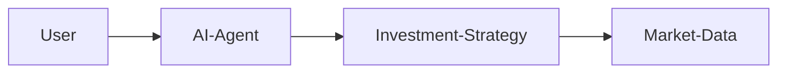
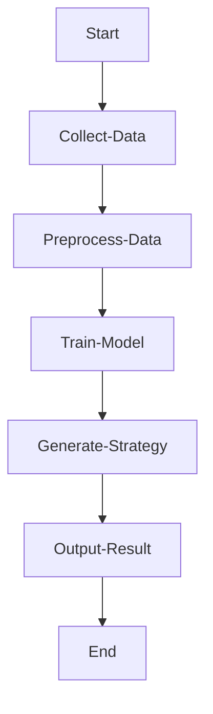
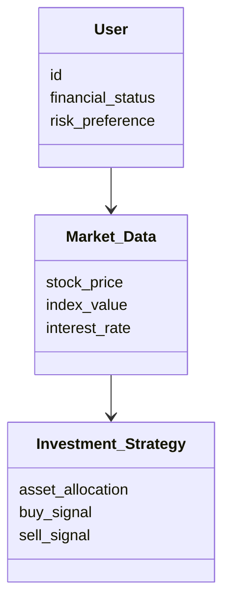
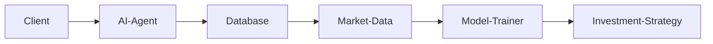
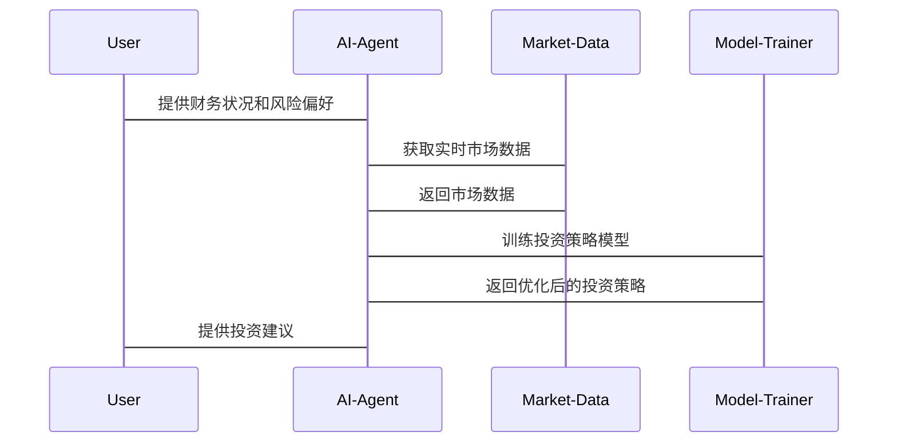

                 


# 从零构建投资理财智能助手AI Agent：基本概念与架构设计

> 关键词：投资理财，AI Agent，算法原理，系统架构，项目实战，最佳实践

> 摘要：本文从投资理财领域的挑战与痛点出发，系统地介绍了投资理财智能助手AI Agent的基本概念、核心原理、算法实现、系统架构设计以及项目实战等内容。通过详细的技术分析和案例解读，帮助读者全面理解如何构建一个高效的投资理财智能助手AI Agent。

---

## 第一部分：投资理财智能助手AI Agent的背景与概念

### 第1章：投资理财智能助手AI Agent的背景与问题描述

#### 1.1 投资者面临的常见问题
投资理财领域存在许多挑战，例如：
- **信息过载**：金融市场数据复杂且实时更新，投资者难以快速获取和分析关键信息。
- **决策延迟**：传统投资工具依赖人工分析，耗时且效率低。
- **个性化需求**：每个投资者的财务状况、风险偏好和目标不同，需要个性化的投资建议。

#### 1.2 现有投资工具的局限性
- **传统投资顾问**：依赖人工经验，服务成本高，覆盖范围有限。
- **在线投资平台**：功能单一，缺乏智能化和个性化。
- **量化投资工具**：依赖复杂的数学模型，难以满足普通投资者需求。

#### 1.3 AI技术在投资理财中的潜在价值
- **智能化分析**：AI能够快速处理大量数据，提供实时投资建议。
- **个性化服务**：通过机器学习模型，AI可以为不同投资者定制个性化策略。
- **自动化决策**：AI可以在市场变化时快速做出反应，优化投资组合。

#### 1.4 投资理财智能助手AI Agent的核心目标
- 提供实时、个性化的投资建议。
- 自动化优化投资组合。
- 提高投资效率，降低决策风险。

#### 1.5 功能边界与适用场景
- **边界**：专注于提供投资建议和策略生成，不直接进行交易操作。
- **适用场景**：适用于个人投资者、机构投资者以及财富管理平台。

---

### 第2章：AI Agent的基本原理与核心概念

#### 2.1 AI Agent的核心概念
AI Agent是一种能够感知环境、理解用户需求并采取行动的智能系统。在投资理财领域，AI Agent的主要功能包括：
- **知识表示与推理**：将投资知识转化为可计算的模型。
- **用户需求分析**：通过用户输入和历史数据，分析用户的财务状况和风险偏好。
- **投资策略生成**：基于市场数据和用户需求，生成个性化的投资策略。

#### 2.2 核心概念的属性对比
| 概念 | 特性 |
|------|------|
| 知识表示 | 需要将投资知识转化为数据结构 |
| 用户需求分析 | 需要理解用户的财务状况和风险偏好 |
| 投资策略生成 | 需要根据市场变化动态调整策略 |

#### 2.3 实体关系图


---

## 第二部分：AI Agent的算法原理

### 第3章：AI Agent的算法原理

#### 3.1 算法原理概述
- **基于规则的策略生成**：通过预定义的规则生成投资策略。
- **基于机器学习的投资预测**：使用回归、分类等算法预测市场走势。
- **强化学习在投资决策中的应用**：通过试错学习优化投资策略。

#### 3.2 算法流程图


#### 3.3 算法实现代码示例
```python
import numpy as np

def generate_investment_strategy(data):
    # 数据预处理
    processed_data = preprocess(data)
    # 模型训练
    model = train_model(processed_data)
    # 策略生成
    strategy = model.predict(processed_data)
    return strategy
```

#### 3.4 算法数学模型
- **强化学习模型**：使用Q-learning算法，状态空间为市场数据，动作空间为投资策略。
$$ Q(s, a) = r + \gamma \max_{a'} Q(s', a') $$

---

## 第三部分：系统分析与架构设计

### 第4章：系统分析与架构设计方案

#### 4.1 问题场景介绍
- **用户需求**：投资者需要实时的投资建议和个性化的投资策略。
- **数据来源**：包括历史市场数据、用户行为数据、经济指标等。

#### 4.2 领域模型设计


#### 4.3 系统架构设计


#### 4.4 接口设计与交互流程


---

## 第四部分：项目实战

### 第5章：投资理财智能助手AI Agent的实现

#### 5.1 环境安装与依赖项
- **Python**：3.8+
- **依赖库**：numpy、pandas、scikit-learn、matplotlib

#### 5.2 核心代码实现

```python
import numpy as np
import pandas as pd
from sklearn.model_selection import train_test_split
from sklearn.linear_model import LinearRegression

def preprocess(data):
    # 数据清洗和特征工程
    data.dropna(inplace=True)
    data['return'] = data['close'].pct_change()
    return data

def train_model(data):
    # 训练回归模型
    X = data[['open', 'high', 'low', 'volume']]
    y = data['return']
    X_train, X_test, y_train, y_test = train_test_split(X, y, test_size=0.2)
    model = LinearRegression()
    model.fit(X_train, y_train)
    return model

def generate_strategy(model, data):
    # 生成投资策略
    predictions = model.predict(data)
    return predictions
```

#### 5.3 代码功能解读
- **数据预处理**：清洗数据并计算收益率。
- **模型训练**：使用线性回归模型预测市场走势。
- **策略生成**：基于模型预测生成投资策略。

#### 5.4 实际案例分析
- **案例**：假设市场数据为股票价格数据，模型预测未来三天的走势，生成买入或卖出信号。

#### 5.5 项目小结
通过实际案例，展示了如何利用AI技术构建投资理财智能助手，并对系统实现的关键步骤进行了详细解读。

---

## 第五部分：最佳实践与总结

### 第6章：投资理财智能助手AI Agent的最佳实践

#### 6.1 小结
- AI Agent能够显著提升投资理财的效率和准确性。
- 通过机器学习和强化学习算法，可以实现个性化的投资策略。

#### 6.2 注意事项
- 数据质量对模型性能影响重大，需谨慎处理数据。
- 需定期更新模型，以适应市场变化。

#### 6.3 拓展阅读
- 推荐阅读《机器学习实战》和《投资学原理》。

---

## 作者

作者：AI天才研究院/AI Genius Institute & 禅与计算机程序设计艺术 /Zen And The Art of Computer Programming

