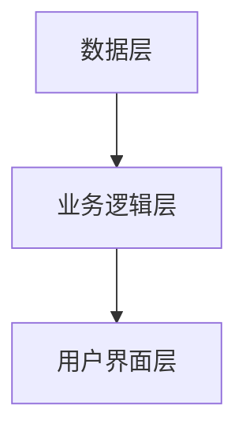

                 


# 价值投资vs量化投资：传统与现代的碰撞

> 关键词：价值投资，量化投资，传统投资，现代投资，投资策略，金融创新

> 摘要：本文探讨了价值投资与量化投资这两种不同投资策略的对比，分析了它们在传统与现代金融中的碰撞与融合。通过背景介绍、核心概念、算法原理、系统架构、项目实战和未来展望等方面，详细阐述了两种投资策略的特点、优缺点及应用场景，帮助读者理解如何在实际投资中灵活运用这两种策略。

---

## 第一部分: 价值投资与量化投资的背景介绍

### 第1章: 价值投资与量化投资的核心概念

#### 1.1 价值投资的定义与特点

价值投资是一种以基本面分析为基础的投资策略，强调以低于内在价值的价格买入优质资产，长期持有，等待市场对其价值的重新认识。其核心在于寻找被市场低估的公司，并通过长期持有实现收益。

- **基本概念**：价值投资关注公司的内在价值，即其未来现金流的现值，而非当前市场价。
- **核心原则**：
  - 价格与价值的差异是投资机会的来源。
  - 市场先生的短期波动不可预测，但长期趋向于反映公司的真实价值。
  - 集中投资于少数优质企业，避免过度分散。
- **适用场景**：适合长期投资者，尤其在市场低估时买入，适合对特定行业有深入研究的投资者。

#### 1.2 量化投资的定义与特点

量化投资是一种基于数学模型和算法的投资策略，通过大量数据和统计分析来寻找投资机会。其核心在于利用计算机技术快速处理信息，捕捉市场中的套利机会或趋势。

- **基本概念**：量化投资依赖于数学模型和算法，通过数据驱动的决策进行投资。
- **核心原则**：
  - 数据驱动决策：利用历史数据和实时数据进行分析。
  - 系统化交易：制定明确的交易规则，避免人为情绪干扰。
  - 高频交易：利用算法快速执行交易，捕捉短期价格波动。
- **适用场景**：适合短期投资者，尤其在市场波动剧烈时，适合对技术分析有深入研究的投资者。

#### 1.3 价值投资与量化投资的对比分析

价值投资和量化投资在多个方面存在显著差异，从目标导向、数据依赖到持有周期、策略灵活性等。下表展示了两者的对比：

| 对比维度        | 价值投资                          | 量化投资                          |
|-----------------|-----------------------------------|------------------------------------|
| 投资目标         | 寻找低估的优质资产                | 利用数据和模型寻找投资机会        |
| 数据依赖         | 依赖基本面分析                    | 依赖大量数据和统计分析             |
| 持股周期         | 长期持有                          | 短期交易，高频操作                |
| 风险控制         | 通过安全边际降低风险              | 通过模型和系统化交易控制风险       |
| 适用市场         | 更适合成熟稳定的市场              | 更适合波动剧烈或有套利机会的市场  |

通过对比，可以看出价值投资和量化投资在策略选择上各有优劣，投资者需要根据自身情况选择适合的策略。

---

## 第二部分: 价值投资与量化投资的核心概念与联系

### 第2章: 价值投资的原理与实现

#### 2.1 价值投资的原理

价值投资的原理基于基本面分析，强调公司内在价值的评估。其核心在于寻找价格低于内在价值的公司，并长期持有。

- **基本面分析**：分析公司的财务报表、行业地位、竞争优势等，评估其内在价值。
- **安全边际**：买入价格低于内在价值，留出安全空间以应对市场波动。
- **股票估值方法**：如DCF模型、PE、PB等指标，评估公司价值。

#### 2.2 价值投资的实现步骤

1. 确定投资目标：选择行业和公司，分析其财务状况。
2. 进行基本面分析：评估公司的盈利能力、成长性、竞争优势。
3. 评估安全边际：计算买入价格与内在价值的差距。
4. 构建投资组合：集中投资于少数优质企业，分散风险。

### 第3章: 量化投资的原理与实现

#### 3.1 量化投资的原理

量化投资基于数学模型和算法，利用数据驱动的决策进行投资。其核心在于通过统计套利和高频交易捕捉市场机会。

- **数据驱动决策**：收集和分析大量市场数据，寻找投资机会。
- **统计套利**：利用资产定价中的错误套利机会。
- **机器学习**：通过算法分析数据，预测市场走势。

#### 3.2 量化投资的实现步骤

1. 数据收集与预处理：获取市场数据，清洗和标准化。
2. 模型构建与回测：设计交易策略，使用历史数据进行回测。
3. 交易执行：根据模型信号进行自动化交易。

### 第4章: 价值投资与量化投资的联系

价值投资和量化投资并非对立，而是互补。价值投资提供长期视角，量化投资提供短期机会。通过结合两者，投资者可以在不同市场条件下灵活调整策略。

- **优势互补**：价值投资捕捉长期价值，量化投资捕捉短期机会。
- **策略融合**：在市场低估时采用价值投资，市场高估时利用量化策略。

---

## 第三部分: 算法原理讲解

### 第4章: 价值投资的算法实现

#### 4.1 基本面分析算法

价值投资的算法基于基本面分析，通过量化指标评估公司价值。以下是一个简单的Python实现：

```python
def calculate_intrinsic_value(company_data):
    # 公司数据包括收入、利润、现金流等
    # 使用DCF模型计算内在价值
    free_cash_flow = company_data['free_cash_flow']
    discount_rate = company_data['discount_rate']
    growth_rate = company_data['growth_rate']
    
    # 简单DCF模型计算
    terminal_value = free_cash_flow * (1 + growth_rate) / (discount_rate - growth_rate)
    present_value = terminal_value / (1 + discount_rate)
    return present_value
```

#### 4.2 价值投资策略的数学模型

价值投资的数学模型可以表示为：

$$ \text{内在价值} = \frac{\text{自由现金流}}{1 + d} $$

其中，d是折现率。

### 第5章: 量化投资的算法实现

#### 5.1 统计套利算法

量化投资中的统计套利算法通过寻找资产定价中的错误来获利。以下是一个简单的Python实现：

```python
def statistical_arbitrage(stocks, window=20):
    # 计算短期均线差
    stock_prices = stocks['close']
    short_ma = stock_prices.rolling(window=5).mean()
    long_ma = stock_prices.rolling(window=20).mean()
    spread = short_ma - long_ma
    
    # 确定交易信号
    signal = spread.shift(1)
    signal[signal > 0] = 1
    signal[signal < 0] = -1
    signal = signal.fillna(0)
    
    return signal
```

#### 5.2 量化投资策略的数学模型

量化投资的数学模型可以表示为：

$$ \text{收益} = \sum_{i=1}^{n} w_i \times r_i $$

其中，\( w_i \) 是权重，\( r_i \) 是收益。

---

## 第四部分: 系统分析与架构设计

### 第6章: 对比分析系统的设计

#### 6.1 系统功能设计

- 数据收集模块：收集股票数据。
- 模型构建模块：构建价值和量化模型。
- 对比分析模块：分析两种策略的优劣。

#### 6.2 系统架构设计

使用分层架构，包括数据层、业务逻辑层和用户界面层。以下是一个简单的架构图：



---

## 第五部分: 项目实战

### 第7章: 实战案例分析

#### 7.1 价值投资案例

选择一只低估股票，分析其基本面，计算内在价值，制定投资计划。

#### 7.2 量化投资案例

设计一个统计套利模型，收集数据，回测策略，执行交易。

---

## 第六部分: 总结与展望

### 第8章: 总结

价值投资和量化投资各有优劣，投资者需要根据市场环境和个人能力选择合适的策略。两者的结合可以提供更全面的投资视角。

### 第9章: 注意事项

- 风险控制：无论采用哪种策略，都需要严格控制风险。
- 持续学习：市场变化快，需不断学习和调整策略。

### 第10章: 未来展望

随着人工智能的发展，量化投资将更加精确，而价值投资将更加依赖于技术辅助分析。两者将更加融合，推动投资策略的创新。

---

## 作者

作者：AI天才研究院/AI Genius Institute  
禅与计算机程序设计艺术 /Zen And The Art of Computer Programming

---

这篇文章通过详细分析价值投资和量化投资的背景、原理、算法实现和系统设计，帮助读者全面理解这两种投资策略的优劣和应用场景。通过实际案例分析，读者可以更好地掌握如何在实际投资中灵活运用这两种策略。希望这篇文章能为投资者提供有价值的参考，帮助他们在传统与现代投资策略中找到最佳的结合点。

