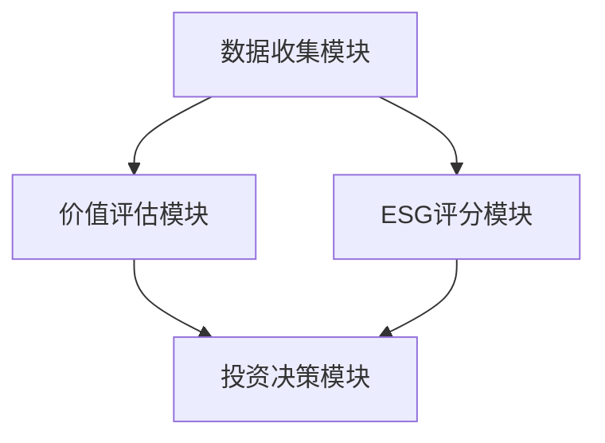

                 


# 价值投资与ESG：社会责任投资的融合

> 关键词：价值投资，ESG，社会责任投资，可持续发展，投资策略

> 摘要：本文探讨了价值投资与ESG（环境、社会、治理）的融合，分析了两者的核心理念、联系与区别，提出了基于ESG评分的数学模型，并通过实际案例展示了如何在投资中应用这些理论。文章旨在为投资者提供一种结合长期价值与社会责任的投资策略。

---

## 第一部分: 价值投资与ESG的背景与概念

### 第1章: 价值投资与ESG的概述

#### 1.1 价值投资的核心理念
##### 1.1.1 价值投资的定义与起源
价值投资是一种长期投资策略，起源于20世纪，由本杰明·格雷厄姆和戴维·多德提出。其核心理念是寻找市场价格低于其内在价值的股票，通过长期持有实现收益。

##### 1.1.2 价值投资的基本原则
- **安全边际**：买入价格低于内在价值，以降低风险。
- **企业基本面分析**：关注企业的盈利能力、财务状况和行业地位。
- **长期持有**：避免短期市场波动，关注企业长期价值。

##### 1.1.3 价值投资的适用场景
- **稳定行业**：如公用事业、消费品等。
- **成熟企业**：具有稳定的盈利能力和良好的财务状况。
- **市场恐慌时期**：市场低估优质资产时，价值投资机会显现。

#### 1.2 ESG的核心概念
##### 1.2.1 环境（Environmental）的定义与重要性
环境因素关注企业在环境保护方面的表现，包括碳排放、资源利用效率和环保合规性。随着全球气候变化问题的加剧，环境因素已成为投资者的重要考量。

##### 1.2.2 社会责任（Social）的定义与实践
社会责任指企业在社会方面的贡献，包括员工权益、社区支持和公平贸易。社会责任强的企业通常更具社会信誉，有助于长期发展。

##### 1.2.3 公司治理（Governance）的定义与关键要素
公司治理涉及董事会结构、高管薪酬和股东权利。良好的治理结构能有效监督管理层，减少企业风险。

### 第2章: 价值投资与ESG的融合背景

#### 2.1 价值投资与ESG的融合动因
##### 2.1.1 全球可持续发展的趋势
全球气候变化、社会不平等等问题推动投资者关注企业的可持续发展能力。

##### 2.1.2 投资者对社会责任的关注
越来越多的投资者意识到，社会责任强的企业更具长期投资价值。

##### 2.1.3 ESG投资的兴起与价值投资的结合
ESG投资兴起于21世纪初，与价值投资的长期视角相结合，形成了新的投资策略。

#### 2.2 价值投资与ESG的融合意义
##### 2.2.1 提升投资的长期价值
通过关注企业的社会责任和治理结构，投资者可以更全面地评估企业价值。

##### 2.2.2 优化企业治理结构
良好的治理结构有助于企业长期稳定发展，减少投资风险。

##### 2.2.3 推动社会可持续发展
投资于注重环境和社会责任的企业，有助于推动全球可持续发展目标的实现。

---

## 第二部分: 价值投资与ESG的核心概念与联系

### 第3章: 价值投资与ESG的核心概念

#### 3.1 价值投资的核心要素
##### 3.1.1 企业基本面分析
分析企业的收入、利润、现金流和资产负债表，评估其财务健康状况。

##### 3.1.2 估值与安全边际
计算企业的内在价值，确保买入价格低于内在价值，以降低投资风险。

##### 3.1.3 长期投资策略
避免短期市场波动，关注企业的长期增长潜力。

#### 3.2 ESG的核心要素
##### 3.2.1 环境因素（Environmental）
- 碳排放量
- 能源利用效率
- 环保合规性

##### 3.2.2 社会责任（Social）
- 员工权益
- 社区支持
- 公平贸易

##### 3.2.3 公司治理（Governance）
- 董事会结构
- 高管薪酬
- 股东权利

### 第4章: 价值投资与ESG的联系与区别

#### 4.1 价值投资与ESG的联系
##### 4.1.1 长期投资视角的契合
价值投资关注长期价值，ESG投资注重企业的可持续发展能力，两者都强调长期视角。

##### 4.1.2 社会责任与企业价值的结合
企业社会责任的履行能够提升企业的品牌形象，增强市场竞争力，从而提升企业价值。

##### 4.1.3 可持续发展与投资回报的统一
通过关注ESG因素，投资者可以找到那些在财务表现和社会责任方面都表现优异的企业，从而实现投资回报与可持续发展的统一。

#### 4.2 价值投资与ESG的区别
##### 4.2.1 投资目标的不同
价值投资的目标是寻找市场价格低于内在价值的企业，而ESG投资的目标是筛选出在环境、社会和治理方面表现优异的企业。

##### 4.2.2 分析方法的差异
价值投资主要依赖于基本面分析和估值模型，而ESG投资则需要构建ESG评分体系，结合定量和定性分析。

##### 4.2.3 关注维度的差异
价值投资关注企业的内在价值和财务表现，而ESG投资则关注企业的环境、社会和治理表现。

---

## 第三部分: 价值投资与ESG的数学模型与算法原理

### 第5章: 价值投资的数学模型

#### 5.1 价值投资的核心公式
##### 5.1.1 现金流折现模型（DCF）
$$DCF = \sum_{t=1}^{n} \frac{CF_t}{(1+r)^t} + \frac{TV}{(1+r)^n}$$
其中，$CF_t$为第t年的现金流，$r$为折现率，$TV$为终值。

##### 5.1.2 市盈率与市净率分析
市盈率（P/E）= 股价 / 每股收益
市净率（P/B）= 股价 / 每股净资产

##### 5.1.3 安全边际计算公式
$$安全边际 = 市场价格 < 内在价值$$

#### 5.2 价值投资的算法流程
1. 收集目标企业的财务数据。
2. 计算企业的内在价值。
3. 比较市场价格与内在价值，寻找低估企业。
4. 进行基本面分析，评估企业长期发展潜力。
5. 做出投资决策。

### 第6章: ESG评分的数学模型与算法

#### 6.1 ESG评分的核心公式
##### 6.1.1 环境评分公式
$$E = \alpha \cdot 碳排放量 + \beta \cdot 能源利用效率 + \gamma \cdot 环保合规性$$
其中，$\alpha$、$\beta$、$\gamma$为权重系数。

##### 6.1.2 社会评分公式
$$S = \alpha \cdot 员工权益 + \beta \cdot 社区支持 + \gamma \cdot 公平贸易$$

##### 6.1.3 治理评分公式
$$G = \alpha \cdot 董事会结构 + \beta \cdot 高管薪酬 + \gamma \cdot 股东权利$$

#### 6.2 ESG评分的算法流程
1. 收集企业的环境、社会和治理数据。
2. 根据权重系数计算各项评分。
3. 综合环境、社会和治理评分，得出企业的ESG总评分。
4. 根据ESG评分和企业基本面分析，筛选出符合价值投资条件的企业。

---

## 第四部分: 价值投资与ESG的系统分析与设计

### 第7章: 价值投资与ESG的系统架构设计

#### 7.1 系统功能设计
- 数据收集模块：收集企业的财务数据和ESG数据。
- 价值评估模块：计算企业的内在价值。
- ESG评分模块：根据模型计算企业的ESG评分。
- 投资决策模块：综合价值评估和ESG评分，做出投资决策。

#### 7.2 系统架构设计


#### 7.3 系统交互设计
```mermaid
sequenceDiagram
    participant 投资者
    participant 数据收集模块
    participant 价值评估模块
    participant ESG评分模块
    participant 投资决策模块
   投资者 -> 数据收集模块：提交企业名单
   数据收集模块 -> 价值评估模块：传输财务数据
   数据收集模块 -> ESG评分模块：传输ESG数据
   价值评估模块 -> 投资决策模块：传输价值评估结果
   ESG评分模块 -> 投资决策模块：传输ESG评分结果
   投资决策模块 -> 投资者：输出投资建议
```

---

## 第五部分: 价值投资与ESG的项目实战

### 第8章: 价值投资与ESG的项目实战

#### 8.1 项目环境与工具
- 数据来源：企业财务数据和ESG评级数据。
- 工具：Python、Pandas、Matplotlib。

#### 8.2 项目核心实现
##### 8.2.1 环境影响评分
```python
import pandas as pd
import numpy as np

def calculate_env_score(data):
    # 碳排放量
    carbon_emissions = data['carbon_emissions']
    # 能源利用效率
    energy_efficiency = data['energy_efficiency']
    # 环保合规性
    environmental_compliance = data['environmental_compliance']
    
    # 计算环境评分
    env_score = carbon_emissions * 0.4 + energy_efficiency * 0.3 + environmental_compliance * 0.3
    return env_score
```

##### 8.2.2 社会责任评分
```python
def calculate_social_score(data):
    # 员工权益
    employee_rights = data['employee_rights']
    # 社区支持
    community_support = data['community_support']
    # 公平贸易
    fair_trade = data['fair_trade']
    
    # 计算社会评分
    social_score = employee_rights * 0.4 + community_support * 0.3 + fair_trade * 0.3
    return social_score
```

##### 8.2.3 治理评分
```python
def calculate_governance_score(data):
    # 董事会结构
    board_structure = data['board_structure']
    # 高管薪酬
    executive_compensation = data['executive_compensation']
    # 股东权利
    shareholder_rights = data['shareholder_rights']
    
    # 计算治理评分
    governance_score = board_structure * 0.4 + executive_compensation * 0.3 + shareholder_rights * 0.3
    return governance_score
```

#### 8.3 项目小结
通过上述代码，我们可以计算出企业的环境、社会和治理评分，结合价值评估模型，筛选出符合价值投资条件且社会责任表现优异的企业。

---

## 第六部分: 总结与展望

### 第9章: 总结与展望

#### 9.1 最佳实践 tips
- 在投资决策中，应综合考虑企业的内在价值和ESG表现。
- 定期更新企业数据和ESG评分，确保投资决策的科学性。

#### 9.2 小结
价值投资与ESG的融合为投资者提供了一种新的投资策略，既关注企业的长期价值，又注重企业的社会责任和可持续发展能力。

#### 9.3 注意事项
- 数据的准确性和完整性是关键。
- ESG评分模型需要根据行业特点进行调整。

#### 9.4 拓展阅读
- 格雷厄姆的《证券分析》
- 联合国可持续发展目标（SDGs）

---

作者：AI天才研究院/AI Genius Institute & 禅与计算机程序设计艺术/Zen And The Art of Computer Programming

