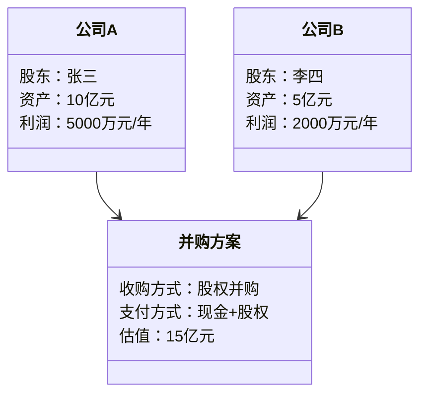
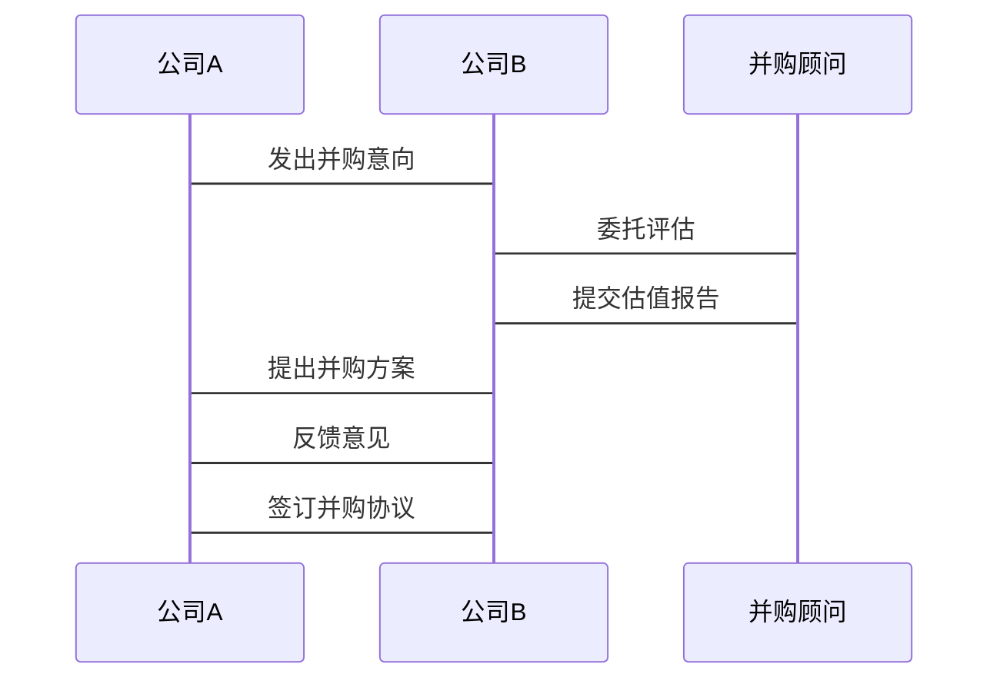

                 


# 《价值投资与公司并购策略》

## 关键词：价值投资，公司并购，股票估值，安全边际，风险管理

## 摘要：  
本文深入探讨了价值投资与公司并购的核心策略，结合实际案例和系统分析，揭示了如何通过科学的估值方法和并购策略来实现长期投资收益最大化。文章从价值投资的基本原理出发，分析了公司并购的动机、类型和目标筛选，提出了基于现金流折现法和并购估值模型的系统架构设计，并通过实际案例展示了如何在复杂市场环境中制定最优并购策略。此外，本文还探讨了并购中的风险管理和策略优化方法，为投资者提供了实用的指导。

---

## 第一章：价值投资与公司并购概述

### 1.1 价值投资的核心理念  
价值投资是一种以低于内在价值的价格买入优质资产的投资策略，其核心在于寻找市场低估的公司。  
- **内在价值**：公司未来现金流的现值，可通过DCF模型计算。  
- **安全边际**：买入价格与内在价值之间的差距，是投资安全的保障。  

#### 1.1.1 价值投资的定义与背景  
价值投资由本杰明·格雷厄姆提出，强调安全边际和长期持有的理念。  
- **背景**：20世纪初，市场波动剧烈，投资者需要一种稳健的投资方法。  
- **核心原则**：  
  1. 以合理价格买入优质资产。  
  2. 长期持有，避免频繁交易。  

#### 1.1.2 价值投资与公司并购的关联  
- **并购机会**：公司并购常被视作价值投资的机会，尤其是当目标公司被低估时。  
- **协同效应**：并购后的企业价值可能因协同效应而提升。  

---

## 第二章：价值投资的核心策略

### 2.1 股票估值的核心方法  
股票估值是价值投资的基础，以下是三种主要方法：  

#### 2.1.1 现金流折现法（DCF模型）  
DCF模型通过将未来现金流折现为现值来估算公司价值。  
- **公式**：  
  $$ V = \sum_{t=1}^{n} \frac{CF_t}{(1+r)^t} + \frac{TV}{(1+r)^n} $$  
  其中，\( CF_t \) 是第 \( t \) 年的现金流，\( r \) 是折现率，\( TV \) 是终值。  

#### 2.1.2 市盈率与市净率分析  
- **市盈率（P/E）**：股价与每股收益的比值，反映市场对公司盈利能力的预期。  
- **市净率（P/B）**：股价与每股净资产的比值，适用于重资产行业。  

#### 2.1.3 内在价值与市场价值的对比  
- **内在价值**：基于公司基本面计算的理论价值。  
- **市场价值**：市场交易形成的实际价值，可能高于或低于内在价值。  

### 2.2 安全边际的概念与应用  
安全边际是投资中避免重大损失的关键。  
- **计算方法**：  
  $$ \text{安全边际} = \text{买入价} - \text{内在价值} $$  
- **应用**：选择安全边际为正的标的，降低投资风险。  

### 2.3 价值投资的长期策略  
长期投资注重时间的复利效应，需结合组合管理控制风险。  
- **组合管理**：分散投资以降低行业或个股风险。  
- **风险管理**：设定止损点，避免单次亏损过大。  

---

## 第三章：公司并购的策略与分析

### 3.1 公司并购的主要动机  
并购是企业扩张的重要手段，主要动机包括：  
- **市场扩展**：进入新市场或行业。  
- **资源获取**：获取技术、品牌或生产能力。  
- **成本协同**：通过规模效应降低运营成本。  

#### 3.1.1 并购动机的对比分析  
| 动机类型 | 描述 | 适用场景 |  
|----------|------|----------|  
| 市场扩展 | 扩大市场份额 | 新市场进入 |  
| 资源获取 | 获取关键资源 | 技术落后时 |  
| 成本协同 | 提高效率 | 行业竞争激烈时 |  

### 3.2 公司并购的类型与特点  
并购类型多样，需根据目标筛选策略选择合适方式。  

#### 3.2.1 同行业并购  
- **特点**：并购双方处于同一行业，协同效应强。  
- **案例**：某科技公司并购同行业初创公司。  

#### 3.2.2 跨行业并购  
- **特点**：跨行业整合，风险较高。  
- **案例**：某互联网公司并购线下零售企业。  

#### 3.2.3 股权并购与资产并购  
- **股权并购**：收购目标公司股权，成为控股股东。  
- **资产并购**：收购目标公司部分资产，不涉及股权。  

### 3.3 公司并购的目标筛选与估值  

#### 3.3.1 目标筛选策略  
- **财务指标**：ROE、净利润率、现金流。  
- **行业地位**：目标公司在行业中的竞争力。  

#### 3.3.2 并购估值模型  
- **相对估值法**：基于可比公司市盈率、市净率等指标。  
- **DCF模型**：适用于目标公司未来现金流可预测的情况。  

---

## 第四章：系统分析与架构设计

### 4.1 并购系统架构设计  
并购涉及多个环节，需系统化设计。  

#### 4.1.1 领域模型类图  


#### 4.1.2 系统交互图  


---

## 第五章：项目实战

### 5.1 案例分析：公司A并购公司B  

#### 5.1.1 环境安装  
- **工具**：Excel、Python（用于估值计算）。  

#### 5.1.2 核心代码实现  
```python
def dcf_valuation(cash_flows, discount_rate, terminal_value):
    return sum(cash_flows / (1 + discount_rate) ** t for t in range(len(cash_flows))) + terminal_value / (1 + discount_rate) ** len(cash_flows)

cash_flows = [100, 120, 150, 200]  # 年现金流
discount_rate = 0.08  # 折现率
terminal_value = 500  # 终值
intrinsic_value = dcf_valuation(cash_flows, discount_rate, terminal_value)
print(f"内在价值为：{intrinsic_value}")
```

#### 5.1.3 案例分析  
- **估值结果**：目标公司B的DCF估值为15亿元。  
- **并购决策**：公司A以12亿元收购，安全边际为3亿元。  

---

## 第六章：风险管理与策略优化

### 6.1 并购中的风险管理  

#### 6.1.1 风险识别  
- **市场风险**：并购后的市场波动。  
- **整合风险**：文化冲突、管理不善等。  

#### 6.1.2 风险评估模型  
- **概率-影响矩阵**：评估风险发生的概率及其影响。  

### 6.2 策略优化  

#### 6.2.1 优化措施  
- **尽职调查**：全面评估目标公司。  
- **并购后整合**：制定详细的整合计划。  

---

## 第七章：总结与展望

### 7.1 总结  
价值投资与公司并购策略相辅相成，需结合基本面分析和市场估值。  

### 7.2 未来展望  
- **技术驱动**：AI在估值和并购中的应用将越来越广泛。  
- **全球化**：跨国并购将成为主流趋势。  

---

## 附录：代码示例  
```python
# DCF模型实现
def calculate_intrinsic_value(cash_flows, discount_rate, terminal_value):
    return sum(cash_flow / (1 + discount_rate) ** t for t, cash_flow in enumerate(cash_flows)) + terminal_value / (1 + discount_rate) ** len(cash_flows)

cash_flows = [100, 120, 150, 200]
discount_rate = 0.08
terminal_value = 500

intrinsic_value = calculate_intrinsic_value(cash_flows, discount_rate, terminal_value)
print(f"公司B的内在价值为：{intrinsic_value}亿元")
```

---

## 作者：AI天才研究院 & 禅与计算机程序设计艺术

