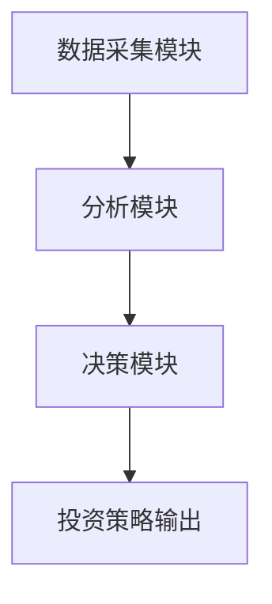

                 


# 价值投资与宏观经济周期的关系

## 关键词：价值投资，宏观经济周期，内在价值，安全边际，经济衰退，经济复苏

## 摘要：本文探讨了价值投资与宏观经济周期之间的关系，分析了价值投资的核心原理、宏观经济周期的影响以及两者在不同经济阶段的策略调整。通过数学模型和实际案例，本文揭示了如何在不同宏观经济环境下应用价值投资策略，帮助投资者做出更明智的决策。

---

## 第1章: 价值投资的核心概念

### 1.1 价值投资的定义与特点

#### 1.1.1 价值投资的定义
价值投资是一种投资策略，强调以低于资产内在价值的价格购买优质资产，长期持有，等待市场的合理估值。其核心在于寻找被市场低估的股票，通过长期持有实现收益。

#### 1.1.2 价值投资的核心特点
- **长期导向**：注重长期价值，而非短期波动。
- **安全边际**：买入价格低于内在价值，以降低风险。
- **基本面分析**：关注企业的财务状况、盈利能力和发展前景。
- **逆向思维**：在市场恐慌时寻找机会，避免追涨杀跌。

#### 1.1.3 价值投资与其它投资策略的对比
- **成长投资**：注重企业未来的增长潜力，可能忽视当前的估值。
- **趋势投资**：跟随市场趋势，依赖技术分析，风险较高。
- **指数投资**：被动跟随市场指数，风险分散但收益有限。

---

### 1.2 宏观经济周期的定义与特征

#### 1.2.1 宏观经济周期的定义
宏观经济周期是指经济活动在长期内呈现的周期性波动，包括衰退、复苏、过热和滞胀四个阶段。

#### 1.2.2 宏观经济周期的主要阶段
- **衰退阶段**：经济活动下降，企业盈利减少，就业率下降。
- **复苏阶段**：经济逐渐恢复，企业盈利开始回升。
- **过热阶段**：经济快速增长，可能出现通货膨胀。
- **滞胀阶段**：经济增长停滞，通胀高企，企业盈利不稳定。

#### 1.2.3 宏观经济周期对投资的影响
- **衰退阶段**：低利率环境可能推高资产价格，但企业盈利下降。
- **复苏阶段**：企业盈利回升，市场情绪改善。
- **过热阶段**：市场可能出现泡沫，风险上升。
- **滞胀阶段**：高通胀可能侵蚀资产实际收益。

---

## 第2章: 价值投资与宏观经济周期的关系

### 2.1 价值投资与宏观经济周期的相互作用

#### 2.1.1 宏观经济周期对价值投资的影响
- **经济衰退**：企业盈利下降，但优质资产可能被低估，提供买入机会。
- **经济复苏**：企业盈利回升，资产价格逐步回归合理估值。
- **经济过热**：市场可能出现高估，价值投资者需警惕泡沫风险。
- **经济滞胀**：高通胀可能导致企业盈利不稳定，但低利率可能推高资产价格。

#### 2.1.2 价值投资对宏观经济周期的反作用
- 价值投资者通过长期持有优质资产，稳定市场预期。
- 在经济衰退时，价值投资策略有助于缓解市场的恐慌情绪。

---

### 2.2 价值投资在不同宏观经济周期阶段的表现

#### 2.2.1 经济衰退阶段的价值投资策略
- 重点关注盈利稳定、负债低的企业。
- 寻找被市场低估的股票，利用安全边际降低风险。

#### 2.2.2 经济复苏阶段的价值投资策略
- 逐步增加对周期性行业的投资，如制造业和房地产。
- 保持对优质企业的长期持有，避免过度交易。

#### 2.2.3 经济过热阶段的价值投资策略
- 谨慎选择股票，避免被市场泡沫影响。
- 关注具有强大竞争优势的企业，避免追高。

#### 2.2.4 经济滞胀阶段的价值投资策略
- 选择抗通胀能力强的行业，如能源和大宗商品。
- 保持适度的防御性投资，降低组合波动性。

---

## 第3章: 价值投资的核心原理

### 3.1 安全边际的概念与计算

#### 3.1.1 安全边际的定义
安全边际是买入价格与资产内在价值之间的差距，是价值投资中降低风险的重要工具。

#### 3.1.2 安全边际的计算方法
$$ \text{安全边际} = \text{内在价值} - \text{市场价格} $$

#### 3.1.3 安全边际在不同宏观经济周期中的应用
- **衰退阶段**：增加安全边际，寻找严重低估的资产。
- **复苏阶段**：适度降低安全边际，抓住市场回升的机会。
- **过热阶段**：保持高安全边际，避免高位接盘。
- **滞胀阶段**：增大安全边际，选择抗通胀能力强的资产。

---

### 3.2 内在价值的评估方法

#### 3.2.1 内在价值的定义
内在价值是资产在长期稳定状态下的合理估值，不受短期市场波动影响。

#### 3.2.2 内在价值的评估模型
$$ V = \frac{CF}{r - g} $$
其中，$V$为内在价值，$CF$为现金流，$r$为折现率，$g$为增长率。

#### 3.2.3 内在价值与宏观经济周期的关系
- **衰退阶段**：现金流可能下降，但折现率可能降低，内在价值变化不确定。
- **复苏阶段**：现金流逐渐恢复，内在价值上升。
- **过热阶段**：现金流可能被高估，内在价值可能偏离实际。
- **滞胀阶段**：现金流不稳定，内在价值可能受到通胀影响。

---

## 第4章: 宏观经济周期对价值投资的影响

### 4.1 宏观经济指标对投资决策的影响

#### 4.1.1 GDP增长率对投资的影响
- **高增长**：企业盈利上升，股市表现较好。
- **低增长**：企业盈利下降，股市表现疲软。

#### 4.1.2 失业率对投资的影响
- **低失业率**：经济活跃，股市可能走强。
- **高失业率**：经济衰退，股市可能下跌。

#### 4.1.3 利率对投资的影响
- **低利率**：资产价格可能被推高，股市表现较好。
- **高利率**：企业融资成本上升，股市可能下跌。

#### 4.1.4 消费者价格指数（CPI）对投资的影响
- **低通胀**：企业盈利稳定，股市表现较好。
- **高通胀**：企业盈利可能被通胀侵蚀，股市表现不佳。

---

### 4.2 宏观经济周期对行业选择的影响

#### 4.2.1 不同行业在不同宏观经济周期中的表现
- **衰退阶段**：防御性行业（如公用事业、医疗）表现较好。
- **复苏阶段**：周期性行业（如制造业、房地产）表现较好。
- **过热阶段**：金融、科技等行业可能被高估。
- **滞胀阶段**：能源、大宗商品等行业表现较好。

#### 4.2.2 行业选择的宏观经济驱动因素
- **经济增长**：GDP增长率影响行业需求。
- **通胀**：高通胀行业可能受益，但需警惕政策调控。
- **利率**：低利率环境可能推动金融和科技行业表现。

---

## 第5章: 价值投资的数学模型

### 5.1 内在价值的数学模型
$$ V = \frac{CF}{r - g} $$

### 5.2 安全边际的数学模型
$$ \text{安全边际} = \text{内在价值} - \text{市场价格} $$

---

## 第6章: 宏观经济周期的数学模型

### 6.1 宏观经济周期的阶段划分
- **衰退阶段**：GDP增长率下降，失业率上升。
- **复苏阶段**：GDP增长率回升，失业率下降。
- **过热阶段**：GDP增长率高企，通胀上升。
- **滞胀阶段**：GDP增长率低，通胀高企。

### 6.2 宏观经济指标的预测模型
- **GDP增长率预测模型**：基于历史数据和经济指标构建预测模型。
- **利率预测模型**：考虑央行货币政策和经济基本面。
- **CPI预测模型**：分析通胀压力和货币政策影响。

---

## 第7章: 价值投资与宏观经济周期的系统分析与架构设计

### 7.1 问题场景介绍
在宏观经济波动的背景下，投资者需要通过价值投资策略在不同经济阶段做出最优决策。

### 7.2 系统功能设计
- **数据采集模块**：收集宏观经济指标和企业财务数据。
- **分析模块**：计算内在价值和安全边际，评估投资机会。
- **决策模块**：根据宏观经济周期调整投资策略。

### 7.3 系统架构设计


---

## 第8章: 价值投资与宏观经济周期的项目实战

### 8.1 环境安装
- 数据分析工具：Python、Pandas、NumPy。
- 绘图工具：Matplotlib、Seaborn。

### 8.2 核心实现源代码
```python
import pandas as pd
import numpy as np

# 示例数据：假设我们有一个包含宏观经济指标和股票数据的DataFrame
data = pd.DataFrame({
    'GDP增长率': [2.0, 3.0, 2.5, 4.0],
    '失业率': [6.0, 5.5, 5.0, 4.5],
    '股票价格': [100, 90, 110, 120],
    '现金流': [100, 90, 110, 120],
    '折现率': [0.05, 0.05, 0.05, 0.05],
    '增长率': [0.02, 0.02, 0.02, 0.02]
})

# 计算内在价值
data['内在价值'] = data['现金流'] / (data['折现率'] - data['增长率'])

# 计算安全边际
data['安全边际'] = data['内在价值'] - data['股票价格']

print(data)
```

### 8.3 实际案例分析
以2008年金融危机为例，分析价值投资策略在经济衰退阶段的表现。通过历史数据验证内在价值模型和安全边际的应用效果。

---

## 第9章: 价值投资与宏观经济周期的总结与展望

### 9.1 总结
价值投资与宏观经济周期密切相关，投资者需根据经济阶段调整策略。内在价值和安全边际是价值投资的核心工具，帮助投资者在不同经济环境中做出明智决策。

### 9.2 小结
- **最佳实践**：长期持有优质资产，避免短期波动干扰。
- **注意事项**：密切关注宏观经济指标，及时调整投资策略。
- **拓展阅读**：深入研究价值投资经典著作，如《巴菲特的教诲》。

---

## 作者：AI天才研究院/AI Genius Institute & 禅与计算机程序设计艺术 /Zen And The Art of Computer Programming

---

以上是关于《价值投资与宏观经济周期的关系》的技术博客文章的完整目录大纲和部分正文内容。

