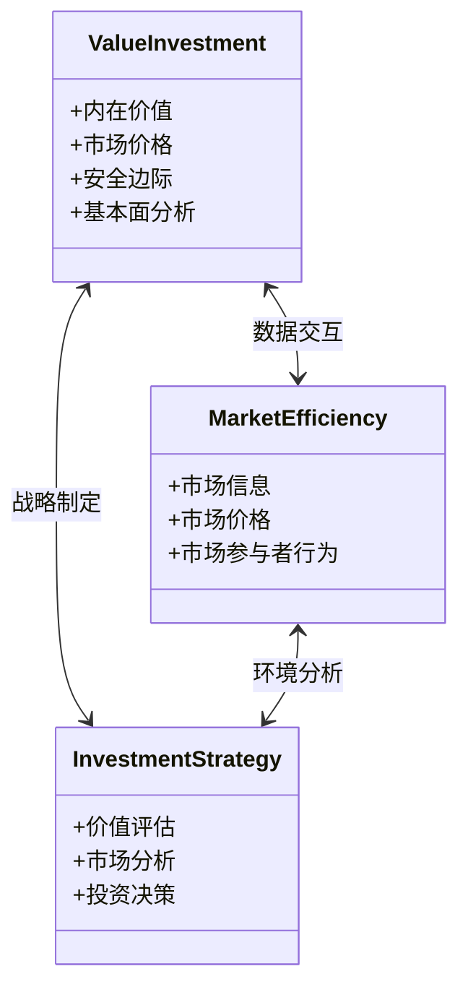
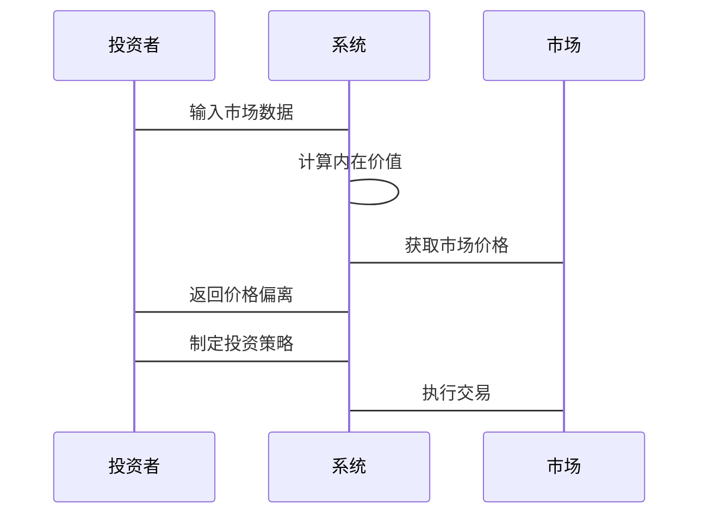

                 


---

# 价值投资与市场效率假说的关系

## 关键词：价值投资，市场效率假说，内在价值，有效市场假说，资产定价模型

## 摘要：本文探讨了价值投资与市场效率假说之间的关系，分析了两者的核心概念、数学模型和系统架构，通过实际案例验证了理论的可行性，并总结了其对投资实践的启示。

---

## 第1章 价值投资与市场效率假说的概述

### 1.1 价值投资的核心概念

#### 1.1.1 价值投资的定义与历史背景

价值投资是一种投资策略，强调以低于其内在价值的价格购买优质资产。该理念由本杰明·格雷厄姆和戴维·多德提出，认为市场价格通常会偏离内在价值，投资者应寻找这种价格差异。价值投资在20世纪30年代经济大萧条期间发展起来，成为投资学的重要流派。

#### 1.1.2 价值投资的核心理念与原则

价值投资的核心理念是通过深入分析企业的基本面，寻找具有安全边际的投资标的。其主要原则包括：

1. **安全边际**：购买价格低于内在价值，以降低风险。
2. **长期视角**：关注企业的长期盈利能力，而非短期价格波动。
3. **逆向思维**：在市场恐慌时买入，在市场狂热时卖出。

#### 1.1.3 价值投资与市场效率的关系

价值投资的实践基于市场存在非有效性的假设，即市场价格不一定反映真实价值。因此，价值投资与市场效率假说存在一定的冲突与互补关系。

---

### 1.2 市场效率假说的基本理论

#### 1.2.1 市场效率的定义与分类

市场效率假说认为，资产价格反映了所有可获得的信息。市场效率分为三类：

1. **弱有效市场**：价格反映历史信息。
2. **半强有效市场**：价格反映所有公开信息。
3. **强有效市场**：价格反映所有公开和非公开信息。

#### 1.2.2 弱有效市场、强有效市场与半强有效市场的区别

| 类别              | 描述                                                                 |
|-------------------|--------------------------------------------------------------------|
| 弱有效市场         | 价格仅反映历史信息，存在技术分析机会。                               |
| 半强有效市场       | 价格反映所有公开信息，技术分析无效，基本面分析也难以持续获得超额收益。 |
| 强有效市场         | 价格反映所有信息，包括内部信息，无法通过任何方法获得超额收益。         |

#### 1.2.3 市场效率假说的理论基础与争议

市场效率假说的理论基础是有效市场假说（EMH），由尤金·法玛提出。然而，现实中市场效率假说存在争议，特别是在短期和长期市场行为中的表现不同。

---

### 1.3 价值投资与市场效率假说的联系与区别

#### 1.3.1 价值投资与市场效率假说的内在联系

价值投资在市场效率假说的基础上，关注价格与价值的偏离，试图在市场低效时获利。

#### 1.3.2 价值投资与市场效率假说的差异分析

价值投资基于市场非有效性的假设，而市场效率假说则认为市场价格反映所有信息。两者在理论上存在冲突，但在实践中可以互补。

#### 1.3.3 价值投资在市场效率不同假设下的表现

在弱有效市场中，价值投资可能有一定收益；在强有效市场中，价值投资难以持续获得超额收益。

---

## 第2章 价值投资与市场效率假说的核心概念分析

### 2.1 价值投资的核心要素

#### 2.1.1 内在价值的计算与评估

内在价值是基于企业未来现金流的现值计算。公式如下：

$$ V = \frac{CF_1}{(1+r)^1} + \frac{CF_2}{(1+r)^2} + \cdots + \frac{CF_n}{(1+r)^n} $$

其中，\( CF \) 为现金流，\( r \) 为折现率。

#### 2.1.2 股价与内在价值的偏离机制

股价与内在价值的偏离通常由市场情绪和短期因素引起。例如，市场恐慌可能导致股价低于内在价值。

#### 2.1.3 价值投资者的行为特征

价值投资者通常具有逆向思维，倾向于在市场低谷时买入，在市场高点时卖出。

---

### 2.2 市场效率假说的核心属性

#### 2.2.1 市场信息的传播与反映

市场效率假说认为，信息传播速度快，价格反映充分。但在现实中，信息传播可能存在延迟。

#### 2.2.2 市场参与者的理性与非理性行为

市场参与者的行为可能偏离理性，导致市场非有效。

#### 2.2.3 市场机制的自我调节功能

市场机制通过价格波动自我调节，但这种调节可能需要时间。

---

### 2.3 价值投资与市场效率假说的属性对比

#### 2.3.1 市场效率假说的假设条件与价值投资的实践基础

市场效率假说基于理性假设，而价值投资基于市场非有效性的实践观察。

#### 2.3.2 价值投资在不同市场效率假设下的策略选择

在弱有效市场中，价值投资可能有效；在强有效市场中，价值投资难以获得超额收益。

#### 2.3.3 价值投资与市场效率假说的动态关系

市场效率假说与价值投资的关系是动态的，取决于市场环境和参与者行为。

---

## 第3章 价值投资与市场效率假说的数学模型与算法原理

### 3.1 价值投资的数学模型

#### 3.1.1 内在价值的计算公式

DCF模型用于计算内在价值：

$$ V = \frac{CF_1}{(1+r)^1} + \frac{CF_2}{(1+r)^2} + \cdots + \frac{CF_n}{(1+r)^n} $$

#### 3.1.2 市盈率与市净率的比较

市盈率和市净率用于评估股价是否合理：

$$ P/E = \frac{Price}{Earnings} $$
$$ P/B = \frac{Price}{Book\ Value} $$

### 3.2 市场效率假说的数学表达

#### 3.2.1 弱有效市场下的股价随机游走模型

$$ P_t = P_{t-1} + \epsilon $$

其中，\( \epsilon \) 为随机误差项。

#### 3.2.2 强有效市场下的资产定价模型

$$ P = \frac{D}{r} $$

其中，\( D \) 为股息，\( r \) 为贴现率。

### 3.3 价值投资与市场效率假说的数学关系

#### 3.3.1 价值投资在有效市场中的预期收益

在有效市场中，价值投资难以获得超额收益，但可能通过降低风险实现稳健回报。

---

## 第4章 价值投资与市场效率假说的系统架构

### 4.1 问题场景介绍

价值投资者在市场中寻找价格低于内在价值的标的，而市场效率假说认为价格反映所有信息。因此，系统需要分析价格与价值的偏离，判断市场效率。

### 4.2 系统功能设计

#### 4.2.1 领域模型（Mermaid 类图）



### 4.3 系统架构设计（Mermaid 架构图）

```mermaid
container 投资系统 {
    ValueInvestment
    MarketEfficiency
    InvestmentStrategy
}

container 市场环境 {
    MarketData
    Participants
    Information
}

投资系统 --> 市场环境 : 数据输入
ValueInvestment --> MarketEfficiency : 数据交互
MarketEfficiency --> InvestmentStrategy : 环境分析
InvestmentStrategy --> ValueInvestment : 战略制定
```

### 4.4 系统接口设计

系统接口包括：

1. 数据输入接口：接收市场数据和公司基本面信息。
2. 分析接口：计算内在价值和市场价格偏离。
3. 决策接口：制定投资策略。

### 4.5 系统交互设计（Mermaid 序列图）



---

## 第5章 价值投资与市场效率假说的项目实战

### 5.1 环境配置

需要安装Python、Pandas、NumPy等工具。

### 5.2 核心实现代码

```python
import pandas as pd
import numpy as np

def calculate_intrinsic_value(FCFF, WACC):
    # 简单的DCF模型，假设永续增长率为0
    return FCFF / WACC

def calculate_price_to_earnings_ratio(price, earnings):
    return price / earnings

# 示例数据
price = 50
earnings = 10
FCFF = 100
WACC = 0.1

intrinsic_value = calculate_intrinsic_value(FCFF, WACC)
pe_ratio = calculate_price_to_earnings_ratio(price, earnings)

print(f"内在价值: {intrinsic_value}")
print(f"市盈率: {pe_ratio}")
```

### 5.3 案例分析与结果解读

假设某公司FCFF为100，WACC为10%，市场价为50，每股收益为10。计算结果为内在价值100，市盈率5。如果市场价格低于内在价值，可能值得投资。

---

## 结论

价值投资与市场效率假说在理论上存在一定的冲突，但在实际操作中可以相互补充。通过数学模型和系统架构的设计，价值投资者可以在不同市场环境下制定合理的投资策略。未来的研究可以进一步探讨市场效率假说在不同经济周期中的表现，以及价值投资在新兴市场中的应用。

---

## 作者

作者：AI天才研究院/AI Genius Institute & 禅与计算机程序设计艺术/Zen And The Art of Computer Programming

---

这篇文章系统地探讨了价值投资与市场效率假说的关系，通过理论分析、数学建模和实际案例验证了其在投资实践中的应用。希望对读者有所帮助！

