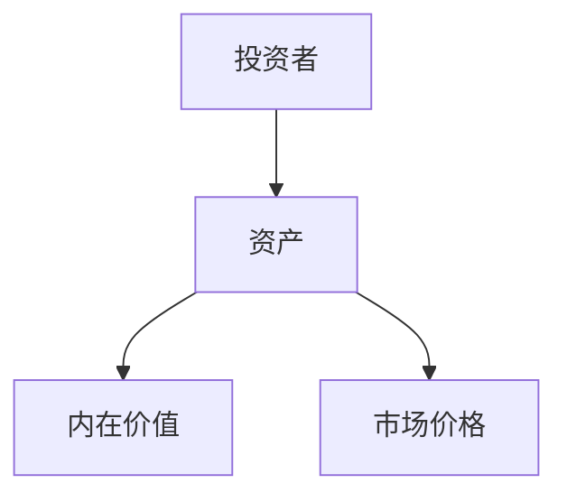
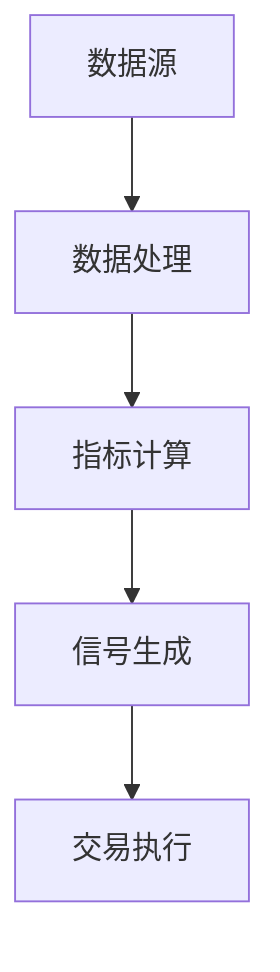
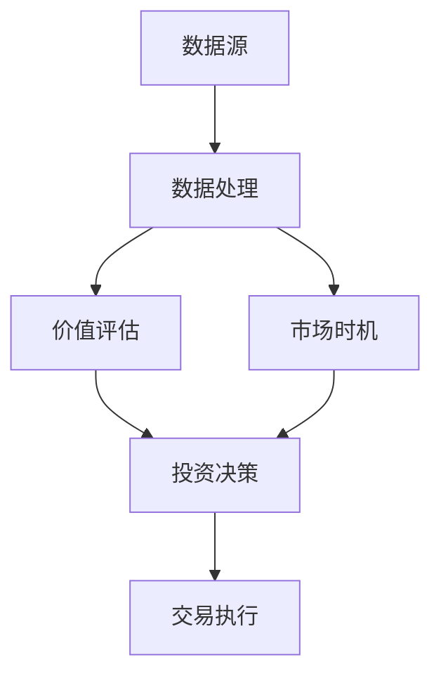
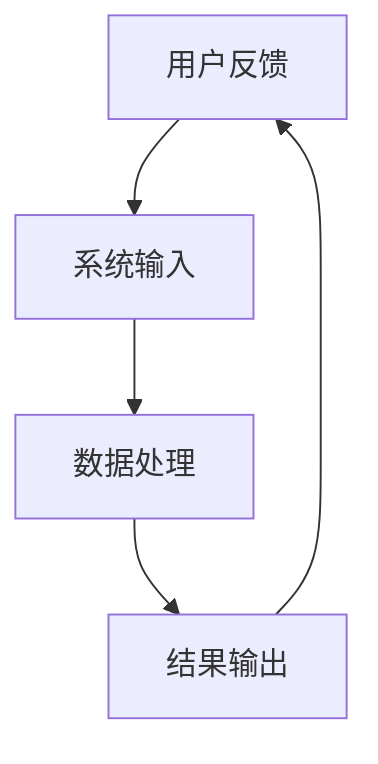

                 


# 价值投资与市场时机选择

> 关键词：价值投资、市场时机选择、投资策略、量化分析、技术分析、风险管理

> 摘要：本文探讨了价值投资与市场时机选择的结合，通过技术分析的方法，帮助投资者制定更科学的投资策略。文章从背景介绍、核心概念、算法原理、系统架构、项目实战等方面展开，结合实例分析，提供了实用的投资策略和风险管理建议。

---

## 第一部分: 价值投资与市场时机选择的背景与基础

### 第1章: 价值投资与市场时机选择概述

#### 1.1 价值投资的核心概念

##### 1.1.1 价值投资的定义与起源
价值投资是一种以基本面分析为基础的投资策略，由本杰明·格雷厄姆和戴维·多德提出。其核心在于寻找市场价格低于其内在价值的资产。

##### 1.1.2 价值投资的核心理念
- 质量：选择财务健康、竞争优势明显的公司。
- 价格：买入价格低于内在价值。
- 时间：长期持有，等待价值实现。

##### 1.1.3 价值投资的适用场景
- 稳定的长期投资。
- 避免短期市场波动的影响。

#### 1.2 市场时机选择的定义与特点

##### 1.2.1 市场时机选择的定义
市场时机选择是指根据市场走势，选择合适的进入和退出时机。

##### 1.2.2 市场时机选择的核心要素
- 市场趋势：分析价格走势。
- 技术指标：如动量、RSI等。
- 市场情绪：投资者心理影响。

##### 1.2.3 市场时机选择的挑战
- 市场不可预测性。
- 成本与风险。

#### 1.3 价值投资与市场时机选择的结合

##### 1.3.1 两者的异同点
| 方面 | 价值投资 | 市场时机选择 |
|------|----------|--------------|
| 核心 | 内在价值 | 市场趋势      |
| 时间框架 | 长期 | 短期         |
| 方法 | 基本面分析 | 技术分析     |

##### 1.3.2 结合的必要性与优势
- 把握市场趋势，优化投资时机。
- 避免在市场高点买入，低点卖出。

##### 1.3.3 结合的边界与外延
- 价值投资提供安全边际，时机选择优化收益。
- 结合需考虑市场周期，避免过度交易。

### 第2章: 价值投资的核心概念与原理

#### 2.1 价值投资的核心概念

##### 2.1.1 核心概念的定义
- 内在价值：资产的真实价值，市场价波动。
- 安全边际：买入价低于内在价值，降低风险。

##### 2.1.2 核心概念的属性特征对比
| 属性 | 内在价值 | 市场价格 |
|------|----------|----------|
| 稳定性 | 高       | 低       |
| 可预测性 | 高       | 低       |

##### 2.1.3 核心概念的ER实体关系图


#### 2.2 价值投资的数学模型与公式

##### 2.2.1 价值评估的数学模型
$$ V = \frac{E}{k} $$
其中，V为内在价值，E为预期收益，k为折现率。

##### 2.2.2 价值投资的公式推导
- 通过基本面分析计算内在价值，确定安全边际：
$$ \text{安全边际} = V - P $$
其中，P为市场价格。

##### 2.2.3 价值投资的实例分析
以某公司为例，计算其内在价值，与市场价格比较，判断是否低估。

### 第3章: 市场时机选择的算法原理

#### 3.1 市场时机选择的算法原理

##### 3.1.1 算法原理的数学模型
$$ \text{动量策略} = \frac{P_t - P_{t-n}}{P_{t-n}} $$
其中，P_t为当前价格，P_{t-n}为n天前价格。

##### 3.1.2 算法原理的公式推导
计算动量指标，判断市场趋势，确定买卖时机。

##### 3.1.3 算法原理的实例分析
以某股票为例，计算动量指标，判断趋势，给出买卖信号。

#### 3.2 市场时机选择的系统架构设计

##### 3.2.1 系统功能设计
- 数据收集：获取市场数据。
- 指标计算：计算技术指标。
- 信号生成：生成买卖信号。
- 执行策略：根据信号执行交易。

##### 3.2.2 系统架构图


##### 3.2.3 系统接口设计
- 数据接口：API获取市场数据。
- 信号接口：接收买卖信号。
- 执行接口：执行交易指令。

---

## 第二部分: 价值投资与市场时机选择的系统架构与实现

### 第4章: 价值投资与市场时机选择的系统架构

#### 4.1 系统功能设计

##### 4.1.1 投资决策支持系统
- 数据收集模块：获取市场数据。
- 价值评估模块：计算内在价值。
- 市场时机模块：生成买卖信号。
- 投资执行模块：执行交易指令。

#### 4.1.2 系统架构图


#### 4.1.3 系统交互设计


### 第5章: 价值投资与市场时机选择的数学模型与代码实现

#### 5.1 价值投资的数学模型与代码实现

##### 5.1.1 价值评估的Python代码实现
```python
def calculate_intrinsic_value(e, k):
    return e / k
```

##### 5.1.2 安全边际的计算
```python
def calculate_margin_of_safety(v, p):
    return v - p
```

#### 5.2 市场时机选择的数学模型与代码实现

##### 5.2.1 动量策略的Python代码实现
```python
def momentum_strategy(prices, n):
    return (prices[-1] - prices[-1 - n]) / prices[-1 - n]
```

##### 5.2.2 均值回归策略的Python代码实现
```python
def mean_reversion_strategy(prices, window):
    ma = prices.rolling(window).mean()
    return prices[-1] > ma[-1]
```

### 第6章: 价值投资与市场时机选择的项目实战

#### 6.1 项目环境安装

##### 6.1.1 安装必要的库
```bash
pip install pandas numpy matplotlib
```

#### 6.2 系统核心实现源代码

##### 6.2.1 价值评估模块
```python
import pandas as pd

def calculate_intrinsic_value(data, k):
    return data['E'] / k
```

##### 6.2.2 市场时机模块
```python
import pandas as pd

def generate_signals(data, n):
    data['Momentum'] = data['Price'].pct_change(n)
    return data
```

#### 6.3 实际案例分析与详细解读

##### 6.3.1 案例分析
以某股票为例，计算其内在价值和市场信号，制定投资策略。

#### 6.4 项目小结

##### 6.4.1 项目总结
结合价值投资和市场时机选择，优化投资策略，降低风险。

##### 6.4.2 项目收获
掌握技术分析方法，提升投资决策能力。

### 第7章: 价值投资与市场时机选择的风险管理与最佳实践

#### 7.1 风险管理

##### 7.1.1 风险控制策略
- 分散投资：降低风险。
- 设置止损：限制亏损。
- 定期评估：调整投资组合。

##### 7.1.2 风险管理的数学模型
$$ \text{VaR} = \text{损失的极限值} $$

#### 7.2 最佳实践

##### 7.2.1 投资策略的优化
- 定期回顾：调整投资策略。
- 持续学习：更新知识和技能。

##### 7.2.2 投资记录与反思
- 记录交易：分析决策。
- 总结经验：优化策略。

#### 7.3 小结与展望

##### 7.3.1 小结
结合价值投资和市场时机选择，优化投资策略，提升收益，降低风险。

##### 7.3.2 展望
技术进步将推动投资策略的创新，未来将有更多量化方法应用于投资决策。

---

## 结论

价值投资与市场时机选择的结合，为投资者提供了更科学的投资策略。通过技术分析和数学模型，投资者可以更好地把握市场机会，优化投资组合。未来，随着技术的进步，投资策略将更加智能化和量化。

---

**作者：AI天才研究院/AI Genius Institute & 禅与计算机程序设计艺术 /Zen And The Art of Computer Programming**

---

*以上为完整的技术博客文章大纲，涵盖从基础到高级的各个方面，确保读者能够系统地学习和应用价值投资与市场时机选择的策略。文章结构清晰，逻辑严密，语言专业且易懂，结合实例和代码，提供实用的投资策略和风险管理建议。*

