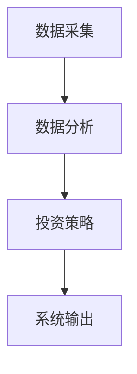

                 


# 《价值投资与行为金融学》

## 关键词：价值投资，行为金融学，投资策略，情绪分析，市场波动，技术分析，算法交易

## 摘要：
《价值投资与行为金融学》一书深入探讨了价值投资与行为金融学的核心概念、数学模型及实际应用。通过分析投资者心理与市场行为，结合长期基本面分析，本书为读者提供了独特的投资视角。内容涵盖价值投资的核心理念、行为金融学的心理偏差、两者结合的策略，以及系统架构设计与实战案例，旨在帮助投资者做出更明智的决策。

---

## 第1章: 价值投资的核心理念

### 1.1 价值投资的定义与核心理念

#### 1.1.1 价值投资的定义
价值投资是一种长期投资策略，强调以低于内在价值的价格买入优质资产。其核心在于分析公司的基本面，寻找被市场低估的投资机会。

#### 1.1.2 价值投资的核心理念：安全边际
安全边际是指股票价格与公司内在价值之间的差距，确保在市场波动中投资的安全性。

#### 1.1.3 价值投资与成长投资的区别
- **价值投资**：关注低估值，追求安全边际。
- **成长投资**：关注高成长性，愿意支付溢价。

### 1.2 价值投资的核心概念与数学模型

#### 1.2.1 市盈率（P/E Ratio）
$$\text{市盈率} = \frac{\text{股价}}{\text{每股净利润}}$$
市盈率低的股票可能具有投资价值，但需结合行业和公司具体情况分析。

#### 1.2.2 市净率（P/B Ratio）
$$\text{市净率} = \frac{\text{股价}}{\text{每股净资产}}$$
市净率低于1通常被视为低估的信号，但需考虑公司盈利能力。

#### 1.2.3 股息率（Dividend Yield）
$$\text{股息率} = \frac{\text{每股股息}}{\text{股价}} \times 100\%$$
高股息率可能表明股票被低估，但也需评估公司的股息支付能力和成长性。

---

## 第2章: 行为金融学的核心概念

### 2.1 行为金融学的定义与核心理念

#### 2.1.1 行为金融学的定义
行为金融学研究投资者心理与行为对市场定价和决策的影响，挑战传统有效市场假说。

#### 2.1.2 行为金融学的核心理念：投资者心理与市场行为
投资者的非理性行为导致市场波动，情绪和认知偏差影响决策。

### 2.2 行为金融学的核心概念与数学模型

#### 2.2.1 认知偏差
- **确认偏差**：倾向于寻找支持自己观点的信息。
- **损失厌恶**：对损失的厌恶程度远高于对收益的偏好。

#### 2.2.2 情绪周期
投资者情绪波动影响市场周期，可通过情绪指数预测市场走势。

#### 2.2.3 群体思维
群体压力导致投资者趋同，引发市场泡沫与崩盘。

---

## 第3章: 价值投资与行为金融学的结合

### 3.1 结合价值投资与行为金融学的必要性

#### 3.1.1 价值投资中的行为偏差
投资者在寻找低估资产时，可能因情绪或认知偏差影响判断。

#### 3.1.2 行为金融学在投资决策中的应用
通过分析情绪和认知偏差，优化投资策略，避免非理性决策。

### 3.2 行为金融学视角下的价值投资策略

#### 3.2.1 情绪分析与投资机会
利用情绪指标预测市场波动，寻找价值投资机会。

#### 3.2.2 认知偏差的克服
通过自我反思和纪律，减少情绪影响，坚持基本面分析。

---

## 第4章: 系统分析与架构设计

### 4.1 投资决策系统的功能设计

#### 4.1.1 数据采集模块
收集市场数据，包括股价、财务指标和情绪指标。

#### 4.1.2 数据分析模块
使用统计和机器学习模型分析数据，识别投资机会。

#### 4.1.3 投资策略模块
制定基于价值和行为分析的投资策略。

#### 4.1.4 系统架构图


### 4.2 系统接口与交互设计

#### 4.2.1 数据接口
定义数据格式和接口，确保模块间数据互通。

#### 4.2.2 交互流程
使用Mermaid序列图展示用户与系统交互过程。

---

## 第5章: 项目实战

### 5.1 价值投资策略的实现

#### 5.1.1 环境安装
安装Python、Pandas、NumPy等工具。

#### 5.1.2 核心代码实现
```python
import pandas as pd

# 计算市盈率
def calculate_pe_ratio(df):
    df['PE Ratio'] = df['股价'] / df['每股净利润']
    return df

# 筛选低估股票
def select_undervalued_stocks(df, threshold=15):
    return df[df['PE Ratio'] < threshold]
```

#### 5.1.3 实例分析
分析某行业股票，找出市盈率低于15的公司，作为潜在投资目标。

### 5.2 行为金融学的应用

#### 5.2.1 情绪分析
使用NLP技术分析市场情绪，生成情绪指数。

#### 5.2.2 案例分析
结合情绪指数和价值指标，制定投资策略。

---

## 第6章: 总结与展望

### 6.1 总结
价值投资与行为金融学的结合为投资决策提供了新视角，帮助投资者克服情绪影响，提升决策质量。

### 6.2 未来展望
未来研究可进一步探索行为金融学模型与AI技术的结合，开发更智能的投资工具。

---

## 作者：AI天才研究院/AI Genius Institute & 禅与计算机程序设计艺术 /Zen And The Art of Computer Programming

