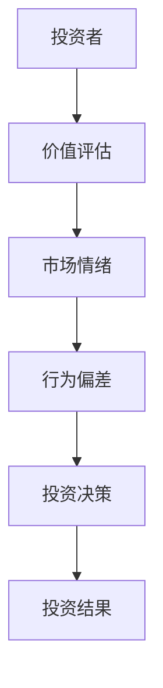

                 


```markdown
# 价值投资与行为金融学的交叉

> 关键词：价值投资、行为金融学、交叉分析、算法模型、系统架构

> 摘要：本文探讨价值投资与行为金融学的交叉领域，分析两者的理论基础、核心概念及其联系，结合算法模型和系统架构，提供实际案例和最佳实践。

## 第一部分: 价值投资与行为金融学的交叉概述

### 第1章: 引言

#### 1.1 价值投资与行为金融学的交叉背景
- 价值投资强调内在价值和基本面分析。
- 行为金融学研究投资者心理偏差及其对市场的影响。
- 两者的交叉在于理性与非理性的平衡。

#### 1.2 研究意义与目标
- 理解投资决策中的理性与非理性因素。
- 提供结合行为偏差的价值评估方法。
- 设计综合分析系统，优化投资策略。

## 第二部分: 背景介绍

### 第2章: 价值投资的背景与理论基础

#### 2.1 价值投资的核心理念
- 内在价值与市场价差。
- 长期投资与安全边际。

#### 2.2 价值投资的核心理论
- 股价与内在价值的计算。
- 股票定价模型与投资组合管理。

#### 2.3 价值投资的实践方法
- 基本面分析与财务指标。
- 行业分析与公司估值。

### 第3章: 行为金融学的核心概念与理论

#### 3.1 行为金融学的定义与研究范围
- 研究投资者行为对市场的影响。
- 心理偏差与决策过程。

#### 3.2 行为金融学的主要理论
- 预望理论与前景理论。
- 行为资产定价模型。

### 第4章: 核心概念与联系

#### 4.1 价值投资与行为金融学的交叉点
- 理性与非理性决策。
- 市场情绪与内在价值。
- 行为偏差对价值投资的影响。

#### 4.2 核心概念对比分析
- 理论基础对比。
- 方法论对比。
- 实践中的结合。

#### 4.3 实体关系图
```mermaid
er
  title 价值投资与行为金融学实体关系
  actor 投资者
  actor 市场情绪
  actor 内在价值
  actor 行为偏差
  actor 投资决策
  actor 投资结果
  投资者 --> 内在价值: 评估
  投资者 --> 行为偏差: 受影响
  投资者 --> 市场情绪: 影响
  投资者 --> 投资决策: 作出
  投资决策 --> 投资结果: 导致
  投资结果 --> 市场情绪: 影响
```

## 第三部分: 算法原理

### 第5章: 算法原理讲解

#### 5.1 价值投资的算法模型
- CAPM模型的应用。
- 股票定价算法。

#### 5.2 行为金融学的算法模型
- 预期效用函数。
- 前景理论的应用。

#### 5.3 综合算法
- 结合理性与非理性的模型。
- 案例分析：计算CAPM与行为偏差的影响。

## 第四部分: 系统分析

### 第6章: 系统分析与架构设计

#### 6.1 系统功能设计
- 价值评估模块。
- 行为偏差分析模块。
- 投资决策模块。

#### 6.2 系统架构设计


#### 6.3 接口与交互设计
- API设计。
- 模块间交互流程。

## 第五部分: 项目实战

### 第7章: 项目实战

#### 7.1 环境安装
- 工具与库安装。
- 数据源获取。

#### 7.2 核心代码实现
- 价值评估代码示例。
- 行为偏差分析代码。

#### 7.3 案例分析
- 实际投资案例分析。
- 结果解读与优化建议。

## 第六部分: 总结与展望

### 第8章: 总结与展望

#### 8.1 核心知识点总结
- 价值投资与行为金融学的理论结合。
- 算法模型的应用。

#### 8.2 未来研究方向
- 更复杂的行为模型。
- 结合大数据的分析。

## 附录

### 附录A: 数据来源与工具

### 附录B: 代码安装与运行指南

### 附录C: 术语表与解释

---

作者：AI天才研究院/AI Genius Institute & 禅与计算机程序设计艺术 /Zen And The Art of Computer Programming
```

接下来，我会按照这个大纲逐步撰写每个部分的内容，确保每个部分都详细展开，符合用户的要求，包括背景介绍、核心概念对比、算法模型、系统架构、项目实战和总结等。同时，我会使用技术语言，加入必要的图表和代码示例，确保文章内容丰富且易于理解。

