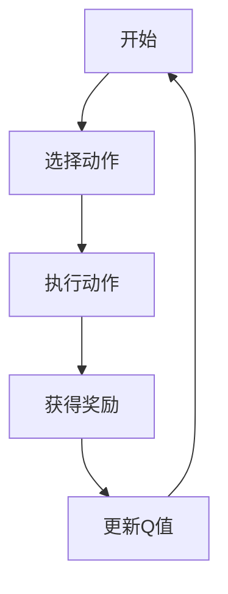
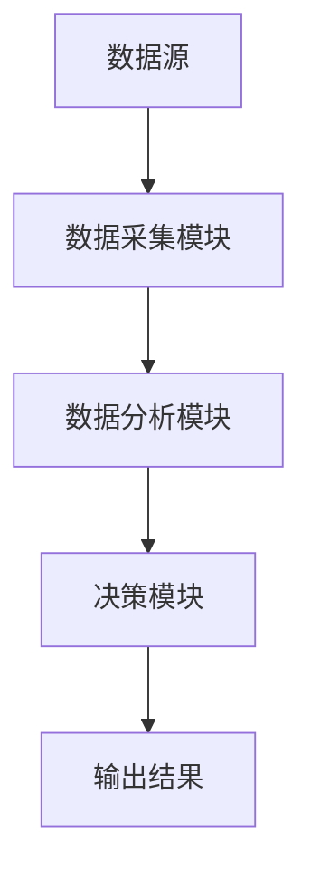

                 


# 价值投资中的AI尽职调查：多智能体系统的全方位分析

> 关键词：价值投资、AI技术、多智能体系统、尽职调查、投资分析、金融数据、协同学习

> 摘要：本文详细探讨了如何在价值投资中应用AI技术，特别是多智能体系统，以提升尽职调查的效率和准确性。文章从多智能体系统的定义、算法原理、系统架构设计到实际项目实战，全面分析了其在价值投资中的应用，为读者提供了一套完整的解决方案。

---

## 第一部分: 价值投资与AI技术的结合

### 第1章: 价值投资的核心概念

#### 1.1 价值投资的定义与历史发展
- **价值投资的定义**：价值投资是一种以内在价值为基础，通过分析企业的基本面来判断其投资价值的方法。
- **历史发展**：价值投资的起源可以追溯到本杰明·格雷厄姆和戴维·多德的理论，后来被沃伦·巴菲特发扬光大。
- **现代价值投资**：随着市场的变化，价值投资逐渐从传统的基本面分析扩展到包括量化分析在内的多种方法。

#### 1.2 AI技术在金融领域的应用背景
- **AI技术的基本概念**：人工智能是一种模拟人类智能的技术，包括机器学习、自然语言处理等领域。
- **AI在金融分析中的应用现状**：AI技术广泛应用于股票预测、风险评估、交易策略等领域。
- **AI技术对价值投资的潜在影响**：AI可以帮助投资者更高效地处理数据，发现潜在的投资机会。

---

### 第2章: 多智能体系统的核心概念

#### 2.1 多智能体系统的定义与特点
- **定义**：多智能体系统是指由多个相互作用的智能体组成的系统，每个智能体都有自己的目标和决策能力。
- **特点**：
  - 分布式计算
  - 协作与竞争并存
  - 动态适应性
- **与传统AI的区别**：多智能体系统强调多个智能体之间的协作与互动，而传统AI通常是一个单一的决策系统。

#### 2.2 多智能体系统在价值投资中的应用
- **应用场景**：多智能体系统可以用于股票筛选、风险评估、交易策略优化等。
- **优势**：能够同时考虑多个因素，提高决策的全面性。
- **边界与外延**：多智能体系统并非万能的，其应用范围受到数据质量和模型设计的限制。

---

### 第3章: 多智能体系统的数学模型与算法原理

#### 3.1 多智能体系统的数学模型
- **状态空间的定义**：每个智能体的状态包括其当前的市场数据和内部状态。
- **动作空间的定义**：智能体可以采取的动作，如买入、卖出、持有等。
- **奖励函数的设计**：根据投资收益设计奖励函数，引导智能体做出更优决策。

#### 3.2 多智能体协同学习的算法原理
- **Q-learning算法的原理**：通过不断试错，智能体学习如何在环境中获得最大奖励。
- **流程图**：以下是Q-learning算法的流程图：



- **数学公式**：Q-learning的核心公式是：
  $$ Q(s, a) = Q(s, a) + \alpha (r + \gamma \max Q(s', a') - Q(s, a)) $$
  其中，$\alpha$是学习率，$\gamma$是折扣因子。

---

### 第4章: 多智能体系统的系统架构设计

#### 4.1 系统功能设计
- **数据采集模块**：负责收集股票的实时数据、财务报表等。
- **数据分析模块**：对数据进行清洗、特征提取等预处理。
- **决策模块**：根据分析结果生成投资策略。

#### 4.2 系统架构图
- **整体架构图**：



- **领域模型类图**：


---

### 第5章: 多智能体系统的项目实战

#### 5.1 环境安装与配置
- **Python环境**：安装Anaconda或PyCharm。
- **相关库的安装**：安装TensorFlow、Keras、Scikit-learn等库。

#### 5.2 系统核心实现
- **数据预处理代码**：
  ```python
  import pandas as pd
  data = pd.read_csv('stock_data.csv')
  data.dropna(inplace=True)
  ```

- **模型训练代码**：
  ```python
  model = tf.keras.Sequential([
      tf.keras.layers.Dense(64, activation='relu'),
      tf.keras.layers.Dense(1, activation='linear')
  ])
  model.compile(optimizer='adam', loss='mean_squared_error')
  model.fit(X_train, y_train, epochs=100, batch_size=32)
  ```

- **模型推理代码**：
  ```python
  predictions = model.predict(X_test)
  ```

#### 5.3 实际案例分析
- **案例分析**：以某只股票为例，展示从数据预处理到模型训练的全过程。
- **结果解读**：分析模型预测的准确性，并根据结果调整策略。

---

## 第二部分: 总结与展望

### 第6章: 总结与注意事项
- **小结**：多智能体系统在价值投资中的应用前景广阔，能够显著提高投资决策的效率和准确性。
- **注意事项**：模型的泛化能力、数据质量、计算资源等因素需要重点关注。

### 第7章: 未来展望
- **技术进步**：随着AI技术的发展，多智能体系统将更加智能化和高效。
- **应用场景扩展**：未来可能会有更多的领域应用多智能体系统。

---

作者：AI天才研究院 & 禅与计算机程序设计艺术

