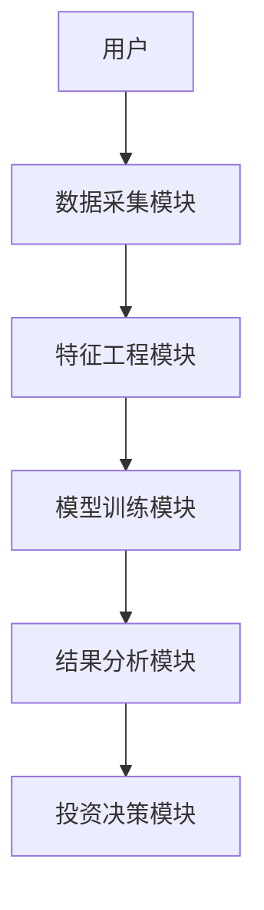

                 


# 价值投资中的AI智能体ESG因素量化分析

---

## 关键词：价值投资、ESG、AI智能体、量化分析、可持续投资、环境社会公司治理

---

## 摘要

本文探讨了在价值投资中，如何利用人工智能（AI）智能体对环境、社会和公司治理（ESG）因素进行量化分析。通过结合ESG评分模型和AI技术，投资者可以更高效地评估企业的可持续发展能力和长期投资价值。文章从ESG量化分析的核心概念出发，详细讲解了AI智能体在数据处理、模型训练和结果分析中的应用，并通过实际案例展示了如何利用AI技术发现ESG投资机会。最后，本文总结了AI在ESG量化分析中的优势与挑战，并展望了未来的研究方向。

---

## 第一部分: 价值投资中的ESG因素与AI智能体概述

---

## 第1章: 价值投资中的ESG因素概述

### 1.1 ESG投资的背景与意义

ESG投资是指在投资决策中，除了考虑传统的财务指标外，还综合评估企业在环境、社会和公司治理方面的表现。随着全球对可持续发展的关注增加，ESG投资逐渐成为主流。企业对环境保护、社会责任和治理结构的重视，不仅影响其声誉，还直接关系到其长期盈利能力。

#### 1.1.1 ESG投资的定义与内涵

ESG投资是一种将环境（Environmental）、社会（Social）和治理（Governance）因素纳入投资决策的投资策略。环境因素包括企业的碳排放、资源利用效率等；社会因素包括企业对员工权益、社会责任的履行情况；治理因素则关注企业内部的管理结构、透明度和高管薪酬。

#### 1.1.2 ESG投资的重要性与发展趋势

近年来，ESG投资的重要性日益凸显。全球气候变化、社会不平等问题的加剧，使得投资者越来越关注企业在可持续发展方面的表现。根据相关研究，ESG表现良好的企业在长期投资中往往表现更优。此外，随着技术的进步，AI技术在ESG量化分析中的应用也为投资者提供了更强大的工具。

#### 1.1.3 ESG投资与传统投资的区别

传统投资主要关注企业的财务指标，如收入、利润和市盈率等。而ESG投资则将企业的非财务因素，如环境影响、社会责任和治理结构等纳入考虑。这种区别使得ESG投资更注重企业的长期可持续发展能力。

---

### 1.2 ESG量化分析的核心概念

ESG量化分析是通过建立数学模型，将企业的ESG表现转化为可量化的指标，以便投资者进行比较和评估。

#### 1.2.1 ESG量化分析的定义

ESG量化分析是指利用数据分析技术，将企业的ESG表现转化为具体的量化指标，如评分或排名。这些指标可以帮助投资者更好地评估企业的可持续发展能力。

#### 1.2.2 ESG量化分析的关键要素

ESG量化分析的关键要素包括数据采集、特征工程、模型训练和结果解读。数据采集涉及从公开信息中提取ESG相关数据；特征工程是对数据进行处理和特征提取；模型训练则通过机器学习算法建立ESG评分模型；结果解读则需要结合企业的行业背景和具体情况进行分析。

#### 1.2.3 ESG量化分析的边界与外延

ESG量化分析的边界在于其数据来源和模型假设。由于数据的局限性，模型可能无法完全捕捉企业的所有ESG因素。外延方面，ESG量化分析可以与其他投资策略相结合，如因子投资和多因子模型。

---

### 1.3 价值投资与ESG量化分析的结合

价值投资是一种以企业内在价值为导向的投资策略，而ESG量化分析提供了评估企业内在价值的新维度。

#### 1.3.1 价值投资的定义与特点

价值投资是指以低于市场价的价格买入具有长期竞争优势的企业。其核心在于寻找市场低估的优质企业。

#### 1.3.2 ESG因素在价值投资中的作用

ESG因素可以帮助投资者发现那些在环境、社会和治理方面表现优异的企业，这些企业在长期投资中可能具有更高的增值潜力。

#### 1.3.3 人工智能在ESG量化分析中的应用前景

人工智能技术在数据处理、特征工程和模型训练方面具有显著优势，可以显著提高ESG量化分析的效率和准确性。

---

### 1.4 本章小结

本章介绍了ESG投资的背景、定义、重要性及其与传统投资的区别。同时，详细讲解了ESG量化分析的核心概念和价值投资与ESG量化分析的结合。通过这些分析，为后续章节的AI智能体应用奠定了基础。

---

## 第2章: ESG量化分析的核心概念与联系

---

### 2.1 ESG量化分析的核心原理

ESG量化分析的核心在于建立科学的评分模型，将企业的ESG表现转化为可量化的指标。

#### 2.1.1 ESG评分模型的构建原理

ESG评分模型通常包括数据采集、特征工程、模型训练和结果解读四个步骤。数据采集涉及从企业年报、社会责任报告等渠道获取ESG相关数据；特征工程是对数据进行清洗、标准化和特征提取；模型训练则通过机器学习算法建立评分模型；结果解读则需要结合企业的行业背景和具体情况进行分析。

#### 2.1.2 ESG数据的获取与处理

ESG数据的获取途径主要包括企业年报、社会责任报告、第三方评级机构数据等。数据处理步骤包括清洗、标准化和特征提取。

#### 2.1.3 ESG评分的标准化与对比

为了便于比较，ESG评分需要进行标准化处理。常用的方法包括Z-score标准化和min-max标准化。

---

### 2.2 ESG量化分析的核心概念对比

为了更好地理解ESG量化分析的核心概念，需要进行对比分析。

#### 2.2.1 ESG评分模型的属性特征对比表格

| 比较维度       | 传统财务指标 | ESG量化指标 |
|----------------|--------------|--------------|
| 数据来源       | 财务报表     | ESG报告、第三方评级 |
| 评估维度       | 收入、利润   | 环境、社会、治理 |
| 评估目标       | 企业盈利能力 | 可持续发展能力 |
| 评估结果       | 数值型       | 评分型       |

#### 2.2.2 ESG数据来源的对比分析

ESG数据来源主要包括企业自披露数据、第三方评级机构数据和社会责任报告。不同数据源的优缺点如下：

- 企业自披露数据：优势是数据准确性高，但可能存在选择性披露问题。
- 第三方评级机构数据：优势是数据标准化程度高，但可能存在评级标准不统一的问题。
- 社会责任报告：优势是数据全面性好，但可能存在企业过度包装的问题。

#### 2.2.3 ESG评分与企业价值的关系

研究表明，ESG评分与企业价值之间存在一定的相关性。ESG评分高的企业在长期投资中可能具有更高的增值潜力。

---

### 2.3 ESG量化分析的ER实体关系图

为了更好地理解ESG量化分析的实体关系，可以通过ER图进行建模。

#### 2.3.1 实体关系图的构建

以下是ESG量化分析的ER实体关系图：

```mermaid
erDiagram
    company : 公司
    esg_data : ESG数据
    esg_score : ESG评分
    investment : 投资决策
    company --> esg_data : 提供
    esg_data --> esg_score : 生成
    esg_score --> investment : 支持
```

#### 2.3.2 实体关系图的分析与解释

公司提供ESG数据，这些数据经过处理生成ESG评分，评分结果支持投资决策。

#### 2.3.3 实体关系图的应用场景

ER实体关系图可以用于ESG量化分析的系统设计和数据建模。

---

### 2.4 本章小结

本章详细讲解了ESG量化分析的核心原理和核心概念对比，通过ER实体关系图展示了ESG量化分析的系统架构。这些内容为后续章节的AI智能体应用奠定了基础。

---

## 第3章: AI智能体在ESG量化分析中的应用

---

### 3.1 AI智能体的基本概念与特点

AI智能体是一种能够感知环境、做出决策并采取行动的智能系统。

#### 3.1.1 AI智能体的定义

AI智能体是指具有感知、决策和行动能力的智能系统。它能够根据环境信息做出最优决策。

#### 3.1.2 AI智能体的核心特点

AI智能体具有自主性、反应性、目标导向性和学习能力等特点。

#### 3.1.3 AI智能体与传统量化分析的区别

AI智能体能够处理非结构化数据，具有更强的学习能力和适应性。

---

### 3.2 AI智能体在ESG分析中的应用场景

AI智能体在ESG量化分析中的应用场景主要包括数据处理、特征工程、模型训练和结果分析。

#### 3.2.1 数据处理与特征提取

AI智能体可以通过自然语言处理技术从企业社会责任报告中提取ESG相关特征。

#### 3.2.2 模型训练与优化

AI智能体可以利用机器学习算法（如随机森林和神经网络）建立ESG评分模型，并通过交叉验证进行优化。

#### 3.2.3 结果分析与投资决策

AI智能体可以通过分析ESG评分和财务指标，帮助投资者做出更科学的投资决策。

---

### 3.3 AI智能体在ESG量化分析中的优势

AI智能体在ESG量化分析中的优势主要体现在高效性、准确性和适应性。

#### 3.3.1 高效性与准确性

AI智能体能够快速处理大量数据，并通过机器学习算法提高评分的准确性。

#### 3.3.2 数据驱动与动态调整

AI智能体可以通过实时数据更新动态调整ESG评分模型。

---

### 3.4 本章小结

本章详细介绍了AI智能体的基本概念、应用场景和优势，展示了AI技术在ESG量化分析中的巨大潜力。

---

## 第4章: AI智能体的算法原理与实现

---

### 4.1 算法原理概述

AI智能体的算法主要包括特征选择、模型训练和结果分析三个步骤。

#### 4.1.1 特征选择

特征选择是通过统计方法或机器学习算法，从大量数据中筛选出对ESG评分影响较大的特征。

#### 4.1.2 模型训练

模型训练是利用机器学习算法（如随机森林和神经网络）建立ESG评分模型。

#### 4.1.3 模型调优与验证

模型调优是通过交叉验证和超参数优化提高模型的准确性和稳定性。

---

### 4.2 算法实现步骤

以下是AI智能体的算法实现步骤：

1. 数据采集与预处理
2. 特征工程
3. 模型训练
4. 模型验证
5. 模型部署与应用

---

### 4.3 算法原理的数学模型与公式

以下是随机森林算法的数学模型：

$$
\text{随机森林} = \{ \text{决策树}_i \}_{i=1}^{n}
$$

---

## 第5章: 系统架构设计与实现

---

### 5.1 系统架构设计

系统架构设计包括功能模块设计和系统交互设计。

#### 5.1.1 功能模块设计

功能模块包括数据采集、特征工程、模型训练和结果分析。

#### 5.1.2 系统交互设计

系统交互包括用户输入、数据处理和结果展示。

---

### 5.2 系统架构图

以下是系统架构图：



---

## 第6章: 项目实战与案例分析

---

### 6.1 项目实战

以下是项目实战的步骤：

1. 环境安装
2. 数据采集
3. 数据处理
4. 模型训练
5. 模型验证
6. 模型部署

---

### 6.2 案例分析

以下是案例分析的具体步骤：

1. 数据来源：企业社会责任报告和第三方评级数据
2. 数据处理：清洗、标准化和特征提取
3. 模型训练：随机森林和神经网络
4. 模型验证：交叉验证和结果分析
5. 投资决策：基于ESG评分和财务指标的综合评估

---

## 第7章: 总结与展望

---

### 7.1 总结

本文详细探讨了AI智能体在ESG量化分析中的应用，展示了AI技术在提升ESG投资效率和准确性方面的巨大潜力。

### 7.2 展望

未来，随着技术的进步，AI智能体在ESG量化分析中的应用将更加广泛。多模态数据的应用和强化学习的结合将为ESG投资带来更多的可能性。

---

## 作者：AI天才研究院/AI Genius Institute & 禅与计算机程序设计艺术 /Zen And The Art of Computer Programming

---

**本文通过系统的分析和具体的案例，展示了AI智能体在ESG量化分析中的应用。通过结合ESG量化分析的核心概念和AI技术，投资者可以更高效地评估企业的可持续发展能力，从而做出更科学的投资决策。未来，随着技术的进步，AI智能体在ESG量化分析中的应用将更加广泛，为价值投资带来更多的可能性。**

