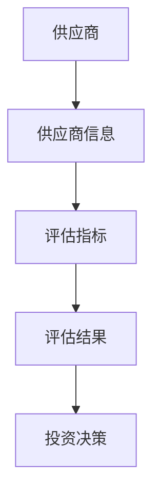
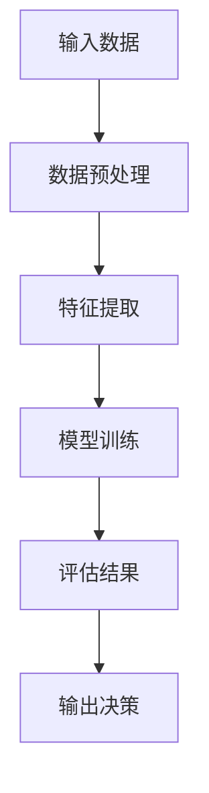
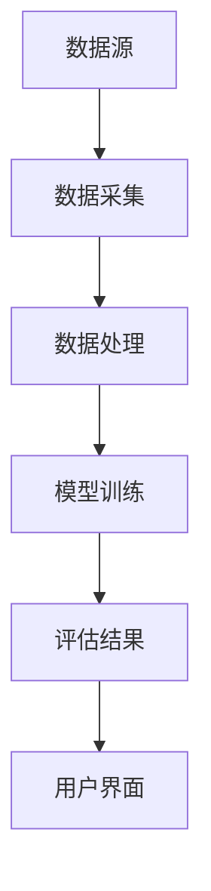
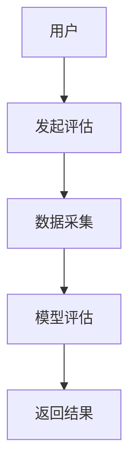

                 


# 价值投资中的AI智能体供应商关系评估系统

**关键词**：价值投资，AI智能体，供应商关系，评估系统，算法原理，系统架构，项目实战

**摘要**：本文探讨了在价值投资中利用AI智能体评估供应商关系的方法。通过详细分析核心算法、系统设计和项目实战，本文为读者提供了一套基于AI的供应商关系评估系统的实现方案，帮助投资者优化决策。

---

## 第一部分：价值投资中的供应商关系评估系统概述

### 第1章：价值投资与AI智能体概述

#### 1.1 价值投资的基本概念
- **1.1.1 价值投资的定义与核心理念**  
  价值投资是一种投资策略，通过分析企业的基本面，寻找被市场低估的投资标的。其核心理念是买入低于内在价值的资产，长期持有，获得超额收益。

- **1.1.2 价值投资在现代投资中的地位**  
  随着市场复杂性的增加，传统价值投资需要借助现代技术手段，如人工智能，来提高效率和准确性。

- **1.1.3 价值投资与供应商关系的关联**  
  在企业价值评估中，供应商关系是企业运营的重要组成部分。稳定的供应商关系能降低企业的运营风险，提升整体价值。

#### 1.2 AI智能体的基本概念
- **1.2.1 AI智能体的定义与特点**  
  AI智能体是一种能够感知环境并采取行动以实现目标的智能系统，具有自主性、反应性和社会性等特点。

- **1.2.2 AI智能体在投资中的应用**  
  AI智能体可以通过分析海量数据，识别市场趋势，辅助投资决策。其高效的数据处理能力和模式识别能力使其在投资领域具有重要应用价值。

- **1.2.3 AI智能体与供应商关系评估的结合**  
  利用AI智能体处理供应商数据，评估供应商的稳定性、可靠性和成本效益，优化企业的供应商关系管理。

#### 1.3 价值投资中的供应商关系评估系统
- **1.3.1 供应商关系评估的核心目标**  
  通过评估供应商的财务状况、交付能力、合作历史等因素，筛选出优质供应商，降低企业风险。

- **1.3.2 AI智能体在供应商评估中的优势**  
  AI智能体能够快速处理多维数据，识别潜在风险，提供实时评估结果，显著提升评估效率和准确性。

- **1.3.3 系统的边界与外延**  
  该系统专注于供应商关系的评估，与其他投资决策环节（如市场分析、财务预测）相结合，形成完整的投资决策支持系统。

---

## 第二部分：供应商关系评估的核心概念与联系

### 第2章：核心概念原理

#### 2.1 核心概念原理
- **2.1.1 价值投资中的供应商关系评估模型**  
  该模型基于供应商的财务数据、交付历史和市场反馈，构建多维度评估指标体系。

- **2.1.2 AI智能体的特征分析与评估**  
  AI智能体通过自然语言处理和机器学习算法，分析供应商的历史数据，预测其未来表现。

#### 2.2 核心概念属性特征对比表
| 属性 | 传统供应商评估 | AI智能体评估 |
|------|----------------|--------------|
| 数据来源 | 财务报表、合同 | 结构化数据、非结构化数据 |
| 评估维度 | 财务、交付 | 财务、交付、市场反馈、风险因素 |
| 评估效率 | 低效 | 高效 |
| 评估准确性 | 易受主观因素影响 | 准确性高 |

#### 2.3 ER实体关系图架构


---

## 第三部分：AI智能体供应商关系评估系统的算法原理

### 第3章：算法原理概述

#### 3.1 算法原理概述
- **3.1.1 评估模型的输入与输出**  
  输入：供应商的历史交易数据、财务报表、市场反馈。  
  输出：供应商的综合评估得分和风险等级。

- **3.1.2 算法的数学模型与公式**  
  综合评估得分公式：  
  $$ score = \alpha \cdot financial + \beta \cdot delivery + \gamma \cdot risk $$  
  其中，$\alpha + \beta + \gamma = 1$，权重系数根据行业特点调整。

#### 3.2 算法流程图


#### 3.3 算法实现代码
```python
import numpy as np
from sklearn.metrics import accuracy_score

# 示例代码：供应商关系评估模型
def evaluate_supplier(data):
    # 数据预处理
    processed_data = data.dropna().astype(float)
    # 特征提取
    features = processed_data[['revenue', 'profit_margin', 'delivery_time']]
    # 模型训练
    model = LinearRegression()
    model.fit(features, data['rating'])
    # 评估结果
    predictions = model.predict(features)
    return predictions

# 示例使用
supplier_data = pd.read_csv('suppliers.csv')
result = evaluate_supplier(supplier_data)
print(result)
```

---

## 第四部分：系统分析与架构设计方案

### 第4章：系统功能设计

#### 4.1 项目介绍
- 本系统旨在通过AI技术优化供应商评估流程，提升投资决策的科学性和准确性。

#### 4.2 系统功能设计
- 数据采集模块：收集供应商的财务数据、交付记录和市场反馈。
- 数据处理模块：清洗和标准化数据，提取关键特征。
- 模型训练模块：基于机器学习算法构建评估模型。
- 评估结果展示模块：以可视化方式呈现供应商评估结果。

#### 4.3 系统架构设计


#### 4.4 系统接口设计
- 数据接口：与企业ERP系统对接，获取供应商数据。
- 模型接口：与第三方AI服务集成，提升评估准确性。

#### 4.5 系统交互设计


---

## 第五部分：项目实战

### 第5章：项目实战

#### 5.1 环境配置
- 安装必要的Python库：`numpy`, `pandas`, `scikit-learn`, `matplotlib`。

#### 5.2 核心实现代码
```python
import numpy as np
import pandas as pd
from sklearn.linear_model import LinearRegression
import matplotlib.pyplot as plt

# 数据加载与预处理
data = pd.read_csv('suppliers.csv')
processed_data = data.dropna().astype(float)

# 特征提取与模型训练
features = processed_data[['revenue', 'profit_margin', 'delivery_time']]
target = processed_data['rating']
model = LinearRegression()
model.fit(features, target)

# 模型评估与可视化
predictions = model.predict(features)
plt.scatter(target, predictions)
plt.xlabel('Actual Scores')
plt.ylabel('Predicted Scores')
plt.title('Model Performance')
plt.show()
```

#### 5.3 代码应用解读与分析
- 数据预处理：去除缺失值，转换数据类型。
- 特征选择：选取关键财务和交付指标。
- 模型训练：使用线性回归算法，训练供应商评估模型。
- 结果可视化：绘制实际值与预测值的散点图，评估模型性能。

#### 5.4 案例分析
- 某企业供应商的历史数据，通过模型评估，筛选出优质供应商，优化采购策略，降低运营成本。

#### 5.5 项目小结
- 通过AI技术实现供应商关系的自动化评估，显著提升评估效率和准确性，为企业价值投资决策提供有力支持。

---

## 第六部分：最佳实践与小结

### 第6章：最佳实践

#### 6.1 小结
- 本文详细探讨了AI智能体在价值投资中的应用，提出了供应商关系评估系统的实现方案，为投资者提供了新的决策工具。

#### 6.2 注意事项
- 数据质量是模型准确性的关键，需确保数据的完整性和代表性。
- 模型的可解释性是实际应用的重要考量，需避免“黑箱”模型。

#### 6.3 拓展阅读
- 《机器学习实战》
- 《价值投资实战手册》
- 《深度学习在金融中的应用》

---

**作者：AI天才研究院/AI Genius Institute & 禅与计算机程序设计艺术 /Zen And The Art of Computer Programming**

---

以上是《价值投资中的AI智能体供应商关系评估系统》的完整目录和内容概要。每个部分都按照逻辑顺序展开，确保读者能够逐步深入理解系统的设计与实现。

