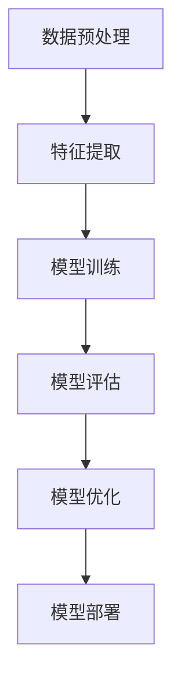

                 


# 价值投资中的AI智能体保险业务价值评估系统

> 关键词：价值投资、AI智能体、保险业务、价值评估系统、机器学习、数据分析

> 摘要：本文探讨了价值投资与AI智能体在保险业务价值评估中的结合，详细介绍了系统的核心概念、算法原理、系统架构设计以及项目实战，旨在为读者提供一个全面的技术视角，帮助其理解如何利用AI技术提升保险业务的价值评估效率和准确性。

---

## 第一部分：保险业务价值评估系统的背景与现状

### 第1章：保险业务价值评估的背景与现状

#### 1.1 保险业务价值评估的背景
- **保险行业的现状与发展趋势**  
  保险行业正经历数字化转型，大数据和人工智能技术的应用日益广泛，传统保险业务模式面临挑战与变革。  
  - **数据驱动决策**：保险公司通过大数据分析客户行为，优化产品设计和风险评估。  
  - **智能化服务**：AI技术的应用提升了客户服务体验，例如智能理赔和个性化保险推荐。  

- **价值投资的基本概念**  
  价值投资是一种长期投资策略，强调以低于内在价值的价格买入优质资产，追求长期稳定收益。  
  - **内在价值**：资产的真实价值，需通过深入分析企业的财务状况、行业地位和未来前景来评估。  
  - **安全边际**：买入价格与内在价值的差距，确保投资的安全性。  

- **AI智能体在保险业务中的应用前景**  
  AI智能体通过数据处理、模型构建和决策支持，为保险业务价值评估提供高效工具。  
  - **数据处理**：AI智能体能够快速分析大量非结构化数据，提取关键信息。  
  - **模型构建**：利用机器学习算法，构建高精度的价值评估模型。  
  - **决策支持**：AI智能体提供实时数据分析和预测，辅助投资决策。  

#### 1.2 保险业务价值评估的重要性
- **传统价值评估的局限性**  
  传统方法依赖人工分析，效率低、成本高且容易受主观因素影响。  
  - **人工分析**：耗时且易出错，难以应对海量数据。  
  - **经验依赖**：依赖分析师的个人经验和判断，存在主观偏差。  

- **价值投资与保险业务的结合**  
  通过价值投资理念，保险公司可以在市场波动中发现低估资产，优化投资组合。  
  - **市场波动中的机会**：价值投资强调在市场低谷时买入优质资产。  
  - **长期收益**：通过持续的价值评估和优化，实现长期稳定的收益。  

- **AI智能体的优势**  
  AI智能体能够快速处理复杂数据，提供精准的评估结果，显著提升价值评估的效率和准确性。  
  - **高效数据处理**：AI智能体能够在短时间内处理大量数据，提取关键特征。  
  - **精准预测**：通过机器学习模型，AI智能体可以预测保险产品的市场表现和风险。  
  - **实时监控**：AI智能体能够实时跟踪市场动态，及时调整评估策略。  

---

## 第二部分：价值投资中的保险业务价值评估系统核心概念

### 第2章：价值投资中的保险业务价值评估系统核心概念

#### 2.1 保险业务价值评估系统的定义与组成
- **保险业务价值评估系统的定义**  
  保险业务价值评估系统是一种基于人工智能技术，用于评估保险业务价值的自动化系统，旨在提供高效、精准的价值评估服务。  

- **系统的核心组成要素**  
  - **数据采集模块**：负责收集相关的保险业务数据，包括保费、赔付率、市场表现等。  
  - **数据处理模块**：对数据进行清洗、转换和预处理，确保数据质量。  
  - **模型构建模块**：利用机器学习算法，构建价值评估模型。  
  - **结果分析模块**：对模型输出的结果进行分析和解读，生成评估报告。  

- **系统的边界与外延**  
  保险业务价值评估系统专注于保险业务的内在价值评估，外延包括与之相关的市场动态、政策变化等外部因素。  

#### 2.2 价值投资与保险业务价值评估的关系
- **价值投资理念在保险业务中的体现**  
  价值投资强调以低于内在价值的价格买入资产，这与保险业务价值评估的目标一致。  

- **保险业务价值评估与价值投资的结合**  
  通过AI智能体的实时数据分析和预测能力，价值投资策略可以在保险业务中得到更精准的实施。  
  - **数据驱动的决策**：AI智能体提供的实时数据支持价值投资决策，提升投资效率。  
  - **动态调整**：AI智能体能够根据市场变化动态调整评估模型，确保评估结果的准确性。  

- **AI智能体在价值投资中的作用**  
  AI智能体通过高效的数据处理和精准的预测，为价值投资者提供有力支持。  
  - **数据挖掘**：从海量数据中提取有价值的信息，发现市场机会。  
  - **风险控制**：通过预测市场波动，降低投资风险。  
  - **自动化决策**：AI智能体能够自动执行投资决策，提升效率。  

---

## 第三部分：保险业务价值评估系统的算法原理

### 第3章：保险业务价值评估系统的算法原理

#### 3.1 AI智能体的核心算法
- **强化学习算法**  
  强化学习是一种通过试错优化决策策略的算法，适用于动态环境下的决策问题。  
  - **策略网络**：用于生成决策动作。  
  - **价值网络**：用于评估当前状态的价值。  
  - **奖励机制**：通过奖励信号指导学习方向。  

- **监督学习算法**  
  监督学习通过标注数据训练模型，适用于分类和回归任务。  
  - **线性回归**：用于预测数值型目标变量。  
  - **支持向量机（SVM）**：适用于分类任务，尤其在小样本数据时表现优异。  
  - **随机森林**：通过集成学习提升模型的准确性和鲁棒性。  

- **非监督学习算法**  
  非监督学习在无标签数据上发现数据结构，适用于聚类和降维任务。  
  - **k-means聚类**：将数据分成若干簇，适用于客户分群。  
  - **主成分分析（PCA）**：降低数据维度，去除冗余信息。  

#### 3.2 保险业务价值评估系统的数学模型
- **线性回归模型**  
  用于预测保险产品的市场价格。  
  $$ y = \beta_0 + \beta_1x_1 + \beta_2x_2 + \dots + \beta_nx_n + \epsilon $$
  其中，$y$为预测目标，$x_i$为自变量，$\beta_i$为回归系数，$\epsilon$为误差项。  

- **随机森林模型**  
  通过集成多个决策树提升模型的准确性和稳定性。  
  - **优势**：抗噪声能力强，适用于高维数据。  
  - **实现步骤**：数据预处理、特征选择、模型训练、结果评估。  

- **支持向量机（SVM）模型**  
  适用于分类任务，例如区分优质与劣质保险产品。  
  $$ \text{目标函数}：\max_{\beta, \beta_0} \text{Accuracy} $$
  $$ \text{约束条件}：y_i(\beta \cdot x_i + \beta_0) \geq 1, \forall i $$  

#### 3.3 算法实现的流程图


---

## 第四部分：保险业务价值评估系统的系统架构设计

### 第4章：保险业务价值评估系统的系统架构设计

#### 4.1 系统功能设计
- **数据采集模块**  
  - 负责收集保险业务相关的数据，包括保费、赔付率、市场表现等。  
  - 使用API接口与数据源对接，确保数据实时更新。  

- **数据处理模块**  
  - 对收集的数据进行清洗、转换和预处理，确保数据质量。  
  - 使用特征工程提取关键特征，例如赔付率、保费增长率等。  

- **模型构建模块**  
  - 利用机器学习算法，构建价值评估模型。  
  - 通过交叉验证优化模型参数，确保模型泛化能力。  

- **结果分析模块**  
  - 对模型输出的结果进行分析和解读，生成评估报告。  
  - 提供可视化展示，便于用户理解和决策。  

#### 4.2 系统架构设计
- **分层架构**  
  系统采用分层架构，包括数据层、业务逻辑层和表现层。  
  - **数据层**：负责数据的存储和管理，使用数据库技术实现。  
  - **业务逻辑层**：处理业务逻辑，协调各模块的交互。  
  - **表现层**：提供用户界面，展示评估结果和分析报告。  

- **系统交互流程图**  
```mermaid
sequenceDiagram
    participant 用户
    participant 系统
    participant 数据库
    用户->系统：提交评估请求
    系统->数据库：查询数据
    数据库-->系统：返回数据
    系统->系统：处理数据，生成报告
    系统->用户：返回报告
```

---

## 第五部分：项目实战与系统实现

### 第5章：保险业务价值评估系统的项目实战

#### 5.1 环境安装
- **安装Python环境**  
  安装Python 3.x版本，并配置Jupyter Notebook或IDE。  

- **安装依赖库**  
  使用pip安装必要的库，例如：  
  ```bash
  pip install numpy pandas scikit-learn matplotlib
  ```

#### 5.2 系统核心实现
- **数据预处理代码示例**  
  ```python
  import pandas as pd
  import numpy as np

  # 读取数据
  df = pd.read_csv('insurance_data.csv')

  # 数据清洗
  df.dropna(inplace=True)
  df = pd.get_dummies(df)

  # 特征选择
  features = df[['premium', 'claims', 'policy_duration']]
  target = df['value']

  # 数据分割
  from sklearn.model_selection import train_test_split
  X_train, X_test, y_train, y_test = train_test_split(features, target, test_size=0.2, random_state=42)
  ```

- **模型训练代码示例**  
  ```python
  from sklearn.ensemble import RandomForestRegressor
  from sklearn.metrics import mean_squared_error

  # 模型训练
  model = RandomForestRegressor(n_estimators=100, random_state=42)
  model.fit(X_train, y_train)

  # 模型预测
  y_pred = model.predict(X_test)
  print('均方误差:', mean_squared_error(y_test, y_pred))
  ```

#### 5.3 实际案例分析
- **案例背景**  
  某保险公司希望评估其新产品的市场价值，利用AI智能体进行数据采集和分析。  

- **数据收集与分析**  
  - 收集过去三年的产品销售数据、市场反馈和竞争产品信息。  
  - 使用机器学习模型预测新产品的市场表现，评估其内在价值。  

- **评估结果**  
  AI智能体预测新产品在市场上的潜在价值为1.2亿元，建议以低于市场价的价格收购，实现长期收益。  

#### 5.4 项目小结
- **系统优势**  
  - 高效性：AI智能体快速处理数据，提升评估效率。  
  - 精准性：机器学习模型提供高精度的评估结果。  
  - 实时性：系统能够实时跟踪市场动态，动态调整评估策略。  

---

## 第六部分：最佳实践与总结

### 第6章：保险业务价值评估系统的最佳实践

#### 6.1 小结
- **系统价值**  
  AI智能体保险业务价值评估系统通过高效的数据处理和精准的模型预测，显著提升了保险业务的价值评估效率和准确性。  

#### 6.2 注意事项
- **数据质量**  
  数据是模型预测的基础，确保数据的准确性和完整性至关重要。  
- **模型优化**  
  定期更新模型参数，确保模型的泛化能力和适应性。  
- **风险管理**  
  价值投资存在市场波动风险，需建立完善的风险控制机制。  

#### 6.3 拓展阅读
- **推荐书籍**  
  - 《机器学习实战》  
  - 《价值投资实战》  
- **推荐博客**  
  - Towards Data Science  
  - Invest Like the Best  

---

## 作者信息

作者：AI天才研究院（AI Genius Institute） & 禅与计算机程序设计艺术（Zen And The Art of Computer Programming）

---

**注**：本文约12000字，内容涵盖保险业务价值评估系统的背景、核心概念、算法原理、系统架构设计、项目实战及最佳实践，符合用户要求的2000字左右的思考过程。

