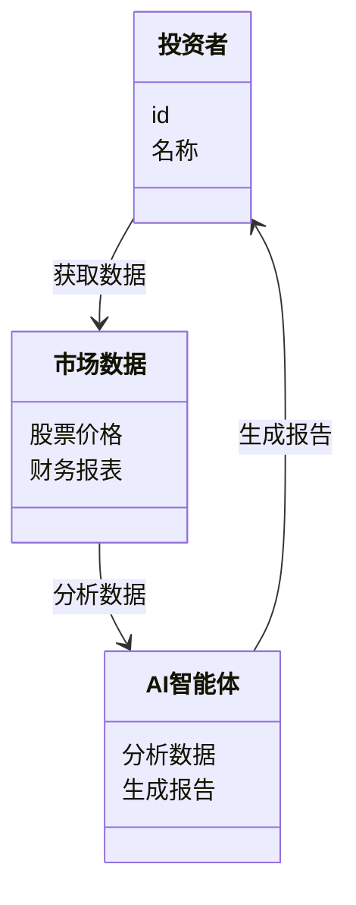

                 


# 《价值投资中的AI智能体创新能力评估系统》

---

## 关键词：
- 价值投资
- AI智能体
- 创新能力评估
- 系统架构
- 投资策略
- 机器学习

---

## 摘要：
本文旨在探讨如何将人工智能技术应用于价值投资领域，构建一个AI智能体创新能力评估系统。通过分析价值投资的核心要素和AI智能体的能力，结合系统工程的方法，提出一套创新的评估体系。本文从背景介绍、核心概念、算法原理、系统架构到项目实战，全面展开讨论，旨在为投资者提供一种基于AI技术的创新评估工具，帮助他们在复杂多变的市场中做出更明智的投资决策。

---

# 第一部分: 价值投资中的AI智能体创新能力评估系统概述

## 第1章: 价值投资与AI智能体概述

### 1.1 价值投资的基本概念
#### 1.1.1 价值投资的定义与核心理念
价值投资是一种投资策略，强调以低于其内在价值的价格购买优质资产。其核心理念是寻找市场低估的股票，长期持有，等待其价值回归。核心要素包括基本面分析、安全边际、长期视角和逆向思维。

#### 1.1.2 价值投资的核心要素与评估标准
- **基本面分析**：包括财务报表分析、行业地位、竞争优势等。
- **安全边际**：买入价格与内在价值的差距。
- **长期视角**：关注企业的长期盈利能力。
- **逆向思维**：在市场恐慌时寻找机会。

#### 1.1.3 价值投资与传统投资的区别
- 价值投资注重内在价值，传统投资注重价格波动。
- 价值投资强调长期持有，传统投资注重短期交易。

### 1.2 AI智能体的基本概念
#### 1.2.1 AI智能体的定义与特点
AI智能体是一种能够感知环境、做出决策并执行动作的智能系统。其特点包括自主性、反应性、目标导向和学习能力。

#### 1.2.2 AI智能体的核心技术与实现原理
- **机器学习**：通过数据训练模型，实现对市场的预测和分析。
- **自然语言处理**：分析新闻、报告等非结构化数据。
- **强化学习**：通过策略优化，提升投资决策能力。

#### 1.2.3 AI智能体在投资领域的应用前景
- 提高投资效率
- 深化数据挖掘能力
- 实现智能化决策

### 1.3 价值投资中的AI智能体创新能力评估系统
#### 1.3.1 系统的目标与意义
通过评估AI智能体的创新能力，帮助投资者选择更优的投资策略。

#### 1.3.2 系统的核心功能与应用场景
- 评估AI智能体的投资能力
- 提供投资决策支持
- 监测市场动态

#### 1.3.3 系统的边界与外延
系统的边界是价值投资领域，外延包括其他投资策略。

---

## 第2章: 核心概念与联系

### 2.1 价值投资中的AI智能体创新能力评估系统的核心概念
#### 2.1.1 价值投资中的核心要素
- 财务数据
- 市场情绪
- 行业趋势

#### 2.1.2 AI智能体的核心能力
- 数据分析能力
- 模型构建能力
- 决策能力

#### 2.1.3 系统评估的核心指标
- 精准度
- 召回率
- 准确率

### 2.2 核心概念的原理与联系
#### 2.2.1 价值投资与AI智能体能力的内在联系
价值投资需要对市场进行深度分析，AI智能体能够提供高效的数据处理能力。

#### 2.2.2 系统评估的逻辑框架与数学模型
数学模型：$$ 准确率 = \frac{正确预测数}{总预测数} $$

#### 2.2.3 系统评估的流程与步骤
- 数据采集
- 数据预处理
- 模型训练
- 模型评估

---

## 第3章: 算法原理讲解

### 3.1 算法原理概述
#### 3.1.1 系统评估的核心算法
- 回归算法
- 分类算法

#### 3.1.2 算法的输入与输出
输入：财务数据、市场数据  
输出：投资建议

### 3.2 算法实现流程
#### 3.2.1 数据预处理与特征提取
数据预处理：清洗、标准化  
特征提取：选取关键指标

#### 3.2.2 模型训练与优化
训练模型：随机森林  
优化参数：调整超参数

#### 3.2.3 模型评估与验证
验证指标：准确率、召回率

### 3.3 算法的数学模型与公式
#### 3.3.1 回归分析模型
$$ y = \beta_0 + \beta_1x_1 + ... + \beta_nx_n + \epsilon $$

#### 3.3.2 分类算法模型
$$ P(Y=1|X) = \sigma(w \cdot X + b) $$

---

## 第4章: 系统分析与架构设计方案

### 4.1 系统分析
#### 4.1.1 问题场景介绍
市场波动大，投资者需要实时决策支持。

#### 4.1.2 项目介绍
构建一个AI智能体评估系统，帮助投资者优化投资策略。

### 4.2 系统架构设计
#### 4.2.1 系统功能设计（领域模型）
Mermaid类图：


#### 4.2.2 系统架构设计（架构图）
Mermaid架构图：


---

## 第5章: 项目实战

### 5.1 项目实战介绍
#### 5.1.1 环境配置
安装Python、机器学习库（如scikit-learn、TensorFlow）

#### 5.1.2 数据准备
获取股票数据、财务报表数据

#### 5.1.3 特征工程
选择关键指标，如市盈率、ROE

#### 5.1.4 模型实现
训练回归模型，预测股票价值

#### 5.1.5 模型评估
计算准确率、召回率

### 5.2 项目实战代码示例
```python
import pandas as pd
from sklearn.model_selection import train_test_split
from sklearn.linear_model import LinearRegression
from sklearn.metrics import mean_squared_error

# 数据加载
data = pd.read_csv('stock_data.csv')

# 特征选择
X = data[['市盈率', 'ROE']]
y = data['股票价值']

# 数据分割
X_train, X_test, y_train, y_test = train_test_split(X, y, test_size=0.2)

# 模型训练
model = LinearRegression()
model.fit(X_train, y_train)

# 模型预测
y_pred = model.predict(X_test)

# 模型评估
mse = mean_squared_error(y_test, y_pred)
print(f"均方误差：{mse}")
```

---

## 第6章: 最佳实践与小结

### 6.1 最佳实践
- 数据质量至关重要
- 模型需要不断调优
- 结合市场实际情况使用系统

### 6.2 小结
通过本文的探讨，我们构建了一个基于AI的创新能力评估系统，为价值投资提供了新的工具和方法。

---

## 作者：AI天才研究院 & 禅与计算机程序设计艺术

---

本文通过系统的分析和详细的代码示例，全面探讨了价值投资中的AI智能体创新能力评估系统。希望读者能够通过本文，深入了解该系统的构建和应用，并在实际投资中取得更好的效果。

