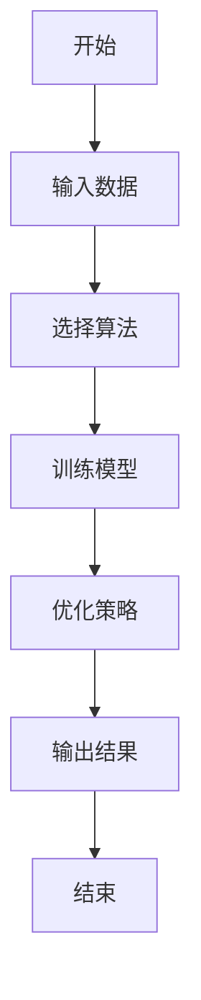

                 


# 价值投资中的AI智能体税收优化系统

## 第一部分: 背景介绍

### 第1章: 价值投资与AI智能体概述

#### 1.1 价值投资的核心概念
- **1.1.1 价值投资的定义与特点**
  - 价值投资是一种以内在价值为导向的投资策略，关注于找到市场价格低于其内在价值的资产。
  - 其特点包括长期视角、基本面分析和逆向思维。

- **1.1.2 价值投资的基本原理**
  - 通过分析公司的财务报表、行业地位和管理层能力，评估其内在价值。
  - 寻找市场先生的错误定价，利用市场的非理性波动进行投资。

- **1.1.3 价值投资在现代金融中的地位**
  - 价值投资是投资学的重要流派之一，尤其在股票投资中占据重要地位。
  - 在当前市场环境下，价值投资的重要性更加凸显，尤其是在市场波动加剧的情况下。

#### 1.2 税收优化的基本概念
- **1.2.1 税收优化的定义**
  - 税收优化是指通过合法的手段，减少纳税人在投资活动中应缴纳的税费，从而提高净收益的过程。

- **1.2.2 税收优化的核心原则**
  - 合法性原则：必须遵守相关法律法规，避免逃税行为。
  - 效益性原则：优化措施应带来显著的经济利益。
  - 稳定性原则：税收优化策略应具备一定的稳定性，避免因政策变化而失效。

- **1.2.3 税收优化在投资中的作用**
  - 降低投资成本，提高投资回报率。
  - 增强资金流动性，优化资产配置。
  - 提高财务灵活性，应对市场变化。

#### 1.3 AI智能体的核心概念
- **1.3.1 AI智能体的定义**
  - AI智能体是指具备自主决策能力，能够根据环境信息做出优化决策的智能系统。
  - 它能够在复杂环境中感知、学习、推理和行动，以实现预定目标。

- **1.3.2 AI智能体的基本特征**
  - 智能性：具备学习和推理能力。
  - 自主性：能够在没有外部干预的情况下独立运作。
  - 适应性：能够根据环境变化调整策略。

- **1.3.3 AI智能体与传统投资工具的区别**
  - 传统投资工具主要依赖人工分析和经验判断，而AI智能体能够利用大数据和机器学习技术，提高决策的准确性和效率。
  - AI智能体能够在短时间内处理海量数据，发现潜在的投资机会和风险。

#### 1.4 本章小结
- 本章介绍了价值投资和税收优化的基本概念，并探讨了AI智能体在其中的角色。通过分析AI智能体的优势，我们看到了它在税收优化中的巨大潜力。

## 第二部分: 核心概念与联系

### 第2章: 价值投资中的税收优化系统

#### 2.1 税收优化系统的核心要素
- **2.1.1 税收计算模型**
  - 税收计算模型是税收优化的基础，用于计算不同投资策略下的税负情况。
  - 该模型需要考虑的因素包括税率、计税基础、纳税时间等。

- **2.1.2 税收规划策略**
  - 税收规划策略是根据税收计算模型得出的结果，制定具体的优化措施。
  - 常见的税收优化策略包括资产配置优化、税务递延和利用税收优惠政策等。

- **2.1.3 税收风险管理**
  - 税收风险管理是指在优化税收的同时，控制可能出现的税务风险。
  - 这包括对税收政策变化的敏感性分析和应对策略的制定。

#### 2.2 AI智能体在税收优化中的角色
- **2.2.1 数据收集与处理**
  - AI智能体会收集与投资相关的各种数据，包括市场数据、财务数据和税务政策等。
  - 数据预处理是确保数据质量和可分析性的关键步骤。

- **2.2.2 模型训练与优化**
  - 利用机器学习算法，训练出能够预测税负和优化策略的模型。
  - 模型优化的目标是在保证准确性的前提下，提高计算效率和决策能力。

- **2.2.3 策略执行与反馈**
  - AI智能体会根据训练好的模型，制定和执行具体的税收优化策略。
  - 反馈机制用于评估策略的效果，并进行模型的更新和优化。

#### 2.3 核心概念的ER实体关系图
```mermaid
erDiagram
    investor(investor_id, name, portfolio_value)
    investment(investment_id, asset_class, risk_level, tax_liability)
    tax_optimization_system(system_id, version, description)
    investor "1..*"
    investment "1..*"
    tax_optimization_system "1..*"
```

## 第三部分: 算法原理讲解

### 第3章: AI智能体的算法原理

#### 3.1 强化学习算法
- **3.1.1 强化学习的基本原理**
  - 强化学习是一种通过试错机制，学习最优策略的机器学习方法。
  - 通过与环境的交互，智能体获得奖励或惩罚，逐步优化自身的决策策略。

- **3.1.2 Q-learning算法**
  - Q-learning是一种基于值函数的强化学习算法，通过更新Q值表来逼近最优策略。
  - Q值表示在特定状态下采取某项动作的预期回报。

- **3.1.3 策略梯度方法**
  - 策略梯度方法直接优化策略，通过计算梯度来更新参数，找到最优策略。
  - 该方法适用于连续动作空间的情况。

#### 3.2 遗传算法
- **3.2.1 遗传算法的基本步骤**
  - 初始化种群：随机生成一组候选解。
  - 适应度评估：计算每个个体的适应度值。
  - 选择：根据适应度值选择优良的个体进行繁殖。
  - 交叉：通过基因交叉操作生成新的个体。
  - 变异：随机改变某些个体的基因，增加种群的多样性。

- **3.2.2 适应度函数的设计**
  - 适应度函数用于衡量个体的优劣，是遗传算法的核心。
  - 在税收优化中，适应度函数可以设计为税后收益最大化，或者风险最小化等目标。

- **3.2.3 选择与交叉操作**
  - 选择操作通常采用轮盘赌选择、锦标赛选择等方式。
  - 交叉操作如单点交叉、双点交叉等，用于生成新的个体。

#### 3.3 算法流程图


## 第四部分: 系统分析与架构设计

### 第4章: 系统分析与架构设计

#### 4.1 系统功能设计
- **4.1.1 数据采集模块**
  - 负责收集与投资相关的各种数据，包括市场数据、财务数据和税务政策等。
  - 数据预处理是确保数据质量和可分析性的关键步骤。

- **4.1.2 模型训练模块**
  - 利用机器学习算法，训练出能够预测税负和优化策略的模型。
  - 模型优化的目标是在保证准确性的前提下，提高计算效率和决策能力。

- **4.1.3 策略执行模块**
  - 根据训练好的模型，制定和执行具体的税收优化策略。
  - 反馈机制用于评估策略的效果，并进行模型的更新和优化。

#### 4.2 系统架构设计
- **4.2.1 系统架构图**
  ```mermaid
  graph TD
      UI --> Controller
      Controller --> Service
      Service --> Repository
      Repository --> Database
  ```

- **4.2.2 系统接口设计**
  - 提供RESTful API接口，供外部系统调用。
  - 接口包括数据采集、模型训练、策略执行等功能。

- **4.2.3 系统交互序列图**
  ```mermaid
  sequenceDiagram
      participant 用户
      participant 控制器
      participant 服务
      participant 数据库
      用户 -> 控制器: 发送请求
      控制器 -> 服务: 处理请求
      服务 -> 数据库: 查询数据
      数据库 --> 服务: 返回数据
      服务 --> 控制器: 处理结果
      控制器 --> 用户: 返回响应
  ```

## 第五部分: 项目实战

### 第5章: 项目实战

#### 5.1 环境安装
- 需要安装的工具包括Python、TensorFlow、Keras、Pandas等。
- 安装命令示例：
  ```bash
  pip install numpy
  pip install pandas
  pip install tensorflow
  ```

#### 5.2 核心实现
- 示例代码：
  ```python
  import numpy as np
  import pandas as pd
  from tensorflow import keras

  # 数据加载
  data = pd.read_csv('data.csv')
  x = data.iloc[:, :-1].values
  y = data.iloc[:, -1].values

  # 模型构建
  model = keras.Sequential([
      keras.layers.Dense(64, activation='relu'),
      keras.layers.Dense(1, activation='linear')
  ])
  model.compile(optimizer='adam', loss='mean_squared_error')

  # 模型训练
  model.fit(x, y, epochs=100, batch_size=32)
  ```

#### 5.3 案例分析
- 通过实际案例分析，展示AI智能体如何优化税收。
- 分步解释代码实现和结果分析。

## 第六部分: 最佳实践 tips

### 第6章: 小结、注意事项、拓展阅读

#### 6.1 小结
- 总结本书的主要内容和关键知识点。
- 强调AI智能体在税收优化中的应用潜力。

#### 6.2 注意事项
- 提醒读者注意合法性和合规性问题。
- 强调数据质量和模型的可解释性。

#### 6.3 拓展阅读
- 推荐相关的书籍和资源，供读者深入学习。

## 作者：AI天才研究院/AI Genius Institute & 禅与计算机程序设计艺术 /Zen And The Art of Computer Programming

