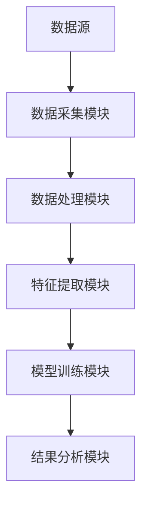
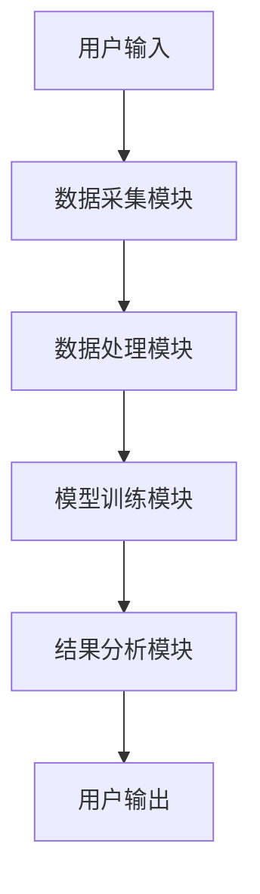
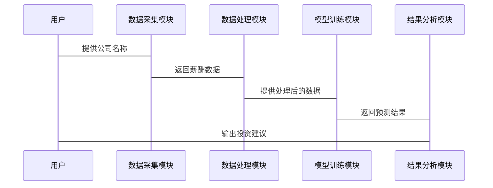

                 


# 价值投资中的AI智能体管理层薪酬结构分析系统

> 关键词：价值投资、AI智能体、管理层薪酬结构、数据分析、机器学习、投资决策

> 摘要：本文探讨了在价值投资中，如何利用AI智能体分析公司的管理层薪酬结构，以评估公司的潜在价值和风险。通过详细分析管理层薪酬的构成、算法原理以及系统架构设计，本文提出了一个完整的分析系统，为投资者提供了科学的决策支持。

---

## 引言

在金融投资领域，价值投资是一种以公司内在价值为导向的投资策略，旨在通过分析公司的财务状况、市场地位和管理团队等因素，识别出具有长期投资价值的公司。随着人工智能技术的迅速发展，越来越多的投资者开始尝试利用AI技术来优化投资决策。本文将重点探讨如何利用AI智能体分析公司的管理层薪酬结构，从而辅助价值投资决策。

---

## 第1章：价值投资与AI智能体概述

### 1.1 价值投资的核心理念

价值投资的核心理念在于寻找市场低估的公司，并长期持有这些公司，直到其内在价值被市场发现。这种投资策略强调对公司基本面的深入分析，包括财务状况、管理层素质、行业地位等多个方面。

- **特点**：
  - 长期投资：价值投资者通常持有公司股票较长时间，关注公司的长期增长。
  - 低估值：寻找市场价格低于内在价值的公司。
  - 高质量：注重公司财务健康、管理团队稳定等因素。

### 1.2 AI智能体的定义与特点

AI智能体是一种能够感知环境、做出决策并执行任务的智能系统。与传统的数据分析工具相比，AI智能体具有以下特点：

- **数据驱动**：能够处理大量复杂数据，发现数据中的潜在规律。
- **自适应性**：能够根据新的数据和环境变化，调整自身的分析模型。
- **自动化**：能够在没有人工干预的情况下，完成数据采集、分析和决策过程。

### 1.3 价值投资与AI智能体的结合

将AI智能体引入价值投资，能够显著提升投资分析的效率和准确性。AI智能体可以通过分析海量数据，识别出传统方法难以察觉的投资机会和风险。

- **意义**：
  - 提高分析效率：AI智能体能够快速处理大量数据，节省时间和成本。
  - 深度分析：通过复杂的算法，揭示数据背后的规律和潜在价值。
  - 优化决策：基于AI分析的结果，投资者可以做出更科学的投资决策。

---

## 第2章：管理层薪酬结构分析的背景与重要性

### 2.1 管理层薪酬结构的定义

管理层薪酬结构是指公司高管（如CEO、 CFO等）获得的报酬形式和比例。通常包括固定工资、奖金、股票期权等多种形式。

- **构成要素**：
  - 固定工资：按月或按年支付的基本薪酬。
  - 奖金：根据公司绩效和个人绩效发放的额外报酬。
  - 股票期权：公司给予高管在特定时期内以特定价格购买公司股票的权利。

### 2.2 管理层薪酬结构分析的重要性

管理层薪酬结构是公司治理的重要组成部分，直接关系到公司的长期发展和股东利益。

- **对股价的影响**：
  - 合理的薪酬结构能够激励管理层追求公司长期发展，从而提升股价。
  - 过高的短期激励可能导致管理层短视行为，损害股东利益。

- **对投资决策的影响**：
  - 通过分析管理层薪酬结构，投资者可以评估管理层的动机和行为，从而做出更明智的投资决策。

### 2.3 管理层薪酬结构分析的挑战

- **数据获取的难度**：管理层薪酬数据通常不公开，获取难度较大。
- **数据分析的复杂性**：薪酬结构涉及多个因素，分析复杂。
- **结果解释的不确定性**：薪酬结构与公司绩效之间的关系并非线性，解释具有不确定性。

---

## 第3章：AI智能体在管理层薪酬结构分析中的核心概念

### 3.1 AI智能体的核心原理

AI智能体在管理层薪酬结构分析中的核心原理包括数据采集、特征提取、模型训练和预测。

- **数据采集**：通过爬虫、API等方式获取公开的公司数据。
- **特征提取**：从数据中提取与管理层薪酬相关的特征，如薪酬总额、股权比例等。
- **模型训练**：使用机器学习算法训练模型，预测薪酬结构对股价的影响。
- **预测与分析**：基于模型预测结果，生成投资建议。

### 3.2 管理层薪酬结构分析的数学模型

#### 3.2.1 线性回归模型

线性回归是一种常用的统计分析方法，适用于分析变量之间的线性关系。

$$ y = \beta_0 + \beta_1x_1 + \beta_2x_2 + ... + \beta_nx_n + \epsilon $$

其中，$y$ 是目标变量（如股价），$x_i$ 是自变量（如薪酬总额），$\beta_i$ 是回归系数，$\epsilon$ 是误差项。

#### 3.2.2 聚类分析模型

聚类分析用于将公司按某种特征划分成不同的类别，帮助投资者识别具有相似特征的公司。

$$ d(x, y) = \sqrt{\sum_{i=1}^{n}(x_i - y_i)^2} $$

其中，$d(x, y)$ 是两个样本之间的距离。

#### 3.2.3 神经网络模型

神经网络是一种复杂的机器学习模型，能够处理非线性关系。

$$ y = \sigma(wx + b) $$

其中，$w$ 是权重，$x$ 是输入，$b$ 是偏置，$\sigma$ 是激活函数。

### 3.3 AI智能体与管理层薪酬结构的关系

#### 3.3.1 数据流图



#### 3.3.2 系统架构图


---

## 第4章：管理层薪酬结构分析系统的算法原理

### 4.1 管理层薪酬结构分析的算法选择

- **线性回归算法**：适用于分析薪酬与股价的线性关系。
- **聚类分析算法**：适用于将公司按薪酬结构相似性进行分类。
- **神经网络算法**：适用于复杂的非线性关系分析。

### 4.2 管理层薪酬结构分析的数学模型

#### 4.2.1 线性回归模型

$$ y = \beta_0 + \beta_1x_1 + \beta_2x_2 + ... + \beta_nx_n + \epsilon $$

其中，$y$ 是目标变量（如股价），$x_i$ 是自变量（如薪酬总额），$\beta_i$ 是回归系数，$\epsilon$ 是误差项。

#### 4.2.2 聚类分析模型

$$ d(x, y) = \sqrt{\sum_{i=1}^{n}(x_i - y_i)^2} $$

其中，$d(x, y)$ 是两个样本之间的距离。

#### 4.2.3 神经网络模型

$$ y = \sigma(wx + b) $$

其中，$w$ 是权重，$x$ 是输入，$b$ 是偏置，$\sigma$ 是激活函数。

### 4.3 管理层薪酬结构分析的算法实现

#### 4.3.1 数据预处理

- 数据清洗：处理缺失值、异常值。
- 数据标准化：将数据标准化，以便模型训练。

#### 4.3.2 模型训练

- 线性回归：使用最小二乘法训练模型。
- 聚类分析：使用K-means算法进行聚类。
- 神经网络：使用反向传播算法训练模型。

#### 4.3.3 模型评估

- 线性回归：评估R²值和残差平方和。
- 聚类分析：评估聚类的准确性和召回率。
- 神经网络：评估准确率和混淆矩阵。

---

## 第5章：管理层薪酬结构分析系统的系统架构设计

### 5.1 系统功能模块划分

- **数据采集模块**：负责采集公司管理层薪酬数据。
- **数据处理模块**：对数据进行清洗和标准化处理。
- **模型训练模块**：训练机器学习模型。
- **结果分析模块**：分析模型预测结果，生成投资建议。

### 5.2 系统架构设计

#### 5.2.1 系统架构图



#### 5.2.2 系统交互流程图



---

## 第6章：项目实战

### 6.1 环境配置

- **Python版本**：Python 3.8以上
- **库的安装**：安装numpy、pandas、scikit-learn、tensorflow等库。

```bash
pip install numpy pandas scikit-learn tensorflow
```

### 6.2 数据集准备

- 数据来源：可以从公开的金融数据网站获取，如Yahoo Finance、Google Finance等。
- 数据格式：包括公司名称、CEO薪酬、 CFO薪酬、股价等。

### 6.3 特征工程

- 数据清洗：处理缺失值和异常值。
- 数据标准化：将薪酬数据标准化，以便模型训练。

### 6.4 模型训练

- 线性回归模型：使用scikit-learn库中的LinearRegression进行训练。
- 神经网络模型：使用TensorFlow库中的Sequential模型进行训练。

### 6.5 模型评估

- 线性回归：评估R²值和残差平方和。
- 神经网络：评估准确率和混淆矩阵。

### 6.6 结果分析

- 线性回归：输出回归系数和预测结果。
- 神经网络：输出预测结果和概率分布。

---

## 第7章：总结与展望

### 7.1 总结

本文详细探讨了如何利用AI智能体分析管理层薪酬结构，辅助价值投资决策。通过介绍价值投资的核心理念、AI智能体的定义与特点、管理层薪酬结构分析的重要性，以及相关的算法原理和系统架构设计，本文为投资者提供了一种科学的分析方法。

### 7.2 展望

未来，随着AI技术的不断发展，管理层薪酬结构分析系统将更加智能化和自动化。同时，如何处理更复杂的数据、提高模型的准确性和可解释性，将是未来研究的重点方向。

---

## 作者

作者：AI天才研究院/AI Genius Institute & 禅与计算机程序设计艺术 /Zen And The Art of Computer Programming

---

通过以上结构，文章详细介绍了价值投资中的AI智能体管理层薪酬结构分析系统，从背景到算法，再到系统实现，为投资者提供了科学的决策支持。

