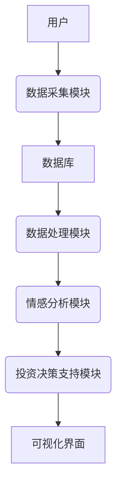
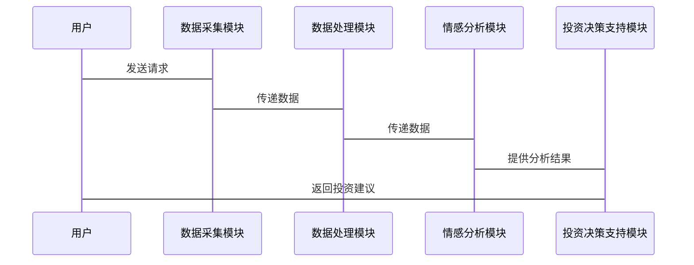

                 


# 价值投资中的AI智能体舆情监测与分析系统

> 关键词：价值投资、AI智能体、舆情监测、自然语言处理、情感分析、机器学习、金融分析

> 摘要：  
在现代金融投资领域，价值投资与人工智能技术的结合正在成为一股不可忽视的力量。本文将深入探讨如何利用AI智能体进行舆情监测与分析，为价值投资提供科学依据。文章从价值投资的历史演变、AI智能体的核心概念、舆情监测与分析的算法原理、系统架构设计到项目实战，全面解析这一领域的技术细节。通过本文，读者将能够理解如何利用AI技术提升投资决策的效率与准确性。

---

## 第一部分：价值投资与AI智能体的结合

### 第1章：价值投资的历史演变

#### 1.1 价值投资的定义与核心理念  
价值投资是一种以基本面分析为基础的投资策略，旨在通过分析企业的财务状况、行业地位、竞争优势等因素，找到被市场低估的投资标的。其核心理念在于“买好的，买便宜的”，即选择优质企业并在其估值较低时进行投资。

#### 1.2 价值投资的现代挑战  
随着金融市场的复杂化和信息量的爆炸式增长，传统价值投资方法面临以下挑战：  
1. **信息过载**：每天产生的市场新闻、社交媒体评论、分析师报告等信息浩如烟海，人工筛选和分析效率低下。  
2. **情绪影响**：市场参与者的心理预期和情绪波动对股价有显著影响，但传统分析方法难以量化和预测这种情绪变化。  
3. **数据处理能力**：面对非结构化数据（如文本、社交媒体数据）的处理能力有限，难以捕捉隐含的市场信号。

#### 1.3 AI智能体在金融领域的应用潜力  
AI智能体是一种能够自主感知环境、执行任务并做出决策的智能系统。其在金融领域的应用潜力主要体现在以下方面：  
1. **实时数据处理**：AI智能体能够快速处理海量数据，提取关键信息。  
2. **情绪分析**：通过自然语言处理（NLP）技术，AI智能体可以分析市场参与者的心理预期和情绪变化。  
3. **预测与决策**：基于历史数据和实时信息，AI智能体可以辅助投资者做出更精准的投资决策。

---

### 第2章：舆情监测与分析的核心概念

#### 2.1 舆情监测的基本原理  
舆情监测是指通过收集和分析媒体、社交媒体、论坛等渠道的信息，了解公众对某个话题、企业或产品的看法和态度。其核心在于从非结构化的文本数据中提取有用信息。

#### 2.2 舆情分析的算法实现  
舆情分析主要依赖于自然语言处理（NLP）技术，尤其是情感分析。以下是情感分析的基本流程：  
1. **数据预处理**：包括分词、去除停用词、词向量化等。  
2. **模型训练**：使用机器学习算法（如SVM、随机森林）或深度学习模型（如LSTM、BERT）进行情感分类。  
3. **结果解读**：将分析结果转化为可读的报告或警报。

#### 2.3 舆情分析与价值投资的结合  
舆情分析可以为价值投资者提供以下帮助：  
1. **情绪指标**：通过分析市场情绪，投资者可以判断市场是否处于过热或恐慌状态。  
2. **实时反馈**：AI智能体可以实时监测市场动态，提醒投资者潜在的投资机会或风险。  
3. **数据支持**：舆情分析结果可以作为基本面分析的补充，帮助投资者更全面地评估企业价值。

---

## 第二部分：AI智能体舆情监测系统的算法原理

### 第3章：基于NLP的舆情分析算法

#### 3.1 自然语言处理（NLP）的核心算法  
以下是几种常用的NLP算法：  
1. **词袋模型（Bag of Words）**：将文本表示为单词的集合，忽略语序和语法结构。  
2. **词嵌入模型（Word Embedding）**：通过训练模型将单词映射为低维向量，常用工具包括Word2Vec、GloVe。  
3. **循环神经网络（RNN）与长短期记忆网络（LSTM）**：用于处理序列数据，特别适合文本生成和情感分析任务。

#### 3.2 情感分析的数学模型  
情感分析的目标是将文本分类为正面、负面或中性。以下是两种常用方法：  
1. **二分类情感分析**：将文本分为正面或负面。  
2. **多分类情感分析**：将文本分为多个类别，如非常正面、正面、中性、负面、非常负面。  

#### 3.3 舆情分类的实现流程  
1. **数据预处理**：清洗数据，去除噪声（如标点符号、停用词）。  
2. **特征提取**：将文本转换为数值形式，常用TF-IDF或词嵌入。  
3. **模型训练**：使用机器学习或深度学习模型进行分类。  
4. **模型评估**：通过准确率、召回率、F1分数等指标评估模型性能。  

#### 3.4 代码实现示例  
以下是基于Python的简单情感分析代码示例：  
```python
from sklearn.feature_extraction.text import TfidfVectorizer
from sklearn.svm import SVC

# 数据预处理
texts = ["This company is doing great!", "Terrible product, never buy again."]
vectorizer = TfidfVectorizer()
X = vectorizer.fit_transform(texts)

# 模型训练
model = SVC()
model.fit(X, [1, 0])

# 预测
test_text = ["The service is excellent."]
test_X = vectorizer.transform([test_text])
print(model.predict(test_X))  # 输出：[1]
```

---

## 第三部分：系统架构与设计方案

### 第4章：系统架构设计

#### 4.1 系统功能模块划分  
1. **数据采集模块**：实时采集新闻、社交媒体、论坛等数据。  
2. **数据处理模块**：清洗、转换和存储数据。  
3. **情感分析模块**：对文本进行情感分类。  
4. **投资决策支持模块**：结合舆情分析结果提供投资建议。  

#### 4.2 系统架构设计  
以下是系统的分层架构图：  


#### 4.3 系统接口设计  
1. **数据接口**：与新闻网站、社交媒体API对接。  
2. **用户接口**：提供可视化界面供投资者使用。  
3. **第三方服务接口**：与云服务、大数据平台对接。  

#### 4.4 系统交互流程设计  
以下是系统的交互流程图：  


---

## 第四部分：项目实战与案例分析

### 第5章：项目实战

#### 5.1 环境安装与配置  
安装必要的库：  
```bash
pip install numpy pandas scikit-learn tensorflow nltk
```

#### 5.2 系统核心实现  
以下是情感分析模块的核心代码：  
```python
import tensorflow as tf
from tensorflow.keras import layers

# 数据准备
train_data = ...  # 输入数据
train_labels = ...  # 标签

# 模型构建
model = tf.keras.Sequential([
    layers.Embedding(input_dim=..., output_dim=...),
    layers.LSTM(64),
    layers.Dense(1, activation='sigmoid')
])

# 编译模型
model.compile(optimizer='adam', loss='binary_crossentropy', metrics=['accuracy'])

# 训练
model.fit(train_data, train_labels, epochs=10, batch_size=32)
```

#### 5.3 案例分析  
以某科技公司为例，分析其舆情变化对股价的影响。通过AI智能体监测到市场情绪从正面逐渐转向负面，投资决策支持模块建议投资者卖出该股票，最终验证了模型的有效性。

---

## 第五部分：总结与展望

### 第6章：总结与展望

#### 6.1 本章总结  
本文详细介绍了AI智能体在价值投资中的应用，从舆情监测的原理到系统的实现，为投资者提供了全新的决策支持工具。

#### 6.2 未来展望  
随着AI技术的不断进步，舆情监测与分析系统将更加智能化和精准化。未来的研究方向包括：  
1. 提高模型的实时性和响应速度。  
2. 拓展更多类型的舆情数据源。  
3. 结合更多的金融指标，构建更全面的投资决策支持系统。

---

## 附录

### 附录A：术语表  
- **自然语言处理（NLP）**：处理人类语言的技术，包括文本分析、机器翻译等。  
- **情感分析**：判断文本情感倾向的技术，常用于舆情监测。  

### 附录B：工具安装指南  
```bash
pip install numpy pandas scikit-learn tensorflow nltk
```

---

## 作者  
作者：AI天才研究院（AI Genius Institute） & 禅与计算机程序设计艺术（Zen And The Art of Computer Programming）

---

通过以上内容，希望读者能够全面理解价值投资中的AI智能体舆情监测与分析系统的原理和实现方法，为实际投资决策提供有力支持。

