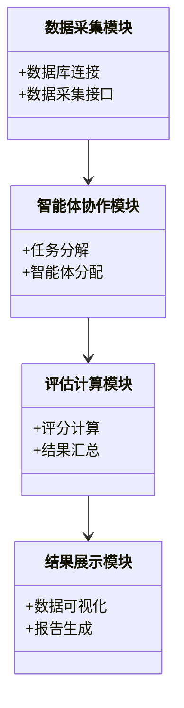
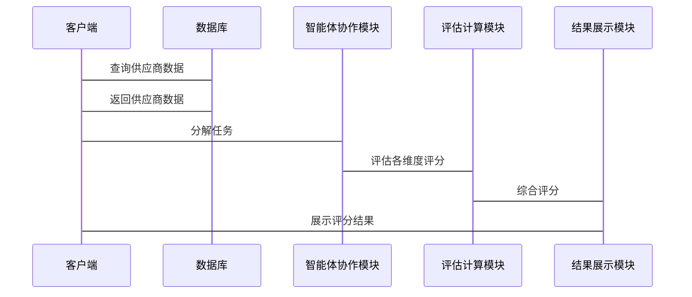

                 


# 价值投资中的AI驱动供应商关系评估：多智能体协作

## 关键词：
- 价值投资
- AI驱动
- 多智能体协作
- 供应商关系评估
- 供应商评分模型
- 数据驱动决策

## 摘要：
本文探讨了在价值投资中，如何利用人工智能技术进行供应商关系评估，特别强调多智能体协作的应用。文章从价值投资的基本概念入手，详细分析了AI在供应商关系评估中的作用，结合多智能体协作的算法原理和系统架构设计，提供了实际的项目实现和案例分析。通过本文，读者能够理解如何利用AI技术优化供应商关系，从而提升投资决策的效率和准确性。

---

# 正文

## 第1章 价值投资与AI驱动供应商关系评估概述

### 1.1 价值投资的基本概念
#### 1.1.1 价值投资的定义与核心理念
价值投资是一种以基本面分析为基础的投资策略，旨在通过深入分析企业的财务状况、行业地位和未来发展潜力，寻找被市场低估的投资标的。其核心理念是“买入并持有”，注重长期稳健的收益。

#### 1.1.2 价值投资在现代投资中的地位
随着金融市场日益复杂化和数据化的趋势，传统的价值投资方法逐渐融入现代技术手段，尤其是人工智能技术的应用，为投资者提供了更精准、高效的决策支持。

#### 1.1.3 价值投资与传统投资策略的对比
- 传统投资策略：依赖经验判断和市场直觉，主观性强，效率较低。
- 价值投资结合AI：利用大数据分析和机器学习模型，提高投资决策的客观性和准确性。

### 1.2 供应商关系评估的必要性
#### 1.2.1 供应商关系在企业运营中的作用
供应商是企业供应链的重要组成部分，供应商关系的好坏直接影响企业的成本、交付能力和市场竞争力。

#### 1.2.2 供应商关系评估的核心目标
- 优化供应商选择，降低采购成本。
- 提高供应链的稳定性和灵活性。
- 通过长期合作，建立战略伙伴关系。

#### 1.2.3 价值投资中供应商关系评估的独特性
在价值投资中，供应商关系评估不仅仅是对供应商的财务能力进行分析，更注重供应商的长期合作潜力和市场竞争力，从而为企业的长期发展提供支持。

### 1.3 AI技术在价值投资中的应用前景
#### 1.3.1 AI技术在金融领域的应用现状
- AI技术广泛应用于股票预测、风险评估、市场趋势分析等领域。
- 大数据分析能力使得AI能够处理海量数据，发现传统方法难以察觉的市场规律。

#### 1.3.2 AI在供应商关系评估中的潜在价值
- 通过机器学习模型分析供应商的历史数据，预测其未来的履约能力和市场表现。
- 利用自然语言处理技术，分析供应商的公开信息，评估其信用风险。

#### 1.3.3 多智能体协作在复杂投资决策中的优势
多智能体协作能够将不同的决策因素分解成多个独立的子任务，通过协作实现整体最优解。例如，在供应商关系评估中，可以将供应商的财务状况、市场表现、信用风险等多个维度分别进行评估，最终综合得出供应商的整体评分。

---

## 第2章 多智能体协作的基本原理

### 2.1 多智能体协作的定义与特点
#### 2.1.1 多智能体协作的定义
多智能体协作是指多个智能体通过协同工作，共同完成复杂任务的过程。每个智能体负责不同的子任务，通过信息共享和协作，实现整体目标。

#### 2.1.2 多智能体协作的核心特点
- 分布式计算：任务分解成多个子任务，由不同的智能体独立完成。
- 协作性：智能体之间通过信息共享和协调，实现协同工作。
- 自适应性：能够根据环境变化动态调整协作策略。

#### 2.1.3 多智能体协作与传统单智能体决策的对比
- 传统单智能体：集中式决策，效率较低，难以应对复杂任务。
- 多智能体协作：分布式决策，任务分解明确，协作高效。

### 2.2 供应商关系评估的多智能体模型
#### 2.2.1 多智能体协作在供应商关系评估中的应用
- 任务分解：将供应商评估分解为财务分析、市场表现、信用风险等多个子任务。
- 协作机制：每个智能体负责一个子任务，并将结果共享给其他智能体。

#### 2.2.2 供应商关系评估的多智能体模型构建
- **智能体角色**：每个智能体对应一个评估维度（如财务分析智能体、市场表现智能体）。
- **通信机制**：智能体之间通过共享数据进行协作，例如通过API接口传递评估结果。
- **决策机制**：综合各智能体的评估结果，得出最终供应商评分。

#### 2.2.3 多智能体协作的优势
- 提高评估效率：任务分解后，多个智能体同时处理不同维度的数据。
- 提高评估准确性：通过多维度分析，避免单一维度评估的片面性。

### 2.3 多智能体协作的算法实现
#### 2.3.1 多智能体协作的算法模型
- **任务分配**：根据任务特点分配给合适的智能体。
- **信息共享**：智能体之间通过通信协议共享数据和结果。
- **协作优化**：通过不断优化协作策略，提高整体评估效率。

#### 2.3.2 算法实现的数学模型
$$ \text{供应商评分} = \sum_{i=1}^{n} w_i \cdot s_i $$
其中，\( w_i \) 为第 \( i \) 个评估维度的权重，\( s_i \) 为第 \( i \) 个维度的评分。

---

## 第3章 价值投资中的多智能体协作算法

### 3.1 供应商关系评估的多智能体算法
#### 3.1.1 算法概述
多智能体协作算法通过任务分解和信息共享，实现供应商关系的全面评估。每个智能体负责一个子任务，最终通过加权评分得出供应商的整体评分。

#### 3.1.2 算法实现步骤
1. 任务分解：将供应商评估任务分解为财务分析、市场表现、信用风险等多个子任务。
2. 智能体分配：为每个子任务分配对应的智能体。
3. 数据收集：智能体从数据库中获取相关数据。
4. 评估计算：每个智能体根据分配的任务进行评估计算。
5. 信息共享：智能体之间共享评估结果。
6. 综合评分：根据权重计算最终供应商评分。

#### 3.1.3 算法实现的数学模型
$$ S = \sum_{i=1}^{n} w_i \cdot s_i $$
其中，\( S \) 为供应商总评分，\( w_i \) 为第 \( i \) 个维度的权重，\( s_i \) 为第 \( i \) 个维度的评分。

### 3.2 算法实现的Python代码
```python
import numpy as np

# 示例数据
weights = [0.4, 0.3, 0.3]  # 权重
scores = [0.8, 0.9, 0.7]  # 各维度评分

# 计算总评分
total_score = np.dot(weights, scores)

print(f"供应商总评分为: {total_score}")
```

---

## 第4章 系统分析与架构设计

### 4.1 系统功能设计
#### 4.1.1 系统功能模块
- 数据采集模块：从数据库中获取供应商数据。
- 智能体协作模块：分解任务并分配给不同智能体。
- 评估计算模块：计算各维度评分并综合得出总评分。
- 结果展示模块：将供应商评分以可视化形式展示。

#### 4.1.2 功能模块的Mermaid类图


### 4.2 系统架构设计
#### 4.2.1 系统架构图


#### 4.2.2 交互流程图


---

## 第5章 项目实战

### 5.1 环境安装
- Python 3.8+
- Numpy、Pandas、Scikit-learn等库
- Mermaid图生成工具（如PlantUML）

### 5.2 系统核心实现
```python
import numpy as np
import pandas as pd

# 数据预处理
data = pd.read_csv('suppliers.csv')
data = data.dropna()

# 智能体协作实现
def calculate_supplier_score(data):
    # 分解任务
    financial_score = data['financial_score'].mean()
    market_score = data['market_score'].mean()
    credit_score = data['credit_score'].mean()
    
    # 权重
    weights = [0.4, 0.3, 0.3]
    
    # 综合评分
    total_score = np.dot(weights, [financial_score, market_score, credit_score])
    return total_score

# 应用案例
scores = calculate_supplier_score(data)
print(f"供应商平均评分为: {scores}")
```

### 5.3 案例分析
假设我们有三个供应商，分别在财务、市场和信用方面有不同的评分。通过多智能体协作算法，我们可以计算出每个供应商的综合评分，从而选择最优供应商。

---

## 第6章 最佳实践与总结

### 6.1 小结
本文详细探讨了价值投资中AI驱动的供应商关系评估方法，结合多智能体协作算法，提供了系统的解决方案。通过任务分解和信息共享，实现了供应商关系的高效评估。

### 6.2 注意事项
- 数据质量是评估结果准确性的重要保障，需确保数据来源可靠。
- 权重分配需根据实际情况调整，避免单一维度评分对结果的影响过大。
- 系统设计需考虑可扩展性，以便未来增加更多评估维度。

### 6.3 未来展望
随着AI技术的不断发展，多智能体协作在价值投资中的应用将更加广泛。未来的研究可以进一步优化协作算法，探索更多应用场景。

---

## 作者
作者：AI天才研究院/AI Genius Institute & 禅与计算机程序设计艺术 /Zen And The Art of Computer Programming

---

通过以上内容，我们详细探讨了价值投资中的AI驱动供应商关系评估方法，结合多智能体协作算法，提供了系统的解决方案。希望本文能够为读者提供有价值的参考和启发。

