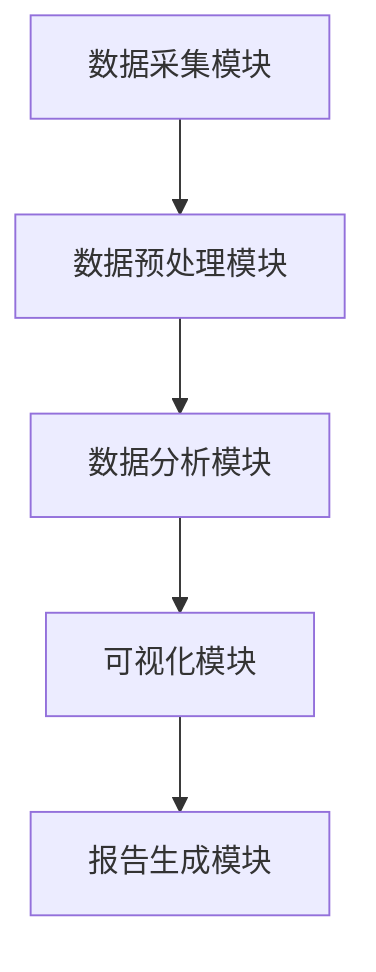

                 


# 价值投资中的AI驱动供应链分析：多智能体系统的优势

> 关键词：价值投资，供应链分析，人工智能，多智能体系统，投资策略，数据分析，系统架构

> 摘要：本文深入探讨了在价值投资中，如何利用人工智能技术，特别是多智能体系统，来优化供应链分析。通过分析多智能体系统在供应链中的应用，本文揭示了如何利用AI技术提升供应链效率，进而优化投资决策。文章涵盖了从理论基础到实际应用的各个方面，包括数据采集、算法选择、系统架构设计和项目实战等，为读者提供了一个全面的视角。

---

## 第1章: 价值投资与供应链分析概述

### 1.1 价值投资的基本概念

#### 1.1.1 价值投资的定义与核心理念
价值投资是一种投资策略，强调通过分析企业的基本面，如财务状况、行业地位和管理团队等，寻找被市场低估的投资标的。其核心理念是“买入并持有”，即长期投资优质资产。

#### 1.1.2 供应链分析在投资中的重要性
供应链分析是指对从原材料采购到产品交付的整个过程进行研究，以优化资源分配、降低运营成本和提高效率。在价值投资中，供应链分析可以帮助投资者评估企业的运营效率和成本控制能力，从而判断其长期盈利能力。

#### 1.1.3 价值投资与供应链分析的结合
将供应链分析融入价值投资，可以通过对企业供应链效率的评估，更准确地判断企业的竞争优势和潜在风险，从而优化投资决策。

---

### 1.2 AI在供应链分析中的应用背景

#### 1.2.1 供应链分析的传统方法与局限性
传统供应链分析依赖于人工数据收集和统计分析，效率低、成本高且难以实时响应市场变化。

#### 1.2.2 AI技术如何提升供应链分析的效率
AI技术可以通过机器学习算法自动处理大量数据，快速识别供应链中的瓶颈和优化点，显著提升分析效率。

#### 1.2.3 多智能体系统在供应链分析中的优势
多智能体系统能够模拟供应链中的多个参与者（如供应商、制造商、分销商）的行为，通过协同决策优化整体供应链绩效。

---

## 第2章: 多智能体系统在供应链分析中的应用

### 2.1 多智能体系统的基本概念

#### 2.1.1 多智能体系统的定义与特点
多智能体系统（MAS）是由多个自主智能体组成的分布式系统，每个智能体能够感知环境、做出决策并与其他智能体协作。

#### 2.1.2 多智能体系统与传统供应链分析的区别
与传统方法相比，多智能体系统能够实时模拟供应链中各参与者的动态行为，提供更精准的预测和优化建议。

#### 2.1.3 多智能体系统在供应链分析中的优势
多智能体系统能够处理复杂的供应链关系，通过分布式计算和协同决策，实现全局优化。

---

### 2.2 多智能体系统的组成与功能

#### 2.2.1 多智能体系统的组成架构
一个典型的多智能体系统包括以下组成部分：
- **智能体**：负责具体任务的执行单元。
- **通信机制**：智能体之间的信息交互渠道。
- **协调机制**：用于协调各智能体的行动。
- **环境**：智能体所处的外部环境。

#### 2.2.2 各智能体的功能与角色
- **供应商智能体**：负责原材料的采购和供应。
- **制造商智能体**：负责生产计划和调度。
- **分销商智能体**：负责产品的物流和分销。
- **消费者智能体**：代表最终消费者的需求。

#### 2.2.3 多智能体系统在供应链中的协同机制
通过通信和协调机制，各智能体能够协同工作，实现供应链的整体优化。

---

## 第3章: AI驱动的供应链数据分析

### 3.1 数据采集与预处理

#### 3.1.1 数据来源与采集方法
- 数据来源包括企业内部数据库、公开市场数据和第三方数据服务。
- 数据采集方法包括爬虫技术、API接口和数据库查询。

#### 3.1.2 数据清洗与特征提取
- 数据清洗：去除重复数据、处理缺失值和异常值。
- 特征提取：通过主成分分析（PCA）提取关键特征。

#### 3.1.3 数据标准化与归一化
- 数据标准化：将数据缩放到统一的尺度，如Z-score标准化。
- 数据归一化：将数据映射到0-1范围，便于模型训练。

---

### 3.2 供应链数据分析的算法选择

#### 3.2.1 常见的供应链数据分析算法
- 线性回归：用于预测需求和成本。
- 支持向量机（SVM）：用于分类和预测。
- 随机森林：用于特征重要性分析和预测。

#### 3.2.2 算法选择的依据与原则
- 数据特征：根据数据类型选择适合的算法。
- 业务需求：根据分析目标选择合适的算法。
- 计算资源：考虑算法的计算复杂度和资源需求。

#### 3.2.3 算法性能评估与优化
- 评估指标：准确率、召回率、F1值等。
- 优化方法：超参数调优、集成学习。

---

### 3.3 数据分析结果的可视化

#### 3.3.1 数据可视化的基本方法
- 折线图：展示时间序列数据。
- 条形图：展示分类数据。
- 热力图：展示数据的分布情况。

#### 3.3.2 可视化工具的选择与使用
- 工具：Python中的Matplotlib、Seaborn，以及Tableau。
- 使用方法：根据数据类型选择合适的可视化方式。

#### 3.3.3 可视化结果的解读与应用
- 通过可视化结果，识别供应链中的瓶颈和优化点。

---

## 第4章: 供应链分析的数学模型与公式

### 4.1 供应链分析的基本数学模型

#### 4.1.1 供应链成本模型
- 成本构成：采购成本、运输成本、仓储成本。
- 模型：$$ \text{总成本} = \text{采购成本} + \text{运输成本} + \text{仓储成本} $$

#### 4.1.2 供应链库存模型
- 库存管理：经济订单量（EOQ）模型。
- 公式：$$ EOQ = \sqrt{\frac{2DS}{H}} $$
  - D：年需求量
  - S：每次订单成本
  - H：单位库存持有成本

#### 4.1.3 供应链需求预测模型
- 预测方法：ARIMA模型。
- 公式：$$ ARIMA(p, d, q) $$

---

### 4.2 AI驱动的供应链分析算法

#### 4.2.1 线性回归模型
- 公式：$$ y = \beta_0 + \beta_1x + \epsilon $$
- 应用：预测需求和成本。

#### 4.2.2 支持向量机模型
- 公式：$$ y = \text{sign}(\sum_{i=1}^n \alpha_i y_i K(x_i, x)) $$
- 应用：分类和预测。

#### 4.2.3 随机森林模型
- 公式：$$ y = \text{多数投票结果} $$
- 应用：特征重要性分析和预测。

---

## 第5章: 供应链分析系统的架构设计

### 5.1 系统功能设计

#### 5.1.1 功能模块划分
- 数据采集模块：负责数据的采集和预处理。
- 数据分析模块：负责数据的建模和预测。
- 可视化模块：负责数据结果的可视化展示。
- 报告生成模块：生成分析报告。

#### 5.1.2 功能流程
1. 数据采集模块从数据库中获取数据。
2. 数据预处理模块清洗数据并提取特征。
3. 数据分析模块选择合适的算法进行建模。
4. 可视化模块将结果以图表形式展示。
5. 报告生成模块输出分析报告。

---

### 5.2 系统架构设计

#### 5.2.1 系统架构图


#### 5.2.2 系统接口设计
- 数据接口：提供API接口供其他系统调用。
- 用户接口：提供图形化界面供用户操作。

---

## 第6章: 项目实战

### 6.1 环境安装

#### 6.1.1 Python环境安装
- 安装Python：下载并安装最新版本的Python。
- 安装依赖库：使用pip安装numpy、pandas、scikit-learn等库。

#### 6.1.2 数据库安装
- 安装MySQL：用于存储和管理数据。

---

### 6.2 核心代码实现

#### 6.2.1 数据采集模块
```python
import requests
import json

url = "https://example.com/api/data"
response = requests.get(url)
data = json.loads(response.text)
print(data)
```

#### 6.2.2 数据分析模块
```python
from sklearn.ensemble import RandomForestRegressor
import pandas as pd

# 加载数据
data = pd.read_csv('data.csv')

# 特征选择
X = data.drop('target', axis=1)
y = data['target']

# 模型训练
model = RandomForestRegressor()
model.fit(X, y)

# 预测
predictions = model.predict(X)
```

---

### 6.3 案例分析

#### 6.3.1 案例背景
某制造企业希望优化其供应链管理，降低运营成本。

#### 6.3.2 数据分析结果
通过随机森林模型，发现关键特征为供应商交货时间、原材料成本和市场需求。

#### 6.3.3 投资建议
基于分析结果，建议投资者关注该企业的成本控制能力和供应链效率。

---

## 第7章: 最佳实践与未来展望

### 7.1 最佳实践

#### 7.1.1 数据质量管理
- 确保数据的准确性和完整性。

#### 7.1.2 模型优化
- 定期更新模型，确保其适应市场变化。

#### 7.1.3 团队协作
- 建立跨学科团队，促进数据科学家与业务部门的协作。

---

### 7.2 未来展望

#### 7.2.1 技术发展
- 更先进的AI算法（如深度学习和强化学习）将进一步提升供应链分析的精度。

#### 7.2.2 应用场景拓展
- 供应链分析将应用于更多领域，如智能物流和智能制造。

---

## 结语

通过本文的分析，我们可以看到，AI驱动的供应链分析在价值投资中具有巨大潜力。多智能体系统的引入，使得供应链分析更加智能化和动态化，为企业和投资者提供了更精准的决策支持。

---

## 作者：AI天才研究院/AI Genius Institute & 禅与计算机程序设计艺术 /Zen And The Art of Computer Programming

