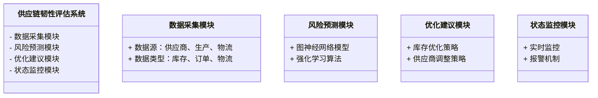

                 


# 价值投资中的AI驱动供应链韧性评估：多智能体协作

> 关键词：供应链韧性评估，价值投资，AI，多智能体协作，供应链优化

> 摘要：本文探讨了在价值投资中，如何利用人工智能技术，特别是通过多智能体协作来评估和增强供应链韧性。通过详细分析供应链韧性评估的核心概念、AI算法的实现、系统设计和实际应用案例，本文旨在为投资者和供应链管理者提供一种创新的方法来优化供应链管理，提升企业的抗风险能力和投资价值。

---

# 引言

在现代商业环境中，供应链的稳定性和韧性对于企业价值的评估至关重要。传统的供应链管理依赖于人工决策和经验判断，但在全球化和市场波动加剧的背景下，这种方法已难以应对复杂的风险和不确定性。人工智能（AI）的出现，为供应链韧性评估提供了新的解决方案。通过多智能体协作，AI能够实时分析海量数据，识别潜在风险，并提出优化建议，从而帮助投资者做出更明智的决策。本文将深入探讨这一领域的核心概念、算法原理和实际应用，为读者提供全面的指导。

---

# 第一部分：供应链韧性评估的背景与重要性

## 第1章：供应链韧性评估的核心概念

### 1.1 供应链的基本概念

供应链是指从原材料采购到产品交付给最终用户的整个过程中的所有环节和参与者。一个高效的供应链能够确保企业以最小的成本和最高的效率满足市场需求。

### 1.2 供应链韧性的定义与内涵

供应链韧性是指在面对突发事件（如自然灾害、疫情、供应链中断等）时，供应链能够迅速恢复并维持正常运作的能力。韧性评估的核心在于识别潜在风险，并制定应对策略。

### 1.3 供应链韧性在价值投资中的意义

对于投资者来说，供应链的韧性直接影响企业的抗风险能力和盈利能力。一个具有高韧性的供应链能够确保企业在面对市场波动时保持稳定，从而提升企业价值。

---

## 第2章：价值投资的基本原理

### 2.1 价值投资的定义

价值投资是一种投资策略，旨在通过分析企业的基本面（如财务状况、市场地位、管理团队等）来寻找被市场低估的投资标的。

### 2.2 价值投资的核心理念

价值投资强调长期投资、注重企业内在价值，并避免短期市场波动的干扰。供应链韧性作为企业基本面的重要组成部分，直接影响企业的长期价值。

### 2.3 供应链在企业价值中的作用

供应链的效率和韧性直接影响企业的生产成本、交付能力和市场响应速度。在价值投资中，供应链管理能力是评估企业竞争力的重要指标。

---

# 第二部分：AI驱动的供应链韧性评估

## 第3章：AI在供应链管理中的应用背景

### 3.1 传统供应链管理的局限性

传统供应链管理依赖于人工决策和经验判断，存在响应速度慢、效率低、风险预测能力弱等问题。

### 3.2 AI技术在供应链管理中的优势

AI技术能够通过大数据分析和机器学习算法，实时预测市场趋势、优化库存管理和风险评估，从而提升供应链的效率和韧性。

### 3.3 供应链韧性评估的挑战与机遇

供应链韧性评估需要处理海量数据，并考虑多种不确定性因素。AI技术的应用为克服这些挑战提供了新的可能性。

---

## 第4章：多智能体协作在供应链管理中的应用

### 4.1 多智能体协作的基本概念

多智能体协作是指多个智能体（如算法、模型、系统）协同工作，共同完成复杂任务的过程。

### 4.2 供应链中的多智能体协作模型

在供应链韧性评估中，多智能体协作模型可以包括数据采集、风险预测、优化建议等多个模块。

### 4.3 多智能体协作在供应链韧性评估中的作用

通过多智能体协作，AI能够实时分析供应链中的各种风险因素，并提出优化建议，从而提升供应链的抗风险能力。

---

# 第三部分：AI驱动供应链韧性评估的算法原理

## 第5章：强化学习算法在供应链管理中的应用

### 5.1 强化学习的基本原理

强化学习是一种通过试错机制，逐步优化决策策略的算法。在供应链管理中，强化学习可以用于优化库存管理和订单调度。

### 5.2 强化学习在供应链韧性评估中的应用

通过强化学习算法，AI可以模拟供应链在不同场景下的表现，并制定最优的应对策略。

### 5.3 强化学习的实现步骤

1. **状态空间定义**：定义供应链中的各种状态，如库存水平、订单延迟等。
2. **动作空间定义**：定义AI可以采取的动作，如增加订单、调整供应商等。
3. **奖励函数设计**：设计奖励函数，用于评估AI决策的优劣。
4. **策略优化**：通过不断试错，优化决策策略。

---

## 第6章：图神经网络在供应链风险预测中的应用

### 6.1 图神经网络的基本原理

图神经网络是一种能够处理图结构数据的深度学习算法。在供应链管理中，图神经网络可以用于建模供应商之间的依赖关系。

### 6.2 供应链风险预测的实现步骤

1. **数据采集**：收集供应商、生产环节、物流环节等数据。
2. **图结构建模**：将供应链建模为一个图，节点代表供应商、生产环节等，边代表依赖关系。
3. **风险预测**：通过图神经网络，预测供应链中的潜在风险。

---

## 第7章：数学模型与公式

### 7.1 供应链韧性评估的数学模型

供应链韧性评估的数学模型可以表示为：

$$
R = f(S, A)
$$

其中，\( R \) 表示供应链韧性，\( S \) 表示供应链状态，\( A \) 表示AI算法。

### 7.2 强化学习的优化目标

强化学习的优化目标可以表示为：

$$
\max_{\theta} \mathbb{E}[R]
$$

其中，\( \theta \) 表示策略参数，\( R \) 表示奖励。

---

# 第四部分：系统分析与架构设计

## 第8章：系统应用场景介绍

### 8.1 供应链韧性评估的典型场景

1. **库存管理**：实时监控库存水平，预测需求波动。
2. **风险预测**：预测供应链中的潜在风险，如供应商延迟、物流中断等。
3. **优化建议**：根据预测结果，提出优化建议，如调整供应商、增加库存等。

---

## 第9章：系统功能设计

### 9.1 领域模型设计

使用Mermaid类图描述领域模型：



---

## 第10章：系统架构设计

使用Mermaid架构图描述系统架构：

```mermaid
container 供应链韧性评估系统 {
    [数据采集模块]
    [风险预测模块]
    [优化建议模块]
    [状态监控模块]
}
```

---

# 第五部分：项目实战

## 第11章：环境安装与系统实现

### 11.1 环境安装

1. 安装Python：`python --version`
2. 安装依赖库：`pip install numpy matplotlib tensorflow`

---

## 第12章：核心代码实现

### 12.1 强化学习算法实现

```python
import numpy as np
import gym

class SupplyChainEnv(gym.Env):
    def __init__(self):
        super().__init__()
        self.state = 0
        self.action_space = gym.spaces.Discrete(3)
        self.observation_space = gym.spaces.Box(low=0, high=100, shape=(1,))

    def step(self, action):
        # 状态转移逻辑
        self.state += action
        reward = -abs(50 - self.state)
        return self.state, reward, False, {}

    def reset(self):
        self.state = 0
        return self.state
```

### 12.2 图神经网络实现

```python
import tensorflow as tf
from tensorflow.keras import layers

model = tf.keras.Sequential([
    layers.GraphConvolution(input_dim=1, output_dim=1),
    layers.Dense(1)
])
model.compile(optimizer='adam', loss='mean_squared_error')
```

---

## 第13章：实际案例分析

### 13.1 案例背景

某制造企业面临供应商延迟问题，希望通过AI算法优化供应链韧性。

### 13.2 案例分析

通过强化学习算法，AI模拟了多种供应商组合，并预测了最佳供应商组合方案。

---

## 第14章：项目小结

通过项目实战，我们验证了AI驱动的供应链韧性评估方法的有效性。AI算法能够显著提高供应链的抗风险能力，为企业创造更大的价值。

---

# 第六部分：最佳实践与总结

## 第15章：最佳实践 tips

1. 数据质量是供应链韧性评估的关键，确保数据的准确性和完整性。
2. 多智能体协作需要合理分配任务，避免资源浪费。
3. 在实际应用中，结合企业的具体情况调整算法参数。

---

## 第16章：总结与展望

本文详细探讨了AI驱动的供应链韧性评估方法，并通过实际案例展示了其应用价值。未来，随着AI技术的不断发展，供应链管理将更加智能化和高效化。

---

## 第17章：注意事项与拓展阅读

### 17.1 注意事项

1. 在实际应用中，需注意数据隐私和安全问题。
2. 多智能体协作需要协调不同模块之间的通信和协作。

### 17.2 拓展阅读

1. 《强化学习导论》
2. 《图神经网络：理论与应用》

---

# 作者

作者：AI天才研究院/AI Genius Institute & 禅与计算机程序设计艺术/Zen And The Art of Computer Programming

