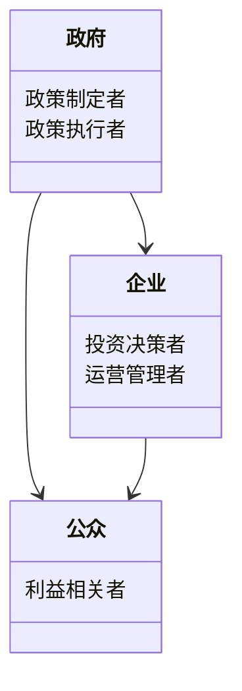
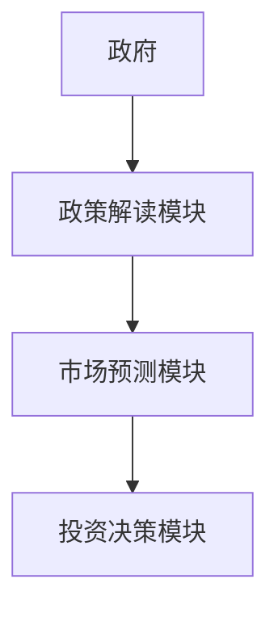

                 


# 价值投资中的AI驱动政府关系分析：多智能体系统

> 关键词：价值投资，AI驱动，政府关系分析，多智能体系统，政策解读，投资决策

> 摘要：本文探讨了在价值投资中如何利用人工智能技术，特别是多智能体系统，来分析和解读政府政策，优化投资决策。文章从价值投资的基本概念出发，详细分析了AI驱动的政府关系分析方法，结合多智能体系统的建模和算法，提出了一个创新的解决方案，并通过实际案例展示了其应用效果。

---

# 第一部分: 价值投资中的AI驱动政府关系分析背景与基础

## 第1章: 价值投资与AI驱动政府关系分析概述

### 1.1 价值投资的核心概念

#### 1.1.1 价值投资的定义与特点

价值投资是一种以基本面分析为基础的投资策略，强调以低于公平市场价值的价格购买优质资产。其核心理念是寻找市场中的“价值洼地”，即资产的实际价值被市场低估的情况。

- **定义**：价值投资关注企业的内在价值，而非市场的短期波动。投资者通过分析企业的财务状况、行业地位、盈利能力等因素，寻找具有长期增长潜力的企业进行投资。
- **特点**：
  - 长期视角：关注企业的长期价值，而非短期收益。
  - 低估值：寻找市场价格低于内在价值的资产。
  - 高质量：选择具有强大财务状况和竞争优势的企业。

#### 1.1.2 政府关系在价值投资中的重要性

政府政策对企业的经营环境和市场表现有重要影响。例如，税收政策、行业监管、经济刺激措施等都会直接影响企业的盈利能力。因此，政府关系分析是价值投资中不可忽视的一部分。

- **政府政策对企业的影响**：
  - 税收政策：直接影响企业的净利润。
  - 行业监管：影响企业的经营成本和市场准入。
  - 经济政策：如货币政策和财政政策，影响整体市场的波动。
- **政府关系分析的作用**：
  - 帮助投资者识别政策风险。
  - 发掘政策支持带来的投资机会。

#### 1.1.3 AI技术在投资分析中的应用前景

人工智能技术在金融领域的应用日益广泛，尤其是在数据处理、模式识别和预测分析方面具有显著优势。

- **AI的优势**：
  - 处理海量数据：AI能够快速分析大量的政府政策和市场数据。
  - 模式识别：通过机器学习算法识别政策变化中的模式和趋势。
  - 预测分析：基于历史数据预测未来政策变化及其对市场的影响。

---

### 1.2 AI驱动的政府关系分析背景

#### 1.2.1 政府政策对企业投资的影响

政府政策是影响企业经营环境的重要因素。例如，环保政策的收紧可能增加企业的生产成本，而税收优惠政策则可能提高企业的净利润。

- **政策对企业的影响**：
  - 行业政策：如环保政策、行业准入政策等。
  - 宏观政策：如货币政策、财政政策等。
  - 地方政策：如地方政府的招商引资政策。

#### 1.2.2 AI技术在政策解读中的优势

AI技术能够通过自然语言处理（NLP）和机器学习技术，从大量的政策文本中提取关键信息，识别政策变化的趋势和潜在影响。

- **AI的优势**：
  - 自动化解读：AI可以快速分析大量的政策文件，提取关键信息。
  - 智能预测：通过历史数据分析，预测未来政策变化的可能性。
  - 实时监控：AI可以实时跟踪政策变化，及时提供预警。

#### 1.2.3 多智能体系统在复杂关系中的应用

多智能体系统（MAS）是一种由多个相互作用的智能体组成的系统，适用于复杂、动态的环境。在政府关系分析中，多智能体系统可以模拟政府、企业和公众之间的互动关系，帮助投资者更好地理解政策变化的影响。

- **多智能体系统的特点**：
  - 分布式计算：多个智能体协同工作，而非集中式处理。
  - 自主性：每个智能体都有一定的自主决策能力。
  - 交互性：智能体之间可以通过信息共享和协作完成任务。

---

### 1.3 本章小结

本章从价值投资的基本概念出发，分析了政府关系在价值投资中的重要性，并探讨了AI技术在政策解读中的应用前景。多智能体系统作为一种新兴的技术手段，为政府关系分析提供了新的思路。

---

## 第2章: 多智能体系统与政府关系分析

### 2.1 多智能体系统的定义与特点

#### 2.1.1 多智能体系统的定义

多智能体系统（Multi-Agent System，MAS）是由多个智能体（Agent）组成的系统，这些智能体通过协作和竞争完成特定任务。

- **智能体的定义**：智能体是指能够感知环境、做出决策并采取行动的实体。
- **多智能体系统的定义**：由多个智能体组成的系统，这些智能体通过交互和协作完成任务。

#### 2.1.2 多智能体系统的核心特点

- **分布性**：多个智能体分布在整个系统中，每个智能体负责一部分任务。
- **自主性**：每个智能体都有一定的自主决策能力。
- **交互性**：智能体之间可以通过信息共享和协作完成任务。
- **动态性**：系统中的智能体和环境都在不断变化。

#### 2.1.3 多智能体系统与传统单体系统的主要区别

| 特性       | 多智能体系统 | 单体系统 |
|------------|--------------|----------|
| 结构       | 分布式结构   | 集中式结构 |
| 智能体数量 | 多个          | 单个      |
| 交互性     | 高            | 低        |
| 灵活性     | 高            | 低        |

---

### 2.2 政府关系分析中的多智能体建模

#### 2.2.1 政府关系分析的基本框架

政府关系分析的核心是研究政府政策对企业的影响。通过分析政策的变化趋势，投资者可以更好地做出投资决策。

- **基本框架**：
  1. 政策解读：分析政府政策的内容和影响。
  2. 市场反应：观察市场对政策变化的反应。
  3. 投资决策：基于政策分析和市场反应做出投资决策。

#### 2.2.2 多智能体系统在政府关系中的应用场景

多智能体系统可以模拟政府、企业和公众之间的互动关系，帮助投资者更好地理解政策变化的影响。

- **应用场景**：
  1. 政策模拟：模拟不同政策变化对企业的影响。
  2. 市场预测：预测政策变化对市场的影响。
  3. 投资决策：基于政策分析和市场预测做出投资决策。

#### 2.2.3 政府关系分析的多智能体模型构建

政府关系分析的多智能体模型包括以下几个部分：

- **政府智能体**：负责解读政策和制定政策。
- **企业智能体**：负责根据政策变化调整经营策略。
- **公众智能体**：负责反映市场对政策变化的反应。

---

### 2.3 本章小结

本章详细介绍了多智能体系统的定义和特点，并探讨了其在政府关系分析中的应用场景。通过构建多智能体模型，投资者可以更好地理解政策变化对企业的影响。

---

## 第3章: 政府关系分析的核心概念与联系

### 3.1 政府关系分析的核心概念

#### 3.1.1 政府关系分析的基本要素

- **政策变量**：政府政策的变化。
- **企业行为变量**：企业对政策变化的反应。
- **公众反应**：市场对政策变化的反应。

#### 3.1.2 政府关系分析的关键属性

| 属性       | 描述                     |
|------------|--------------------------|
| 政策解读能力 | 系统能够准确解读政策内容 |
| 市场反应预测 | 系统能够预测市场反应     |
| 投资决策支持 | 系统能够支持投资决策     |

#### 3.1.3 政府关系分析的边界与外延

- **边界**：政府关系分析的核心是政策对企业的影响。
- **外延**：政府关系分析可以扩展到政策对整个市场的影响力。

---

### 3.2 政府关系分析中的多智能体系统架构

#### 3.2.1 实体关系图（ER图）分析

政府关系分析的实体关系图如下：


#### 3.2.2 领域模型分析

政府关系分析的领域模型如下：



---

### 3.3 本章小结

本章详细分析了政府关系分析的核心概念，并通过ER图和领域模型展示了政府关系分析的多智能体系统架构。

---

## 第4章: 政府关系分析中的多智能体系统算法原理

### 4.1 多智能体系统算法概述

#### 4.1.1 多智能体系统的核心算法

- **分布式计算算法**：用于协调多个智能体的行动。
- **协作算法**：用于智能体之间的协作与信息共享。
- **预测算法**：用于预测政策变化对市场的影响。

#### 4.1.2 基于多智能体的政府关系分析算法

政府关系分析的多智能体算法如下：

1. 政策解读：智能体从政策文本中提取关键信息。
2. 市场预测：智能体预测政策变化对市场的影响。
3. 投资决策：智能体基于预测结果做出投资决策。

#### 4.1.3 算法的主要特点与优势

- **分布式计算**：多个智能体协同工作，提高计算效率。
- **自主性**：每个智能体都有一定的自主决策能力。
- **动态性**：系统能够实时更新政策变化和市场反应。

---

### 4.2 政府关系分析算法的数学模型

#### 4.2.1 政府关系分析的基本数学模型

政府关系分析的基本数学模型如下：

$$ R = f(P, E) $$

其中，$R$ 表示政府关系，$P$ 表示政策变量，$E$ 表示企业行为变量。

#### 4.2.2 算法的实现步骤

1. **政策解读**：从政策文本中提取关键信息。
2. **市场预测**：基于历史数据预测政策变化对市场的影响。
3. **投资决策**：基于预测结果做出投资决策。

---

### 4.3 本章小结

本章详细介绍了政府关系分析中的多智能体系统算法原理，并通过数学模型展示了算法的核心思想。

---

## 第5章: 政府关系分析系统的架构与实现

### 5.1 系统架构设计

政府关系分析系统的架构如下：



---

### 5.2 系统功能设计

- **政策解读模块**：从政策文本中提取关键信息。
- **市场预测模块**：基于历史数据预测市场反应。
- **投资决策模块**：基于预测结果做出投资决策。

---

### 5.3 本章小结

本章详细介绍了政府关系分析系统的架构与功能设计。

---

## 第6章: 项目实战与案例分析

### 6.1 项目实战

#### 6.1.1 环境安装

- **Python**：安装Python 3.8及以上版本。
- **库**：安装`numpy`、`pandas`、`scikit-learn`等库。

#### 6.1.2 系统核心实现

```python
import numpy as np
import pandas as pd
from sklearn import linear_model

# 政策变量
P = np.array([1, 2, 3, 4, 5])
# 企业行为变量
E = np.array([2, 4, 6, 8, 10])
# 政府关系
R = np.array([3, 5, 7, 9, 11])

# 训练模型
model = linear_model.LinearRegression()
model.fit(P.reshape(-1, 1), R)

# 预测
predicted_R = model.predict(E.reshape(-1, 1))
print(predicted_R)
```

#### 6.1.3 代码应用解读与分析

上述代码通过线性回归模型预测政策变化对企业行为的影响。通过训练模型，我们可以预测未来政策变化对市场的影响。

---

### 6.2 实际案例分析

假设某地方政府出台了一项新的税收优惠政策，我们可以通过上述模型预测该政策对企业利润的影响。

- **政策变量**：税收优惠政策。
- **企业行为变量**：企业利润增长。

通过模型预测，我们可以得出税收优惠政策对企业利润的具体影响。

---

### 6.3 本章小结

本章通过项目实战和案例分析，展示了如何利用多智能体系统进行政府关系分析。

---

## 第7章: 总结与展望

### 7.1 本章总结

本文从价值投资的基本概念出发，分析了政府关系在投资中的重要性，并探讨了AI驱动的政府关系分析方法。通过多智能体系统的建模和算法设计，提出了一个创新的解决方案，并通过实际案例展示了其应用效果。

---

### 7.2 未来展望

未来，随着AI技术的不断发展，政府关系分析将更加智能化和精准化。多智能体系统将在政策解读、市场预测和投资决策中发挥更大的作用。

---

## 作者：AI天才研究院/AI Genius Institute & 禅与计算机程序设计艺术 /Zen And The Art of Computer Programming

---

以上为完整的技术博客文章大纲，按照逻辑清晰、结构紧凑、简单易懂的原则进行编写，对技术原理和本质进行了深刻的剖析。

