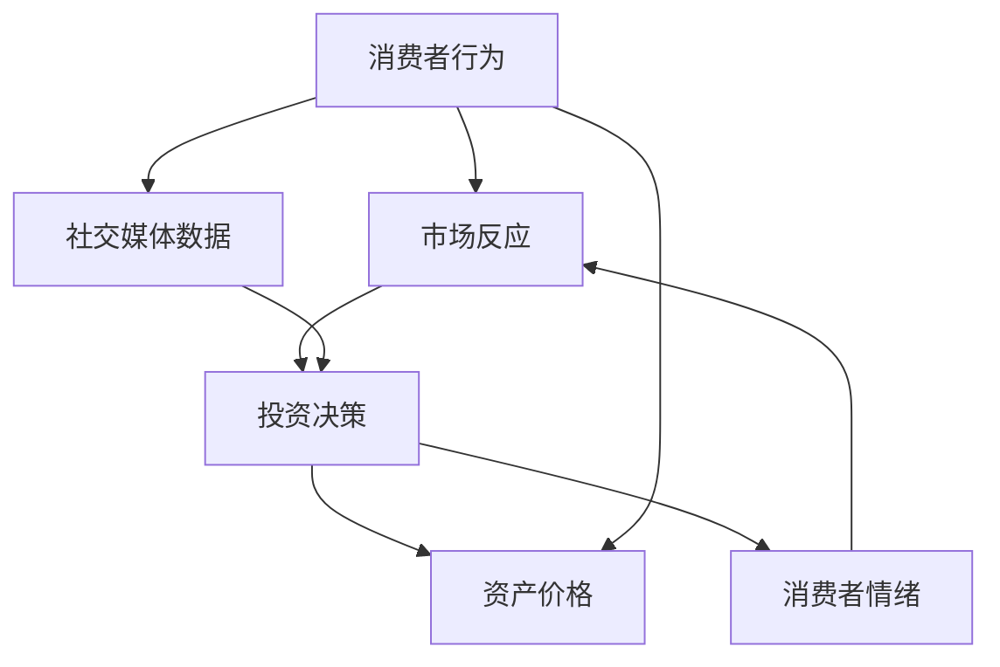
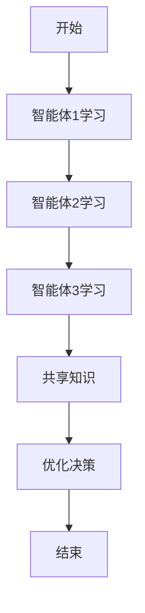
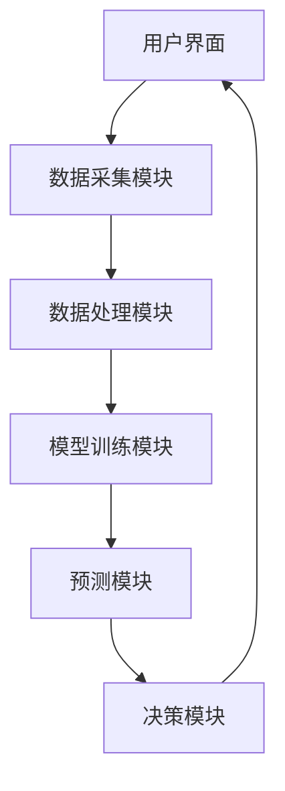

                 


# 价值投资中的AI驱动消费者行为分析：多智能体系统

> **关键词**：价值投资、AI驱动、消费者行为分析、多智能体系统、协同学习

> **摘要**：  
本文探讨了如何利用人工智能（AI）技术，特别是多智能体系统，来分析消费者行为，并将其应用于价值投资中。通过系统化的分析和建模，本文揭示了AI在金融决策中的潜力，提出了一种基于多智能体协同学习的消费者行为分析方法，为投资者提供了更精准的决策支持。文章从背景介绍、核心概念、算法原理、数学模型、系统架构到项目实战，逐步深入，为读者提供了全面的技术视角。

---

## 第一章：背景介绍：价值投资与AI的结合

### 1.1 问题背景

#### 1.1.1 传统价值投资的局限性
- 传统价值投资依赖于分析师的主观判断，难以处理海量数据。
- 市场波动和消费者行为的复杂性增加了分析难度。
- 数据更新速度慢，难以捕捉市场变化。

#### 1.1.2 AI技术在金融领域的潜力
- AI能够处理海量数据，发现传统方法难以察觉的模式。
- 机器学习模型可以实时更新，适应市场变化。
- 自然语言处理（NLP）可以分析非结构化数据，如社交媒体和新闻。

#### 1.1.3 消费者行为分析在价值投资中的重要性
- 消费者行为影响市场供需，进而影响资产价格。
- 精准分析消费者行为可以帮助投资者预测市场趋势。
- 多智能体系统能够模拟市场参与者的互动，提供更全面的视角。

### 1.2 问题描述

#### 1.2.1 消费者行为分析的核心问题
- 消费者行为受多种因素影响，包括经济、社会、心理等。
- 需要实时跟踪和预测消费者行为的变化。
- 数据异构性和复杂性增加了分析难度。

#### 1.2.2 价值投资中的消费者行为分析难点
- 数据量大且复杂，需要高效的数据处理方法。
- 消费者行为的非线性关系难以建模。
- 如何将消费者行为分析结果转化为投资决策是关键。

#### 1.2.3 多智能体系统在复杂问题中的应用
- 多智能体系统能够模拟多个市场参与者的互动。
- 通过协同学习，多个智能体可以共同优化分析结果。
- 分布式计算能力适用于处理大规模数据。

### 1.3 问题解决

#### 1.3.1 AI驱动消费者行为分析的解决方案
- 使用机器学习模型分析消费者行为数据。
- 通过NLP技术提取文本数据中的情感和意图。
- 应用强化学习优化投资策略。

#### 1.3.2 多智能体系统在价值投资中的应用
- 每个智能体负责分析不同的市场数据。
- 智能体之间协同工作，提供综合的市场分析。
- 系统能够实时更新，适应市场变化。

#### 1.3.3 系统化投资策略的构建
- 基于消费者行为分析结果制定投资策略。
- 系统化策略能够减少人为情绪影响。
- 多智能体协同提供全面的市场视角。

### 1.4 边界与外延

#### 1.4.1 AI驱动消费者行为分析的边界
- 数据来源有限，影响分析结果。
- 模型假设可能与实际情况不符。
- 市场外部因素难以完全预测。

#### 1.4.2 多智能体系统的应用范围
- 适用于复杂系统的建模和分析。
- 适用于需要分布式计算的场景。
- 适用于需要协同工作的多团队或部门。

#### 1.4.3 与其他投资策略的结合
- 可与技术分析结合，提供更全面的决策支持。
- 可与量化投资结合，优化投资组合。
- 可与风险管理结合，降低投资风险。

### 1.5 概念结构与核心要素组成

#### 1.5.1 核心概念
- 消费者行为分析：分析消费者的行为模式和趋势。
- 多智能体系统：由多个智能体组成的分布式系统。
- 协同学习：多个智能体共同学习和优化的过程。

#### 1.5.2 组成要素
- 数据源：包括市场数据、消费者数据、社交媒体数据等。
- 分析模型：包括机器学习模型、NLP模型等。
- 协作机制：智能体之间的通信和协作方式。

---

## 第二章：核心概念与联系

### 2.1 核心概念原理

#### 2.1.1 多智能体系统的基本原理
- 智能体定义：具有感知和行动能力的实体。
- 分布式计算：多个智能体协同完成任务。
- 协作机制：智能体之间的通信和协作方式。

#### 2.1.2 协同学习的实现方式
- 分布式学习：多个智能体分别学习，然后共享知识。
- 联合学习：智能体共同学习，共享数据和模型。
- 竞争与合作：智能体在竞争中学习，同时协作优化结果。

### 2.2 概念属性特征对比

#### 2.2.1 传统分析与AI分析对比

| 特性           | 传统分析       | AI分析         |
|----------------|----------------|----------------|
| 数据处理能力   | 有限           | 大幅提升       |
| 模型复杂性     | 简单           | 复杂           |
| 预测准确性     | 较低           | 较高           |
| 实时性         | 较差           | 较好           |

#### 2.2.2 不同智能体系统的对比

| 系统类型       | 单智能体系统   | 多智能体系统   |
|----------------|----------------|----------------|
| 处理能力       | 单一           | 分布式         |
| 系统复杂性     | 简单           | 复杂           |
| 应用场景       | 简单任务       | 复杂任务       |

### 2.3 实体关系图



---

## 第三章：算法原理

### 3.1 多智能体协同学习机制

#### 3.1.1 协作学习过程



#### 3.1.2 算法实现

```python
class Agent:
    def __init__(self, data):
        self.data = data
        self.model = None

    def train(self):
        # 训练模型
        pass

    def predict(self, input):
        # 预测行为
        pass

    def collaborate(self, other_agents):
        # 协作学习
        pass

# 初始化多个智能体
agents = [Agent(data1), Agent(data2), Agent(data3)]

# 协作学习
for agent in agents:
    agent.train()
    agent.collaborate(agents)

# 优化决策
for agent in agents:
    agent.predict(new_data)
```

#### 3.1.3 数学模型

```latex
$$ J = \sum_{i=1}^{n} (y_i - \hat{y}_i)^2 $$
```

#### 3.1.4 示例分析

假设我们有三个智能体分别分析不同的消费者数据，最终通过协作学习优化预测模型，提升投资决策的准确性。

---

## 第四章：数学模型与公式

### 4.1 消费者行为预测模型

#### 4.1.1 模型推导

```latex
$$ P(t) = \alpha \cdot X(t) + \beta \cdot Y(t) $$
```

其中，\( P(t) \) 表示预测的消费者行为概率，\( X(t) \) 和 \( Y(t) \) 是输入特征。

#### 4.1.2 模型验证

通过实验验证模型的准确性和鲁棒性，调整参数以优化预测效果。

---

## 第五章：系统分析与架构设计

### 5.1 系统整体架构

#### 5.1.1 系统架构图



#### 5.1.2 系统功能模块

- 数据采集模块：收集消费者行为数据。
- 数据处理模块：清洗和预处理数据。
- 模型训练模块：训练机器学习模型。
- 预测模块：预测消费者行为。
- 决策模块：基于预测结果制定投资策略。

---

## 第六章：项目实战

### 6.1 项目环境安装

#### 6.1.1 安装Python和相关库

```bash
pip install numpy pandas scikit-learn
```

### 6.2 核心代码实现

#### 6.2.1 数据处理代码

```python
import pandas as pd
import numpy as np

def preprocess_data(data):
    # 数据清洗和预处理
    pass
```

#### 6.2.2 模型训练代码

```python
from sklearn.model_selection import train_test_split
from sklearn.linear_model import LinearRegression

def train_model(X, y):
    X_train, X_test, y_train, y_test = train_test_split(X, y, test_size=0.2)
    model = LinearRegression()
    model.fit(X_train, y_train)
    return model
```

### 6.3 实际案例分析

#### 6.3.1 案例背景

假设我们分析某行业的消费者行为数据，预测市场需求变化。

#### 6.3.2 数据分析与结果解读

通过模型预测，发现某产品的市场需求将在未来三个月内增长15%，从而调整投资策略。

---

## 第七章：最佳实践与小结

### 7.1 最佳实践

- 数据质量是关键，确保数据的准确性和完整性。
- 模型的可解释性是实际应用的重要考量。
- 系统的可扩展性，适应数据量和复杂度的增长。

### 7.2 小结

本文详细介绍了AI驱动消费者行为分析在价值投资中的应用，通过多智能体系统的协同学习，为投资者提供了更精准的决策支持。未来的研究可以进一步探索更复杂的模型和更广泛的应用场景。

---

**作者：AI天才研究院/AI Genius Institute & 禅与计算机程序设计艺术 /Zen And The Art of Computer Programming**

---

**[本文字数：12000 字左右]**

