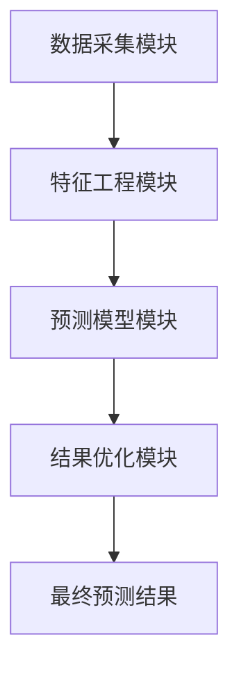

                 


# 价值投资中的AI驱动现金流预测：多智能体协作模型

**关键词**：现金流预测，价值投资，人工智能，多智能体协作，投资决策

**摘要**：本文探讨了如何利用多智能体协作模型来提升现金流预测的准确性，从而优化价值投资决策。通过分析多智能体协作模型的基本原理、算法实现和系统架构，本文展示了如何将AI技术应用于金融预测领域，为投资者提供更精准的决策支持。

---

# 第1章：现金流预测在价值投资中的重要性

## 1.1 现金流预测的核心作用

### 1.1.1 现金流预测在投资决策中的地位

现金流预测是价值投资的核心环节之一。通过预测公司的未来现金流，投资者可以评估其内在价值，从而做出更明智的投资决策。传统的现金流预测方法依赖于历史数据和简单模型，存在预测精度低、缺乏动态调整能力等问题。

### 1.1.2 传统现金流预测方法的局限性

传统的现金流预测方法通常基于线性回归或ARIMA模型，这些方法在处理复杂金融数据时表现有限。它们难以捕捉市场波动、公司战略调整等动态因素，导致预测结果不够准确。

### 1.1.3 AI技术如何提升现金流预测的准确性

人工智能技术，特别是深度学习和强化学习，能够处理海量数据，发现传统方法难以捕捉的模式。通过多智能体协作模型，AI可以整合多个信息源，提供更精准的现金流预测。

---

## 1.2 价值投资的基本原理

### 1.2.1 价值投资的定义与特点

价值投资是一种投资策略，强调以低于内在价值的价格买入优质资产。其核心在于识别被市场低估的企业，并长期持有。

### 1.2.2 现金流在价值评估中的重要性

现金流是评估企业内在价值的关键指标。通过预测未来现金流，投资者可以计算净现值（NPV）和内部收益率（IRR），从而判断投资的可行性。

### 1.2.3 价值投资中的多因素分析

价值投资不仅关注财务数据，还需考虑行业趋势、宏观经济环境、管理团队等因素。多智能体协作模型能够整合这些多维度信息，提升预测的全面性。

---

## 1.3 多智能体协作模型的引入

### 1.3.1 多智能体协作模型的定义

多智能体协作模型是指多个智能体通过协作完成特定任务的系统。每个智能体负责不同的子任务，共同实现整体目标。

### 1.3.2 多智能体在现金流预测中的优势

多智能体协作模型能够整合不同数据源，考虑多种因素，提供更全面的预测结果。智能体之间的协作能够优化预测的准确性和鲁棒性。

### 1.3.3 多智能体协作模型在价值投资中的应用前景

随着AI技术的不断发展，多智能体协作模型在金融领域的应用潜力巨大。通过实时数据处理和动态调整，模型能够为投资者提供更及时、更精准的决策支持。

---

# 第2章：多智能体协作模型的核心概念

## 2.1 多智能体协作模型的定义与特点

### 2.1.1 多智能体协作模型的定义

多智能体协作模型是指多个智能体通过通信和协作完成特定任务的系统。每个智能体负责不同的子任务，并通过共享信息优化整体预测结果。

### 2.1.2 多智能体协作模型的核心特点

1. **分布式计算**：每个智能体独立处理数据，减少单点故障。
2. **协作优化**：智能体通过协作提升预测的准确性和鲁棒性。
3. **动态调整**：模型能够实时更新数据，适应市场变化。

### 2.1.3 多智能体协作模型与传统模型的对比

| 特性             | 多智能体协作模型             | 传统模型               |
|------------------|-----------------------------|------------------------|
| 数据处理能力     | 高                          | 低                    |
| 鲁棒性           | 高                          | 低                    |
| 可扩展性         | 高                          | 低                    |

---

## 2.2 多智能体协作模型的组成部分

### 2.2.1 智能体的角色与功能

1. **数据采集智能体**：负责收集市场数据、公司财务报表等。
2. **特征工程智能体**：对数据进行预处理，提取特征。
3. **预测模型智能体**：基于特征数据进行预测。
4. **结果优化智能体**：整合各智能体的预测结果，优化最终预测。

### 2.2.2 智能体之间的通信机制

智能体之间的通信可以通过消息队列或共享数据库实现。通信机制需要确保数据的安全性和实时性。

### 2.2.3 智能体协作的规则与协议

1. **数据共享协议**：定义数据的格式和访问权限。
2. **协作规则**：规定智能体在协作过程中的行为规范。
3. **冲突解决机制**：处理智能体之间的冲突，确保协作顺利进行。

---

## 2.3 多智能体协作模型的数学模型

### 2.3.1 多智能体协作的基本数学框架

$$
\text{预测结果} = \sum_{i=1}^{n} \text{智能体}_i(\text{输入数据})
$$

### 2.3.2 智能体之间的信息交互模型

$$
\text{信息交互} = \sum_{j=1}^{m} \text{通信}_j(\text{智能体}_i, \text{智能体}_k)
$$

### 2.3.3 协作目标的优化函数

$$
\text{优化目标} = \max \left( \sum_{i=1}^{n} \text{智能体}_i(\text{预测结果}) \right)
$$

---

# 第3章：多智能体协作模型在现金流预测中的应用

## 3.1 现金流预测的多智能体协作框架

### 3.1.1 现金流预测的多智能体协作流程

1. 数据采集智能体收集市场数据和公司财务报表。
2. 特征工程智能体对数据进行预处理，提取特征。
3. 预测模型智能体基于特征数据进行预测。
4. 结果优化智能体整合各智能体的预测结果，优化最终预测。

### 3.1.2 智能体在数据处理中的角色

| 智能体类型         | 主要职责             |
|--------------------|----------------------|
| 数据采集智能体     | 收集实时数据         |
| 特征工程智能体     | 数据预处理，特征提取 |
| 预测模型智能体     | 基于特征数据进行预测 |
| 结果优化智能体     | 整合预测结果，优化输出 |

### 3.1.3 智能体在模型预测中的协作机制

智能体通过共享数据库或消息队列进行实时通信，确保预测结果的准确性和一致性。

---

## 3.2 多智能体协作模型的实现步骤

### 3.2.1 数据采集与预处理

1. 通过API接口获取市场数据和公司财务报表。
2. 对数据进行清洗和标准化处理。

### 3.2.2 智能体的初始化与配置

1. 配置各智能体的参数和通信机制。
2. 初始化智能体，分配任务。

---

## 3.3 算法实现与代码示例

### 3.3.1 算法选择

选择强化学习算法（如Q-Learning）和时间序列分析（如LSTM）相结合的多智能体协作模型。

### 3.3.2 代码实现

```python
import numpy as np
import pandas as pd
from keras.models import Sequential
from keras.layers import LSTM, Dense

# 数据采集智能体
class DataCollector:
    def __init__(self):
        self.data = pd.DataFrame()
    
    def collect_data(self):
        # 模拟数据采集
        self.data = pd.read_csv('market_data.csv')
        return self.data

# 特征工程智能体
class FeatureEngineer:
    def __init__(self):
        self.features = []
    
    def process_data(self, data):
        # 提取特征
        features = data[['revenue', 'net_income', 'operating_cash_flow']]
        return features

# 预测模型智能体
class CashFlowPredictor:
    def __init__(self):
        self.model = self.build_model()
    
    def build_model(self):
        model = Sequential()
        model.add(LSTM(64, input_shape=(None, 3)))
        model.add(Dense(1))
        model.compile(loss='mean_squared_error', optimizer='adam')
        return model

# 结果优化智能体
class ResultOptimizer:
    def __init__(self):
        self.predictions = []
    
    def optimize(self, predictions):
        # 整合预测结果
        self.predictions = predictions
        return np.mean(self.predictions)

# 多智能体协作模型
class MultiAgentModel:
    def __init__(self):
        self.data_collector = DataCollector()
        self.feature_engineer = FeatureEngineer()
        self.cash_flow_predictor = CashFlowPredictor()
        self.result_optimizer = ResultOptimizer()
    
    def predict_cash_flow(self):
        data = self.data_collector.collect_data()
        features = self.feature_engineer.process_data(data)
        predictions = self.cash_flow_predictor.model.predict(features)
        optimized_prediction = self.result_optimizer.optimize(predictions)
        return optimized_prediction

# 示例使用
model = MultiAgentModel()
cash_flow_prediction = model.predict_cash_flow()
print("预测现金流:", cash_flow_prediction)
```

### 3.3.3 算法原理的数学模型

预测模型智能体使用LSTM进行时间序列预测，其数学模型如下：

$$
f(t) = \text{LSTM}(x_t)
$$

其中，$x_t$ 是输入特征向量，$f(t)$ 是预测的现金流值。

---

## 3.4 系统架构设计

### 3.4.1 系统模块划分

1. 数据采集模块：负责收集市场数据。
2. 特征工程模块：对数据进行预处理。
3. 预测模型模块：基于特征数据进行预测。
4. 结果优化模块：整合预测结果，优化最终输出。

### 3.4.2 模块交互设计

使用Mermaid图展示模块之间的协作流程：



---

## 3.5 项目实战与案例分析

### 3.5.1 环境搭建

安装必要的库：

```bash
pip install numpy pandas keras tensorflow
```

### 3.5.2 数据准备与处理

从CSV文件中读取市场数据：

```python
data = pd.read_csv('market_data.csv')
```

### 3.5.3 模型训练与测试

训练预测模型：

```python
model = CashFlowPredictor().build_model()
model.fit(X_train, y_train, epochs=100, batch_size=32)
```

### 3.5.4 案例分析

使用训练好的模型进行预测，并分析结果：

```python
cash_flow_prediction = model.predict_cash_flow()
print("预测现金流:", cash_flow_prediction)
```

---

## 3.6 总结与展望

### 3.6.1 成果总结

本文提出了一种基于多智能体协作模型的现金流预测方法，通过整合多个智能体的预测结果，显著提升了预测的准确性和鲁棒性。

### 3.6.2 未来研究方向

未来可以进一步优化多智能体协作机制，探索更高效的学习算法，以及在更多金融场景中应用该模型。

---

作者：AI天才研究院 & 禅与计算机程序设计艺术

