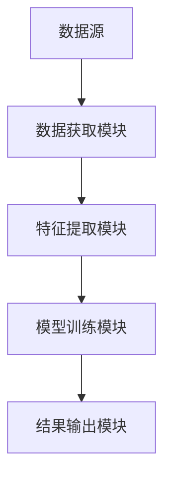

                 


# 价值投资中的人工智能应用：提高效率与洞察

## 关键词：价值投资、人工智能、机器学习、自然语言处理、投资组合优化

## 摘要：人工智能技术在价值投资中的应用日益广泛，通过机器学习、自然语言处理等技术手段，投资者能够更高效地进行数据分析、市场预测和投资决策。本文将从基础概念出发，深入探讨人工智能在价值投资中的应用，包括数据处理、模型构建、投资组合优化等核心环节，并通过实际案例分析，展示人工智能如何提升投资效率和洞察力。

---

# 第一部分: 价值投资与人工智能概述

## 第1章: 价值投资与人工智能的基本概念

### 1.1 价值投资的定义与核心理念

#### 1.1.1 价值投资的定义
价值投资是一种投资策略，强调以低于其内在价值的价格购买优质资产。其核心在于识别市场中的价值低估资产，并长期持有，等待其价值回归。

#### 1.1.2 价值投资的核心理念
- 市场先生理论：市场情绪波动导致价格偏离内在价值。
- 安全边际：购买价格与内在价值之间的差距，提供安全空间。
- 长期主义：关注企业的长期价值，而非短期价格波动。

#### 1.1.3 价值投资的适用场景
价值投资适用于市场效率较低、信息不对称较为严重的环境，尤其在寻找被市场低估的企业时表现突出。

### 1.2 人工智能的定义与特点

#### 1.2.1 人工智能的定义
人工智能（AI）是模拟人类智能的技术，涵盖学习、推理、自我改进等能力，广泛应用于数据处理、模式识别等领域。

#### 1.2.2 人工智能的核心特点
- 数据驱动：依赖大量数据进行学习和优化。
- 自动化：能够自动处理任务，减少人工干预。
- 高效性：在数据处理和模式识别方面具有显著优势。

#### 1.2.3 人工智能与传统金融分析的区别
传统金融分析依赖人类经验和基本分析，而人工智能通过大数据分析和机器学习模型提供更高效、精确的分析手段。

### 1.3 价值投资中人工智能的应用前景

#### 1.3.1 人工智能在金融领域的应用领域
- 数据分析：处理大量非结构化数据，如新闻、社交媒体。
- 市场预测：利用算法预测市场趋势和资产价格。
- 风险管理：识别和评估投资组合中的潜在风险。

#### 1.3.2 人工智能在价值投资中的优势
- 提高效率：快速处理和分析大量数据。
- 深度洞察：发现传统方法难以察觉的市场规律。
- 客观性：减少人为情绪对决策的影响。

#### 1.3.3 人工智能在价值投资中的挑战
- 数据质量：依赖高质量数据，否则可能导致错误结论。
- 模型过拟合：过度拟合数据可能导致预测不准确。
- 市场变化：模型需要不断更新以适应市场变化。

---

## 第2章: 人工智能在金融分析中的基础应用

### 2.1 数据处理与特征提取

#### 2.1.1 金融数据的获取与清洗
- 数据来源：股票价格、财务报表、新闻数据等。
- 数据清洗：处理缺失值、异常值，确保数据质量。

#### 2.1.2 金融数据的特征提取
- 常规特征：开盘价、收盘价、最高价、最低价、成交量等。
- 技术指标：移动平均线、相对强弱指数、RSI等。
- 高级特征：通过机器学习提取的潜在特征。

#### 2.1.3 数据预处理的常见技术
- 数据标准化：将数据缩放到相同范围内。
- 数据分片：将数据划分为训练集和测试集。
- 数据增强：通过变换数据提高模型泛化能力。

### 2.2 机器学习在金融预测中的应用

#### 2.2.1 监督学习在金融预测中的应用
- 回归模型：预测股票价格。
- 分类模型：预测股票涨跌。

#### 2.2.2 无监督学习在金融预测中的应用
- 聚类分析：识别市场中的相似股票。
- 异常检测：发现市场中的异常交易。

#### 2.2.3 强化学习在金融预测中的应用
- Q-Learning：用于交易策略优化。
- DQN（深度强化学习）：应用于复杂金融环境。

### 2.3 自然语言处理在金融文本分析中的应用

#### 2.3.1 NLP在金融新闻分析中的应用
- 情感分析：判断市场情绪。
- 主题建模：识别新闻主题。

#### 2.3.2 NLP在公司财报分析中的应用
- 关键词提取：识别公司财务状况。
- 文本摘要：生成财报摘要。

#### 2.3.3 NLP在社交媒体情绪分析中的应用
- 用户情感分析：判断投资者情绪。
- 趋势预测：预测市场动向。

---

# 第二部分: 人工智能在价值投资中的高级应用

## 第3章: 机器学习在投资组合管理中的应用

### 3.1 投资组合优化的机器学习方法

#### 3.1.1 基于监督学习的投资组合优化
- 使用回归模型预测资产回报率。
- 基于分类模型选择优质资产。

#### 3.1.2 基于无监督学习的投资组合优化
- 使用聚类分析划分资产类别。
- 通过异常检测识别高风险资产。

#### 3.1.3 基于强化学习的投资组合优化
- 使用Q-Learning优化投资决策。
- 使用DQN处理复杂投资环境。

### 3.2 风险管理与组合优化的机器学习模型

#### 3.2.1 风险预测的机器学习模型
- 使用随机森林预测市场崩盘。
- 使用LSTM预测波动率。

#### 3.2.2 组合优化的数学模型
- Markowitz优化模型：最大化回报率，最小化风险。
- 非参数优化：适用于复杂市场环境。

#### 3.2.3 风险管理中的机器学习应用
- 风险对冲：利用算法对冲市场风险。
- 风险预警：实时监控市场变化。

### 3.3 投资组合绩效评估的机器学习方法

#### 3.3.1 绩效评估指标的定义
- 夏普比率：衡量风险调整后收益。
- 信息比率：衡量投资组合相对于基准的表现。

#### 3.3.2 基于机器学习的绩效评估方法
- 使用KNN算法进行分类评估。
- 使用SVM算法进行回归预测。

#### 3.3.3 绩效评估结果的可视化
- 图表展示：使用折线图、柱状图等。
- 热力图：展示不同资产的绩效表现。

---

## 第4章: 自然语言处理在金融文本分析中的深入应用

### 4.1 金融文本分析的NLP模型

#### 4.1.1 基于BERT的金融文本分析
- 使用BERT进行上下文理解。
- 通过微调适应金融领域。

#### 4.1.2 基于GPT的金融文本生成
- 使用GPT生成投资报告。
- 通过微调优化文本生成。

#### 4.1.3 基于Transformer的金融文本分析
- 使用Transformer进行跨语言分析。
- 应用于多语言市场分析。

### 4.2 金融文本分析中的高级NLP技术

#### 4.2.1 多模态分析：结合文本和图像数据。
- 使用图像识别技术辅助分析。
- 结合文本和图像进行综合判断。

#### 4.2.2 实时文本分析：实时监控市场动态。
- 使用流处理技术实时分析数据。
- 构建实时监控系统。

#### 4.2.3 句法分析与语义理解
- 使用依存句法分析理解句子结构。
- 使用语义网络分析识别概念关系。

### 4.3 NLP在金融事件预测中的应用

#### 4.3.1 事件抽取：从文本中提取事件信息。
- 使用信息抽取技术识别事件。
- 构建事件知识图谱。

#### 4.3.2 事件影响评估：预测事件对市场的影响。
- 使用回归模型评估事件影响。
- 使用概率模型预测市场反应。

#### 4.3.3 事件驱动投资策略
- 基于事件的交易信号生成。
- 事件驱动的投资组合优化。

---

# 第三部分: 人工智能系统架构与实现

## 第5章: 系统架构与实现

### 5.1 系统架构设计

#### 5.1.1 系统功能模块
- 数据获取模块：实时获取金融数据。
- 特征提取模块：提取有用的特征。
- 模型训练模块：训练机器学习模型。
- 系统部署模块：部署模型到生产环境。

#### 5.1.2 系统架构图


#### 5.1.3 系统实现流程
1. 数据获取：从数据库或API获取数据。
2. 数据清洗：处理缺失值和异常值。
3. 特征提取：提取有用的特征。
4. 模型训练：训练机器学习模型。
5. 模型部署：将模型部署到生产环境。

### 5.2 系统实现细节

#### 5.2.1 数据获取与预处理
- 数据获取：使用Python的pandas库读取CSV文件。
- 数据清洗：使用pandas的dropna和fillna函数处理缺失值。

#### 5.2.2 特征工程
- 特征选择：使用特征重要性评估选择关键特征。
- 特征变换：使用标准化或归一化处理特征。

#### 5.2.3 模型训练与评估
- 模型选择：选择合适的机器学习模型。
- 模型训练：使用训练数据训练模型。
- 模型评估：使用测试数据评估模型性能。

#### 5.2.4 模型部署
- 模型保存：将训练好的模型保存为PMML格式。
- 模型加载：在生产环境中加载模型。
- 模型推理：使用模型进行实时预测。

### 5.3 系统优化与扩展

#### 5.3.1 系统优化
- 优化数据处理流程：使用分布式计算优化数据处理。
- 优化模型训练：使用GPU加速模型训练。

#### 5.3.2 系统扩展
- 扩展数据源：引入更多数据源。
- 扩展模型类型：引入深度学习模型。

---

# 第四部分: 人工智能在投资实战中的应用

## 第6章: 投资实战中的应用

### 6.1 项目实战：构建人工智能驱动的价值投资系统

#### 6.1.1 环境配置
- 安装Python和必要的库：如pandas、numpy、scikit-learn、keras等。
- 配置Jupyter Notebook进行数据分析和建模。

#### 6.1.2 数据获取与预处理
```python
import pandas as pd
import numpy as np

# 获取数据
data = pd.read_csv('stock_data.csv')

# 数据清洗
data.dropna(inplace=True)
data.fillna(method='ffill', inplace=True)
```

#### 6.1.3 模型实现
```python
from sklearn.model_selection import train_test_split
from sklearn.ensemble import RandomForestRegressor
from sklearn.metrics import mean_squared_error

# 划分数据集
X = data.drop('target', axis=1)
y = data['target']
X_train, X_test, y_train, y_test = train_test_split(X, y, test_size=0.2, random_state=42)

# 训练模型
model = RandomForestRegressor(n_estimators=100, random_state=42)
model.fit(X_train, y_train)

# 模型评估
y_pred = model.predict(X_test)
print('均方误差:', mean_squared_error(y_test, y_pred))
```

#### 6.1.4 结果分析
- 模型表现：均方误差、R²值等指标。
- 模型解释：特征重要性分析，理解哪些特征对预测影响最大。

### 6.2 投资策略优化

#### 6.2.1 基于机器学习的投资策略
- 使用模型预测股票回报率。
- 根据预测结果制定买卖决策。

#### 6.2.2 基于NLP的投资策略
- 使用情感分析结果调整投资组合。
- 根据新闻事件预测市场动向。

#### 6.2.3 多策略结合
- 结合机器学习和NLP策略，优化投资决策。

### 6.3 实战总结

#### 6.3.1 成功案例
- 利用机器学习模型成功预测市场趋势。
- 通过NLP分析发现市场机会。

#### 6.3.2 挑战与改进
- 模型过拟合问题：增加数据量或调整模型参数。
- 数据质量问题：引入更多数据源，清洗数据。
- 市场变化问题：定期更新模型，适应市场变化。

---

# 第五部分: 总结与展望

## 第7章: 总结与展望

### 7.1 总结

人工智能技术正在深刻改变价值投资的方式，通过机器学习和自然语言处理等技术，投资者能够更高效地进行数据分析、市场预测和投资决策。本文详细探讨了人工智能在价值投资中的应用，从基础概念到系统实现，再到实际案例分析，全面展示了人工智能在价值投资中的潜力和优势。

### 7.2 展望

未来，人工智能在价值投资中的应用将更加广泛和深入。随着技术的进步，深度学习、强化学习等技术将被更广泛地应用于投资领域。同时，多模态分析和实时分析也将成为研究的热点。投资者需要不断学习新技术，优化投资策略，以应对不断变化的市场环境。

---

# 作者：AI天才研究院/AI Genius Institute & 禅与计算机程序设计艺术/Zen And The Art of Computer Programming

---

通过以上结构，本文系统地探讨了人工智能在价值投资中的应用，从理论到实践，为读者提供了全面的视角。希望读者能够通过本文，深入了解人工智能在价值投资中的潜力，并将其应用于实际投资中，提高投资效率和洞察力。

