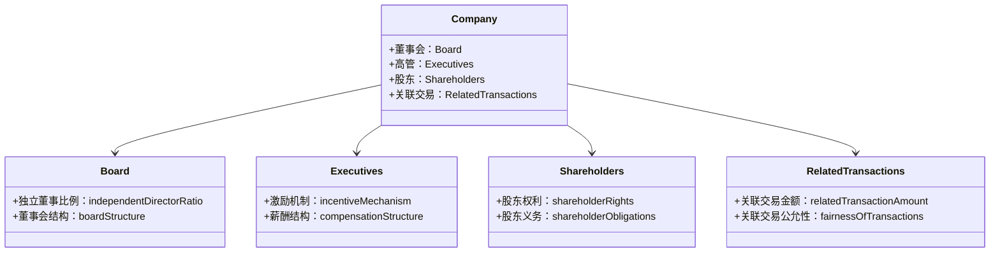
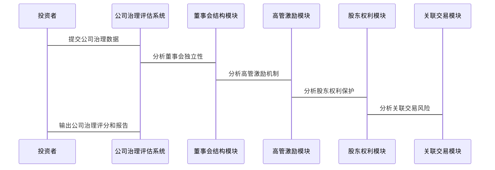

                 


# 价值投资中的公司治理考量

## 关键词：
价值投资、公司治理、董事会结构、高管激励、股东权利

## 摘要：
公司治理是价值投资中不可或缺的一环，它影响着企业的长期发展和股东的长期利益。本文将深入探讨公司治理的核心要素，分析其在价值投资中的重要性，并通过数学模型和实际案例，帮助投资者更好地评估和选择优秀的标的公司。

---

## 第一部分: 价值投资中的公司治理背景介绍

### 第1章: 公司治理在价值投资中的重要性

#### 1.1 公司治理的基本概念
##### 1.1.1 公司治理的定义与核心要素
公司治理是指通过一套制度和机制，确保公司内部各利益相关方（股东、董事会、管理层、员工等）之间的权利和责任得到合理分配和有效制衡。核心要素包括：
- **董事会结构**：董事会的组成、职责和决策机制。
- **高管激励机制**：高管的薪酬结构和激励方式。
- **股东权利**：股东的知情权、投票权和收益权。
- **关联交易**：公司与关联方之间的交易是否透明、公允。
- **内部控制**：公司内部的监督机制和风险管理。

##### 1.1.2 公司治理与企业价值的关系
良好的公司治理能够提高企业的运营效率、降低风险，从而提升企业价值。反之，治理不善可能导致企业决策失误、利益输送，进而损害股东利益。

##### 1.1.3 投资者视角下的公司治理
投资者在选择标的公司时，应重点关注公司的治理结构是否透明、高效，以及是否能保障股东的合法权益。

#### 1.2 价值投资与公司治理的结合
##### 1.2.1 价值投资的核心理念
价值投资强调以低于内在价值的价格买入优质公司，长期持有，获得超额收益。

##### 1.2.2 公司治理在价值投资中的地位
公司治理是判断公司是否“优质”的重要标准。优秀的公司治理能够确保管理层与股东利益一致，减少短期行为，专注于长期发展。

##### 1.2.3 优秀公司治理对企业长期价值的影响
- 提高管理层决策的透明度和合理性。
- 降低关联交易风险，避免利益输送。
- 增强投资者信心，提升公司市值。

### 第2章: 公司治理的核心要素与投资者关注点

#### 2.1 董事会结构与职责
##### 2.1.1 董事会的组成与分工
董事会应由独立董事和执行董事组成，独立董事占比应足够高，以确保决策的独立性和客观性。

##### 2.1.2 董事会的独立性与决策效率
独立董事会能够有效制衡管理层，避免权力滥用。同时，高效的董事会能够快速决策，抓住市场机会。

##### 2.1.3 董事会与管理层的职责边界
董事会负责制定公司战略和监督管理层，管理层负责执行董事会的决策。

#### 2.2 高管激励机制
##### 2.2.1 激励机制的类型与特点
常见的激励机制包括股票期权、限制性股票、绩效奖金等。

##### 2.2.2 激励机制与管理层行为的关系
有效的激励机制能够将管理层的个人利益与公司利益绑定，避免短期行为。

##### 2.2.3 激励机制对股东利益的保障
通过长期激励机制，确保管理层关注公司的长期发展，而非短期利益。

#### 2.3 股东权利与义务
##### 2.3.1 股东的基本权利
- 知情权：股东有权了解公司的财务状况和经营情况。
- 投票权：股东有权参与公司重大决策的投票。
- 收益权：股东有权获得公司分配的股息和剩余资产。

##### 2.3.2 股东的义务与责任
- 遵守公司章程和公司治理规则。
- 支持公司合法经营，不滥用股东权利。

##### 2.3.3 股东权利的实现途径
- 通过股东大会行使权利。
- 通过董事会和管理层间接影响公司决策。

#### 2.4 关联交易与利益输送
##### 2.4.1 关联交易的定义与常见形式
关联交易是指公司与关联方之间的交易，常见形式包括采购、销售、融资等。

##### 2.4.2 关联交易对股东利益的影响
- 正面影响：降低交易成本，提高效率。
- 负面影响：可能的利益输送，损害股东利益。

##### 2.4.3 如何识别和评估关联交易风险
- 关联交易的定价是否公允。
- 关联交易是否经过独立董事会和股东大会的批准。
- 关联交易是否充分披露。

### 第3章: 公司治理的国际实践与标准

#### 3.1 国际公司治理准则
##### 3.1.1 OECD公司治理原则
OECD提出的公司治理原则包括：
- 董事会的独立性和职责。
- 股东的权利和保护。
- 透明度和信息披露。

##### 3.1.2 美国、英国等主要国家的公司治理标准
- 美国：强调董事会独立性，推行双层董事会制度。
- 英国：强调董事会的集体责任和独立董事的作用。

##### 3.1.3 不同文化背景下的公司治理差异
文化差异会影响公司治理的具体实践。例如，东方国家可能更注重集体决策，而西方国家更注重个体决策。

#### 3.2 中国的公司治理现状与挑战
##### 3.2.1 中国公司治理的特点
- 股东结构以国有股和大股东为主。
- 独立董事比例较低。

##### 3.2.2 当前中国公司治理的主要问题
- 董事会独立性不足。
- 关联交易频繁，利益输送风险高。

##### 3.2.3 政府监管与市场机制在公司治理中的作用
- 政府监管：通过法律法规规范公司治理。
- 市场机制：通过市场力量推动公司治理改进。

---

## 第二部分: 公司治理的数学模型与分析

### 第4章: 公司治理评分模型

#### 4.1 模型概述
##### 4.1.1 模型的构建目的
通过量化公司治理的表现，帮助投资者快速评估公司的治理水平。

##### 4.1.2 模型的输入变量与输出结果
- 输入变量：董事会独立性、高管激励机制、股东权利保护、关联交易风险等。
- 输出结果：公司治理评分（0-100分），分数越高，治理水平越高。

#### 4.2 模型的具体实现
##### 4.2.1 公司治理评分公式
$$ \text{公司治理评分} = 0.3 \times \text{董事会独立性} + 0.3 \times \text{高管激励机制} + 0.2 \times \text{股东权利保护} + 0.2 \times \text{关联交易风险} $$

##### 4.2.2 各变量的计算方法
- **董事会独立性**：独立董事比例（%）。
- **高管激励机制**：激励机制的公允性和透明度（%）。
- **股东权利保护**：股东权利实现的保障程度（%）。
- **关联交易风险**：关联交易的公允性和透明度（%）。

#### 4.3 模型的应用
##### 4.3.1 案例分析
假设某公司董事会独立性得分为80，高管激励机制得分为70，股东权利保护得分为60，关联交易风险得分为50。则公司治理评分为：
$$ 0.3 \times 80 + 0.3 \times 70 + 0.2 \times 60 + 0.2 \times 50 = 24 + 21 + 12 + 10 = 67 $$

---

## 第三部分: 系统分析与架构设计方案

### 第5章: 公司治理评估系统

#### 5.1 问题场景介绍
投资者需要一个系统化的工具，快速评估目标公司的治理水平。

#### 5.2 系统功能设计
##### 5.2.1 领域模型（Mermaid 类图）


#### 5.3 系统架构设计（Mermaid 架构图）


#### 5.4 系统接口设计
- 输入接口：公司治理数据。
- 输出接口：公司治理评分和评估报告。

#### 5.5 系统交互（Mermaid 序列图）


---

## 第四部分: 项目实战

### 第6章: 公司治理评估案例分析

#### 6.1 环境安装
- 数据来源：公司公告、财务报表、媒体报道。
- 工具：Excel、Python（Pandas、Scikit-learn）。

#### 6.2 核心实现源代码
```python
def calculate_governance_score(board_independence, executive_incentives, shareholder_protection, related_transactions):
    return 0.3 * board_independence + 0.3 * executive_incentives + 0.2 * shareholder_protection + 0.2 * related_transactions

# 示例数据
board_independence = 80  # 独立董事比例
executive_incentives = 70  # 激励机制得分
shareholder_protection = 60  # 股东权利保护得分
related_transactions = 50  # 关联交易风险

# 计算治理评分
governance_score = calculate_governance_score(board_independence, executive_incentives, shareholder_protection, related_transactions)
print(f"公司治理评分为：{governance_score}")
```

#### 6.3 代码应用解读与分析
上述代码实现了公司治理评分的计算，输入各项指标的得分，输出最终的治理评分。投资者可以根据实际情况调整各项指标的权重。

#### 6.4 实际案例分析
以某公司为例，假设各项指标得分为：
- 董事会独立性：80
- 高管激励机制：70
- 股东权利保护：60
- 关联交易风险：50

则治理评分为：
$$ 0.3 \times 80 + 0.3 \times 70 + 0.2 \times 60 + 0.2 \times 50 = 67 $$

#### 6.5 项目小结
通过数学模型和实际案例分析，投资者可以更好地理解公司治理的重要性，并在实际投资中应用这些方法。

---

## 第五部分: 总结与展望

### 第7章: 总结与展望

#### 7.1 总结
公司治理是价值投资中不可忽视的重要因素。通过量化评估公司治理水平，投资者可以更好地识别优质标的，降低投资风险。

#### 7.2 展望
未来，随着人工智能和大数据技术的发展，公司治理评估将更加智能化和精准化。投资者可以利用更多工具和技术，进一步提升公司治理分析的效率和准确性。

---

## 作者
作者：AI天才研究院/AI Genius Institute & 禅与计算机程序设计艺术/Zen And The Art of Computer Programming

---

通过以上内容，投资者可以系统地了解公司治理在价值投资中的重要性，并掌握如何通过数学模型和实际案例分析来评估公司的治理水平。

