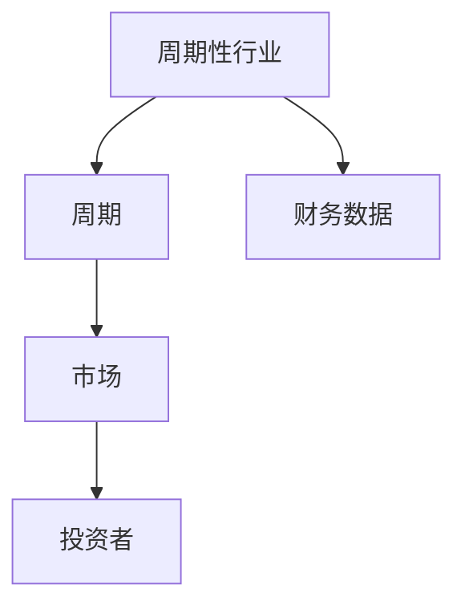
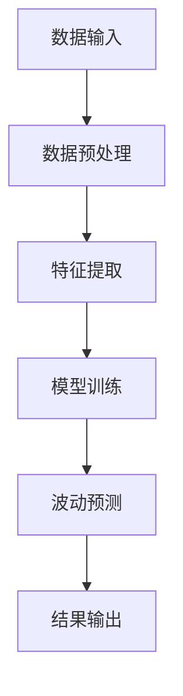
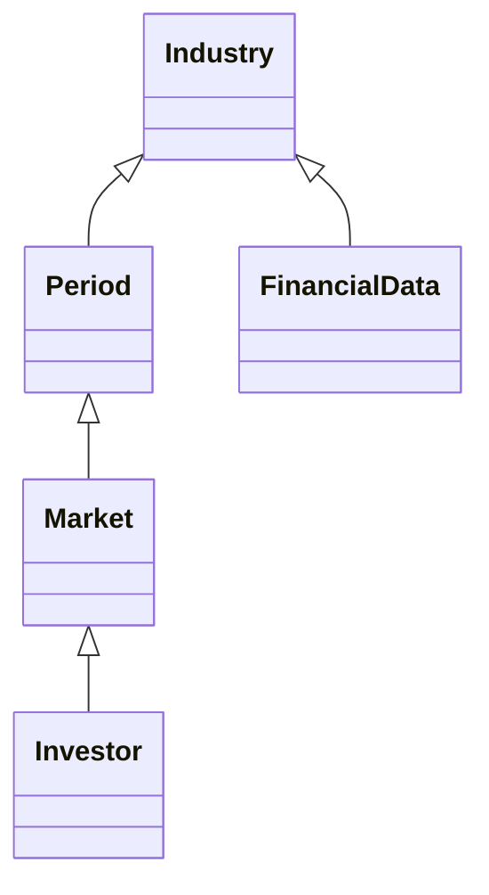
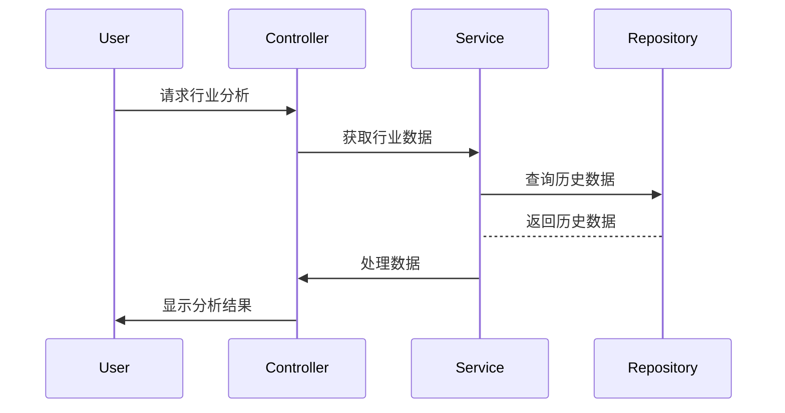

                 


# 周期性行业分析：价值投资中的制胜策略

---

## 关键词：  
- 价值投资  
- 周期性行业  
- 行业分析  
- 股票投资  
- 金融市场  

---

## 摘要：  
周期性行业在价值投资中具有重要的地位，其波动性为投资者提供了盈利机会，但也带来了挑战。本文从周期性行业的基本概念、核心要素、分析方法、系统架构到实际案例，全面解析如何在价值投资中把握行业起落。通过详细分析行业波动的原因、预测算法、数学模型和系统设计，本文为投资者提供了一套实用的周期性行业分析框架，帮助其在复杂市场中做出明智决策。

---

# 第1章: 周期性行业的基本概念  

## 1.1 周期性行业的定义与分类  
### 1.1.1 周期性行业的定义  
周期性行业是指其产品或服务的需求与经济周期密切相关的行业。这些行业在经济繁荣时表现良好，而在衰退时则可能面临需求下降、库存积压等问题。  

### 1.1.2 周期性行业的分类  
周期性行业可以分为以下几类：  
1. **强周期性行业**：如房地产、汽车制造、能源等行业，其需求与经济周期高度相关。  
2. **弱周期性行业**：如消费必需品、医疗保健等行业，需求受经济波动的影响较小。  

### 1.1.3 周期性行业的特点  
- **波动性**：周期性行业的业绩波动较大，通常与经济周期同步。  
- **周期性**：行业周期性波动可以通过历史数据分析预测。  
- **杠杆效应**：行业在繁荣期可能大幅扩张，而在衰退期可能面临去杠杆压力。  

## 1.2 周期性行业的波动原因  
### 1.2.1 宏观经济因素  
宏观经济指标如GDP增长率、利率水平、通货膨胀率等都会影响周期性行业的需求。  

### 1.2.2 行业供需关系  
行业内部的供需关系变化也是导致周期性波动的重要原因。例如，供过于求可能导致价格下跌，需求不足可能导致产能过剩。  

### 1.2.3 市场情绪与投资者行为  
投资者情绪的波动也会对周期性行业的股价产生影响。在市场乐观时，投资者可能过度投资，而在市场悲观时，可能抛售资产。  

## 1.3 价值投资与周期性行业的关系  
### 1.3.1 价值投资的核心理念  
价值投资强调以低于内在价值的价格买入优质资产，长期持有，获得超额收益。  

### 1.3.2 周期性行业在价值投资中的地位  
周期性行业由于其波动性，可能在市场低谷时被低估，为价值投资者提供了买入机会。  

### 1.3.3 把握行业起落的重要性  
投资者需要识别周期性行业的周期性波动，避免在高点买入，同时抓住低点的投资机会。  

## 1.4 本章小结  
本章介绍了周期性行业的基本概念、分类、特点及其与价值投资的关系，为后续分析奠定了基础。

---

# 第2章: 周期性行业的核心概念与联系  

## 2.1 周期性行业的核心要素  
### 2.1.1 行业生命周期  
行业生命周期包括初创期、成长期、成熟期和衰退期。周期性行业可能在成长期和成熟期表现较好，而在衰退期面临挑战。  

### 2.1.2 行业波动周期  
周期性行业的波动周期可以通过历史数据分析得出，包括上升周期和下降周期。  

### 2.1.3 行业关键指标  
关键指标包括收入增长率、利润率、库存周转率等，这些指标可以帮助投资者判断行业的周期性波动。  

## 2.2 周期性行业与其他行业的对比  
### 2.2.1 行业属性对比表  
以下是对周期性行业与其他行业的属性对比：  

| 行业类型 | 需求弹性 | 周期性 | 投资风险 | 利润波动 |  
|----------|----------|--------|----------|----------|  
| 强周期性行业 | 高      | 强     | 高       | 大       |  
| 弱周期性行业 | 中       | 弱     | 中       | 小       |  
| 非周期性行业 | 低      | 无     | 低       | 稳定     |  

### 2.2.2 行业波动幅度对比  
通过对比不同行业的波动幅度，投资者可以更好地理解周期性行业的特性。  

### 2.2.3 行业风险与收益对比  
周期性行业通常具有较高的收益潜力，但也伴随着较高的投资风险。  

## 2.3 周期性行业的ER实体关系图  
以下是一个简单的ER图，展示了周期性行业与其他相关实体的关系：  



## 2.4 本章小结  
本章通过对比分析和实体关系图，深入探讨了周期性行业的核心概念及其与其他行业的联系。

---

# 第3章: 周期性行业分析的算法原理  

## 3.1 数据收集与预处理  
### 3.1.1 数据来源  
数据来源包括历史股价、财务报表、宏观经济指标等。  

### 3.1.2 数据清洗  
数据清洗包括去除缺失值、处理异常值等。  

### 3.1.3 数据标准化  
数据标准化可以采用归一化或标准化方法，以便后续分析。  

## 3.2 周期性行业波动预测算法  
### 3.2.1 算法流程  
以下是一个简单的波动预测算法流程图：  



### 3.2.2 算法实现代码  
以下是一个简单的Python代码示例，用于预测行业波动：  

```python
import pandas as pd
import numpy as np
from sklearn.linear_model import LinearRegression
from sklearn.metrics import mean_squared_error

# 数据加载
data = pd.read_csv('industry_data.csv')

# 特征提取
features = data[['GDP增长率', '利率', '通货膨胀率']]
target = data['行业波动']

# 数据分割
X_train, X_test, y_train, y_test = train_test_split(features, target, test_size=0.2, random_state=42)

# 模型训练
model = LinearRegression()
model.fit(X_train, y_train)

# 预测与评估
y_pred = model.predict(X_test)
mse = mean_squared_error(y_test, y_pred)
print(f"均方误差: {mse}")
```

## 3.3 算法的数学模型与公式  
### 3.3.1 线性回归模型  
线性回归模型可以表示为：  
$$ y = \beta_0 + \beta_1x_1 + \beta_2x_2 + \dots + \beta_nx_n + \epsilon $$  
其中，$y$ 是目标变量，$x_i$ 是特征变量，$\beta_i$ 是系数，$\epsilon$ 是误差项。  

### 3.3.2 时间序列分析  
时间序列分析可以使用ARIMA模型，其一般形式为：  
$$ ARIMA(p, d, q) $$  
其中，$p$ 是自回归阶数，$d$ 是差分阶数，$q$ 是移动平均阶数。  

## 3.4 本章小结  
本章详细介绍了周期性行业分析的算法原理，包括数据处理、特征提取和模型训练等步骤，并通过代码示例和数学公式进行了详细讲解。

---

# 第4章: 周期性行业的系统分析与架构设计  

## 4.1 系统功能设计  
### 4.1.1 领域模型设计  
以下是一个领域模型的类图：  



### 4.1.2 系统架构设计  
系统架构采用分层架构，包括数据层、业务逻辑层和用户界面层。  

## 4.2 系统架构设计  
### 4.2.1 架构图  
以下是一个系统的架构图：  


### 4.2.2 接口设计  
系统接口包括数据接口、用户接口和API接口。  

### 4.2.3 交互设计  
以下是一个用户与系统交互的序列图：  



## 4.3 本章小结  
本章从系统设计的角度，详细探讨了周期性行业分析的架构与交互设计。

---

# 第5章: 项目实战与案例分析  

## 5.1 项目背景与目标  
本项目旨在通过分析某周期性行业的历史数据，预测其未来的波动趋势。  

## 5.2 项目环境安装  
需要安装Python、Pandas、NumPy、Scikit-learn等工具。  

## 5.3 核心代码实现  
以下是一个完整的Python代码实现：  

```python
import pandas as pd
import numpy as np
from sklearn.linear_model import LinearRegression
from sklearn.metrics import mean_squared_error
from sklearn.model_selection import train_test_split

# 数据加载
data = pd.read_csv('industry_data.csv')

# 特征提取
features = data[['GDP增长率', '利率', '通货膨胀率']]
target = data['行业波动']

# 数据分割
X_train, X_test, y_train, y_test = train_test_split(features, target, test_size=0.2, random_state=42)

# 模型训练
model = LinearRegression()
model.fit(X_train, y_train)

# 预测与评估
y_pred = model.predict(X_test)
mse = mean_squared_error(y_test, y_pred)
print(f"均方误差: {mse}")

# 可视化结果
import matplotlib.pyplot as plt
plt.scatter(y_test, y_pred)
plt.xlabel('真实值')
plt.ylabel('预测值')
plt.title('行业波动预测')
plt.show()
```

## 5.4 案例分析  
以某周期性行业为例，分析其历史数据，预测未来波动趋势，并制定投资策略。  

## 5.5 本章小结  
本章通过具体案例，展示了如何将理论应用于实践，帮助投资者做出明智决策。

---

# 第6章: 最佳实践与小结  

## 6.1 投资策略建议  
- **低点买入，高点卖出**：抓住行业低谷期的投资机会。  
- **分散投资**：避免过度集中于单一行业，降低风险。  
- **长期持有**：周期性行业的波动性较大，但长期来看可能有较好的收益。  

## 6.2 投资注意事项  
- **关注宏观经济指标**：如GDP增长率、利率、通货膨胀率等。  
- **行业供需关系**：分析行业供需变化，判断周期性波动。  
- **市场情绪**：避免被市场情绪左右，坚持价值投资理念。  

## 6.3 未来趋势  
随着技术进步和经济全球化，周期性行业的波动可能会更加复杂，投资者需要更加灵活应对。  

## 6.4 本章小结  
本章总结了全书的核心内容，并提出了投资建议和注意事项。

---

# 附录: 资料与工具  

## 1. 数据来源  
- 公司财务报表  
- 宏观经济数据  
- 行业研究报告  

## 2. 工具安装  
- Python  
- Pandas  
- NumPy  
- Scikit-learn  

## 3. 术语表  
- 周期性行业：需求与经济周期密切相关的行业。  
- 波动预测：通过算法预测行业的波动趋势。  

---

# 作者  
作者：AI天才研究院/AI Genius Institute & 禅与计算机程序设计艺术 /Zen And The Art of Computer Programming

