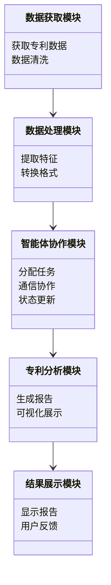
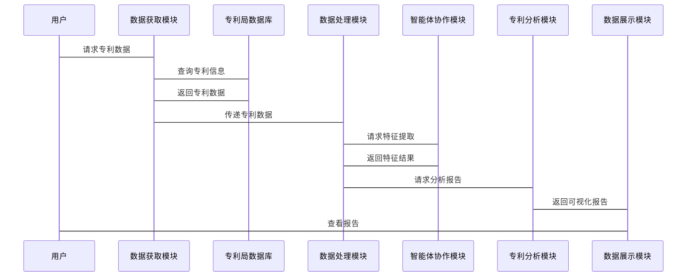

                 


```markdown
# 价值投资中的多智能体AI专利分析系统

> 关键词：价值投资, 多智能体AI, 专利分析, 投资决策, 人工智能

> 摘要：本文系统性地探讨了多智能体AI技术在价值投资中的应用，特别是如何利用多智能体AI进行专利分析，从而辅助投资决策。文章从多智能体AI的基本概念出发，详细分析了其与价值投资的结合方式，重点阐述了多智能体AI专利分析系统的算法原理和系统架构设计，并通过实际案例展示了系统的实现过程和应用效果。本文还讨论了系统优化与扩展策略，为读者提供了一套完整的多智能体AI专利分析解决方案。

---

## 第一部分: 背景介绍

### 第1章: 多智能体AI与价值投资的结合

#### 1.1 多智能体AI的基本概念
- 1.1.1 多智能体AI的定义
- 1.1.2 多智能体AI的核心特点
- 1.1.3 多智能体AI与传统AI的区别

#### 1.2 价值投资的基本原理
- 1.2.1 价值投资的定义
- 1.2.2 价值投资的核心策略
- 1.2.3 价值投资与技术分析的区别

#### 1.3 多智能体AI在价值投资中的应用前景
- 1.3.1 多智能体AI在金融领域的潜力
- 1.3.2 专利分析在价值投资中的重要性
- 1.3.3 多智能体AI与专利分析的结合

---

## 第二部分: 多智能体AI专利分析系统的核心概念与联系

### 第2章: 多智能体AI与专利分析的系统性分析

#### 2.1 多智能体AI的系统架构
- 2.1.1 多智能体AI的组成要素
- 2.1.2 多智能体AI的协作机制
- 2.1.3 多智能体AI的通信协议

#### 2.2 专利分析的核心要素
- 2.2.1 专利数据的获取与处理
- 2.2.2 专利分析的关键指标
- 2.2.3 专利分析的可视化方法

#### 2.3 多智能体AI与专利分析的关联性
- 2.3.1 多智能体AI如何辅助专利分析
- 2.3.2 专利分析如何支持多智能体AI的决策
- 2.3.3 多智能体AI与专利分析的协同优化

---

## 第三部分: 多智能体AI专利分析系统的算法原理

### 第3章: 多智能体AI的协作算法

#### 3.1 多智能体协作的基本原理
- 3.1.1 多智能体协作的定义
- 3.1.2 多智能体协作的核心算法
- 3.1.3 多智能体协作的实现步骤

#### 3.2 专利分析的特征提取算法
- 3.2.1 专利数据的特征提取方法
- 3.2.2 专利分析的特征选择策略
- 3.2.3 专利分析的特征权重计算

#### 3.3 多智能体协作与专利分析的结合算法
- 3.3.1 多智能体协作的专利分析流程
- 3.3.2 多智能体协作的专利分析模型
- 3.3.3 多智能体协作的专利分析优化

---

## 第四部分: 多智能体AI专利分析系统的系统分析与架构设计

### 第4章: 系统功能设计

#### 4.1 系统功能模块划分
- 4.1.1 数据获取模块
- 4.1.2 数据处理模块
- 4.1.3 智能体协作模块
- 4.1.4 专利分析模块
- 4.1.5 结果展示模块

#### 4.2 系统功能流程设计
- 4.2.1 数据获取与预处理流程
- 4.2.2 智能体协作与分析流程
- 4.2.3 结果展示与反馈流程

#### 4.3 系统功能设计的mermaid类图


### 第5章: 系统架构设计

#### 5.1 系统架构设计概述
- 5.1.1 系统架构的目标
- 5.1.2 系统架构的核心组件
- 5.1.3 系统架构的分层设计

#### 5.2 系统架构的mermaid架构图


#### 5.3 系统接口设计
- 5.3.1 数据获取模块接口
- 5.3.2 数据处理模块接口
- 5.3.3 智能体协作模块接口
- 5.3.4 专利分析模块接口
- 5.3.5 结果展示模块接口

#### 5.4 系统交互的mermaid序列图


---

## 第五部分: 多智能体AI专利分析系统的实现与应用

### 第6章: 项目实战

#### 6.1 环境安装与配置
- 6.1.1 安装Python
- 6.1.2 安装依赖库（如numpy, pandas, scikit-learn）
- 6.1.3 安装可视化工具（如Matplotlib, Seaborn）
- 6.1.4 安装多智能体协作框架（如Ray, Airflow）

#### 6.2 系统核心实现
- 6.2.1 数据获取模块的实现
- 6.2.2 数据处理模块的实现
- 6.2.3 智能体协作模块的实现
- 6.2.4 专利分析模块的实现
- 6.2.5 结果展示模块的实现

#### 6.3 代码实现与解读
- 数据获取模块：
```python
import requests

def fetch_patent_data(api_key):
    # 使用API获取专利数据
    url = f"https://api.patents.com/patents?api_key={api_key}"
    response = requests.get(url)
    return response.json()
```

- 数据处理模块：
```python
import pandas as pd

def preprocess_data(data):
    df = pd.DataFrame(data)
    df['date'] = pd.to_datetime(df['date'])
    return df
```

- 智能体协作模块：
```python
from ray import RemoteFunction

def collaborate_agents(data):
    @RemoteFunction
    def process_data(data):
        # 处理数据并返回结果
        return data * 2
    return process_data.remote(data)
```

- 专利分析模块：
```python
from sklearn.metrics import accuracy_score

def analyze_patents(data):
    # 假设data为训练好的模型
    y_pred = data.predict(X_test)
    return accuracy_score(y_true, y_pred)
```

#### 6.4 实际案例分析
- 6.4.1 案例背景介绍
- 6.4.2 数据收集与处理
- 6.4.3 智能体协作与分析
- 6.4.4 结果展示与解读

#### 6.5 系统优化与扩展
- 6.5.1 数据处理效率优化
- 6.5.2 智能体协作性能优化
- 6.5.3 专利分析模型优化
- 6.5.4 系统可扩展性设计

---

## 第六部分: 总结与展望

### 第7章: 总结与展望

#### 7.1 系统总结
- 7.1.1 系统实现成果
- 7.1.2 系统应用效果
- 7.1.3 系统优缺点分析

#### 7.2 未来展望
- 7.2.1 系统优化方向
- 7.2.2 新功能开发计划
- 7.2.3 多智能体AI在价值投资中的未来应用

#### 7.3 最佳实践与注意事项
- 7.3.1 数据源选择建议
- 7.3.2 系统部署注意事项
- 7.3.3 用户使用建议

---

## 附录

### 附录A: 数据集说明
- 数据来源
- 数据格式
- 数据预处理步骤

### 附录B: 工具安装指南
- Python安装
- 依赖库安装
- 开发环境配置

### 附录C: 参考文献
- 相关书籍
- 相关论文
- 相关技术文档

---

## 作者：AI天才研究院/AI Genius Institute & 禅与计算机程序设计艺术 /Zen And The Art of Computer Programming
```

