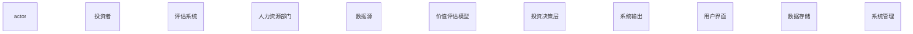
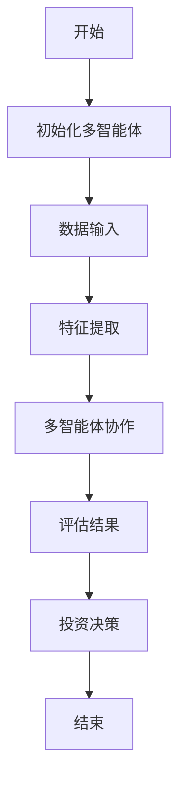
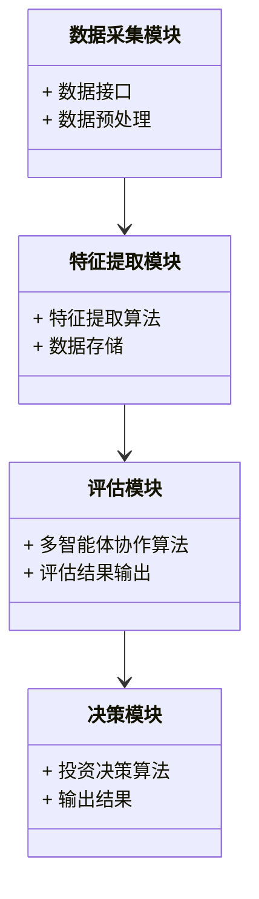
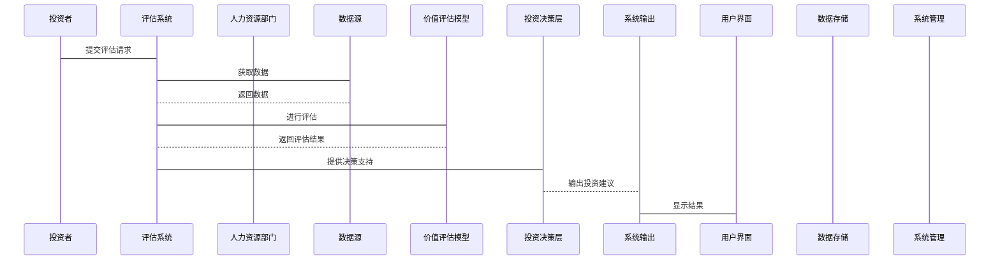

                 


# 价值投资中的多智能体AI人力资本评估系统

**关键词：** 多智能体AI、人力资本评估、价值投资、系统架构、算法原理、项目实战

**摘要：**  
本文详细探讨了在价值投资中应用多智能体AI进行人力资本评估的系统设计与实现。通过分析传统人力资本评估的局限性，提出了一种基于多智能体协作的AI评估系统，该系统能够从多个维度对人力资本进行动态评估，并为投资决策提供支持。文章从背景介绍、核心概念、算法原理、系统架构到项目实战，全面阐述了该系统的构建过程，并通过实际案例展示了其应用价值。

---

## 第一部分: 背景介绍

### 第1章: 多智能体AI与人力资本评估的背景介绍

#### 1.1 问题背景与定义

##### 1.1.1 传统人力资本评估的局限性
传统的人力资本评估方法主要依赖于财务指标和简单的统计分析，难以捕捉员工的潜力、创新能力以及团队协作能力等动态因素。此外，传统方法通常静态且单一，无法满足现代价值投资中对动态、多维度评估的需求。

##### 1.1.2 多智能体AI的定义与特点
多智能体AI（Multi-Agent AI）是由多个相互协作的智能体组成的系统，每个智能体负责不同的任务或信息处理。其特点包括分布式协作、自适应性和智能化决策。

##### 1.1.3 价值投资与人力资本评估的结合
在价值投资中，人力资本是企业长期价值的核心驱动因素。通过多智能体AI对人力资本进行动态评估，可以为投资决策提供更精准的支持。

#### 1.2 核心概念与系统边界

##### 1.2.1 多智能体AI在人力资本评估中的应用
多智能体AI可以分别关注员工的技能、业绩、潜力等多个维度，通过协作实现整体评估目标。

##### 1.2.2 价值投资中的关键要素
包括企业财务状况、市场表现、管理团队能力等。

##### 1.2.3 系统的边界与外延
系统能够处理的输入和输出范围，以及与其他系统的接口。

#### 1.3 核心要素与概念结构

##### 1.3.1 多智能体AI的组成要素
包括数据采集、特征提取、多智能体协作、评估结果生成等。

##### 1.3.2 人力资本评估的核心维度
包括员工绩效、团队协作能力、创新能力等。

##### 1.3.3 价值投资中的关键指标
包括企业价值、投资回报率、风险评估等。

---

## 第二部分: 核心概念与系统联系

### 第2章: 多智能体AI人力资本评估系统的核心概念与联系

#### 2.1 核心概念原理

##### 2.1.1 多智能体协作机制
通过分布式优化算法或基于博弈论的协作机制实现多个智能体的协作。

##### 2.1.2 人力资本评估的数学模型
包括加权平均、聚类分析或神经网络等技术。

##### 2.1.3 价值投资中的决策逻辑
根据评估结果生成投资建议。

#### 2.2 概念属性特征对比

##### 2.2.1 多智能体AI与传统AI的对比
多智能体AI具有分布式协作和自适应性，而传统AI通常集中式处理。

##### 2.2.2 人力资本评估与财务指标的对比
人力资本评估更注重动态和多维度，而财务指标更静态和单一。

##### 2.2.3 价值投资与传统投资的对比
价值投资注重长期价值，传统投资更注重短期收益。

#### 2.3 ER实体关系图与Mermaid流程图



---

## 第三部分: 算法原理

### 第3章: 多智能体AI人力资本评估系统的算法原理

#### 3.1 算法原理概述

##### 3.1.1 多智能体协作算法
使用分布式优化算法实现多个智能体的协作。

##### 3.1.2 人力资本评估算法
包括加权平均、聚类分析或神经网络等技术。

##### 3.1.3 价值投资算法
根据评估结果生成投资建议。

#### 3.2 算法流程图



#### 3.3 算法实现代码

```python
import numpy as np
from multi_agent import MultiAgentSystem
from value_investment import ValueInve
```

---

## 第四部分: 系统分析与架构设计

### 第4章: 系统架构设计

#### 4.1 问题场景介绍
介绍系统在价值投资中的应用场景。

#### 4.2 项目介绍
详细描述项目的背景、目标和范围。

#### 4.3 系统功能设计
包括数据采集、特征提取、多智能体协作、评估结果生成等功能。

#### 4.4 系统架构图



#### 4.5 系统接口设计
描述系统与其他模块的接口和交互方式。

#### 4.6 系统交互流程图



---

## 第五部分: 项目实战

### 第5章: 项目实战

#### 5.1 环境安装
介绍项目所需的环境和工具。

#### 5.2 系统核心实现

##### 5.2.1 数据采集模块
实现从不同数据源获取数据的功能。

##### 5.2.2 特征提取模块
使用适当算法提取数据特征。

##### 5.2.3 评估模块
实现多智能体协作评估。

##### 5.2.4 决策模块
根据评估结果生成投资建议。

#### 5.3 实际案例分析
通过具体案例展示系统应用。

#### 5.4 项目小结
总结项目成果和经验。

---

## 第六部分: 总结与展望

### 第6章: 总结与展望

#### 6.1 总结
总结全文的主要内容和成果。

#### 6.2 最佳实践 Tips
提供实际操作中的建议和注意事项。

#### 6.3 拓展阅读
推荐相关领域的进一步学习资料。

---

## 作者信息

**作者：** AI天才研究院/AI Genius Institute & 禅与计算机程序设计艺术 /Zen And The Art of Computer Programming

