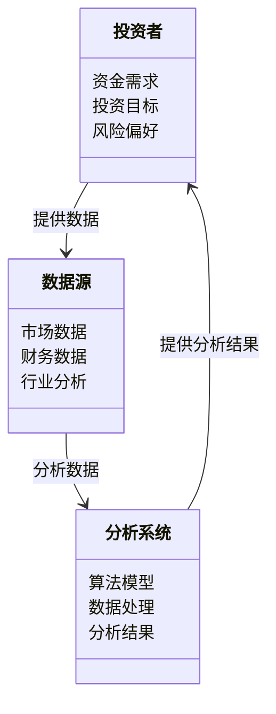

                 


# 价值投资中的多智能体AI工作资本分析系统

> 关键词：价值投资、多智能体AI、资本分析、系统架构、算法原理、项目实战

> 摘要：本文探讨了在价值投资中运用多智能体人工智能技术进行工作资本分析的系统设计与实现。通过详细分析多智能体系统的原理、算法实现、系统架构以及实际案例，展示了如何利用先进的AI技术提升资本分析的效率与准确性，帮助投资者做出更明智的决策。

---

## 第一部分: 多智能体AI工作资本分析系统的背景与核心概念

### 第1章: 价值投资与多智能体AI的结合

#### 1.1 价值投资的定义与核心理念
- **1.1.1 价值投资的基本概念**
  - 价值投资是一种以内在价值为导向的投资策略，强调以低于内在价值的价格买入优质资产。
- **1.1.2 价值投资的核心原则**
  - 独立思考、安全边际、长期主义。
- **1.1.3 价值投资在现代金融中的应用**
  - 传统价值投资的局限性与技术驱动的革新。

#### 1.2 多智能体AI的定义与特点
- **1.2.1 多智能体系统的定义**
  - 由多个相互作用的智能体组成的系统，每个智能体都有自己的目标和决策机制。
- **1.2.2 多智能体系统的核心特征**
  - 分布式计算、自主决策、协同合作、动态适应。
- **1.2.3 多智能体系统与传统AI的区别**
  - 单一智能体 vs. 多智能体：从个体决策到群体协作。

#### 1.3 工作资本分析系统的概念
- **1.3.1 工作资本的定义**
  - 工作资本是企业在日常运营中用于维持业务活动的流动资金，包括现金、存货、应收账款等。
- **1.3.2 工作资本分析系统的功能**
  - 数据采集、分析评估、决策支持。
- **1.3.3 工作资本分析系统与价值投资的关系**
  - 通过分析企业的资本结构和流动性，辅助投资者评估企业的真实价值。

#### 1.4 多智能体AI在价值投资中的应用前景
- **1.4.1 多智能体AI的潜在应用场景**
  - 实时市场监控、多维度数据挖掘、智能决策支持。
- **1.4.2 价值投资中使用多智能体AI的优势**
  - 高效的数据处理能力、多维度的分析视角、动态的市场适应性。
- **1.4.3 应用中的挑战与机遇**
  - 数据质量、模型复杂性、系统集成难度。

### 第2章: 多智能体AI工作资本分析系统的背景与问题背景

#### 2.1 当前价值投资中的问题与挑战
- **2.1.1 传统价值投资中的信息不对称问题**
  - 数据获取的局限性、分析能力的限制。
- **2.1.2 数据分析的复杂性与不准确性**
  - 大数据时代的海量信息处理难题。
- **2.1.3 传统分析方法的局限性**
  - 线性回归、单一指标分析的局限性。

#### 2.2 多智能体AI的解决方案
- **2.2.1 多智能体AI如何解决传统问题**
  - 分布式计算提升数据处理能力、协同学习增强模型准确性。
- **2.2.2 多智能体AI的核心优势**
  - 高效的并行计算、多元的分析视角、动态的适应能力。
- **2.2.3 多智能体AI的创新点**
  - 结合领域知识图谱、引入强化学习机制。

#### 2.3 系统边界与外延
- **2.3.1 系统的边界定义**
  - 系统专注于资本分析，不涉及企业的其他业务领域。
- **2.3.2 系统的外延与扩展性**
  - 可扩展至其他类型资产分析、支持多语言多文化环境。
- **2.3.3 系统与外部环境的交互**
  - 与金融市场数据源、投资管理平台的接口设计。

### 第3章: 多智能体AI工作资本分析系统的核心概念与联系

#### 3.1 核心概念的原理
- **3.1.1 多智能体系统的协同机制**
  - 分布式计算、任务分配、协同决策。
- **3.1.2 工作资本分析的核心算法**
  - 基于强化学习的资本评估模型。
- **3.1.3 价值投资中的关键指标**
  - 市盈率、市净率、股息率等。

#### 3.2 核心概念的属性特征对比
- **3.2.1 多智能体系统与传统单智能体系统的对比**
  - 表格对比：计算能力、数据处理能力、决策复杂度。
- **3.2.2 工作资本分析与传统财务分析的对比**
  - 分析深度、数据依赖性、结果可解释性。
- **3.2.3 价值投资中的指标对比**
  - 常用指标 vs. AI生成的新指标。

#### 3.3 ER实体关系图架构
```mermaid
erDiagram
    customer[投资者] {
        <属性> 资金需求
        <属性> 投资目标
        <属性> 风险偏好
    }
    market_data[数据源] {
        <属性> 市场数据
        <属性> 财务数据
        <属性> 行业分析
    }
    capital_analysis[分析系统] {
        <属性> 算法模型
        <属性> 数据处理
        <属性> 分析结果
    }
    customer --> market_data : 提供数据
    market_data --> capital_analysis : 分析数据
    capital_analysis --> customer : 提供分析结果
```

---

## 第二部分: 多智能体AI工作资本分析系统的算法原理

### 第4章: 算法原理与实现

#### 4.1 多智能体AI算法的基本原理
- **4.1.1 分布式计算与并行处理**
  - 每个智能体负责特定的数据子集，协同完成整体分析。
- **4.1.2 强化学习机制**
  - 智能体通过与环境的交互，不断优化资本评估策略。
- **4.1.3 联合学习与知识共享**
  - 智能体之间共享分析结果，提升整体系统的准确性。

#### 4.2 工作资本分析算法的实现步骤
- **4.2.1 数据预处理**
  - 数据清洗、特征提取。
- **4.2.2 算法选择与参数设置**
  - 选择强化学习模型，如Q-Learning。
- **4.2.3 模型训练与优化**
  - 使用历史数据训练模型，调整参数以提升预测准确性。

#### 4.3 算法实现的数学模型
- **4.3.1 强化学习的Q函数**
  $$ Q(s, a) = r + \gamma \max Q(s', a') $$
- **4.3.2 资本评估的回归模型**
  $$ y = \beta_0 + \beta_1x_1 + \beta_2x_2 + \epsilon $$

#### 4.4 算法实现的Python代码示例
```python
import numpy as np
import pandas as pd
from collections import defaultdict

class QLearningAgent:
    def __init__(self, states, actions, learning_rate=0.1, discount_factor=0.9):
        self.states = states
        self.actions = actions
        self.lr = learning_rate
        self.gamma = discount_factor
        self.q_table = defaultdict(dict)
    
    def choose_action(self, state):
        if state not in self.q_table:
            return np.random.choice(self.actions)
        else:
            return max(self.q_table[state], key=lambda k: self.q_table[state][k])
    
    def update_q_table(self, state, action, reward, next_state):
        if state not in self.q_table:
            self.q_table[state] = {action: reward}
        else:
            self.q_table[state][action] = reward + self.gamma * max(self.q_table.get(next_state, {}).values())
```

---

### 第5章: 系统分析与架构设计方案

#### 5.1 系统应用场景与功能设计
- **5.1.1 应用场景**
  - 实时市场监控、多维度数据挖掘、智能决策支持。
- **5.1.2 功能设计**
  - 数据采集、分析评估、决策支持。

#### 5.2 领域模型设计


#### 5.3 系统架构设计
```mermaid
containerDiagram
    container 系统架构 {
        component 数据采集模块 {
            数据源接口
        }
        component 数据处理模块 {
            数据清洗、特征提取
        }
        component 分析模块 {
            强化学习模型
        }
        component 结果展示模块 {
            可视化界面
        }
    }
```

#### 5.4 接口与交互设计
- **5.4.1 接口设计**
  - 数据接口：与市场数据源的对接。
  - 分析接口：向投资者提供分析结果。
- **5.4.2 交互设计**
  - 用户输入需求，系统返回分析结果。
  - 系统实时更新分析结果，用户可查看详细报告。

---

### 第6章: 项目实战与案例分析

#### 6.1 环境安装与配置
- **6.1.1 Python环境搭建**
  - 安装必要的库：numpy、pandas、matplotlib。
- **6.1.2 数据源获取**
  - 从Yahoo Finance获取股票数据。

#### 6.2 系统核心功能实现
- **6.2.1 数据采集模块**
  ```python
  import yfinance as yf
  def get_stock_data(ticker, start, end):
      return yf.download(ticker, start=start, end=end)
  ```
- **6.2.2 强化学习模型训练**
  ```python
  def train_agent(agent, env, episodes=100):
      for episode in range(episodes):
          state = env.reset()
          while True:
              action = agent.choose_action(state)
              next_state, reward, done = env.step(action)
              agent.update_q_table(state, action, reward, next_state)
              if done:
                  break
  ```

#### 6.3 实际案例分析
- **6.3.1 案例背景**
  - 分析某科技公司的工作资本结构。
- **6.3.2 数据分析过程**
  - 使用多智能体AI系统进行数据挖掘和评估。
- **6.3.3 结果解读与投资决策**
  - 系统提供的分析结果对投资决策的影响。

#### 6.4 项目小结
- **系统性能**
  - 处理速度、分析准确率、用户体验。
- **实现难点**
  - 多智能体协同、模型优化、数据处理效率。
- **经验总结**
  - 系统设计的重要性、算法优化的必要性。

---

### 第7章: 最佳实践与总结

#### 7.1 小结
- 多智能体AI在价值投资中的应用前景广阔。
- 系统设计的关键点在于算法优化和数据处理效率。

#### 7.2 注意事项
- 数据质量对分析结果的影响。
- 模型的可解释性与实际应用的结合。

#### 7.3 拓展阅读
- 推荐相关书籍和论文，鼓励读者深入学习。

---

## 作者：AI天才研究院/AI Genius Institute & 禅与计算机程序设计艺术 /Zen And The Art of Computer Programming

---

**本文是关于价值投资中的多智能体AI工作资本分析系统的系统性分析与实践，通过详细的技术讲解和案例分析，展示了如何利用多智能体AI技术提升资本分析的效率与准确性，为投资者提供更强大的决策支持工具。**

