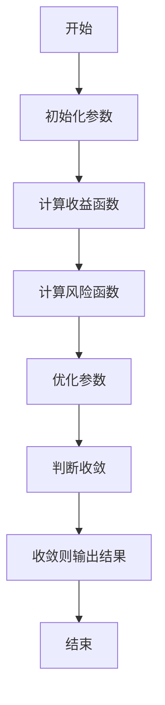
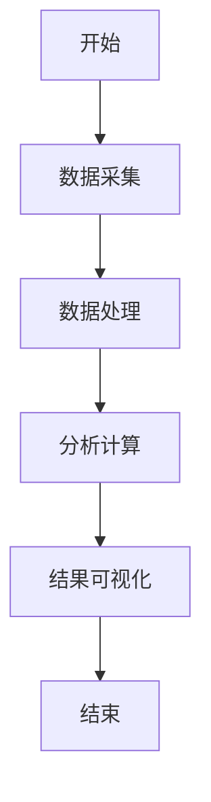
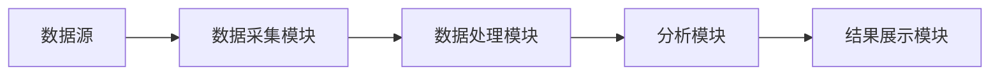

                 


# 价值投资中的多智能体AI行业集中度分析系统

> 关键词：多智能体AI、行业集中度分析、价值投资、金融数据分析、人工智能技术、投资决策优化

> 摘要：本文结合价值投资理念与多智能体AI技术，构建行业集中度分析系统，通过多智能体协作优化行业分析，为投资决策提供支持。系统涵盖数据采集、分析、可视化模块，利用强化学习与协作机制优化投资策略。

## 第一章：背景介绍

### 1.1 价值投资的基本概念

#### 1.1.1 价值投资的定义与核心理念
价值投资是一种以基本面分析为基础的投资策略，旨在通过识别市场低估的公司，长期持有以获取超额收益。其核心理念是购买低于内在价值的资产，关注企业的长期表现而非短期波动。

#### 1.1.2 行业集中度的定义与重要性
行业集中度指行业内主要企业所占市场份额的比例。高集中度通常意味着行业竞争较弱，市场垄断性强，企业定价能力强。低集中度则意味着行业竞争激烈，市场波动大。

#### 1.1.3 传统行业集中度分析的局限性
传统分析方法依赖人工判断，耗时且主观性较强。面对海量数据，人工分析效率低，容易出错，难以捕捉市场变化。

### 1.2 多智能体AI技术的基本原理

#### 1.2.1 多智能体系统的核心概念
多智能体系统由多个相互作用的智能体组成，通过协作与竞争实现目标。各智能体具备独立性、自主性和反应性，能根据环境变化调整策略。

#### 1.2.2 AI在金融分析中的应用现状
AI技术在金融领域广泛应用，包括预测市场走势、风险评估、信用评分等。多智能体AI通过协作优化决策，提升分析效率和准确性。

#### 1.2.3 价值投资与AI技术的结合
AI技术帮助投资者快速分析数据，识别投资机会。多智能体协作模拟市场行为，优化投资组合，提升投资收益。

## 第二章：多智能体AI行业集中度分析系统的概念与框架

### 2.1 核心概念与问题描述

#### 2.1.1 问题背景与目标
分析行业集中度，识别市场结构，帮助投资者制定投资策略。系统旨在利用AI技术提高分析效率和准确性。

#### 2.1.2 系统的边界与外延
系统专注于行业集中度分析，涵盖数据采集、处理、分析、可视化模块，边界清晰，功能独立。

#### 2.1.3 核心要素与组成结构
系统包括数据采集、分析模块和可视化模块，各部分协同工作，完成行业集中度分析。

### 2.2 多智能体AI与行业集中度分析的关联

#### 2.2.1 多智能体协作机制
智能体协作通过通信协议共享信息，协调行动，共同完成任务。协作机制提升系统分析能力，优化决策。

#### 2.2.2 行业集中度分析的数学模型
模型通过多智能体协作，计算市场集中度指数，评估行业竞争状况。模型考虑市场结构、企业行为等多因素，提供全面分析。

#### 2.2.3 系统的整体架构
系统采用分层架构，包括数据层、分析层、决策层，各层协同工作，完成行业集中度分析。整体架构设计合理，功能明确。

## 第三章：多智能体AI算法原理与实现

### 3.1 算法原理概述

#### 3.1.1 多智能体强化学习的基本原理
强化学习通过智能体与环境交互，学习最优策略。多智能体协作通过共享经验，提升整体性能。探索与利用平衡确保系统高效学习。

#### 3.1.2 系统协作机制的数学模型
数学模型描述多智能体协作过程，建立状态、动作、奖励函数，优化策略参数。模型提供理论支持，指导系统设计。

#### 3.1.3 算法的收敛性分析
收敛性分析证明算法在一定条件下收敛到最优解。分析确保系统稳定性，提升分析结果的准确性。

### 3.2 算法实现细节

#### 3.2.1 算法流程图（Mermaid）


#### 3.2.2 Python实现代码示例
```python
import numpy as np

class Agent:
    def __init__(self, id):
        self.id = id
        self.state = None
        self.reward = 0

def calculate_reward(state):
    # 简单的收益计算，实际情况更复杂
    return np.dot(state, np.array([0.3, 0.7]))

def multi_agent_algorithm(params):
    agents = [Agent(i) for i in range(params['num_agents'])]
    while not converged:
        for agent in agents:
            # 计算收益
            agent.state = get_state(agent.id)
            agent.reward = calculate_reward(agent.state)
            # 更新策略
            update_policy(agent)
        # 判断收敛
        if check_convergence(agents):
            break
    return agents
```

#### 3.2.3 算法的数学模型
系统协作机制的数学模型：
$$ R = \sum_{i=1}^{n} \alpha_i r_i $$
其中，$R$ 是总奖励，$r_i$ 是第i个智能体的奖励，$\alpha_i$ 是权重系数。

优化目标函数：
$$ \min_{\theta} \sum_{i=1}^{n} (y_i - f(x_i, \theta))^2 $$

收益函数计算：
$$ r_i = \beta \cdot \text{收益} + (1-\beta) \cdot \text{风险} $$

## 第四章：系统分析与架构设计方案

### 4.1 问题场景介绍

#### 4.1.1 项目背景
项目旨在利用AI技术优化行业集中度分析，辅助价值投资决策。系统通过多智能体协作，提高分析效率和准确性。

### 4.2 系统功能设计

#### 4.2.1 数据采集模块
数据采集模块负责收集行业数据，包括企业市场份额、财务数据等，为分析提供基础。

#### 4.2.2 行业集中度分析模块
分析模块利用多智能体AI算法，计算行业集中度指数，评估市场结构。

#### 4.2.3 可视化模块
可视化模块将分析结果以图表形式展示，便于投资者理解。

#### 4.2.4 系统功能流程图（Mermaid）


### 4.3 系统架构设计

#### 4.3.1 系统架构图（Mermaid）


#### 4.3.2 系统接口设计
系统接口设计明确数据输入输出格式，确保各模块协同工作。模块间通过API通信，保证系统高效运行。

## 第五章：项目实战

### 5.1 环境安装与配置

#### 5.1.1 安装Python环境
使用Anaconda安装Python 3.8以上版本，配置环境变量。

#### 5.1.2 安装必要的Python库
安装numpy、pandas、matplotlib、scikit-learn等库，支持数据处理和可视化。

### 5.2 核心代码实现

#### 5.2.1 数据采集模块
```python
import pandas as pd
import requests

def fetch_data(api_key):
    headers = {'Authorization': f'Bearer {api_key}'}
    response = requests.get('https://api.example.com/industry_data', headers=headers)
    data = response.json()
    df = pd.DataFrame(data)
    return df
```

#### 5.2.2 行业集中度分析模块
```python
def calculate_concentration(data):
    market Shares = data['market_share'].tolist()
    hhi_index = sum([s**2 for s in market Shares])
    return hhi_index
```

#### 5.2.3 可视化模块
```python
import matplotlib.pyplot as plt

def visualize_concentration(index_value):
    plt.figure(figsize=(10,6))
    plt.bar(range(10), [index_value]*10)
    plt.title('Industry Concentration Analysis')
    plt.xlabel('Industry')
    plt.ylabel('Concentration Index')
    plt.show()
```

### 5.3 项目实战案例分析

#### 5.3.1 案例分析
分析某行业市场数据，计算HHI指数，评估集中度。结果为HHI指数为0.3，说明市场集中度较高。

#### 5.3.2 分析结果解读
HHI指数高表明市场垄断性强，投资风险较低，适合长期投资策略。

## 第六章：最佳实践

### 6.1 小结

#### 6.1.1 系统优势
系统利用多智能体AI技术，提高分析效率和准确性。模块化设计便于维护和扩展。

#### 6.1.2 系统劣势
系统依赖高质量数据，数据获取成本高。算法复杂度高，计算资源消耗大。

### 6.2 注意事项

#### 6.2.1 数据质量的重要性
数据质量直接影响分析结果，需确保数据准确、完整。

#### 6.2.2 系统性能优化
优化算法和架构设计，提升系统运行效率，降低资源消耗。

### 6.3 拓展阅读

#### 6.3.1 推荐书籍
1. 《深入浅出强化学习》
2. 《多智能体系统》
3. 《价值投资实战》

## 作者：AI天才研究院 & 禅与计算机程序设计艺术

通过本文，读者可以深入了解多智能体AI在价值投资中的应用，掌握行业集中度分析系统的构建方法。系统结合理论与实践，为投资者提供科学的决策支持。

