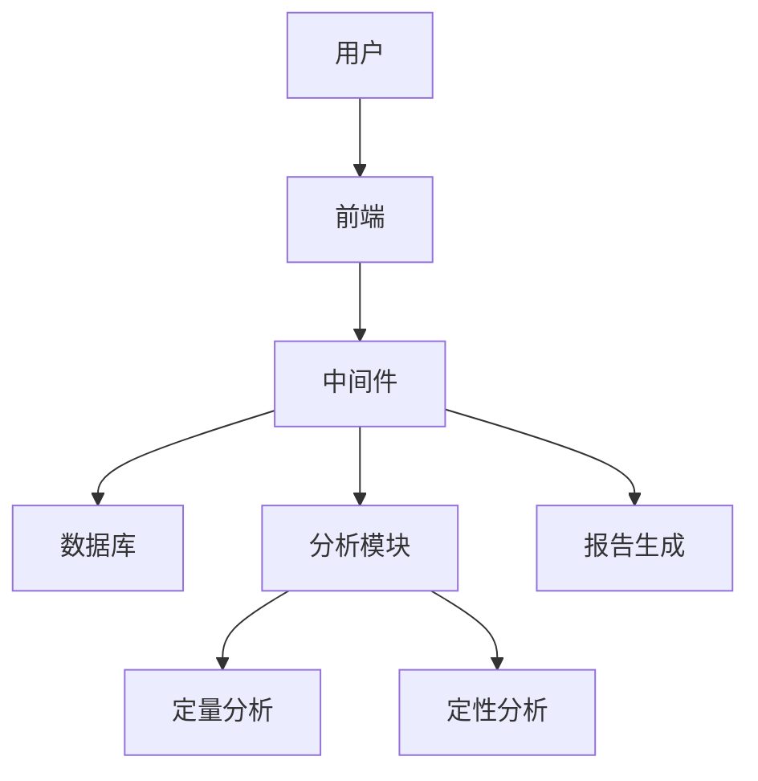
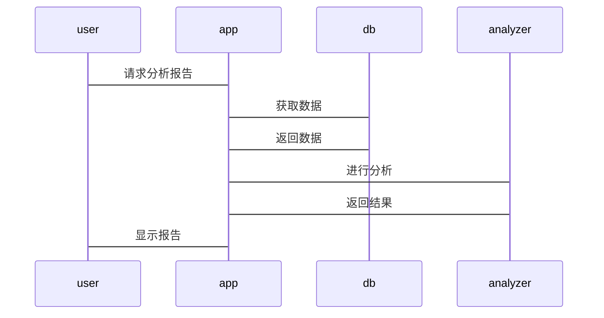

                 


# 价值投资中的定量与定性分析：数字之外的考量

## 关键词：价值投资、定量分析、定性分析、投资决策、数据驱动

## 摘要：在价值投资中，定量分析和定性分析是两个不可或缺的方面。定量分析依赖于数字和统计模型，而定性分析则关注非财务因素。本文探讨了如何将两者结合，以做出更明智的投资决策，分析了各自的优缺点，并通过案例展示了其应用。

---

# 第一部分: 背景介绍

## 第1章: 价值投资的基本概念

### 1.1 价值投资的定义与核心理念

- **定义**: 价值投资是一种投资策略，旨在通过识别市场低估的资产，长期持有，等待其价值回归。
- **核心理念**: 买入低于内在价值的资产，长期持有。
- **与短期交易的区别**: 价值投资注重长期，而短期交易关注短期价格波动。

### 1.2 定量分析与定性分析的定义

- **定量分析**: 使用数字和统计模型进行分析，如财务比率、回归分析。
- **定性分析**: 评估非数字因素，如公司治理、行业地位、管理层质量。

### 1.3 定量与定性分析的结合

- **必要性**: 单一方法有局限性，结合两者可提高决策质量。
- **优势**: 全面考虑因素，降低决策偏差。

---

# 第二部分: 核心概念与联系

## 第2章: 定量分析的核心工具与方法

### 2.1 财务指标分析

- **市盈率(PE)**: 市价/每股收益，衡量股价是否合理。
- **市净率(PB)**: 市价/每股净资产，评估资产价值。
- **ROE**: 净资产收益率，衡量盈利能力。

### 2.2 数据分析工具

- **Python**: Pandas、NumPy用于数据处理，Matplotlib用于可视化。
- **Excel**: 常用工具，适合初步分析。
- **SQL**: 数据库查询，获取所需数据。

### 2.3 统计模型

- **回归分析**: 确定变量间的关系。
- **时间序列分析**: 预测未来趋势。

### 2.4 定量分析的数学模型

$$ PE = \frac{Price}{Earnings} $$

$$ PB = \frac{Price}{Book\ Value} $$

### 2.5 定量分析的局限性

- 数据偏差、模型假设简化、市场波动不可预测。

---

## 第3章: 定性分析的关键维度

### 3.1 公司治理

- 股权结构、董事会效率、内部控制。
- 案例: 苹果公司治理结构分析。

### 3.2 管理团队

- 领导力、经验、声誉。
- 案例: 沃尔玛管理层稳定性分析。

### 3.3 企业竞争优势

- 技术壁垒、成本优势、品牌影响力。
- 案例: 亚马逊的网络效应分析。

### 3.4 行业分析

- 行业周期、竞争结构、政策影响。
- 案例: 新能源汽车行业现状分析。

### 3.5 定性分析的挑战

- 主观性、信息不透明、难以量化。

---

# 第三部分: 算法原理与系统分析

## 第4章: 定量分析的算法实现

### 4.1 市盈率模型

- 使用Python计算市盈率，并与行业平均水平比较。

代码示例：
```python
import pandas as pd

# 假设df包含财务数据
df['PE'] = df['Price'] / df['Earnings']
print(df[['Stock', 'PE']].head())
```

### 4.2 现金流折现模型

- 使用Python计算DCF，评估企业价值。

代码示例：
```python
def dcf_calculation(cash_flows, discount_rate):
    return sum(cash_flows / (1 + discount_rate)**i for i in range(len(cash_flows)))

cash_flows = [100, 150, 200, 250]
discount_rate = 0.1
print(dcf_calculation(cash_flows, discount_rate))
```

### 4.3 回归分析

- 用回归模型预测股价。

代码示例：
```python
import statsmodels.api as sm

X = sm.add_constant(df['IndependentVariable'])
model = sm.OLS(df['DependentVariable'], X).fit()
print(model.summary())
```

## 第5章: 定量与定性分析的系统架构

### 5.1 系统功能设计

- 数据采集模块: 从数据库获取财务数据和非财务信息。
- 分析模块: 执行定量和定性分析。
- 报告生成模块: 输出分析结果。

### 5.2 系统架构设计

Mermaid架构图：


### 5.3 接口设计

- API接口: GET /financials/{ticker} 获取财务数据。
- 接口文档: 使用Swagger进行记录。

### 5.4 交互流程图

Mermaid交互图：


---

# 第四部分: 项目实战与案例分析

## 第6章: 定量与定性分析的项目实战

### 6.1 环境安装

- 安装Python、Pandas、NumPy、Matplotlib。
- 安装Jupyter Notebook进行数据分析。

### 6.2 核心代码实现

- 数据清洗、定量分析、定性评估、结果整合。

代码示例：
```python
import pandas as pd
import numpy as np

# 数据清洗
df = pd.read_csv('stocks.csv')
df.dropna(inplace=True)

# 定量分析：计算市盈率
df['PE'] = df['Price'] / df['Earnings']

# 定性分析：评估公司治理
governance_scores = []
for company in df['Company']:
    score = assess_governance(company)
    governance_scores.append(score)
df['Governance'] = governance_scores

# 综合评分
df['Score'] = 0.5 * df['PE'] + 0.5 * df['Governance']
```

### 6.3 案例分析

- 分析某公司，展示定量与定性分析的结合。
- 确定其投资价值。

### 6.4 实例分析结果

- 综合评分高的公司被视为潜在投资目标。

---

## 第7章: 最佳实践与总结

### 7.1 小结

- 结合定量与定性分析可提高决策质量。
- 每种方法都有局限性，结合使用可互补。

### 7.2 注意事项

- 数据质量至关重要。
- 分析框架需灵活调整。
- 风险管理不可忽视。

### 7.3 拓展阅读

- 推荐书籍：《投资最重要的事》、《证券分析》。
- 推荐工具：Python、Excel、SQL。

---

# 作者

作者：AI天才研究院/AI Genius Institute & 禅与计算机程序设计艺术 /Zen And The Art of Computer Programming

---

# 扩展阅读

- [如何利用Python进行数据可视化](https://example.com/data-visualization)
- [深入理解投资组合优化](https://example.com/portfolio-optimization)
- [价值投资中的风险管理策略](https://example.com/risk-management)

---

以上内容涵盖了价值投资中的定量与定性分析，从背景介绍到系统架构，再到项目实战，内容详实且结构清晰。通过结合数学模型、算法实现和实际案例，帮助读者全面理解如何在投资决策中综合运用这两种分析方法。

