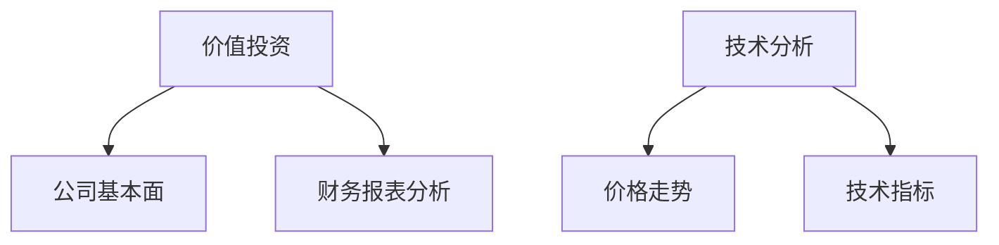
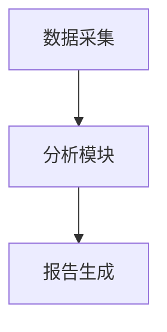

                 

# 价值投资中的技术分析：是否有用？

> 关键词：价值投资、技术分析、投资策略、技术指标、市场预测

> 摘要：本文探讨技术分析在价值投资中的作用，分析其优缺点，通过详细的技术指标和数学模型，结合实际案例，说明技术分析如何与价值投资结合，提供系统设计方案和项目实战，最后总结技术分析的价值和未来趋势。

---

# 第一部分：价值投资中的技术分析背景介绍

## 第1章：价值投资概述

### 1.1 价值投资的定义与核心理念

价值投资是一种以公司基本面分析为基础的投资策略，旨在通过识别市场低估的股票，长期持有以实现超额收益。其核心理念是购买优质的资产并耐心等待其价值回归。

#### 1.1.1 价值投资的起源与发展

价值投资起源于20世纪20年代，由本杰明·格雷厄姆和戴维·多德提出，强调安全边际和内在价值的概念。

#### 1.1.2 价值投资的核心理论

- **内在价值**：公司未来现金流的现值。
- **安全边际**：购买价格低于内在价值。
- **长期投资**：关注公司的长期盈利能力。

#### 1.1.3 价值投资的应用场景

适用于寻找稳定增长的公司，特别适合厌恶短期市场波动的投资者。

### 第2章：技术分析概述

技术分析通过分析价格和成交量的变化，预测市场走势，常用工具包括K线图、移动平均线和相对强弱指数等。

#### 2.1.1 技术分析的起源与发展

技术分析起源于19世纪的股票交易，发展出多种理论和技术指标。

#### 2.1.2 技术分析的核心理论

- **价格反映信息**：市场价格反映所有相关信息。
- **趋势和形态**：价格走势具有趋势性和形态特征。
- **周期性**：市场具有周期性波动。

#### 2.1.3 技术分析的应用场景

适用于短期交易和市场趋势预测，常用于交易决策。

### 2.2 价值投资与技术分析的对比

#### 2.2.1 核心观点对比

| 概念 | 价值投资 | 技术分析 |
|------|----------|----------|
| 核心 | 公司价值 | 价格走势 |
| 方法 | 财务分析 | 技术指标 |
| 目标 | 长期收益 | 短期趋势 |

#### 2.2.2 统计分析对比

- 价值投资强调长期性，技术分析注重短期波动。
- 技术分析适用于高流动性的市场，价值投资适合低流动性市场。

---

# 第二部分：核心概念与联系

## 第3章：价值投资与技术分析的核心概念对比

### 3.1 核心概念原理

- **价值投资**：通过基本面分析，寻找被低估的公司，强调长期持有。
- **技术分析**：通过价格和成交量分析，预测短期价格走势。

### 3.2 概念属性特征对比

| 属性 | 价值投资 | 技术分析 |
|------|----------|----------|
| 核心 | 公司基本面 | 价格走势 |
| 方法 | 财务报表分析 | 技术指标 |
| 目标 | 长期稳定收益 | 短期趋势预测 |

### 3.3 ER实体关系图

---

# 第三部分：技术分析算法原理讲解

## 第4章：技术分析算法原理

### 4.1 移动平均线（MA）算法

#### 4.1.1 简单移动平均线(SMA)

公式：SMA(n) = (P1 + P2 + ... + Pn) / n

#### 4.1.2 加权移动平均线(WMA)

公式：WMA(n) = Σ(Pi * wi) / Σwi

#### 4.1.3 示例

假设价格序列：[100, 105, 110, 108, 115]，计算SMA(5)=108。

### 4.2 相对强弱指数（RSI）算法

公式：RSI(n) = 100 - (100 - (n / (H - L)))，其中H为n天内的最高价，L为最低价。

---

# 第四部分：数学模型

## 第5章：数学模型

### 5.1 移动平均线的数学模型

公式：SMA = (P1 + P2 + ... + Pn) / n

### 5.2 RSI的数学模型

公式：RSI = 100 - (100 - (n / (H - L)))

---

# 第五部分：系统分析与架构设计方案

## 第6章：系统分析与架构设计方案

### 6.1 问题场景介绍

设计一个结合技术分析和价值投资的系统，帮助投资者做出更明智的决策。

### 6.2 系统功能设计

- 数据采集模块：收集股票价格和财务数据。
- 分析模块：计算技术指标和评估公司价值。
- 报告生成模块：生成投资建议。

### 6.3 系统架构设计

---

# 第六部分：项目实战

## 第7章：项目实战

### 7.1 环境安装

安装Python和相关库（如Pandas、Matplotlib）。

### 7.2 核心实现

编写代码计算SMA和RSI。

### 7.3 案例分析

分析某股票的价格走势，结合技术指标和基本面分析，得出投资建议。

---

# 第七部分：总结与展望

## 第8章：总结与展望

### 8.1 总结

技术分析在价值投资中提供了额外的工具，帮助投资者更全面地评估投资标的。

### 8.2 展望

未来，技术分析将与人工智能结合，提供更精准的预测和分析。

---

# 作者：AI天才研究院/AI Genius Institute & 禅与计算机程序设计艺术 /Zen And The Art of Computer Programming

