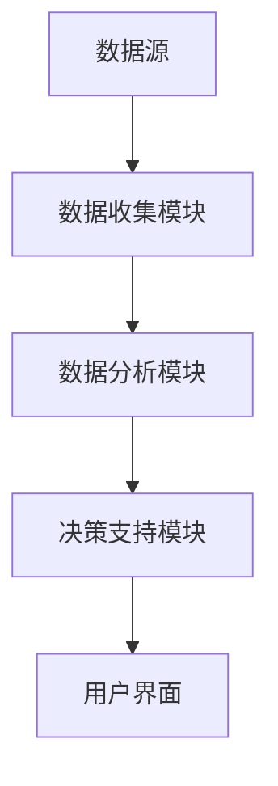

                 


# 价值投资中的新兴市场机会：高风险下的高回报

---

## 关键词：价值投资、新兴市场、高风险、高回报、风险管理、投资策略、量化分析

---

## 摘要：  
新兴市场作为全球经济增长的重要驱动力，为价值投资者提供了丰富的投资机会。然而，新兴市场的高风险也对投资者的能力提出了更高的要求。本文从价值投资的核心理念出发，结合量化分析和风险管理策略，深入探讨新兴市场的投资机会与挑战。通过系统化的分析框架和实战案例，本文为投资者提供了一套在高风险下实现高回报的策略体系。

---

# 第1章：新兴市场的定义与重要性

## 1.1 新兴市场的概念与特点  
### 1.1.1 新兴市场的定义  
新兴市场是指那些经济快速发展但尚未完全工业化的国家的金融市场。这些市场通常位于发展中国家，具有较高的增长潜力，但也伴随着较高的波动性和不确定性。  

### 1.1.2 新兴市场的核心特征  
- **高增长潜力**：新兴市场的GDP增速通常高于发达国家。  
- **市场流动性**：新兴市场的流动性相对较低，尤其是在中小型企业中。  
- **政策风险**：新兴市场国家的政策变化可能对市场产生重大影响。  
- **行业多样性**：新兴市场的产业结构多样化，涵盖制造业、科技、消费等多个领域。  

### 1.1.3 新兴市场与发达国家市场的对比  
| 特性             | 新兴市场                   | 发达国家市场             |  
|------------------|---------------------------|--------------------------|  
| 经济增速         | 高                      | 低或中等                 |  
| 市场流动性       | 低                      | 高                      |  
| 投资风险         | 高                      | 低                      |  
| 行业结构         | 多样化                  | 较少多样化               |  

---

## 1.2 价值投资的基本原理  
### 1.2.1 价值投资的定义与核心理念  
价值投资是一种投资策略，强调以低于公允价值的价格买入优质资产。其核心理念是寻找市场低估的公司，并长期持有，等待其价值回归。  

### 1.2.2 价值投资的三大支柱  
1. **安全边际**：买入价格低于内在价值。  
2. **基本面分析**：关注企业的财务状况、盈利能力和发展潜力。  
3. **长期视角**：避免短期市场波动的干扰，关注企业的长期价值。  

### 1.2.3 价值投资与新兴市场的结合  
新兴市场的高增长潜力与价值投资的理念完美契合。通过识别被市场低估的优质企业，投资者可以在新兴市场中实现高回报。

---

## 1.3 新兴市场的投资机会  
### 1.3.1 新兴市场的经济增长潜力  
新兴市场的GDP增速通常高于发达国家，尤其是在亚洲、非洲和拉丁美洲等地区。  

### 1.3.2 新兴市场的行业分布特点  
- **科技行业**：新兴市场的科技企业增长迅速，尤其是在互联网和数字化转型领域。  
- **消费行业**：随着中产阶级的崛起，消费行业具有较大的增长潜力。  
- **制造业**：新兴市场的制造业成本优势明显，尤其是在劳动密集型行业。  

### 1.3.3 新兴市场的政策环境分析  
- **政策支持**：许多新兴市场国家政府积极推动经济发展，提供政策支持。  
- **政策风险**：政策变化可能对市场产生重大影响，投资者需密切关注。  

---

## 1.4 本章小结  
新兴市场作为全球经济增长的核心动力，为价值投资者提供了丰富的投资机会。然而，新兴市场的高风险也要求投资者具备更强的分析能力和风险管理能力。

---

# 第2章：价值投资的核心概念与数学模型

## 2.1 价值投资的核心公式  
### 2.1.1 火车轨道法公式  
火车轨道法是一种简单有效的股票估值方法，公式为：  
$$ \text{内在价值} = \frac{\text{每股收益} \times \text{市盈率}}{2} $$  

### 2.1.2 内在价值计算公式  
内在价值的计算公式为：  
$$ V = \frac{C}{r - g} $$  
其中，$C$ 是现金流，$r$ 是折现率，$g$ 是增长率。  

### 2.1.3 安全边际计算公式  
安全边际的计算公式为：  
$$ \text{安全边际} = \text{内在价值} - \text{市场价格} $$  

---

## 2.2 价值投资的数学模型  
### 2.2.1 股票估值的数学模型  
股票估值的数学模型可以用以下公式表示：  
$$ \text{估值} = \sum_{t=1}^{n} \frac{\text{现金流}_t}{(1 + r)^t} $$  

### 2.2.2 市盈率与市净率的对比分析  
| 指标     | 市盈率（P/E） | 市净率（P/B） |  
|----------|---------------|---------------|  
| 定义     | 市价与每股收益的比值 | 市价与每股净资产的比值 |  
| 适用场景 | 初期增长型企业 | 成熟型企业     |  

### 2.2.3 投资回报率的计算公式  
投资回报率的计算公式为：  
$$ \text{回报率} = \frac{\text{投资收益}}{\text{投资成本}} \times 100\% $$  

---

## 2.3 价值投资的算法实现  
### 2.3.1 简单价值投资算法  
1. 计算股票的内在价值。  
2. 比较市场价格与内在价值，如果市场价格低于内在价值，则买入。  

### 2.3.2 基于机器学习的股票筛选算法  
1. 收集股票的财务数据和市场数据。  
2. 使用机器学习模型预测股票的潜在价值。  
3. 根据模型输出筛选低估股票。  

---

## 2.4 本章小结  
价值投资的核心公式和数学模型为投资者提供了科学的估值方法，结合算法实现，可以更高效地识别投资机会。

---

# 第3章：新兴市场的风险分析与管理

## 3.1 新兴市场的风险因素  
### 3.1.1 政治风险  
新兴市场国家的政治不稳定可能对市场产生重大影响。  

### 3.1.2 经济波动风险  
新兴市场的经济波动较大，容易受到外部冲击的影响。  

### 3.1.3 市场流动性风险  
新兴市场的流动性较低，可能导致资产难以变现。  

---

## 3.2 风险评估的数学模型  
### 3.2.1 风险价值（VaR）模型  
风险价值（VaR）模型用于衡量投资组合的潜在损失。公式为：  
$$ \text{VaR} = \text{置信水平} \times \text{标准差} \times \text{投资金额} $$  

### 3.2.2 风险调整后的回报模型  
风险调整后的回报模型公式为：  
$$ \text{RAR} = \frac{\text{投资回报} - \text{无风险利率}}{\text{风险度量}} $$  

### 3.2.3 风险分散策略的数学分析  
通过分散投资可以降低非系统性风险，公式为：  
$$ \text{分散后的风险} = \sqrt{\text{权重}_1^2 \times \text{方差}_1 + \text{权重}_2^2 \times \text{方差}_2 + \dots} $$  

---

## 3.3 风险管理的策略与技巧  
### 3.3.1 多元化投资策略  
通过投资不同行业和地区的资产来分散风险。  

### 3.3.2 风险对冲策略  
使用衍生工具（如期权和期货）对冲市场风险。  

### 3.3.3 安全边际的再利用  
在新兴市场中，保持更高的安全边际以应对潜在的市场波动。  

---

## 3.4 本章小结  
新兴市场的高风险要求投资者采取科学的风险管理策略，以确保投资的稳定性。

---

# 第4章：新兴市场的量化投资策略

## 4.1 量化投资的基本原理  
### 4.1.1 量化投资的定义与特点  
量化投资是一种基于数学模型的投资策略，强调数据驱动的决策。  

### 4.1.2 量化投资与传统投资的区别  
| 特性     | 量化投资           | 传统投资           |  
|----------|--------------------|--------------------|  
| 决策依据 | 数据和算法         | 个人判断和经验     |  
| 操作频率 | 高频交易           | 低频交易           |  

---

## 4.2 量化投资的算法实现  
### 4.2.1 基于因子模型的投资策略  
因子模型通过分析股票的多个因子（如市盈率、市净率、收益增长率）来筛选投资标的。  

### 4.2.2 基于机器学习的预测模型  
机器学习模型可以利用历史数据预测股票的未来表现。  

### 4.2.3 算法交易的实现步骤  
1. 数据收集与预处理。  
2. 策略开发与回测。  
3. 系统优化与部署。  

---

## 4.3 新兴市场的量化分析  
### 4.3.1 新兴市场的因子分析  
- **低市盈率因子**：寻找市盈率低于行业平均水平的股票。  
- **高收益增长因子**：筛选收益增长高于行业平均水平的股票。  

### 4.3.2 新兴市场的数据特征  
新兴市场数据通常具有以下特征：  
- 数据量小  
- 数据波动性大  
- 数据缺失较多  

### 4.3.3 新兴市场的量化投资策略优化  
通过优化算法和调整参数，可以提高量化投资在新兴市场的表现。

---

## 4.4 本章小结  
量化投资为新兴市场的投资提供了新的思路，但需要结合市场的特点进行策略优化。

---

# 第5章：系统架构与投资分析工具

## 5.1 投资分析系统的功能需求  
### 5.1.1 数据收集模块  
功能：收集股票的财务数据和市场数据。  

### 5.1.2 数据分析模块  
功能：对数据进行清洗、分析和建模。  

### 5.1.3 决策支持模块  
功能：根据分析结果生成投资建议。  

---

## 5.2 系统架构设计  
### 5.2.1 系统架构图  


### 5.2.2 系统接口设计  
- 数据接口：与数据源对接，获取实时数据。  
- 用户接口：提供友好的用户界面，展示分析结果。  

---

## 5.3 项目实战  
### 5.3.1 环境安装  
- 安装Python和相关库（如Pandas、NumPy、Scikit-learn）。  

### 5.3.2 核心实现源代码  
```python
import pandas as pd
import numpy as np
from sklearn.linear_model import LinearRegression

# 数据收集
data = pd.read_csv('emerging_markets.csv')

# 数据分析
X = data[['PE', 'ROE']]
y = data['Return']

model = LinearRegression()
model.fit(X, y)

# 预测
predicted_returns = model.predict(X)
```

### 5.3.3 代码应用解读  
上述代码通过线性回归模型，基于市盈率（PE）和净资产收益率（ROE）预测股票的回报率。  

---

## 5.4 本章小结  
通过系统化的分析工具和投资分析系统，投资者可以更高效地识别新兴市场的投资机会。

---

# 第6章：总结与最佳实践

## 6.1 总结  
新兴市场为价值投资者提供了丰富的投资机会，但同时也伴随着高风险。通过科学的估值方法和风险管理策略，投资者可以在新兴市场中实现高回报。

## 6.2 最佳实践 tips  
1. **分散投资**：避免将所有资金投入到单一市场或行业。  
2. **长期视角**：坚持价值投资理念，避免短期波动的干扰。  
3. **持续学习**：关注新兴市场的政策和经济动态。  

## 6.3 注意事项  
- 新兴市场的波动性较大，投资者需做好心理准备。  
- 风险管理是投资成功的关键，不可忽视。  

## 6.4 拓展阅读  
- 《价值投资入门》  
- 《量化投资策略》  
- 《风险管理实务》  

---

# 作者：AI天才研究院/AI Genius Institute & 禅与计算机程序设计艺术 /Zen And The Art of Computer Programming

