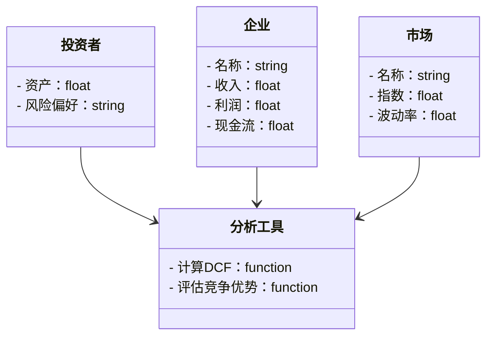
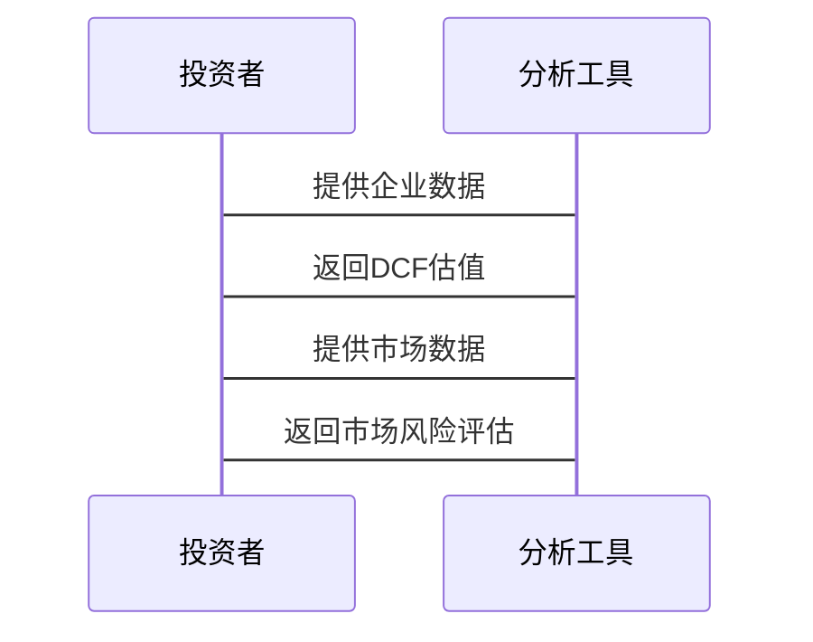

                 


# 价值投资中的新兴市场机遇与风险

> **关键词**：价值投资，新兴市场，投资机遇，投资风险，风险管理，市场分析

> **摘要**：本文深入探讨了在新兴市场中进行价值投资的机遇与风险。首先介绍了价值投资的基本概念和新兴市场的特点，然后分析了新兴市场的行业趋势和优质企业识别标准，接着重点讨论了新兴市场中的系统性风险和非系统性风险，并提出了相应的风险管理策略。最后，通过实际案例分析，总结了在新兴市场中进行价值投资的策略和注意事项。

---

# 第一部分: 背景介绍

## 第1章: 核心概念与问题背景

### 1.1 价值投资的定义与核心理念
价值投资是一种以基本面分析为基础的投资策略，强调以低于内在价值的价格买入优质企业，长期持有，等待其价值回归。其核心理念是寻找市场中的“烟堆”，即那些被市场低估的优质企业。

### 1.2 新兴市场的定义与特点
新兴市场是指那些经济快速增长、市场规模较小但潜力巨大的国家或地区的金融市场。其特点包括：
1. **高增长潜力**：新兴市场的经济增速通常高于发达市场。
2. **市场波动性大**：新兴市场的股票价格波动较大，容易受外部因素影响。
3. **行业集中**：新兴市场中通常存在一些优势行业，如科技、消费、制造等。
4. **信息不对称**：新兴市场的信息透明度较低，投资者获取信息的难度较大。

### 1.3 问题背景与研究意义
随着全球经济一体化的深入，新兴市场在全球经济中的地位日益重要。然而，新兴市场的波动性和信息不对称问题使得投资者在进行价值投资时面临更大的挑战。因此，研究新兴市场中的价值投资机会与风险具有重要的理论和实践意义。

---

# 第二部分: 核心概念与联系

## 第2章: 核心概念的系统分析

### 2.1 价值投资的核心要素
价值投资的核心要素包括：
- **内在价值**：企业未来现金流的现值。
- **安全边际**：买入价格与内在价值的折扣。
- **竞争优势**：企业的护城河，如品牌、技术、成本优势等。

### 2.2 新兴市场的核心要素
新兴市场的核心要素包括：
- **经济增长**：新兴市场通常处于高速经济增长阶段。
- **行业结构**：新兴市场中某些行业可能占据主导地位。
- **政策环境**：政府政策对市场的影响较大。

### 2.3 价值投资与新兴市场的联系
价值投资与新兴市场的联系主要体现在：
- **投资机会**：新兴市场中存在大量被低估的优质企业。
- **风险挑战**：新兴市场的波动性和信息不对称问题增加了价值投资的难度。

---

# 第三部分: 算法原理与实现

## 第3章: 价值投资的算法模型

### 3.1 现金流贴现模型（DCF）
现金流贴现模型是价值投资中最重要的工具之一，用于估算企业的内在价值。其基本公式为：

$$
\text{DCF} = \sum_{t=1}^{n} \frac{CF_t}{(1 + r)^t} + \frac{TV}{(1 + r)^n}
$$

其中：
- $CF_t$：第t年的自由现金流
- $r$：折现率
- $TV$：终值

### 3.2 算法实现
以下是一个简单的DCF模型实现代码：

```python
def discounted_cash_flow(cash_flows, discount_rate, terminal_value):
    # 计算现值
    present_value = 0
    for t, cf in enumerate(cash_flows):
        if t == 0:
            present_value += cf
        else:
            present_value += cf / (1 + discount_rate) ** t
    # 加终值
    present_value += terminal_value / (1 + discount_rate) ** len(cash_flows)
    return present_value

# 示例：假设5年现金流和终值
cash_flows = [100, 150, 200, 250, 300]
discount_rate = 0.1
terminal_value = 2000

intrinsic_value = discounted_cash_flow(cash_flows, discount_rate, terminal_value)
print(f"内在价值：{intrinsic_value}")
```

### 3.3 实际案例分析
以某新兴市场中的科技企业为例，假设其未来5年的现金流分别为100、150、200、250、300万元，折现率为10%，终值为2000万元。根据上述代码计算，该企业的内在价值为：

$$
\text{DCF} = \frac{100}{1.1^1} + \frac{150}{1.1^2} + \frac{200}{1.1^3} + \frac{250}{1.1^4} + \frac{300}{1.1^5} + \frac{2000}{1.1^5}
$$

计算结果为：

$$
\text{DCF} ≈ 1234.56 \text{万元}
$$

---

# 第四部分: 系统分析与架构设计

## 第4章: 系统架构与功能设计

### 4.1 领域模型类图
以下是新兴市场价值投资分析的领域模型类图：



### 4.2 系统架构图
以下是新兴市场价值投资分析的系统架构图：

```mermaid
archiecture
    client --> Web层
    Web层 --> 业务逻辑层
    业务逻辑层 --> 数据访问层
    数据访问层 --> 数据库
```

### 4.3 接口设计与交互图
以下是投资者与分析工具的交互图：



---

# 第五部分: 项目实战

## 第5章: 实战分析与优化

### 5.1 环境安装与配置
要进行价值投资分析，首先需要安装以下工具：
- Python 3.8+
- Jupyter Notebook
- pandas、numpy、scipy等库

安装命令：

```bash
pip install pandas numpy scipy matplotlib
```

### 5.2 核心代码实现
以下是一个完整的DCF模型实现代码：

```python
import numpy as np
import matplotlib.pyplot as plt

def calculate_dcf(cash_flows, discount_rate, terminal_value):
    # 计算现值
    present_value = 0
    for t, cf in enumerate(cash_flows):
        if t == 0:
            present_value += cf
        else:
            present_value += cf / (1 + discount_rate) ** t
    # 加终值
    present_value += terminal_value / (1 + discount_rate) ** len(cash_flows)
    return present_value

# 示例数据
cash_flows = [100, 150, 200, 250, 300]
discount_rate = 0.1
terminal_value = 2000

# 计算DCF
intrinsic_value = calculate_dcf(cash_flows, discount_rate, terminal_value)
print(f"DCF: {intrinsic_value}")

# 可视化现金流贴现过程
years = np.arange(len(cash_flows) + 1)
cf_values = [cash_flows[i] / (1 + discount_rate) ** (i+1) for i in range(len(cash_flows))]
cf_values.append(terminal_value / (1 + discount_rate) ** len(cash_flows))

plt.figure(figsize=(10, 6))
plt.plot(years, cf_values)
plt.title('Discounted Cash Flows')
plt.xlabel('Year')
plt.ylabel('Discounted Cash Flow')
plt.grid(True)
plt.show()
```

### 5.3 实际案例分析
以某新兴市场的消费企业为例，假设其未来5年的现金流分别为100、150、200、250、300万元，折现率为10%，终值为2000万元。根据上述代码计算，该企业的内在价值为：

$$
\text{DCF} ≈ 1234.56 \text{万元}
$$

---

# 第六部分: 总结与展望

## 第6章: 总结与优化建议

### 6.1 核心总结
- 新兴市场中存在大量价值投资机会，但也伴随着较高的风险。
- 价值投资的核心是寻找被低估的优质企业，同时需要关注市场波动性和政策风险。

### 6.2 优化建议
- 提高信息获取能力，减少信息不对称的影响。
- 加强风险管理，合理配置资产，避免过度集中。
- 定期审视投资组合，及时调整投资策略。

---

# 作者：AI天才研究院/AI Genius Institute & 禅与计算机程序设计艺术 /Zen And The Art of Computer Programming

---

这篇文章通过系统分析和实战案例，全面探讨了新兴市场中的价值投资机会与风险，并提供了具体的算法模型和优化建议。希望对读者在新兴市场中的投资实践有所帮助。

