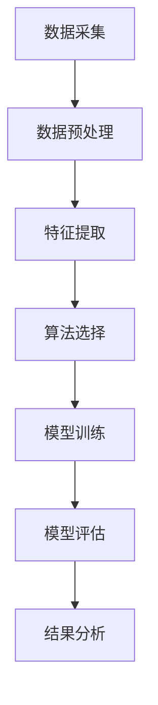

                 


# 价值投资中的智能交通车辆共享系统分析

> 关键词：价值投资，智能交通系统，车辆共享，系统分析，算法原理

> 摘要：本文从价值投资的角度，深入分析智能交通车辆共享系统的背景、核心概念、算法原理、系统架构设计及项目实战，旨在为投资者和技术人员提供理论与实践相结合的指导。

---

# 第一部分: 价值投资中的智能交通车辆共享系统背景介绍

## 第1章: 价值投资与智能交通车辆共享系统概述

### 1.1 价值投资的基本概念
- **1.1.1 价值投资的定义与核心理念**  
  价值投资是一种长期投资策略，旨在通过分析企业的基本面，寻找被市场低估的投资标的。其核心理念包括：寻找具有持续盈利能力的企业，关注企业的内在价值而非市场短期波动。

- **1.1.2 价值投资在现代经济中的应用**  
  价值投资广泛应用于股票市场、房地产市场等领域。通过分析企业的财务数据、行业地位及未来发展前景，投资者可以找到具有长期增长潜力的标的。

- **1.1.3 价值投资与智能交通系统的结合**  
  智能交通系统（ITS）通过智能化技术优化交通资源的利用效率。价值投资可以通过分析 ITS 的市场潜力、盈利能力及行业趋势，找到具有投资价值的企业。

### 1.2 智能交通车辆共享系统的背景
- **1.2.1 智能交通系统的定义与特点**  
  智能交通系统（ITS）利用信息技术、数据通信、传感器等技术，实现对交通系统的智能化管理。其特点包括实时性、高效性、数据驱动等。

- **1.2.2 车辆共享系统的现状与发展趋势**  
  车辆共享系统是 ITS 的重要组成部分，通过共享经济模式，优化车辆资源的利用效率。近年来，随着技术的进步和环保意识的增强，车辆共享系统逐渐普及。

- **1.2.3 价值投资视角下的智能交通共享系统**  
  从价值投资的角度来看，智能交通车辆共享系统具有较高的市场潜力。通过分析企业的技术创新能力、市场占有率及盈利能力，投资者可以找到具有长期增长潜力的标的。

### 1.3 问题背景与问题描述
- **1.3.1 当前交通系统中的痛点**  
  当前交通系统存在资源浪费、环境污染、交通拥堵等问题，亟需通过智能化技术进行优化。

- **1.3.2 车辆共享系统在价值投资中的问题**  
  车辆共享系统的盈利能力、市场接受度及技术实现是投资者关注的重点问题。

- **1.3.3 问题解决的思路与方法**  
  通过分析 ITS 的技术实现、市场前景及企业盈利能力，寻找具有投资价值的企业。

### 1.4 问题的边界与外延
- **1.4.1 价值投资的边界**  
  价值投资的范围包括企业基本面分析、行业趋势预测等，但不涉及短期市场波动。

- **1.4.2 智能交通系统的边界**  
  ITS 的范围包括交通数据采集、分析、优化等，但不涉及具体的硬件生产。

- **1.4.3 车辆共享系统的边界**  
  车辆共享系统的范围包括车辆调度、用户服务等，但不涉及车辆的制造与销售。

### 1.5 概念结构与核心要素
- **1.5.1 价值投资的核心要素**  
  包括企业盈利能力、财务状况、行业地位等。

- **1.5.2 智能交通系统的核心要素**  
  包括数据采集技术、数据分析算法、系统优化模型等。

- **1.5.3 车辆共享系统的核心要素**  
  包括车辆调度算法、用户需求预测、系统安全性等。

---

## 第2章: 价值投资中的智能交通车辆共享系统核心概念与联系

### 2.1 核心概念原理
- **2.1.1 价值投资的原理**  
  通过分析企业的基本面，寻找被市场低估的投资标的。

- **2.1.2 智能交通系统的原理**  
  利用信息技术优化交通资源的利用效率。

- **2.1.3 车辆共享系统的原理**  
  通过共享经济模式，实现车辆资源的高效利用。

### 2.2 核心概念属性特征对比
| 概念       | 属性特征                   |
|------------|----------------------------|
| 价值投资   | 长期性、基本面分析、低估识别 |
| 智能交通系统 | 数据驱动、实时性、高效性    |
| 车辆共享系统 | 资源优化、用户需求、技术实现 |

### 2.3 ER实体关系图
```mermaid
erDiagram
    actor 投资者 {
        <属性> 投资金额
        <属性> 投资收益
    }
    actor 共享用户 {
        <属性> 用户ID
        <属性> 使用频率
    }
    actor 交通管理部门 {
        <属性> 交通流量
        <属性> 系统运行状况
    }
    entity 车辆共享系统 {
        <属性> 车辆ID
        <属性> 使用状态
        <属性> 调度算法
    }
    relation "投资" -->
    投资者 --|{拥有}
    车辆共享系统
    relation "使用" -->
    共享用户 --|{使用}
    车辆共享系统
    relation "监管" -->
    交通管理部门 --|{监控}
    车辆共享系统
```

---

## 第3章: 价值投资中的智能交通车辆共享系统算法原理

### 3.1 算法原理概述
- **3.1.1 数据采集与预处理**  
  通过传感器、GPS等技术采集交通数据，进行清洗和特征提取。

- **3.1.2 算法选择与实现**  
  使用机器学习算法（如线性回归、随机森林等）进行数据分析和预测。

- **3.1.3 算法优化与调参**  
  通过交叉验证等方法优化算法性能。

### 3.2 算法流程图


### 3.3 算法实现代码
```python
import pandas as pd
from sklearn.linear_model import LinearRegression
from sklearn.metrics import mean_squared_error

# 数据加载
data = pd.read_csv('vehicle_share_data.csv')

# 特征与标签分离
X = data[['usage_frequency', 'system_status']]
y = data['revenue']

# 模型训练
model = LinearRegression()
model.fit(X, y)

# 模型预测
y_pred = model.predict(X)

# 模型评估
mse = mean_squared_error(y, y_pred)
print(f"均方误差：{mse}")
```

### 3.4 数学模型与公式
- **收益预测模型**  
  $$ revenue = \beta_0 + \beta_1 \times usage\_frequency + \epsilon $$

- **成本分析模型**  
  $$ cost = \gamma_0 + \gamma_1 \times system\_status + \delta $$

- **风险评估模型**  
  $$ risk = \alpha \times revenue + \beta \times cost $$

---

## 第4章: 价值投资中的智能交通车辆共享系统系统分析与架构设计

### 4.1 系统分析
- **问题场景介绍**  
  通过分析车辆共享系统的运行效率、用户需求及市场反馈，优化系统设计。

- **项目介绍**  
  本项目旨在设计一个基于智能交通系统的车辆共享平台，实现车辆资源的高效利用。

### 4.2 系统架构设计


### 4.3 系统接口设计
- **用户接口**  
  提供车辆预约、使用记录查询等功能。

- **系统接口**  
  提供数据接口，与交通管理部门进行数据交互。

---

## 第5章: 价值投资中的智能交通车辆共享系统项目实战

### 5.1 环境配置
- **开发环境**  
  Python 3.8+, Jupyter Notebook, Pandas, Scikit-learn

- **数据来源**  
  从公开数据集获取交通数据。

### 5.2 核心代码实现
```python
import pandas as pd
from sklearn.ensemble import RandomForestRegressor

# 数据加载
data = pd.read_csv('vehicle_share_data.csv')

# 特征与标签分离
X = data[['feature1', 'feature2']]
y = data['target']

# 模型训练
model = RandomForestRegressor()
model.fit(X, y)

# 模型预测
y_pred = model.predict(X)

# 模型评估
score = model.score(X, y)
print(f"模型得分：{score}")
```

### 5.3 案例分析
- **案例描述**  
  某城市车辆共享系统运行效率低，用户需求与系统调度不匹配。

- **解决方案**  
  通过机器学习算法优化车辆调度算法，提高系统运行效率。

---

## 第6章: 价值投资中的智能交通车辆共享系统最佳实践

### 6.1 投资策略建议
- **长期视角**  
  关注企业的技术创新能力和市场潜力。

- **风险管理**  
  分散投资，降低市场波动风险。

### 6.2 项目实施建议
- **数据驱动**  
  通过数据分析优化系统设计。

- **技术创新**  
  关注新技术的应用，保持系统竞争力。

---

## 结论
本文从价值投资的角度，系统分析了智能交通车辆共享系统的背景、核心概念、算法原理及系统架构设计。通过项目实战和最佳实践，为投资者和技术人员提供了理论与实践相结合的指导。

---

## 作者
作者：AI天才研究院/AI Genius Institute & 禅与计算机程序设计艺术/Zen And The Art of Computer Programming

