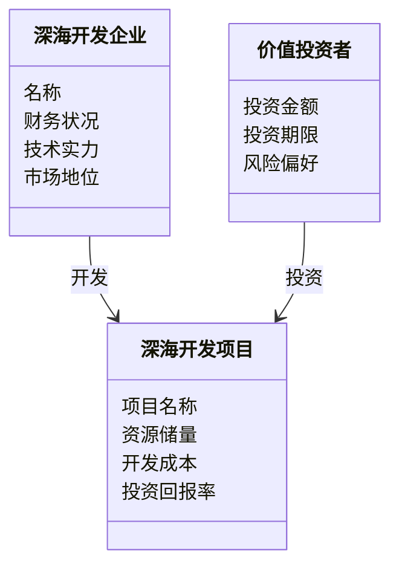
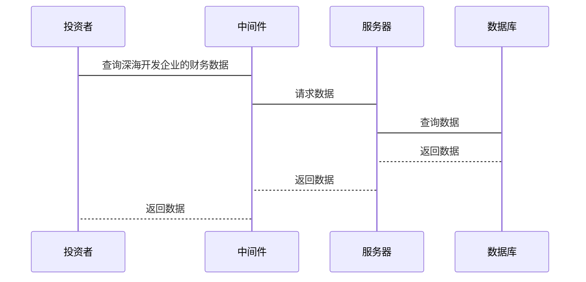

                 


# 价值投资中的深海开发技术前景

## 关键词：价值投资、深海开发、技术前景、投资策略、资源开发、风险评估

## 摘要：  
本文探讨了价值投资在深海开发技术中的应用前景，分析了深海开发技术的现状与未来趋势，结合价值投资的核心理念与方法，提出了两者结合的可行性与潜力。通过数学模型、算法原理、系统架构的设计与实现，详细解读了价值投资在深海开发技术中的具体应用，并通过实际案例分析，展示了如何利用价值投资的方法论来优化深海开发技术的投资决策。本文旨在为投资者和技术开发者提供一份系统性、前瞻性的指南，帮助他们在深海开发技术领域做出更明智的投资决策。

---

## 第一部分: 价值投资与深海开发技术的背景介绍

### 第1章: 价值投资的基本概念与深海开发技术的现状

#### 1.1 价值投资的基本概念

价值投资是一种长期稳健的投资策略，其核心理念是寻找市场低估的资产，通过深入分析企业的基本面，寻找具有持续竞争优势和良好管理的公司，以低于其内在价值的价格买入并长期持有。价值投资强调安全边际、内在价值和市场先生的情绪波动，注重对公司财务状况、行业地位、盈利能力等多方面的分析。

#### 1.2 深海开发技术的现状与前景

深海开发技术是指在海洋深处进行资源勘探、开采和利用的技术，包括深海石油、天然气、矿产资源的开发等。随着全球能源需求的增长和陆上资源的枯竭，深海开发技术的重要性日益凸显。当前，深海开发技术面临的技术挑战包括极端环境适应性、资源勘探的精度提升、开采过程的安全性保障以及环境保护等问题。

#### 1.3 价值投资与深海开发技术的结合

价值投资在深海开发技术领域的应用，主要是通过对深海开发企业的基本面分析，寻找那些具有技术优势、成本优势和市场潜力的企业，以低于其内在价值的价格进行投资。这种结合不仅可以帮助投资者在深海开发技术领域获得超额收益，还可以推动技术创新和产业发展。

---

## 第二部分: 价值投资与深海开发技术的核心概念与联系

### 第2章: 价值投资与深海开发技术的核心概念对比

#### 2.1 价值投资的核心概念与属性特征

| 核心概念       | 属性特征                                                                 |
|----------------|--------------------------------------------------------------------------|
| 内在价值       | 企业的未来现金流的现值，基于财务报表和行业分析得出。                   |
| 安全边际       | 股价与内在价值的差距，提供缓冲以应对市场波动。                         |
| 长期持有       | 投资者应长期持有优质资产，避免频繁交易。                               |
| 市场先生       | 市场情绪波动为价值投资者提供买入机会。                                   |

#### 2.2 深海开发技术的核心概念与属性特征

| 核心概念       | 属性特征                                                                 |
|----------------|--------------------------------------------------------------------------|
| 深海资源勘探   | 利用地震勘探、地质分析等技术寻找海底资源。                               |
| 深海开采技术   | 包括海底钻井、管道铺设等技术，用于开采深海石油、天然气等资源。         |
| 环境保护       | 深海开发过程中需避免对海洋生态系统造成破坏。                             |
| 成本控制       | 深海开发技术的高成本要求企业进行技术创新以降低成本。                     |

#### 2.3 价值投资与深海开发技术的联系与区别

##### 联系

- 价值投资关注企业的内在价值，深海开发技术的核心是企业的技术创新和成本控制，两者都强调基本面分析。
- 价值投资可以帮助投资者在深海开发技术领域找到具有长期增长潜力的企业。
- 深海开发技术的高风险和高回报特性，使得价值投资在其中具有重要作用。

##### 区别

- 价值投资是一种投资策略，而深海开发技术是一种技术领域。
- 价值投资关注企业的整体价值，而深海开发技术关注具体的技术实现和应用。

---

## 第三部分: 价值投资与深海开发技术的算法原理

### 第3章: 价值投资的算法原理与数学模型

#### 3.1 价值投资的数学模型与公式

##### 内在价值计算公式

$$
V = \sum_{t=1}^n \frac{CF_t}{(1 + r)^t}
$$

其中：
- \( V \) 为内在价值
- \( CF_t \) 为第 \( t \) 年的现金流
- \( r \) 为折现率
- \( n \) 为时间跨度

##### 风险评估模型

$$
\text{风险} = \text{标准差} = \sqrt{\frac{1}{n}\sum_{i=1}^n (x_i - \bar{x})^2}
$$

其中：
- \( x_i \) 为每个现金流的值
- \( \bar{x} \) 为现金流的平均值

##### 决策树分析

```mermaid
graph TD
    A[开始] -> B[初始资本]
    B -> C[投资深海开发企业]
    C -> D[高风险，高回报]
    D -> E[成功]
    D -> F[失败]
    E -> G[收益]
    F -> H[损失]
```

#### 3.2 价值投资的算法实现与代码示例

##### 现金流折现模型的 Python 实现

```python
def calculate_intrinsic_value(cash_flows, discount_rate, horizon):
    intrinsic_value = 0
    for t in range(1, horizon + 1):
        cf = cash_flows[t]
        intrinsic_value += cf / (1 + discount_rate) ** t
    return intrinsic_value

# 示例数据
cash_flows = {
    1: 100,
    2: 150,
    3: 200,
    4: 250,
    5: 300
}
discount_rate = 0.1
horizon = 5

iv = calculate_intrinsic_value(cash_flows, discount_rate, horizon)
print(f"内在价值为：{iv}")
```

---

## 第四部分: 系统分析与架构设计方案

### 第4章: 深海开发技术的系统分析与架构设计

#### 4.1 深海开发技术的项目场景介绍

深海开发技术的应用场景包括深海石油和天然气的勘探与开采、海底矿产资源的开发、海洋能的利用等。本文以一个深海油田开发项目为例，探讨价值投资在其中的应用。

#### 4.2 深海开发技术的系统功能设计

##### 领域模型设计



#### 4.3 深海开发技术的系统架构设计

##### 系统架构图


其中：
- 客户端：投资者进行投资决策的界面。
- 中间件：负责数据处理和业务逻辑。
- 服务器：提供深海开发技术的相关数据和服务。
- 数据库：存储企业财务数据、项目信息等。

#### 4.4 深海开发技术的系统接口设计

##### 接口交互流程图



---

## 第五部分: 项目实战

### 第5章: 价值投资在深海开发技术中的项目实战

#### 5.1 项目环境安装

- 操作系统：Windows/Mac/Linux
- Python版本：3.8+
- 工具安装：Python的数学库（NumPy、Pandas）、可视化工具（Matplotlib、Seaborn）、版本控制工具（Git）

#### 5.2 系统核心实现源代码

##### 现金流折现模型的实现

```python
import numpy as np
import pandas as pd

def calculate_intrinsic_value(cash_flows, discount_rate, horizon):
    return np.npv(discount_rate, cash_flows)

# 示例数据
cash_flows = np.array([100, 150, 200, 250, 300])
discount_rate = 0.1
horizon = 5

iv = calculate_intrinsic_value(cash_flows, discount_rate, horizon)
print(f"内在价值为：{iv}")
```

#### 5.3 代码应用解读与分析

通过上述代码，我们可以计算出深海开发企业的内在价值。如果计算出的内在价值高于当前股价，说明该企业具有投资价值。投资者可以据此进行决策。

#### 5.4 实际案例分析

以一家深海石油开采企业为例，假设其未来五年的现金流分别为100、150、200、250、300万元，折现率为10%。根据上述公式计算出的内在价值为：

$$
V = \frac{100}{(1+0.1)^1} + \frac{150}{(1+0.1)^2} + \frac{200}{(1+0.1)^3} + \frac{250}{(1+0.1)^4} + \frac{300}{(1+0.1)^5}
$$

计算结果为：

$$
V ≈ 423.16 \text{万元}
$$

如果该企业的当前股价为300万元，则其具有较高的投资价值。

---

## 第六部分: 最佳实践、小结、注意事项与拓展阅读

### 第6章: 最佳实践与拓展

#### 6.1 最佳实践 tips

- 在进行价值投资时，应结合深海开发技术的行业特点，重点关注企业的技术优势和成本控制能力。
- 深海开发技术具有高风险、高回报的特点，投资者应充分评估风险，并设置合理的止损位。
- 定期跟踪企业的财务状况和项目进展，及时调整投资策略。

#### 6.2 小结

本文通过理论分析和实际案例，探讨了价值投资在深海开发技术中的应用前景。通过数学模型、算法原理和系统架构的设计与实现，详细解读了如何利用价值投资的方法论优化深海开发技术的投资决策。未来，随着深海开发技术的不断发展，价值投资在其中的应用潜力将更加广阔。

#### 6.3 注意事项

- 深海开发技术的高风险性要求投资者具备较强的专业知识和风险承受能力。
- 投资者应密切关注行业动态和技术进步，及时调整投资策略。
- 在进行投资决策时，应结合宏观经济环境和政策支持等因素。

#### 6.4 拓展阅读

- 《The Intelligent Investor》——本杰明·格雷厄姆
- 《深海开发技术与资源勘探》——某某出版社
- 《价值投资与技术创新》——某某作者

---

## 作者：AI天才研究院/AI Genius Institute & 禅与计算机程序设计艺术 /Zen And The Art of Computer Programming

