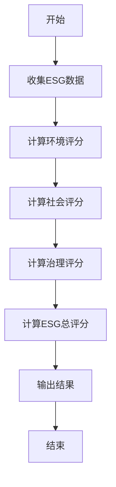
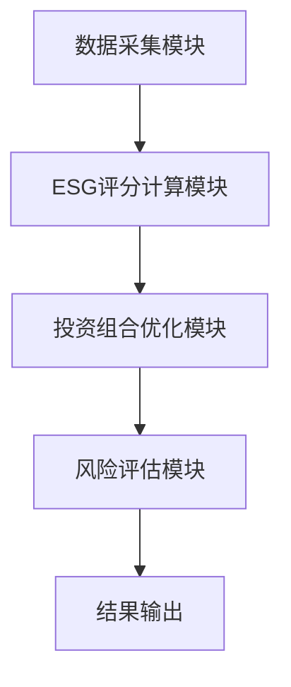

                 


# 价值投资中的环境、社会和治理（ESG）因素

## 关键词：ESG，价值投资，环境因素，社会因素，治理因素

## 摘要：  
环境、社会和治理（ESG）因素在价值投资中的重要性日益凸显。本文从ESG的定义、核心概念、算法原理、系统架构设计、项目实战等多个方面详细分析了ESG在投资中的应用，结合数学公式和流程图，系统性地展示了如何将ESG因素融入投资决策中，帮助投资者更好地识别风险、优化投资组合并实现可持续发展。

---

## 第一部分: 价值投资中的环境、社会和治理（ESG）因素概述

### 第1章: ESG概念与背景介绍

#### 1.1 ESG的核心概念
##### 1.1.1 环境（E）的定义与内涵
环境因素（E）关注企业在环境保护方面的表现，包括能源消耗、碳排放、污染治理等方面。企业的环境表现不仅影响其运营成本，还可能对企业的声誉和长期可持续性产生重大影响。

##### 1.1.2 社会（S）的定义与内涵
社会因素（S）关注企业在社会层面的责任，包括员工权益、社区关系、产品安全、公平对待等方面。企业的社会表现反映了其在社会中的角色和影响力，也影响着企业的品牌形象和社会责任感。

##### 1.1.3 治理（G）的定义与内涵
治理因素（G）关注企业的治理结构和管理能力，包括董事会结构、高管薪酬、股权激励、透明度等方面。良好的治理结构能够有效降低企业风险，提高企业效率和决策质量。

##### 1.1.4 ESG的整合与系统性分析
ESG三要素的整合需要通过系统性分析，将环境、社会和治理因素有机地结合在一起，形成一个完整的评估体系，从而更好地指导投资决策。

#### 1.2 ESG在价值投资中的重要性
##### 1.2.1 ESG投资的历史发展
ESG投资起源于20世纪60年代，随着社会对可持续发展的关注逐渐增加，ESG投资从简单的道德投资发展为一种系统化的投资策略。

##### 1.2.2 ESG与企业长期价值的关系
企业的ESG表现与其长期价值密切相关。良好的ESG表现能够降低企业风险、提升企业声誉、增强客户黏性和员工忠诚度，从而为企业创造更大的价值。

##### 1.2.3 ESG对投资风险的识别与管理
通过分析企业的ESG表现，投资者可以更好地识别和管理投资风险，例如环境风险、社会风险和治理风险。这些风险可能在短期内不明显，但在长期会对企业的价值产生重大影响。

##### 1.2.4 ESG与可持续发展的全球趋势
随着全球可持续发展目标的推进，越来越多的投资者开始关注企业的ESG表现，将ESG因素纳入投资决策中，以实现经济、社会和环境的可持续发展。

---

## 第二部分: ESG的核心概念与联系

### 第2章: ESG核心概念的原理

#### 2.1 ESG核心概念的原理
##### 2.1.1 环境因素的数学模型
环境因素可以通过以下数学模型进行量化评估：
$$
\text{环境评分} = \alpha \times \text{能源消耗} + \beta \times \text{碳排放} + \gamma \times \text{污染治理}
$$
其中，$\alpha$、$\beta$和$\gamma$是权重系数，根据行业特点和投资目标进行调整。

##### 2.1.2 社会因素的属性特征
社会因素可以通过以下指标进行评估：
- 员工满意度
- 社区关系强度
- 产品安全性
- 公平对待程度

##### 2.1.3 治理因素的系统架构
治理因素的系统架构可以通过以下模块进行分析：
1. 董事会结构
2. 高管薪酬
3. 股权激励
4. 透明度

##### 2.1.4 ESG三要素的对比分析
通过对比分析表可以清晰地看出E、S、G三要素的差异和联系：

| **因素** | **定义** | **权重** | **影响**
|----------|----------|----------|----------
| E        | 环境     | 中高     | 能源消耗、碳排放
| S        | 社会     | 中       | 员工权益、社区关系
| G        | 治理     | 高       | 董事会结构、透明度

##### 2.1.5 ESG与企业价值评估的权重分配
在企业价值评估中，ESG因素的权重可以按照以下比例分配：
$$
\text{ESG总评分} = 0.4 \times \text{E} + 0.3 \times \text{S} + 0.3 \times \text{G}
$$

#### 2.2 ESG与可持续发展的全球趋势
通过ER实体关系图可以清晰地看出，ESG三要素与企业绩效之间的关联关系：

```mermaid
erDiagram
    ESG [crow] 组织 : 组织的ESG表现
    组织 [crow] 绩效 : 企业的绩效表现
    绩效 [crow] 风险 : 投资风险
    风险 [crow] 投资决策 : 投资者的决策
```

---

## 第三部分: ESG投资的算法原理

### 第3章: ESG投资的算法原理

#### 3.1 ESG评分模型的数学公式
##### 3.1.1 ESG评分的加权计算公式
$$
\text{ESG评分} = \sum_{i=1}^{n} w_i \times x_i
$$
其中，$w_i$是第$i$个因素的权重，$x_i$是第$i$个因素的评分。

##### 3.1.2 基于ESG的公司评级公式
$$
\text{公司评级} = \frac{\text{ESG评分} + \text{财务表现}}{2}
$$
其中，$\text{财务表现}$包括净利润率、ROE等传统财务指标。

##### 3.1.3 ESG在投资组合中的优化模型
$$
\text{最大化收益} = \sum_{i=1}^{n} w_i \times r_i
$$
$$
\text{最小化风险} = \sum_{i=1}^{n} w_i \times \sigma_i^2
$$
其中，$w_i$是第$i$只股票的权重，$r_i$是第$i$只股票的预期收益率，$\sigma_i^2$是第$i$只股票的收益率方差。

#### 3.2 ESG评分算法的流程图


---

## 第四部分: ESG投资的系统架构设计

### 第4章: ESG投资的系统架构设计

#### 4.1 问题场景介绍
##### 4.1.1 ESG投资的核心问题
投资者需要在考虑ESG因素的基础上，优化投资组合，降低风险并提高收益。

##### 4.1.2 投资决策中的ESG因素整合
通过系统化的ESG评分和分析，将ESG因素与传统财务指标相结合，形成综合的投资决策依据。

##### 4.1.3 系统设计的目标与范围
设计一个能够实时收集、处理和分析ESG数据的系统，提供ESG评分、风险评估和投资组合优化的解决方案。

#### 4.2 系统功能设计
##### 4.2.1 数据采集模块
- 数据来源：公开企业数据、ESG评级机构数据
- 数据处理：清洗、转换、存储

##### 4.2.2 ESG评分计算模块
- 环境评分计算
- 社会评分计算
- 治理评分计算
- 综合评分计算

##### 4.2.3 投资组合优化模块
- 优化目标：最大化收益、最小化风险
- 优化算法：均值-方差优化、风险管理模型

##### 4.2.4 风险评估模块
- 风险识别：环境风险、社会风险、治理风险
- 风险量化：VaR、CVaR

#### 4.3 系统架构图


---

## 第五部分: ESG投资的项目实战

### 第5章: ESG投资的项目实战

#### 5.1 环境数据分析
##### 5.1.1 环境数据的收集与处理
- 数据来源：企业年报、环境报告
- 数据处理：清洗、转换、分析

##### 5.1.2 环境评分的计算与分析
- 计算公式：
$$
\text{环境评分} = \alpha \times \text{能源消耗} + \beta \times \text{碳排放} + \gamma \times \text{污染治理}
$$

##### 5.1.3 环境风险的量化评估
- 风险评估模型：
$$
\text{环境风险} = \text{环境评分} \times \text{行业风险}
$$

#### 5.2 社会因素评估
##### 5.2.1 社会数据的获取与处理
- 数据来源：企业社会责任报告、员工调查
- 数据处理：清洗、分析、存储

##### 5.2.2 社会评分的计算与分析
- 计算公式：
$$
\text{社会评分} = \alpha \times \text{员工满意度} + \beta \times \text{社区关系强度}
$$

##### 5.2.3 社会风险的量化评估
- 风险评估模型：
$$
\text{社会风险} = \text{社会评分} \times \text{行业风险}
$$

#### 5.3 治理结构优化
##### 5.3.1 治理数据的收集与处理
- 数据来源：企业治理报告、董事会结构
- 数据处理：清洗、分析、存储

##### 5.3.2 治理评分的计算与分析
- 计算公式：
$$
\text{治理评分} = \alpha \times \text{董事会结构} + \beta \times \text{透明度}
$$

##### 5.3.3 治理优化的建议与实施
- 优化建议：优化董事会结构、提高透明度、引入股权激励

---

## 总结与展望

### 总结
通过本文的详细分析，我们可以看到，ESG因素在价值投资中的重要性日益增加。通过系统化的ESG评分和分析，投资者可以更好地识别和管理风险，优化投资组合，并实现可持续发展。

### 展望
未来，随着技术的进步和数据的完善，ESG投资将更加精准和高效。投资者需要不断学习和适应新的技术和方法，以更好地应对市场变化和挑战。

---

## 作者

**作者：AI天才研究院/AI Genius Institute & 禅与计算机程序设计艺术 /Zen And The Art of Computer Programming**

---

以上是文章的详细内容，涵盖ESG在价值投资中的各个方面，从理论到实践，从概念到算法，从系统设计到项目实战，为投资者提供了全面的指导和参考。

