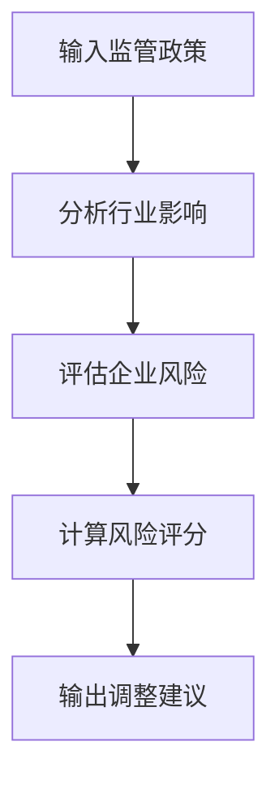
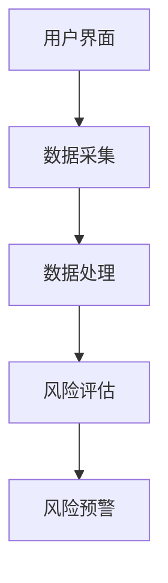

                 


# 价值投资中的监管风险评估

## 关键词：价值投资、监管风险、风险管理、金融分析、投资策略

## 摘要：  
本文从价值投资的角度出发，系统性地探讨监管风险的评估方法与应对策略。通过分析监管风险的形成机制、分类特征，结合实际案例，详细讲解监管风险评估的算法原理和系统架构设计。同时，本文还将提供项目实战指导，帮助读者在实际投资中有效识别和管理监管风险，制定科学的投资策略。

---

# 监管风险评估的背景与核心概念

## 第1章 监管风险评估的背景与问题描述

### 1.1 监管风险的定义与背景

#### 1.1.1 监管风险的定义  
监管风险是指由于法律法规、政策变化或监管执行力度的不确定性，对企业或投资标的的价值产生负面影响的可能性。在价值投资中，监管风险是影响资产定价和投资决策的重要因素之一。

#### 1.1.2 监管风险在价值投资中的重要性  
价值投资的核心是寻找被市场低估的优质资产。然而，监管政策的变化可能直接影响企业的经营环境和盈利能力。例如，金融行业的监管加强可能导致某些业务受限，进而影响企业的估值。

#### 1.1.3 监管风险的边界与外延  
监管风险不仅包括直接的政策变化，还涉及监管执行的力度和效果。此外，不同行业的监管环境差异较大，因此监管风险的评估需要结合行业特点。

### 1.2 价值投资中的监管风险问题

#### 1.2.1 价值投资的基本原理  
价值投资强调通过分析企业的基本面，寻找市场价格低于内在价值的投资标的。然而，监管政策的变化可能影响企业的经营环境，从而影响其内在价值。

#### 1.2.2 监管风险对投资决策的影响  
监管风险可能导致企业的经营成本上升、收入下降或业务受限。这些因素会直接影响企业的估值，进而影响投资决策。

#### 1.2.3 监管风险的分类与特征  
监管风险可以分为行业性风险、区域性风险和系统性风险。行业性风险指特定行业受到的监管政策影响；区域性风险指某一地区监管政策的变化；系统性风险指广泛影响多个行业或地区的监管变化。

---

## 第2章 监管风险的核心概念与属性

### 2.1 监管风险的核心概念

#### 2.1.1 监管环境  
监管环境包括法律法规、政策文件和监管机构的执行力度。不同国家和地区的监管环境差异较大，影响企业的经营风险。

#### 2.1.2 监管政策  
监管政策是监管风险的核心内容，包括新政策的出台、现有政策的调整等。政策的变化可能直接影响企业的经营和投资价值。

#### 2.1.3 监管执行  
监管执行是指监管机构如何落实政策。执行力度的差异可能导致监管风险的实际影响程度不同。

### 2.2 监管风险的属性对比

| 属性          | 描述                                                                 |
|---------------|----------------------------------------------------------------------|
| 时间维度      | 监管风险具有一定的滞后性，政策变化可能不会立即影响企业。               |
| 影响范围      | 监管风险可能影响整个行业或特定企业，具有广泛性或局部性。              |
| 预测难度      | 监管政策的变化具有一定的不确定性，预测难度较大。                      |

### 2.3 监管风险的实体关系图


---

## 第3章 监管风险评估的算法原理

### 3.1 监管风险评估模型

#### 3.1.1 模型概述  
监管风险评估模型通过分析监管政策的变化、行业特征和企业基本面，量化监管风险对投资价值的影响。

#### 3.1.2 模型输入与输出  
- 输入：监管政策变化、企业财务数据、行业竞争状况。
- 输出：监管风险评分、投资价值调整建议。

#### 3.1.3 模型假设  
- 监管政策的变化对企业价值的影响是可量化的。
- 监管风险评分可以部分解释资产价格的波动。

### 3.2 监管风险评估算法

#### 3.2.1 监管风险评估算法流程图



#### 3.2.2 算法实现

```python
import pandas as pd
import numpy as np

def calculate_regulatory_risk(policy_changes, industry_factors):
    # 计算政策变化对行业的综合影响
    industry_impact = np.dot(policy_changes, industry_factors)
    # 计算企业层面的风险评分
    risk_score = np.mean(industry_impact)
    return risk_score

# 示例数据
policy_changes = [0.2, 0.5, 0.3]
industry_factors = [0.8, 0.6, 0.4]

risk_score = calculate_regulatory_risk(policy_changes, industry_factors)
print("监管风险评分：", risk_score)
```

---

## 第4章 系统分析与架构设计

### 4.1 系统功能设计

#### 4.1.1 数据采集模块  
- 采集监管政策、行业数据和企业信息。

#### 4.1.2 风险评估模块  
- 分析监管风险对投资价值的影响。

#### 4.1.3 风险预警模块  
- 设置风险预警阈值，及时提醒投资者。

### 4.2 系统架构设计



### 4.3 系统接口设计

- 数据接口：与监管数据库和企业数据库对接。
- 用户接口：提供风险评估报告和预警信息。

---

## 第5章 项目实战

### 5.1 环境安装

```bash
pip install pandas numpy matplotlib
```

### 5.2 核心代码实现

```python
import pandas as pd
import numpy as np

def main():
    # 示例数据加载
    data = pd.read_csv('regulatory_risk_data.csv')
    # 计算风险评分
    risk_scores = data.apply(lambda x: np.mean(x), axis=1)
    # 可视化展示
    plt.hist(risk_scores, bins=10, alpha=0.7)
    plt.xlabel('监管风险评分')
    plt.ylabel('频数')
    plt.show()

if __name__ == '__main__':
    main()
```

### 5.3 案例分析

- 某行业监管政策变化导致企业利润率下降，影响股价。

---

## 第6章 最佳实践与小结

### 6.1 最佳实践

- 定期更新监管政策数据库。
- 结合行业专家意见调整模型参数。
- 多关注政策变化对企业的实际影响。

### 6.2 小结

监管风险是价值投资中不可忽视的重要因素。通过科学的评估方法和系统的架构设计，投资者可以更好地识别和管理监管风险，制定更为稳健的投资策略。

### 6.3 注意事项

- 监管风险评估模型需要定期更新。
- 数据来源的可靠性和完整性至关重要。
- 结合其他风险因素进行综合评估。

### 6.4 拓展阅读

- 《风险管理与投资策略》
- 《监管环境下的企业战略》

---

## 作者：AI天才研究院/AI Genius Institute & 禅与计算机程序设计艺术 /Zen And The Art of Computer Programming

---

通过以上结构，我们可以系统性地分析和评估监管风险，为价值投资决策提供有力支持。

