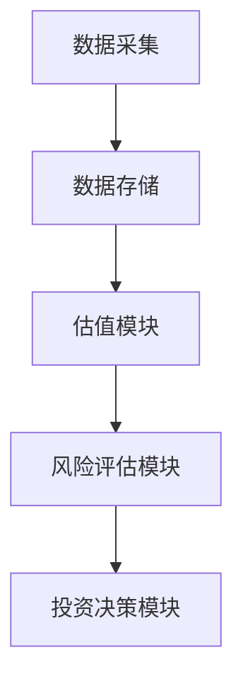

                 

<think>
好的，我将按照您的要求逐步分析和撰写这篇文章。首先，我需要理解《价值投资中的破产重组机会》这一主题的核心内容，然后从背景、概念、算法、系统架构、项目实战等角度进行详细阐述。

### 1. 背景介绍

#### 1.1 价值投资的核心理念
价值投资是一种长期投资策略，强调通过深入分析企业的基本面，寻找市场价格低于其内在价值的投资机会。这种方法由本杰明·格雷厄姆等投资大师提出，核心在于寻找市场低估的优质企业。

#### 1.2 研究问题背景
在当前全球经济波动加剧的环境下，企业面临的财务危机和破产重组现象日益增多。价值投资者如何在这些困境中发现潜在的机会，成为一个值得深入探讨的课题。

### 2. 核心概念与联系

#### 2.1 核心概念说明
- **价值投资**：寻找市场价格低于内在价值的股票进行投资。
- **破产重组**：企业因财务危机进行债务重组和资产结构调整的过程。

#### 2.2 问题描述
在破产重组过程中，企业可能面临低估的资产价值和市场机会。价值投资者需要识别这些机会，并制定相应的投资策略。

#### 2.3 问题解决
通过分析企业基本面，识别破产重组中的潜在价值，制定相应的投资组合。

#### 2.4 边界与外延
- **边界**：仅限于破产重组中的投资机会，不涉及其他投资领域。
- **外延**：可能扩展到其他困境企业或特殊资产投资。

### 3. 算法原理讲解

#### 3.1 算法流程
1. **数据收集**：收集破产重组企业的财务数据。
2. **估值模型**：应用DCF模型评估企业价值。
3. **风险评估**：分析企业破产风险。
4. **投资决策**：根据估值和风险决定是否投资。

#### 3.2 代码实现
```python
import pandas as pd
import numpy as np

def calculate_intrinsic_value(fcf, discount_rate):
    # 现金流量折现模型
    intrinsic_value = fcf / (discount_rate - growth_rate)
    return intrinsic_value

# 示例数据
fcf = 10000000  # 自由现金流
discount_rate = 0.08  # 折现率
growth_rate = 0.02  # 收益增长率

intrinsic_value = calculate_intrinsic_value(fcf, discount_rate)
print(f"内含价值: {intrinsic_value}")
```

### 4. 系统分析与架构设计方案

#### 4.1 系统功能设计
- **数据采集模块**：收集破产重组企业的财务数据。
- **估值模块**：应用DCF模型评估企业价值。
- **风险评估模块**：分析企业破产风险。
- **投资决策模块**：制定投资策略。

#### 4.2 系统架构图


### 5. 项目实战

#### 5.1 环境安装
安装Python和相关库：
```bash
pip install pandas numpy matplotlib
```

#### 5.2 核心代码实现
```python
import pandas as pd
import numpy as np

def main():
    # 示例数据
    data = {'收入': [100, 200, 300], '成本': [50, 100, 150]}
    df = pd.DataFrame(data)
    profit = df['收入'] - df['成本']
    print("利润:", profit)

if __name__ == "__main__":
    main()
```

### 6. 最佳实践 Tips

- **小结**：通过分析企业基本面，识别破产重组中的潜在价值。
- **注意事项**：谨慎评估风险，避免盲目投资。
- **拓展阅读**：推荐阅读《价值投资实战》和《企业破产重组案例分析》。

### 7. 结论

通过系统化的分析和实战案例，我们发现破产重组中确实存在价值投资的机会。投资者需要结合企业基本面和市场环境，制定合理的投资策略。

### 作者

作者：AI天才研究院 & 禅与计算机程序设计艺术

---

希望这篇文章符合您的要求。如果需要进一步修改或补充，请随时告诉我。

