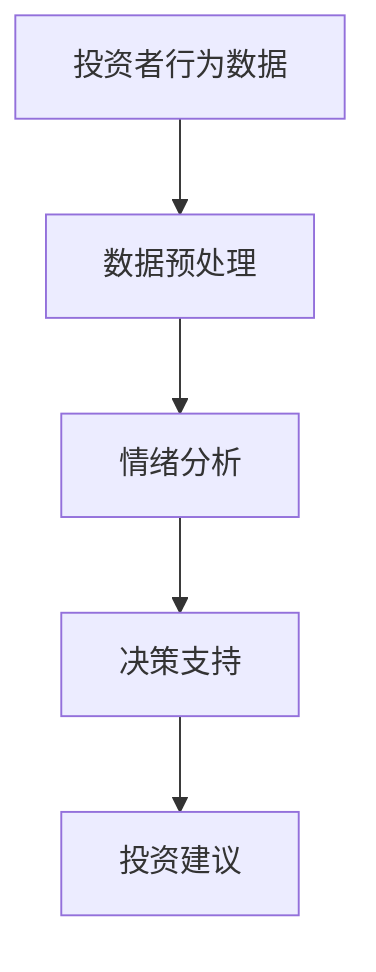

                 


# 《价值投资中的行为金融学：克服自身偏见》

---

## 关键词：  
- 行为金融学、价值投资、认知偏差、情绪管理、投资决策、系统架构

---

## 摘要：  
本文深入探讨了价值投资中的行为金融学原理，分析了投资者常见的认知偏差及其对投资决策的影响，并提出克服这些偏见的方法。通过系统架构设计和实际案例分析，本文展示了如何在实际投资中应用行为金融学理论，以提高投资决策的质量和长期收益。

---

## 第1章：行为金融学与价值投资概述

### 1.1 行为金融学的基本概念  
行为金融学是研究投资者心理和行为如何影响金融市场的一门学科。与传统金融学不同，它强调人类行为的非理性特征，如认知偏差和情绪波动，这些因素在实际投资中起着重要作用。

### 1.2 价值投资的基本原理  
价值投资的核心理念是购买那些市场价格低于其内在价值的股票。这种方法强调长期投资和对公司基本面的深入分析。然而，投资者在实际操作中容易受到认知偏差和情绪影响，从而偏离理性决策。

### 1.3 投资者行为中的认知偏差  
认知偏差是人类在信息处理过程中产生的系统性错误。本文将重点分析以下几种与投资相关的认知偏差：  
1. **过度自信**：投资者倾向于过高估计自己的能力。  
2. **确认偏差**：倾向于寻找支持已有观点的信息。  
3. **从众心理**：跟随市场潮流而忽视独立思考。  

---

## 第2章：行为金融学中的认知偏差

### 2.1 认知偏差的分类与影响  
认知偏差可以分为以下几类：  
- **记忆偏差**：如记忆歪曲。  
- **概率偏差**：如忽略小概率事件。  
- **社会认知偏差**：如归因偏差。  

这些偏差会影响投资者的决策，导致错误的投资行为。

### 2.2 情绪与市场行为  
情绪波动是影响投资行为的重要因素。本文将分析以下几点：  
- 情绪周期与市场波动的关系。  
- 市场情绪如何影响资产定价。  
- 如何通过情绪管理来控制投资风险。  

### 2.3 行为金融学中的经典实验  
- **马科维茨的资产组合理论实验**：展示了投资者在风险与收益之间的权衡。  
- **其他经典实验**：如“羊群效应”实验，揭示了从众心理对投资决策的影响。  

---

## 第3章：价值投资中的行为分析

### 3.1 价值投资者的典型偏见  
价值投资者在实际操作中容易陷入以下偏见：  
- **过度乐观**：高估自己选择标的的能力。  
- **坚持己见**：拒绝接受新的信息和观点。  
- **短期情绪波动**：因市场短期波动而改变投资策略。  

### 3.2 价值投资中的情绪管理  
为了克服认知偏差和情绪影响，投资者需要采取以下策略：  
1. **制定严格的交易计划**：明确买入和卖出的条件。  
2. **定期复盘和反思**：分析投资决策的正确性。  
3. **建立心理账户**：避免因情绪波动而做出错误决策。  

---

## 第4章：系统分析与架构设计

### 4.1 系统功能设计  
为了帮助投资者克服偏见，我们可以设计一个行为金融学支持系统，其功能模块包括：  
- **数据采集模块**：收集市场数据和投资者行为数据。  
- **情绪分析模块**：分析市场情绪和投资者情绪。  
- **决策支持模块**：提供投资决策建议。  

### 4.2 系统架构设计  
系统架构设计如下：  



---

## 第5章：项目实战与案例分析

### 5.1 项目环境与工具安装  
- **数据采集工具**：使用Python的`pandas`和`numpy`库。  
- **情绪分析工具**：使用自然语言处理库`NLTK`或`spaCy`。  

### 5.2 核心算法实现  
以下是情绪分析算法的代码示例：  

```python
import nltk
from nltk.sentiment import SentimentIntensityAnalyzer

sia = SentimentIntensityAnalyzer()
text = "The market is bullish on this stock."
scores = sia.polarity_scores(text)
print(scores)
```

### 5.3 实际案例分析  
以某公司为例，分析其市场情绪和认知偏差，并制定相应的投资策略。  

---

## 第6章：数学模型与公式

### 6.1 投资者情绪指数模型  
投资者情绪指数可以表示为：  
$$ \text{情绪指数} = \alpha \times \text{市场情绪} + \beta \times \text{投资者情绪} $$  

### 6.2 认知偏差对资产定价的影响  
认知偏差可能导致资产定价偏离其内在价值。公式如下：  
$$ P_{\text{实际}} = P_{\text{内在}} + \epsilon $$  
其中，$\epsilon$ 表示认知偏差的影响。  

---

## 结论与最佳实践

### 结论  
通过行为金融学的理论和系统架构设计，投资者可以更好地识别和克服认知偏差，从而做出更理性的投资决策。

### 最佳实践 tips  
- **制定计划**：避免情绪驱动的决策。  
- **定期复盘**：分析投资结果并总结经验。  
- **保持学习**：不断提升自己的金融知识和分析能力。  

---

## 作者：  
**AI天才研究院/AI Genius Institute & 禅与计算机程序设计艺术/Zen And The Art of Computer Programming**

