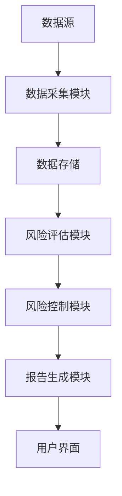
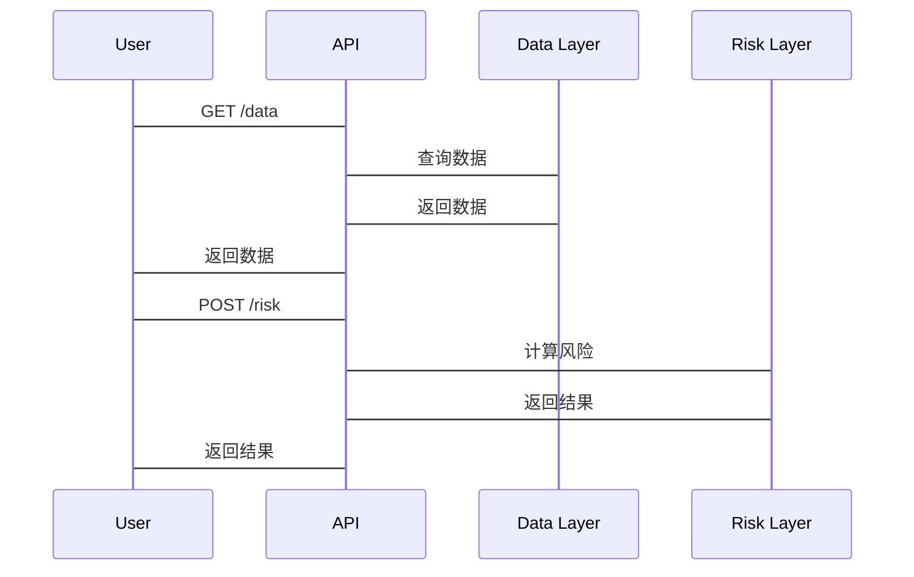

                 


# 价值投资中的风险管理策略

> **关键词**：价值投资、风险管理、数学模型、算法实现、系统架构、投资策略  
> 
> **摘要**：本文系统地探讨了价值投资中的风险管理策略，从基础概念到高级算法实现，再到系统架构设计，全面解析了风险管理在价值投资中的重要性及其具体应用。文章通过详细分析风险的分类、量化方法、控制策略以及数学模型，结合实际案例和代码实现，为读者提供了一套完整的风险管理解决方案。

---

## 第1章: 价值投资与风险管理概述

### 1.1 价值投资的基本概念

#### 1.1.1 价值投资的定义与核心理念
价值投资是一种以基本面分析为基础的投资策略，其核心理念是通过分析企业的内在价值，寻找被市场低估的投资标的。价值投资强调长期持有优质资产，追求安全边际和长期稳定的收益。

**核心概念对比表：**

| 比较维度 | 价值投资 | 其他投资策略 |
|----------|----------|--------------|
| 核心理念 | 基于内在价值 | 基于技术分析或短期波动 |
| 时间跨度 | 长期持有 | 短期交易为主 |
| 风险控制 | 强调安全边际 | 风险暴露较高 |

#### 1.1.2 价值投资与其它投资策略的区别
价值投资与其他策略（如趋势投资、套利策略）的区别主要体现在对投资标的的选择标准和投资期限上。价值投资者更关注企业的基本面，而趋势投资者则更关注市场的短期波动。

#### 1.1.3 价值投资在现代金融中的地位
尽管价值投资在短期内可能表现不佳，但其长期收益稳定，尤其在市场波动加剧时表现出更强的防御性。近年来，随着量化工具的普及，价值投资与其他技术手段的结合越来越紧密。

### 1.2 风险管理的重要性

#### 1.2.1 风险管理的定义与内涵
风险管理是指通过识别、评估和控制风险，以最小化投资组合的损失可能性。在价值投资中，风险管理是确保投资组合稳健增长的关键环节。

#### 1.2.2 风险管理在价值投资中的作用
价值投资强调安全边际，而安全边际的核心就是风险管理。通过科学的风险管理，投资者可以在市场波动中保持投资组合的稳定性。

#### 1.2.3 风险管理与投资收益的关系
风险管理并不是简单的“规避风险”，而是通过合理配置资产和控制风险敞口，实现收益与风险的最佳匹配。有效的风险管理能够帮助投资者在市场下跌时减少损失，在市场上涨时锁定收益。

### 1.3 价值投资中的风险管理策略

#### 1.3.1 风险管理的基本原则
- 分散投资：避免过度集中于单一资产或行业。
- 安全边际：买入价格低于内在价值。
- 持有优质资产：选择具有强大护城河的企业。

#### 1.3.2 价值投资中的风险管理框架
风险管理框架包括以下几个步骤：
1. **风险识别**：识别投资组合中的潜在风险。
2. **风险评估**：量化风险的可能性和影响程度。
3. **风险控制**：通过调整投资组合来降低风险。

#### 1.3.3 风险管理与投资决策的关系
风险管理贯穿投资决策的全过程，从标的筛选到仓位配置，再到日常监控，都是风险管理的重要环节。

---

## 第2章: 价值投资中的风险管理策略

### 2.1 风险的分类与识别

#### 2.1.1 市场风险
市场风险是指由于市场整体波动导致投资组合价值下降的风险。例如，经济衰退或市场恐慌可能导致股票价格大幅下跌。

#### 2.1.2 信用风险
信用风险主要指债券发行人违约的风险。在价值投资中，选择具有 strong balance sheet（强大资产负债表）的企业可以有效降低信用风险。

#### 2.1.3 流动性风险
流动性风险是指投资者在需要资金时无法快速变现资产的风险。选择流动性较好的资产可以有效降低流动性风险。

#### 2.1.4 操作风险
操作风险是指由于投资者的操作失误或系统故障导致的损失风险。例如，交易订单错误或系统故障可能导致重大损失。

### 2.2 风险的量化与评估

#### 2.2.1 风险的量化方法
- **VaR（Value at Risk）**：衡量投资组合在给定置信水平下的最大可能损失。
- **CVaR（Conditional Value at Risk）**：衡量在VaR水平下的平均损失。

#### 2.2.2 风险的评估指标
- **波动率**：衡量资产价格的波动程度。
- **贝塔系数**：衡量资产相对于市场的波动性。
- **夏普比率**：衡量投资组合的风险调整后收益。

#### 2.2.3 风险的评估模型
- **CAPM（资本资产定价模型）**：用于计算资产的预期收益和系统性风险。
- **APT（套利定价理论）**：用于分析资产的风险和收益。

### 2.3 风险的控制与应对

#### 2.3.1 风险的分散策略
通过投资于不同资产类别、行业和地区的标的，可以有效降低市场风险和行业风险。

#### 2.3.2 风险的对冲策略
使用衍生品（如期权、期货）对冲特定风险，例如对冲汇率风险或市场波动风险。

#### 2.3.3 风险的预警机制
建立风险预警指标和触发条件，及时发现和应对潜在风险。

---

## 第3章: 风险管理的数学模型与算法

### 3.1 风险评估的数学模型

#### 3.1.1 风险值（VaR）模型
VaR模型用于计算投资组合在给定置信水平下的最大可能损失。例如，95%置信水平下的VaR表示在95%的概率下，投资组合的最大损失不超过VaR值。

**数学公式**：
$$ VaR = \text{quantile}(p) $$

其中，p为置信水平，quantile为分位数函数。

#### 3.1.2 风险调整后收益（RAROC）模型
RAROC（Risk-Adjusted Return on Capital）是将投资收益与风险成本相结合的指标，用于衡量风险调整后的收益。

**数学公式**：
$$ RAROC = \frac{R - R_f}{R_c} $$
其中，R为投资收益，R_f为无风险利率，R_c为风险成本。

#### 3.1.3 风险中性定价模型
风险中性定价模型假设市场参与者是风险中性的，即他们对风险的偏好通过无风险利率进行补偿。

**数学公式**：
$$ E[\text{payoff}] = e^{-rT} \cdot \mathbb{E}[P_T] $$

其中，r为无风险利率，T为时间期限，P_T为到期时的支付。

### 3.2 风险管理的算法原理

#### 3.2.1 方差-协方差矩阵的构建
方差-协方差矩阵用于衡量资产之间的相关性及其波动性。

**代码实现示例**：
```python
import numpy as np

# 假设收益率矩阵为returns
cov_matrix = np.cov(returns)
```

#### 3.2.2 风险因子的提取与分析
通过主成分分析（PCA）可以提取主要风险因子，降低维度。

**代码实现示例**：
```python
from sklearn.decomposition import PCA

pca = PCA(n_components=3)
principal_components = pca.fit_transform(returns)
```

#### 3.2.3 风险模型的优化与调整
使用优化算法（如均值-方差优化）调整投资组合，以最小化风险或最大化收益。

**代码实现示例**：
```python
import scipy.optimize as optimize

def objective_function(weights, returns, risk_aversion):
    portfolio_variance = np.dot(weights, np.dot(returns, weights))
    return risk_aversion * portfolio_variance - np.dot(weights, returns.mean())

# 约束条件：权重之和为1
def constraint(weights):
    return np.sum(weights) - 1

weights = optimize.minimize(objective_function, np.ones(len(returns)) / len(returns), 
                            args=(returns, 1)).x
```

---

## 第4章: 风险管理的系统架构与设计

### 4.1 系统功能模块设计

#### 4.1.1 数据采集模块
负责收集市场数据、财务数据等。

#### 4.1.2 风险评估模块
基于数学模型计算风险指标。

#### 4.1.3 风险控制模块
根据风险评估结果调整投资组合。

#### 4.1.4 报告生成模块
生成风险评估报告和投资建议。

### 4.2 系统架构设计

#### 4.2.1 分层架构设计
- 数据层：数据存储和访问。
- 应用层：风险管理算法实现。
- 展示层：用户界面和报告展示。

#### 4.2.2 系统架构图


### 4.3 系统接口设计

#### 4.3.1 API接口
- GET /data：获取市场数据。
- POST /risk：提交风险评估请求。

#### 4.3.2 接口交互图


---

## 第5章: 项目实战

### 5.1 环境搭建

#### 5.1.1 安装Python环境
安装Anaconda或Miniconda，包含Python和常用数据科学库。

#### 5.1.2 安装依赖库
```bash
pip install numpy pandas scipy matplotlib
```

### 5.2 系统核心实现源代码

#### 5.2.1 数据处理代码
```python
import pandas as pd
import numpy as np

# 读取数据
data = pd.read_csv('market_data.csv')
returns = data.pct_change().dropna()
```

#### 5.2.2 风险评估代码
```python
import scipy.optimize as optimize

def portfolio_risk(weights, returns):
    return np.dot(weights.T, np.dot(returns, weights))

# 均值-方差优化
mean_return = returns.mean().values
cov_matrix = returns.cov().values

def objective_function(weights):
    return portfolio_risk(weights, cov_matrix)

# 约束条件
def constraint(weights):
    return np.sum(weights) - 1

weights = optimize.minimize(objective_function, np.ones(len(weights)) / len(weights),
                            method='SLSQP', constraints=[{'type': 'eq', 'fun': constraint}]).x

print(weights)
```

---

## 第6章: 最佳实践与总结

### 6.1 小结
价值投资中的风险管理是确保投资组合稳健增长的关键。通过科学的数学模型和系统架构设计，投资者可以更好地控制风险，实现长期收益。

### 6.2 注意事项
- 风险管理不是简单的“规避风险”，而是要在收益与风险之间找到最佳平衡点。
- 需要定期监控和调整投资组合，以应对市场变化。

### 6.3 拓展阅读
- 《The Intelligent Investor》
- 《Portfolio Management for Dummies》
- 《Risk Management in Financial Institutions》

---

## 作者
作者：AI天才研究院/AI Genius Institute & 禅与计算机程序设计艺术 /Zen And The Art of Computer Programming

---

**声明**：本文内容基于技术原理和实践编写，旨在提供风险管理策略的系统性分析。实际投资需结合具体市场环境和专业建议，本文不构成投资建议。

