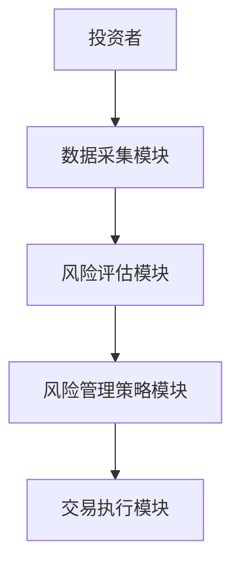

                 


# 价值投资中的风险管理：如何降低损失

## 关键词：价值投资、风险管理、风险度量、投资策略、风险管理方法

## 摘要：  
价值投资是一种长期投资策略，强调以低于内在价值的价格购买优质资产。然而，投资过程中不可避免地会面临各种风险，如市场波动、公司基本面变化等。风险管理是价值投资中不可或缺的一部分，旨在降低潜在损失并确保投资组合的稳定性。本文将从风险管理的核心概念、策略、系统分析、项目实战等多个角度，详细探讨如何在价值投资中有效管理风险，降低损失。

---

# 引言

## 1.1 价值投资的基本概念  
价值投资是由本杰明·格雷厄姆提出的投资理念，强调以低于公平价值的价格购买优质资产，并长期持有。其核心在于识别市场低估的公司，并在市场波动中逐步积累财富。然而，价值投资并非没有风险，市场波动、公司基本面变化等因素都可能影响投资结果。

## 1.2 风险管理的重要性  
风险管理是投资过程中不可忽视的一环。无论市场如何波动，有效的风险管理能够帮助投资者避免重大损失，确保投资组合的稳定性。对于价值投资者而言，风险管理不仅是控制损失的工具，更是实现长期收益的重要保障。

---

# 第二部分: 价值投资中的风险管理基础

## 2.1 现代投资组合理论  
现代投资组合理论（MPT）由哈里·马科维茨提出，强调通过分散投资来降低风险。以下是其核心原理：  
- **有效前沿**：在给定风险水平下，选择能够提供最高预期收益的投资组合。  
- **均值-方差优化**：通过优化投资组合的收益与风险，找到最优配置。  

公式：  
$$ \text{风险} = \sqrt{\sum_{i=1}^{n} w_i^2 \sigma_i^2 + 2 \sum_{i<j} w_i w_j \sigma_i \sigma_j \rho_{i,j}} $$  

其中，$w_i$为资产$i$的权重，$\sigma_i$为资产$i$的波动率，$\rho_{i,j}$为资产$i$和$j$的相关系数。

---

## 2.2 风险度量与评估  

### 2.2.1 VaR（Value at Risk）  
VaR是指在给定置信水平下，投资组合的最大可能损失。例如，95%置信水平下的VaR意味着在95%的情况下，损失不会超过该值。  

### 2.2.2 CVaR（Conditional Value at Risk）  
CVaR是VaR的补充，表示在VaR水平上的平均损失，用于衡量尾部风险。  

公式：  
$$ \text{CVaR} = \frac{1}{1-\alpha} \int_{\alpha}^{1} \text{VaR}(p) dp $$  

---

# 第三部分: 价值投资中的风险管理核心概念

## 3.1 风险管理的核心概念与联系  

### 3.1.1 风险与收益的平衡  
在价值投资中，风险与收益是密不可分的。投资者需要在追求高收益的同时，控制潜在风险。  

### 3.1.2 风险管理中的心理因素  
投资者的心理偏差（如过度自信、损失厌恶）会影响决策，进而影响风险管理效果。  

---

## 3.2 核心概念属性特征对比表格  

| 风险管理方法 | 优点 | 缺点 |
|--------------|------|------|
| 分散投资      | 降低系统性风险 | 无法完全消除特定风险 |
| 止损策略      | 控制损失 | 可能错过反弹机会 |
| 对冲策略      | 减少波动性 | 成本较高 |

---

# 第四部分: 价值投资中的风险管理策略

## 4.1 防御性策略  

### 4.1.1 设置止损点  
止损点是投资者在市场下跌到一定程度时卖出资产的界限。例如，若买入价格为$100，止损点设为$90，则在价格跌至$90时卖出。  

### 4.1.2 评估止损的有效性  
通过历史数据分析和情景模拟，验证止损策略的有效性。  

---

## 4.2 对冲策略  

### 4.2.1 利用衍生品对冲  
通过期货、期权等衍生品，对冲市场波动带来的风险。  

### 4.2.2 风险中性组合  
构建一个风险中性组合，使整体投资组合的风险降至最低。  

---

# 第五部分: 系统分析与架构设计

## 5.1 价值投资风险管理系统的架构  

### 5.1.1 系统功能设计  
- 数据采集：收集市场数据、公司基本面信息等。  
- 风险评估：计算VaR、CVaR等风险指标。  
- 策略执行：根据风险评估结果，执行风险管理策略。  

### 5.1.2 系统架构图  



---

## 5.2 系统接口设计  

### 5.2.1 数据接口  
- 输入：市场数据、资产价格、公司财报等。  
- 输出：风险评估结果、策略建议。  

---

# 第六部分: 项目实战

## 6.1 环境安装  

### 6.1.1 安装Python环境  
```bash
pip install numpy pandas matplotlib
```

---

## 6.2 核心实现  

### 6.2.1 计算VaR  

```python
import numpy as np

# 假设资产收益
returns = np.array([0.05, 0.03, -0.02, 0.01, -0.04])

# 计算VaR（假设95%置信水平）
sorted_returns = np.sort(returns)
VaR = sorted_returns[int(0.05 * len(sorted_returns))]
print("VaR:", VaR)
```

---

## 6.3 案例分析  

### 6.3.1 回测策略  
通过回测分析，验证风险管理策略的有效性。例如，使用止损策略在历史市场波动中减少损失。  

---

# 结论

## 7.1 最佳实践  

### 7.1.1 风险管理注意事项  
- 定期审查和调整风险管理策略。  
- 结合市场环境灵活应用风险管理工具。  

## 7.2 未来展望  
随着人工智能和大数据技术的发展，风险管理将更加智能化和个性化。投资者可以利用这些技术进一步优化风险管理策略，提升投资效果。

---

# 作者：AI天才研究院 & 禅与计算机程序设计艺术

---

通过以上思考和分析，我们系统地探讨了价值投资中的风险管理，从理论到实践，为投资者提供了降低损失的有效方法。希望这篇文章能为价值投资者在风险管理方面提供有价值的指导。

