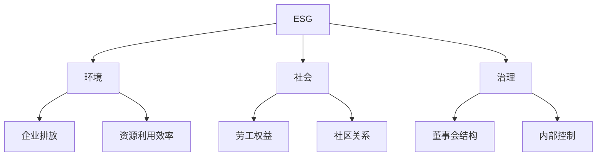
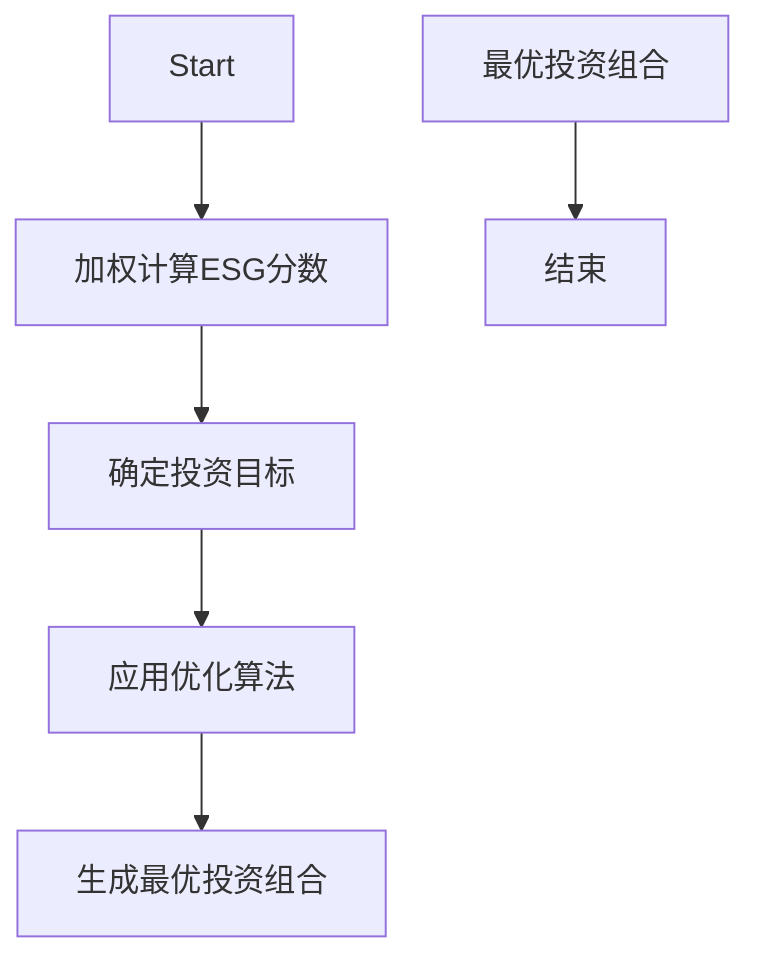
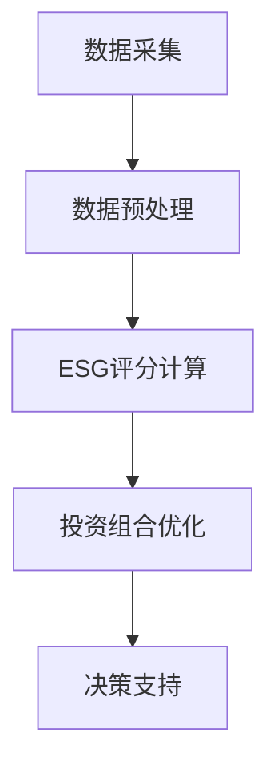
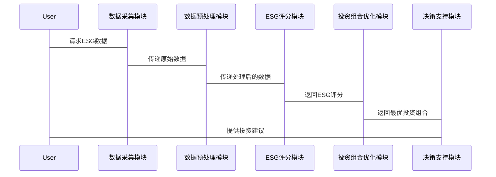

                 


# 价值投资在ESG（环境、社会和治理）框架下的演变

> **关键词**：价值投资、ESG框架、投资策略、环境因素、社会因素、治理因素、投资分析  
> **摘要**：本文探讨了价值投资在ESG框架下的演变，分析了ESG的核心概念及其对投资策略的影响。通过详细的技术分析和案例研究，揭示了如何利用ESG框架优化投资决策，并构建可持续的长期投资组合。

---

## 第一部分：价值投资与ESG框架的背景与核心概念

### 第1章：价值投资与ESG框架的背景

#### 1.1 ESG的定义与演变
- **环境（Environmental）**：关注企业的环境表现，包括碳排放、资源利用效率和可持续发展实践。
- **社会（Social）**：涉及企业与员工、客户和社区的关系，包括劳工权益、社会责任和反腐败。
- **治理（Governance）**：关注企业治理结构和内部控制，包括董事会构成、股权结构和风险管理。

#### 1.2 ESG投资的重要性
- ESG投资不仅是对可持续发展的支持，更是对长期企业价值的提升。研究表明，ESG表现优异的企业往往具有更强的抗风险能力和盈利能力。

#### 1.3 价值投资与ESG框架的结合
- 价值投资强调以合理价格买入优质资产，而ESG框架提供了评估“优质”的新维度。通过结合ESG因素，投资者可以更全面地评估企业的长期价值。

---

### 第2章：ESG框架的核心概念与联系

#### 2.1 ESG核心概念的原理
- **环境维度**：通过量化碳排放、能源消耗等指标，评估企业对环境的影响。
- **社会维度**：通过分析员工满意度、社会责任报告，评估企业在社会中的贡献。
- **治理维度**：通过评估董事会结构、股权分散度等，评估企业治理的健康程度。

#### 2.2 ESG核心概念的对比分析
| **维度** | **环境** | **社会** | **治理** |
|----------|----------|----------|----------|
| **关注点** | 碳排放、资源利用 | 劳工权益、社区关系 | 董事会结构、内部控制 |
| **影响** | 长期环境风险 | 社会声誉与责任 | 治理效率与风险 |

#### 2.3 ESG框架的ER实体关系图


---

## 第二部分：ESG框架下的价值投资分析方法

### 第3章：ESG评分模型的算法原理

#### 3.1 多因子模型的构建
- ESG评分模型结合了环境、社会和治理三个维度，每个维度下有多个具体指标。
- 示例指标：
  - 环境：碳排放强度、可再生能源使用比例。
  - 社会：员工满意度、社会责任投入。
  - 治理：董事会多样性、股权分散度。

#### 3.2 基于ESG的评分权重分配
- 根据行业特点和投资目标，动态调整各维度的权重。例如，能源行业可能更关注环境维度，而金融行业可能更关注治理维度。

#### 3.3 ESG评分的计算公式
$$ ESG\_score = \sum_{i=1}^{n} w_i \times factor_i $$
其中，$w_i$为各维度的权重，$factor_i$为具体指标的评分。

#### 3.4 ESG评分的计算过程


---

### 第4章：基于ESG的价值投资组合优化

#### 4.1 基于均值-方差优化的ESG投资组合
- 使用马科维茨均值-方差模型，结合ESG评分和传统财务指标，构建最优投资组合。
- 示例代码：
  ```python
  import pandas as pd
  import numpy as np

  # 假设esg_scores为各股票的ESG评分，returns为各股票的预期收益率
  def optimize_portfolio(esg_scores, returns, covariance_matrix):
      n = len(esg_scores)
      # 定义目标函数
      def objective(x):
          return np.dot(x.T, covariance_matrix).dot(x)
      # 定义约束条件
      constraints = [
          ('sum', x, 1),
          ('sum', x, 0)
      ]
      # 使用SLSQP求解
      from scipy.optimize import minimize
      result = minimize(objective, np.ones(n)/n, constraints=constraints)
      return result.x
  ```

#### 4.2 基于遗传算法的ESG组合优化
- 通过遗传算法搜索最优投资组合，考虑ESG评分和市场表现的双重目标。
- 示例代码：
  ```python
  import numpy as np

  def genetic_algorithm_optimization(stocks, population_size, generations):
      # 初始化种群
      population = np.random.rand(population_size, len(stocks))
      best_fitness = -1

      for _ in range(generations):
          # 计算适应度
          fitness = np.array([calculate_fitness(stock, stocks) for stock in population])
          best_fitness = max(fitness)
          # 选择和交叉
          selected = population[fitness.argsort()[-int(population_size/2):]]
          new_population = selected + (np.random.rand(population_size, len(stocks)) * 0.5)
          population = new_population % 1
      return population[fitness.argmax()]
  ```

---

## 第三部分：ESG框架下的系统分析与架构设计

### 第5章：系统分析与架构设计

#### 5.1 系统功能设计
- **数据采集模块**：收集企业的ESG数据，包括碳排放、员工满意度等。
- **ESG评分模块**：基于多因子模型计算ESG评分。
- **投资分析模块**：结合ESG评分和财务数据，优化投资组合。
- **决策支持模块**：提供可视化报告和投资建议。

#### 5.2 系统架构设计


#### 5.3 系统接口设计
- 数据接口：与ESG数据供应商对接，获取实时数据。
- API接口：提供ESG评分和投资建议的API，方便第三方调用。

#### 5.4 系统交互流程


---

## 第四部分：项目实战与案例分析

### 第6章：项目实战

#### 6.1 项目背景与目标
- 选择新能源行业，构建一个基于ESG框架的投资组合，评估其长期表现。

#### 6.2 核心实现
- 使用Python编写数据采集和评分模块，结合遗传算法优化投资组合。

#### 6.3 实例分析
- 选取若干新能源企业，计算其ESG评分，优化投资组合，并对比传统投资策略的表现。

#### 6.4 代码实现
```python
import pandas as pd
import numpy as np

# 示例数据
stocks = ['公司A', '公司B', '公司C']
esg_scores = [0.85, 0.75, 0.90]
returns = [0.1, 0.15, 0.08]

# 计算最优投资组合
def calculate_fitness(stock, stocks):
    # 假设fitness基于ESG评分和预期收益
    return stock[0] * stock[1]

population = np.random.rand(10, len(stocks))
best = genetic_algorithm_optimization(stocks, 10, 100)
print("最优投资组合:", best)
```

---

## 第五部分：最佳实践与小结

### 第7章：最佳实践

#### 7.1 关键点总结
- 数据质量：ESG评分需要基于可靠的数据源。
- 动态调整：定期更新ESG评分和投资组合。
- 风险控制：结合传统财务指标，避免过度依赖ESG评分。

#### 7.2 小结
ESG框架为价值投资提供了新的视角，通过结合环境、社会和治理因素，投资者可以更全面地评估企业的长期价值。未来，随着技术的进步，ESG投资将更加智能化和个性化。

#### 7.3 注意事项
- 数据偏差：不同行业和地区的ESG评分标准可能不同，需谨慎处理。
- 时间因素：ESG表现可能随时间变化，需动态调整投资策略。

#### 7.4 拓展阅读
- 阅读更多关于ESG评分模型的文献，探索其在不同行业的应用。

---

## 作者信息

作者：AI天才研究院/AI Genius Institute & 禅与计算机程序设计艺术 /Zen And The Art of Computer Programming

---

以上是文章的完整大纲和内容，希望对您有所帮助！

