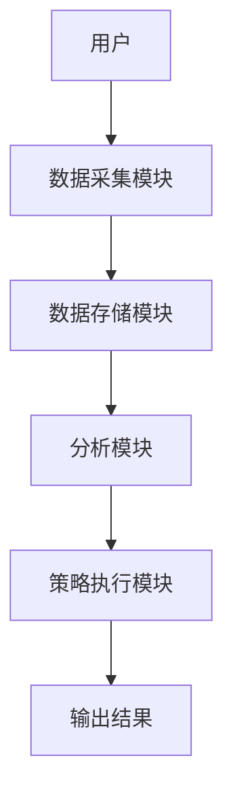

                 

# 价值投资在不同市场条件下的适应性策略

---

## 关键词

- 价值投资
- 市场条件
- 投资策略
- 风险管理
- 基本面分析

---

## 摘要

价值投资是一种长期有效的投资策略，其核心在于通过基本面分析寻找被市场低估的资产。然而，不同市场条件下，价值投资的策略需要进行适当的调整。本文系统地探讨了价值投资在牛市、熊市、震荡市等不同市场环境下的适应性策略，并结合行业轮动和风险管理，提供了具体的实施方法和实际案例。通过分析价值投资的核心理论和策略，本文为投资者提供了在复杂多变的市场环境中进行有效投资的指导。

---

## 引言

在投资领域，价值投资作为一种经典的策略，强调通过深入分析企业的基本面，寻找市场价格低于其内在价值的资产。然而，市场的波动性和经济周期的变化要求投资者灵活调整策略，以应对不同的市场条件。本文旨在探讨在不同市场条件下，价值投资策略的具体实施方法，并结合实际案例和系统架构，为投资者提供实用的指导。

---

## 第1章: 价值投资的背景与核心概念

### 1.1 价值投资的起源与发展

价值投资的起源可以追溯到20世纪初，本杰明·格雷厄姆和菲利普·费雪是这一理念的先驱。他们提出了“安全边际”和“内在价值”等核心概念，奠定了价值投资的理论基础。

### 1.2 价值投资的核心理念

- **内在价值**：资产的真正价值是其未来现金流的现值，与市场价格无关。
- **安全边际**：买入价格低于内在价值，以降低投资风险。

---

## 第2章: 价值投资的理论基础

### 2.1 基本面分析

基本面分析是价值投资的核心方法，包括对企业的财务状况、行业地位和竞争优势的全面评估。

#### 2.1.1 财务报表分析

- **利润表**：评估企业的盈利能力。
- **资产负债表**：分析企业的资产和负债情况。
- **现金流量表**：了解企业的现金流状况。

#### 2.1.2 行业分析与竞争优势

- **行业生命周期**：分析行业所处的阶段，如幼稚期、成长期、成熟期和衰退期。
- **竞争优势**：评估企业在行业中的竞争优势，如成本优势、技术壁垒等。

### 2.2 内在价值评估

#### 2.2.1 内在价值的定义与计算

内在价值是资产在未来现金流的现值，常用 discounted cash flow (DCF) 模型进行计算。

#### 2.2.2 安全边际的重要性

安全边际 = 内在价值 - 市场价格，确保投资的安全性。

---

## 第3章: 不同市场条件下的投资策略

### 3.1 牛市中的价值投资策略

#### 3.1.1 牛市的特点与风险

- 市场情绪高涨，股价可能出现泡沫。
- 投资者容易被乐观情绪影响，忽视基本面。

#### 3.1.2 价值投资者的应对策略

- **寻找被低估的股票**：即使在牛市中，仍有许多企业被市场低估。
- **分散投资**：避免过度集中，降低风险。

### 3.2 熊市中的价值投资策略

#### 3.2.1 熊市的特点与机会

- 市场恐慌，股价可能远低于内在价值。
- 优质资产的价格被低估，为长期投资者提供机会。

#### 3.2.2 价值投资者的应对策略

- **增加仓位**：利用市场的恐慌性抛售，增加对优质资产的投资。
- **保持耐心**：熊市是暂时的，优质资产的价值终将体现。

### 3.3 震荡市中的投资策略

#### 3.3.1 震荡市的特点

- 市场波动剧烈，投资者情绪不稳定。
- 机会与风险并存。

#### 3.3.2 价值投资者的应对策略

- **选择防御性行业**：如公用事业、消费品等行业在震荡市中表现相对稳定。
- **灵活调整组合**：根据市场变化，适当调整投资比例。

---

## 第4章: 行业与板块轮动中的价值投资策略

### 4.1 行业分析与投资机会

#### 4.1.1 行业轮动的基本原理

- **行业轮动的驱动因素**：经济周期、政策变化、技术创新等。
- **不同经济周期下的行业表现**：周期性行业在经济复苏期表现较好，防御性行业在经济衰退期表现稳定。

#### 4.1.2 行业选择的标准

- **行业竞争结构**：分析行业的进入壁垒和竞争程度。
- **行业成长潜力**：评估行业的未来增长空间。

### 4.2 板块轮动中的投资策略

#### 4.2.1 板块轮动的规律

- **技术进步对板块轮动的影响**：如人工智能的发展推动科技股的崛起。
- **政策变化的影响**：如环保政策的加强推动新能源板块的发展。

#### 4.2.2 价值投资者的应对策略

- **把握板块轮动的拐点**：在板块轮动的初期阶段介入。
- **灵活调整投资组合**：根据板块轮动的趋势，动态调整投资比例。

---

## 第5章: 风险管理与投资纪律

### 5.1 风险管理

#### 5.1.1 风险控制的必要性

- 投资者需要控制市场风险、流动性风险和信用风险。

#### 5.1.2 风险管理的具体措施

- **设置止损点**：在投资组合中设定止损点，避免重大损失。
- **分散投资**：通过投资不同行业和资产类别，降低风险。

### 5.2 投资纪律

#### 5.2.1 投资纪律的重要性

- 遵循价值投资的原则，避免情绪化决策。

#### 5.2.2 投资纪律的具体实施

- **定期复盘**：定期检查投资组合，评估投资标的的表现。
- **保持耐心**：价值投资需要长期持有，避免频繁交易。

---

## 第6章: 案例分析

### 6.1 历史案例分析

#### 6.1.1 2008年金融危机期间的价值投资策略

- 以巴菲特为例，说明如何在危机中寻找被低估的资产。

#### 6.1.2 科技股泡沫期间的价值投资策略

- 分析如何在泡沫破裂前退出，或在泡沫破裂后介入。

### 6.2 实际案例分析

#### 6.2.1 某行业周期中的投资策略

- 以制造业为例，分析如何在周期性波动中进行投资。

#### 6.2.2 某板块轮动中的投资策略

- 以科技板块为例，分析如何在板块轮动中获利。

---

## 第7章: 系统架构与最佳实践

### 7.1 系统架构设计

#### 7.1.1 系统功能设计

- **数据采集**：获取实时市场数据和财务报表。
- **分析模块**：进行基本面分析和内在价值评估。
- **策略执行**：根据市场条件调整投资策略。

#### 7.1.2 系统架构图

### 7.2 最佳实践 tips

- **保持学习**：不断更新知识，适应市场变化。
- **长期持有**：避免短期波动影响投资决策。
- **控制风险**：合理设置止损点，分散投资。

---

## 附录

### A. 工具与资源

- **价值投资筛选指标**：市盈率、市净率、股息率等。
- **投资组合管理模板**：包括资产配置、风险控制等内容。

### B. 推荐阅读

- 《The Intelligent Investor》 - 本杰明·格雷厄姆
- 《The Compound Effect》 - 许戈文

---

## 结论

价值投资在不同市场条件下的适应性策略需要投资者具备扎实的理论基础和灵活的实践能力。通过基本面分析、行业轮动和风险管理，投资者可以在各种市场环境中实现长期稳定的收益。

---

## 作者

作者：AI天才研究院/AI Genius Institute & 禅与计算机程序设计艺术 /Zen And The Art of Computer Programming

