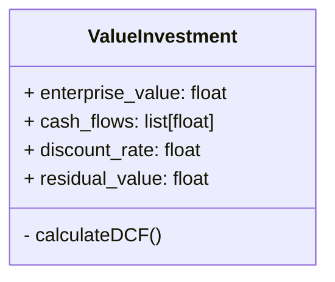

                 


# 价值投资在不同经济周期中的策略调整

> 关键词：价值投资，经济周期，投资策略，防御性投资，周期性投资

> 摘要：本文探讨了价值投资在不同经济周期中的策略调整，分析了经济周期对投资策略的影响，提出了在衰退、复苏、过热和滞胀期的具体投资策略，并通过数学模型和系统架构设计为投资者提供理论支持和实践指导。

---

## 第一部分：价值投资与经济周期的背景

### 第1章：价值投资的核心理念

#### 1.1 价值投资的基本定义

##### 1.1.1 价值投资的起源与发展

价值投资是一种长期投资策略，由本杰明·格雷厄姆和戴维·多德在20世纪初提出。其核心理念是寻找市场低估的股票，关注企业的内在价值而非市场波动。

##### 1.1.2 价值投资的核心原则

价值投资强调安全边际、长期持有和企业基本面分析。投资者应选择那些具有稳定盈利能力和合理估值的企业。

##### 1.1.3 价值投资与基本面分析的关系

基本面分析是价值投资的基础，包括对企业财务状况、行业地位和管理层能力的评估。通过基本面分析，投资者识别具有持续竞争优势的企业。

#### 1.2 经济周期的基本概念

##### 1.2.1 经济周期的定义与特征

经济周期分为衰退、复苏、过热和滞胀四个阶段。每个阶段的市场环境和企业表现不同，影响投资策略的选择。

##### 1.2.2 经济周期的四个阶段

1. **衰退期**：经济增长放缓，企业盈利下降，市场情绪悲观。
2. **复苏期**：经济开始恢复，企业盈利逐步回升，市场情绪转好。
3. **过热期**：经济增长过快，可能出现泡沫，企业盈利高但风险增加。
4. **滞胀期**：经济增长停滞，通胀高企，企业盈利不稳定。

##### 1.2.3 经济周期对投资策略的影响

不同的经济周期阶段需要不同的投资策略。例如，衰退期适合防御性投资，过热期则需警惕泡沫破裂的风险。

---

### 第2章：价值投资与经济周期的关系

#### 2.1 价值投资在经济周期中的表现

##### 2.1.1 不同经济周期中价值投资的特点

- **衰退期**：价值投资可能表现不佳，但为长期投资者提供低价买入的机会。
- **复苏期**：价值投资逐渐复苏，表现优于其他策略。
- **过热期**：价值投资可能被市场忽视，但优质企业仍具投资价值。
- **滞胀期**：价值投资面临通胀压力，需寻找抗通胀资产。

##### 2.1.2 经济周期波动对价值投资的影响

经济周期的波动影响市场的估值和企业盈利，价值投资者需灵活调整策略，抓住低估机会。

##### 2.1.3 价值投资在经济周期中的优势与劣势

优势：长期视角，注重基本面，避免短期波动。劣势：在过热市场中可能错失收益，需耐心等待机会。

#### 2.2 价值投资与经济周期的互动

##### 2.2.1 经济周期对价值投资策略的影响

不同经济周期阶段需要调整投资策略，例如衰退期增加防御性行业配置。

##### 2.2.2 价值投资对经济周期的反馈作用

价值投资通过长期持有优质企业，促进经济稳定和市场健康发展。

##### 2.2.3 价值投资与经济周期的长期关系

长期来看，价值投资与经济周期呈正相关，但需根据周期变化调整策略。

---

## 第二部分：不同经济周期中的价值投资策略

### 第3章：经济衰退期的价值投资策略

#### 3.1 经济衰退期的市场特征

##### 3.1.1 市场情绪与投资者行为分析

衰退期市场情绪悲观，投资者倾向于抛售资产，导致股价低于企业价值。

##### 3.1.2 企业盈利与估值的变化

企业盈利下降，但部分优质企业估值被低估，为价值投资者提供买入机会。

##### 3.1.3 价值投资的机会与风险

机会：低价买入优质企业。风险：市场进一步下跌可能导致短期损失。

#### 3.2 衰退期的价值投资策略调整

##### 3.2.1 寻找被低估的优质企业

关注ROE高、负债低的企业，评估其长期竞争优势。

##### 3.2.2 重点关注防御性行业

如公用事业、医疗保健等需求稳定的行业，具备防御性。

##### 3.2.3 投资组合的防御性构建

降低整体风险敞口，增加现金储备，减少高风险资产配置。

---

### 第4章：经济复苏期的价值投资策略

#### 4.1 经济复苏期的市场特征

##### 4.1.1 市场情绪的变化

市场情绪逐渐好转，投资者信心恢复，股价开始回升。

##### 4.1.2 企业盈利的回升

企业盈利逐步改善，但仍需关注行业复苏的可持续性。

##### 4.1.3 价值投资的机会与挑战

机会：估值修复，优质企业股价上涨。挑战：市场波动较大，需警惕短期回调。

#### 4.2 复苏期的价值投资策略调整

##### 4.2.1 逐步增加风险资产配置

在保持防御性投资的同时，逐步增加周期性行业配置。

##### 4.2.2 重点关注周期性行业

如制造业、房地产等行业的复苏可能带来超额收益。

##### 4.2.3 投资组合的进攻性构建

增加股票配置比例，优化资产分配，平衡风险与收益。

---

### 第5章：经济过热期的价值投资策略

#### 5.1 经济过热期的市场特征

##### 5.1.1 市场情绪的高涨

市场情绪乐观，股价可能被高估，存在泡沫风险。

##### 5.1.2 企业盈利的扩张

企业盈利增长快，但部分行业可能出现过度扩张。

##### 5.1.3 价值投资的机会与风险

机会：优质企业继续增长，但需警惕整体市场泡沫。

风险：高估值可能导致股价回调，优质企业也可能面临过高估值。

#### 5.2 过热期的价值投资策略调整

##### 5.2.1 控制投资风险

避免过度集中于高估值股票，保持投资组合的分散性。

##### 5.2.2 重点关注具有持续竞争优势的企业

寻找那些盈利增长快、市场份额稳定的龙头企业。

##### 5.2.3 投资组合的再平衡

根据市场变化，调整资产配置，降低整体风险。

---

### 第6章：经济滞胀期的价值投资策略

#### 6.1 经济滞胀期的市场特征

##### 6.1.1 经济增长停滞

经济增长缓慢，企业盈利不稳定，市场情绪低迷。

##### 6.1.2 通胀高企

通胀上升，导致企业成本增加，利润被压缩。

##### 6.1.3 价值投资的机会与挑战

机会：寻找抗通胀资产，如房地产信托、黄金等。挑战：企业盈利不稳定，投资难度增加。

#### 6.2 滞胀期的价值投资策略调整

##### 6.2.1 寻找抗通胀投资标的

配置抗通胀资产，分散投资风险。

##### 6.2.2 重点关注必需品行业

如食品、能源等行业的企业需求稳定，具备防御性。

##### 6.2.3 投资组合的多元化构建

增加不同资产类别配置，降低滞胀环境下的风险。

---

## 第三部分：价值投资策略的数学模型与系统架构

### 第7章：数学模型与算法原理

#### 7.1 价值评估模型

##### 7.1.1 DCF模型

使用Discounted Cash Flow（DCF）模型评估企业价值。公式如下：

$$
\text{企业价值} = \sum_{t=1}^{n} \frac{\text{现金流}_t}{(1 + r)^t} + \frac{\text{残值}}{(1 + r)^n}
$$

其中，r为折现率，n为预测年限。

##### 7.1.2 市盈率与市净率分析

市盈率（P/E）=股价/每股收益，市净率（P/B）=股价/每股净资产。两者用于衡量企业估值是否合理。

#### 7.2 算法实现

##### 7.2.1 基于DCF模型的企业估值代码

```python
def calculateDCF(cash_flows, discount_rate, residual_value):
    n = len(cash_flows)
    dcf_value = 0
    for t in range(n):
        dcf_value += cash_flows[t] / (1 + discount_rate) ** t
    dcf_value += residual_value / (1 + discount_rate) ** n
    return dcf_value
```

##### 7.2.2 市盈率与市净率分析代码

```python
def calculatePE(stock_price, earnings_per_share):
    return stock_price / earnings_per_share

def calculatePB(stock_price, book_value_per_share):
    return stock_price / book_value_per_share
```

---

### 第8章：系统分析与架构设计

#### 8.1 系统功能设计

##### 8.1.1 领域模型



##### 8.1.2 系统架构


---

## 第四部分：项目实战

### 第9章：项目实战与代码实现

#### 9.1 环境安装

安装Python和相关库（pandas、numpy、matplotlib）。

#### 9.2 核心代码实现

##### 9.2.1 DCF模型实现

```python
import pandas as pd
import numpy as np

def calculateDCF(cash_flows, discount_rate, residual_value):
    n = len(cash_flows)
    dcf = 0
    for t in range(n):
        dcf += cash_flows[t] / (1 + discount_rate) ** t
    dcf += residual_value / (1 + discount_rate) ** n
    return dcf

# 示例数据
cash_flows = [100, 150, 200]
discount_rate = 0.1
residual_value = 500

print("DCF Value:", calculateDCF(cash_flows, discount_rate, residual_value))
```

##### 9.2.2 实际案例分析

以某公司为例，计算其DCF价值，并与当前股价对比，判断是否低估。

---

## 第五部分：总结与展望

### 第10章：总结与展望

#### 10.1 总结

价值投资在不同经济周期中的策略调整需要根据市场环境变化，灵活调整投资策略，注重企业基本面分析，寻找被低估的优质企业。

#### 10.2 展望

未来，随着经济全球化和科技发展，价值投资将更加注重企业的可持续发展和创新能力，投资者需不断学习和适应市场变化。

---

## 附录

### 术语表

- **DCF模型**：Discounted Cash Flow Model，用于评估企业价值的折现现金流模型。
- **市盈率**：Price-to-Earnings Ratio，股价与每股收益的比率。
- **市净率**：Price-to-Book Ratio，股价与每股净资产的比率。

### 参考文献

1. 格雷厄姆，戴维·多德，《证券分析》
2. �巴菲特，《巴菲特致股东的信》
3. 罗伯特·希勒，《非理性繁荣》

---

作者：AI天才研究院/AI Genius Institute & 禅与计算机程序设计艺术 /Zen And The Art of Computer Programming

---

通过以上结构，您可以逐步撰写每章的内容，确保逻辑清晰、内容详实，并结合实际案例和数学模型进行详细分析。

