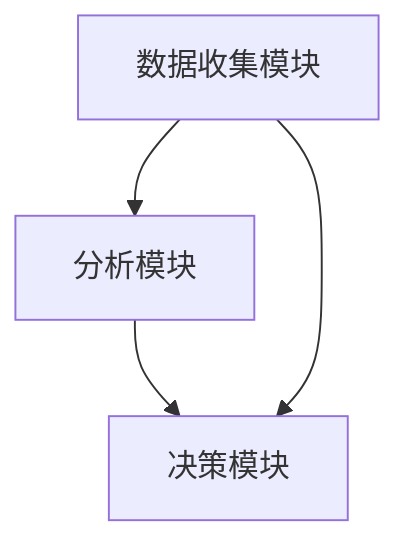
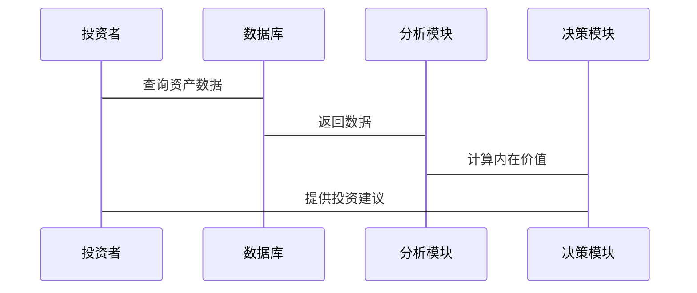

                 


# 价值投资在不同资产类别中的应用：股票、债券、房地产

## 关键词
- 价值投资
- 股票
- 债券
- 房地产
- 资产配置
- 投资策略
- 内在价值评估

## 摘要
价值投资是一种基于资产内在价值的投资策略，通过分析资产的实际价值来决定买入和卖出的时机。本文将探讨价值投资在股票、债券和房地产三种主要资产类别中的应用，分析每种资产的内在价值评估方法、投资策略以及实际操作中的注意事项。文章从基础概念出发，结合具体案例，深入浅出地分析了不同资产类别的价值投资策略，同时提供了一套系统的投资分析框架，帮助投资者在复杂多变的市场环境中做出明智的投资决策。

---

# 第一部分: 价值投资的基本原理

## 第1章: 价值投资的核心概念

### 1.1 价值投资的定义与背景

#### 1.1.1 价值投资的起源与发展
价值投资是一种长期投资策略，起源于20世纪初，由本杰明·格雷厄姆和戴维·多德等投资大师提出。它强调以低于资产内在价值的价格买入优质资产，通过长期持有实现收益。

#### 1.1.2 价值投资的核心理念
- 资产的内在价值是其未来现金流的现值。
- 市场价格波动为投资者提供了低位买入和高位卖出的机会。
- 安全边际是投资决策的重要考量，即买入价格应低于内在价值。

#### 1.1.3 价值投资的适用范围
价值投资适用于股票、债券、房地产等多种资产类别，尤其在股票和房地产领域表现突出。

### 1.2 价值投资的核心原则

#### 1.2.1 购买低于内在价值的资产
投资者应寻找市场价格低于内在价值的资产，确保足够的安全边际。

#### 1.2.2 长期投资与复利效应
价值投资强调长期持有，通过复利效应实现财富的稳步增长。

#### 1.2.3 安全边际的重要性
安全边际是内在价值与买入价格之间的差额，能够降低投资风险。

## 第2章: 股票投资的价值评估

### 2.1 股票的内在价值

#### 2.1.1 股票价值的定义
股票的内在价值是其未来现金流的现值，通常通过股利贴现模型（DDM）或企业价值评估方法计算。

#### 2.1.2 股票价值的计算方法

##### 股利贴现模型（DDM）
$$ V = \frac{D}{k - g} $$
其中，$D$为股利，$k$为贴现率，$g$为股利增长率。

##### 企业价值评估
$$ EV = \frac{EBIT \times (1 + g)}{k - g} $$
其中，$EBIT$为息税前利润，$k$为贴现率，$g$为收入增长率。

#### 2.1.3 股票价值的影响因素
- 财务状况：收入、利润、负债等。
- 行业地位：市场竞争力、行业周期。
- 管理团队：管理能力、战略规划。
- 宏观环境：经济周期、政策变化。

### 2.2 股票估值指标

#### 2.2.1 市盈率（P/E）分析
$$ P/E = \frac{P}{E} $$
其中，$P$为股价，$E$为每股收益。

#### 2.2.2 市净率（P/B）分析
$$ P/B = \frac{P}{B} $$
其中，$B$为每股净资产。

#### 2.2.3 股息率与股息支付率
- 股息率：$$ \text{股息率} = \frac{\text{股息}}{\text{股价}} $$
- 股息支付率：$$ \text{股息支付率} = \frac{\text{股息}}{\text{净利润}} $$

## 第3章: 债券投资的价值评估

### 3.1 债券的内在价值

#### 3.1.1 债券的基本概念
债券是债务工具，发行人承诺在特定时间内支付利息和本金。

#### 3.1.2 债券价值的计算公式
$$ V = \sum_{t=1}^{n} \frac{C}{(1 + r)^t} + \frac{F}{(1 + r)^n} $$
其中，$C$为每年利息，$r$为收益率，$F$为面值，$n$为期限。

#### 3.1.3 债券价值的影响因素
- 利率水平
- 信用风险
- 债务期限

### 3.2 债券定价与收益率

#### 3.2.1 债券收益率的计算
$$ YTM = \frac{C + \frac{F - P}{n}}{P} $$
其中，$P$为购买价格，$F$为面值，$C$为每年利息，$n$为期限。

#### 3.2.2 债券信用评级的影响
信用评级越高，债券的违约风险越低，收益率越低。

#### 3.2.3 债券久期与凸性分析
久期衡量债券价格对利率变化的敏感性，凸性衡量久期的变化。

## 第4章: 房地产投资的价值评估

### 4.1 房地产的内在价值

#### 4.1.1 房地产价值的定义
房地产的内在价值是其未来现金流的现值，通常通过租金收益法或收益资本化法计算。

#### 4.1.2 房地产价值的评估方法

##### 租金收益法
$$ V = \frac{N}{Cap Rate} $$
其中，$N$为年净租金收入，$Cap Rate$为资本化率。

##### 收益资本化法
$$ V = \frac{ NOI }{ Cap Rate } $$
其中，$NOI$为净运营收益，$Cap Rate$为资本化率。

#### 4.1.3 房地产价值的影响因素
- 地理位置
- 房地产类型
- 租赁市场状况
- 建筑状况

### 4.2 房地产市场的周期性

#### 4.2.1 房地产市场的周期分析
房地产市场通常经历复苏、增长、成熟和衰退四个阶段。

#### 4.2.2 房地产市场的供需关系
供需关系影响房地产价格，城市化进程和人口增长推动需求。

#### 4.2.3 房地产市场的风险因素
- 市场波动
- 利率变化
- 政策调控

## 第5章: 价值投资在不同资产类别中的应用

### 5.1 股票、债券与房地产的比较

#### 5.1.1 资产类别特点对比
| 资产类别 | 流动性 | 风险 | 收益 |
|----------|--------|------|------|
| 股票     | 中等   | 高   | 高   |
| 债券     | 高     | 低   | 中等 |
| 房地产   | 低     | 中高 | 高   |

#### 5.1.2 不同资产的风险与收益分析
- 股票风险高，收益高。
- 债券风险低，收益稳定。
- 房地产风险中高，收益高。

#### 5.1.3 资产类别间的相关性
股票与房地产通常正相关，债券与股票负相关。

### 5.2 价值投资策略的跨资产应用

#### 5.2.1 资产配置的重要性
合理配置资产可以降低风险，提高收益。

#### 5.2.2 价值投资在不同资产中的策略
- 股票：寻找低市盈率、低市净率的公司。
- 债券：投资高信用评级债券。
- 房地产：选择地理位置优越、租金稳定的物业。

## 第6章: 系统分析与架构设计方案

### 6.1 问题场景介绍
价值投资需要一个系统化的分析框架，帮助投资者快速评估不同资产的内在价值。

### 6.2 系统功能设计
- 数据收集模块：收集资产的财务数据和市场数据。
- 分析模块：计算内在价值和估值指标。
- 决策模块：根据分析结果制定投资策略。

### 6.3 系统架构设计


### 6.4 系统接口设计
- 数据接口：与财务数据库对接。
- 分析接口：提供估值指标和内在价值。
- 决策接口：输出投资建议。

### 6.5 系统交互序列图


## 第7章: 项目实战

### 7.1 环境安装
- 数据库：MySQL或MongoDB
- 分析工具：Python、Pandas、Matplotlib
- 开发框架：Django或Flask

### 7.2 核心实现源代码
```python
import pandas as pd
import numpy as np

def calculate_intrinsic_value(fcf, discount_rate, growth_rate):
    return fcf / (discount_rate - growth_rate)

def calculate_pe_ratio(price, eps):
    return price / eps

# 示例数据
data = {
    '股价': [100, 80, 120],
    '每股收益': [20, 30, 10],
    '自由现金流': [50, 60, 70],
    '折现率': [0.1, 0.1, 0.1],
    '增长率': [0.05, 0.05, 0.05]
}

df = pd.DataFrame(data)

# 计算内在价值
intrinsic_values = df.apply(lambda x: calculate_intrinsic_value(x['自由现金流'], x['折现率'], x['增长率']), axis=1)
# 计算市盈率
pe_ratios = df.apply(lambda x: calculate_pe_ratio(x['股价'], x['每股收益']), axis=1)

print(intrinsic_values)
print(pe_ratios)
```

### 7.3 案例分析
- 股票案例：分析某公司股票的市盈率和市净率，判断是否低估。
- 债券案例：计算某债券的到期收益率，评估其是否具有投资价值。
- 房地产案例：评估某房地产项目的净现值，判断是否值得投资。

### 7.4 项目小结
通过系统化的分析和实际案例分析，投资者可以更好地应用价值投资策略。

## 第8章: 最佳实践与注意事项

### 8.1 投资策略的注意事项
- 定期复盘和调整投资组合。
- 保持安全边际，避免过度杠杆。
- 关注宏观经济和行业趋势。

### 8.2 价值投资的长期性
价值投资需要耐心和纪律，避免短期市场的波动影响决策。

### 8.3 持续学习与优化
不断学习市场知识，优化投资策略，适应市场变化。

## 第9章: 拓展阅读与进一步学习

### 9.1 经典书籍推荐
- 《价值投资实战》
- 《股票作手回忆录》
- 《投资最重要的事》

### 9.2 在线资源与工具
- 财务数据平台：Yahoo Finance、Google Finance
- 分析工具：Excel、Python、R

## 附录: 术语解释与公式汇总

### 附录A: 术语解释
- 内在价值：资产未来现金流的现值。
- 市盈率：股价与每股收益的比率。
- 久期：债券价格对利率变化的敏感性。

### 附录B: 公式汇总
- 股票价值：$$ V = \frac{D}{k - g} $$
- 债券价值：$$ V = \sum_{t=1}^{n} \frac{C}{(1 + r)^t} + \frac{F}{(1 + r)^n} $$
- 房地产价值：$$ V = \frac{N}{Cap Rate} $$

---

# 结语

价值投资是一种长期有效的投资策略，通过深入分析资产的内在价值，投资者可以在不同资产类别中找到低估的机会。本文通过系统化的分析和实际案例，为投资者提供了价值投资的理论和实践指导。未来，随着市场环境的变化，价值投资策略也需要不断优化和创新，以适应新的挑战和机遇。

---

# 作者：AI天才研究院/AI Genius Institute & 禅与计算机程序设计艺术 /Zen And The Art of Computer Programming

