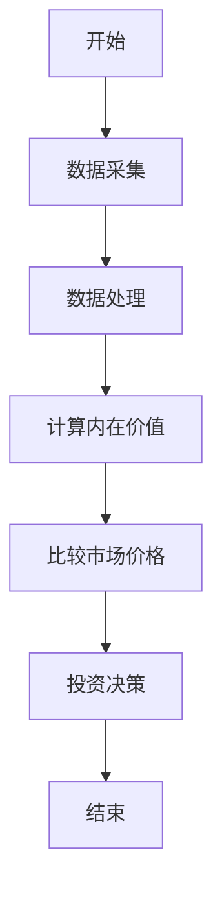

                 


# 价值投资在大宗商品市场的应用

## 关键词
- 价值投资
- 大宗商品市场
- 投资策略
- 金融市场
- 投资分析

## 摘要
价值投资是一种长期投资策略，强调通过深入分析企业的基本面，寻找被市场低估的投资标的。在大宗商品市场中，价值投资同样适用，但需要结合大宗商品市场的特殊性进行调整。本文将从价值投资的核心理念出发，分析其在大宗商品市场中的应用，探讨其在算法、系统架构、项目实战等方面的具体实施方法，为投资者提供深度的理论支持和实践指导。

---

# 第一部分: 价值投资在大宗商品市场的背景与基础

## 第1章: 价值投资的核心理念与大宗商品市场的特点

### 1.1 价值投资的基本原理
#### 1.1.1 价值投资的定义与核心理念
价值投资是一种以基本面分析为核心的长期投资策略，强调以低于内在价值的价格买入优质资产。其核心理念包括：
- 市场短期波动不可预测，但长期趋势由内在价值决定。
- 投资成功的关键在于对企业的深入分析和长期持有。

#### 1.1.2 价值投资与投机的区别
- 投资：基于基本面分析，追求长期稳定收益。
- 投机：基于市场短期波动，追求快速获利。
- 区别：价值投资注重长期价值，而投机注重短期价格波动。

#### 1.1.3 价值投资在不同市场中的适用性
- 股票市场：寻找被低估的公司。
- 债券市场：寻找收益率合理、风险可控的债券。
- 大宗商品市场：寻找供需失衡、价格被低估的商品。

### 1.2 大宗商品市场的特点
#### 1.2.1 大宗商品的定义与分类
- 大宗商品：用于工业生产和消费的初级产品，如原油、黄金、铜、铁矿石等。
- 分类：能源类（原油、天然气）、金属类（铜、铝）、农产品类（小麦、大豆）。

#### 1.2.2 大宗商品市场的参与者与交易机制
- 参与者：生产商、贸易商、投资者、消费企业。
- 交易机制：现货交易、期货交易、掉期交易。

#### 1.2.3 大宗商品价格波动的主要影响因素
- 供需关系：全球经济状况、工业需求。
- 宏观经济：通货膨胀、货币政策、地缘政治。
- 技术分析：价格走势、成交量、市场情绪。

### 1.3 价值投资与大宗商品市场的结合
#### 1.3.1 价值投资在大宗商品市场中的适用性
- 大宗商品作为资产配置的一部分，可以分散投资风险。
- 通过基本面分析，寻找价格被低估的商品。

#### 1.3.2 大宗商品市场中的长期投资机会
- 基于长期供需分析，投资具有持续增长潜力的商品。
- 投资具有战略意义的资源，如能源和稀有金属。

#### 1.3.3 价值投资在大宗商品市场中的挑战与风险
- 商品价格受宏观经济因素影响较大，波动性高。
- 市场流动性不足，可能导致买卖价差大。
- 信息不对称，分析难度较高。

---

## 第2章: 价值投资的核心概念与大宗商品市场的联系

### 2.1 核心概念的定义与属性对比
#### 2.1.1 价值投资的核心概念
- 内在价值：资产的公平市场价格，基于未来现金流的现值。
- 安全边际：买入价格低于内在价值的部分，提供安全空间。

#### 2.1.2 大宗商品市场的核心概念
- 市场价：当前市场价格，受供需和宏观经济影响。
- 边际成本：生产商品的增量成本，影响价格的下限。

#### 2.1.3 核心概念的对比分析
| 比较维度 | 价值投资 | 大宗商品市场 |
|----------|----------|-------------|
| 核心概念 | 内在价值 | 市场价、边际成本 |
| 适用性 | 长期投资 | 短期和长期波动 |

### 2.2 核心概念的ER实体关系图
```mermaid
erDiagram
  actor 投资者 {
    string 型号
    integer 数量
    currency 价格
  }
  actor 生产商 {
    string 型号
    integer 数量
    currency 价格
  }
  actor 消费者 {
    string 型号
    integer 数量
    currency 价格
  }
  entity 商品 {
    key string 名称
    integer 数量
    currency 价格
    date 日期
  }
  entity 市场 {
    key string 名称
    date 日期
    currency 指数
  }
  投资者 --> 商品: 购买
  投资者 --> 市场: 参与
  生产商 --> 商品: 生产
  生产商 --> 市场: 参与
  消费者 --> 商品: 消费
  消费者 --> 市场: 参与
```

### 2.3 核心概念的数学模型与公式
#### 2.3.1 价值投资的核心公式
$$ V = \frac{CF}{r - g} $$
其中：
- \( V \) 为内在价值，
- \( CF \) 为未来现金流，
- \( r \) 为贴现率，
- \( g \) 为增长率。

#### 2.3.2 大宗商品定价的数学模型
$$ P = f(Q, S, C, M) $$
其中：
- \( P \) 为价格，
- \( Q \) 为供需关系，
- \( S \) 为宏观经济因素，
- \( C \) 为市场情绪，
- \( M \) 为边际成本。

---

## 第3章: 价值投资在大宗商品市场中的算法原理

### 3.1 算法原理的概述
#### 3.1.1 价值投资算法的基本原理
- 基于基本面分析，寻找价格低于内在价值的商品。
- 结合技术分析，确认价格趋势和买卖时机。

#### 3.1.2 大宗商品市场中的算法应用
- 使用量化模型筛选低估商品。
- 通过算法优化投资组合，降低风险。

### 3.2 算法原理的mermaid流程图


### 3.3 算法原理的Python源代码实现
```python
import pandas as pd

# 示例数据：假设为原油价格和供需数据
data = {'日期': ['2023-01', '2023-02', '2023-03'],
        '价格': [80, 75, 85],
        '供需比': [1.2, 1.1, 1.3]}
df = pd.DataFrame(data)

# 计算内在价值
def calculate_intrinsic_value(price, supply_demand_ratio):
    # 假设内在价值与供需比成反比
    iv = price / supply_demand_ratio
    return iv

df['内在价值'] = df.apply(lambda x: calculate_intrinsic_value(x['价格'], x['供需比']), axis=1)

# 寻找低估商品
undervalued = df[df['价格'] < df['内在价值']]
print("低估商品:", undervalued)
```

---

## 第4章: 价值投资在大宗商品市场中的系统分析与架构设计

### 4.1 系统分析与架构设计方案
#### 4.1.1 问题场景的介绍
- 需求：寻找大宗商品市场的低估投资机会。
- 限制：数据获取难度大，市场波动性强。

#### 4.1.2 系统功能设计
- 数据采集模块：收集商品价格、供需数据。
- 分析模块：计算内在价值，比较市场价格。
- 决策模块：生成投资策略。

#### 4.1.3 系统架构设计


---

## 第5章: 价值投资在大宗商品市场的项目实战

### 5.1 环境安装与数据获取
- 环境：Python 3.8及以上，Jupyter Notebook。
- 数据来源：公开市场数据，如Bloomberg、Reuters。

### 5.2 核心实现
```python
import pandas as pd
import numpy as np

# 示例数据：假设为黄金价格和宏观经济数据
data = {'日期': ['2023-01', '2023-02', '2023-03'],
        '价格': [1800, 1750, 1850],
        '通胀率': [3, 3.5, 3.2]}
df = pd.DataFrame(data)

# 计算通胀调整后的价格
df['通胀调整后价格'] = df['价格'] * (1 + df['通胀率']/100)
print("通胀调整后价格:", df['通胀调整后价格'])
```

### 5.3 案例分析
- 案例：黄金投资。
- 分析：基于通胀预期，寻找价格被低估的黄金。

---

## 第6章: 最佳实践与小结

### 6.1 最佳实践 tips
- 长期投资，避免频繁交易。
- 结合宏观经济分析，降低投资风险。
- 保持信息敏感，及时调整策略。

### 6.2 小结
价值投资在大宗商品市场中同样适用，但需要结合市场的特殊性进行调整。通过基本面分析和量化模型，投资者可以在大宗商品市场中找到低估的投资机会。

---

## 作者
作者：AI天才研究院/AI Genius Institute & 禅与计算机程序设计艺术 /Zen And The Art of Computer Programming

---

通过以上目录大纲，我们可以看到，价值投资在大宗商品市场的应用需要结合市场特点和投资策略，通过系统化的方法进行分析和实践。

