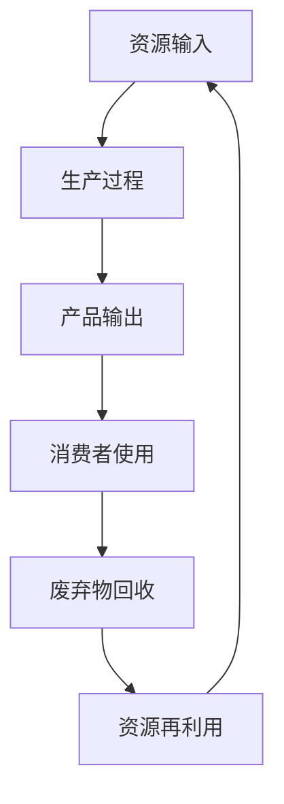
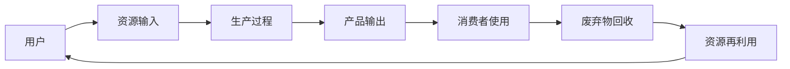
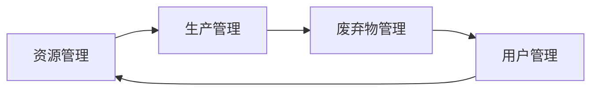
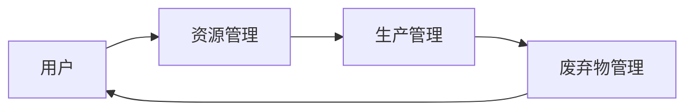

                 


---

# 价值投资在循环经济中的应用：可持续商业模式的机遇

> 关键词：价值投资、循环经济、可持续商业模式、经济价值评估、投资策略、风险管理、系统架构

> 摘要：本文探讨了价值投资在循环经济中的应用，分析了循环经济中的商业模式、价值评估方法、投资策略和风险管理，并通过实际案例展示了如何构建循环经济中的可持续商业模式。文章还提出了基于价值投资的循环经济系统架构，为投资者和企业提供了实践指导。

---

# 第1章 循环经济的基本概念

## 1.1 循环经济的定义与特征

### 1.1.1 循环经济的定义

循环经济是一种以资源高效利用和循环利用为核心，以减少资源消耗和环境污染为目标的经济模式。它强调从“资源-产品-废物”线性经济模式转向“资源-产品-再生资源”的闭环经济模式。

### 1.1.2 循环经济的核心特征

循环经济技术经济性、资源高效性、环境友好性和可持续性。循环经济通过延长产品生命周期、减少资源消耗和废物产生，实现经济与环境的双赢。

### 1.1.3 循环经济与传统经济的区别

- **资源消耗**：传统经济依赖资源的线性消耗，而循环经济强调资源的循环利用。
- **环境污染**：传统经济往往导致环境污染，而循环经济注重减少废物和污染物的产生。
- **经济增长**：传统经济依赖 GDP 增长，而循环经济注重质量而非数量。

---

## 1.2 价值投资的定义与原则

### 1.2.1 价值投资的定义

价值投资是一种投资策略，强调以低于内在价值的价格买入优质资产。其核心在于寻找市场低估的公司，长期持有，等待其价值回归。

### 1.2.2 价值投资的核心原则

- **安全边际**：买入价格低于内在价值。
- **长期视角**：关注企业的长期盈利能力。
- **质量优先**：选择行业龙头或具有竞争优势的企业。

### 1.2.3 价值投资与投机的区别

- **目标**：价值投资追求长期稳定的收益，投机追求短期价格波动的收益。
- **方法**：价值投资基于基本面分析，投机基于市场情绪和价格波动。
- **风险**：价值投资风险较低，投机风险较高。

---

## 1.3 循环经济与价值投资的结合

### 1.3.1 循环经济中的价值发现

循环经济模式下，企业通过延长产品生命周期、提高资源利用效率，创造了新的价值增长点。

### 1.3.2 价值投资在循环经济中的应用

价值投资者可以通过分析循环经济企业的商业模式、成本结构和竞争优势，识别具有长期增长潜力的标的。

### 1.3.3 循环经济与价值投资的协同发展

循环经济为价值投资提供了新的机会，价值投资则为循环经济提供了资金支持和市场认可。

---

# 第2章 循环经济中的商业模式分析

## 2.1 循环经济的主要模式

### 2.1.1 产品生命周期管理

企业通过设计可回收、可再利用的产品，延长产品生命周期，降低资源消耗。

### 2.1.2 资源循环利用模式

企业通过回收废旧材料，进行再加工和再利用，创造新的经济价值。

### 2.1.3 共享经济模式

通过共享资源和资产，提高资源利用率，降低单位产品成本。

---

## 2.2 价值投资在商业模式中的应用

### 2.2.1 价值评估的核心要素

- **资源效率**：企业对资源的利用效率。
- **环境影响**：企业对环境的友好程度。
- **经济效益**：企业的盈利能力和发展潜力。

### 2.2.2 商业模式对投资价值的影响

商业模式决定了企业的收入来源、成本结构和竞争优势，直接影响其投资价值。

### 2.2.3 可持续商业模式的识别

价值投资者需要识别那些具有可持续商业模式的企业，重点关注其资源效率和环境表现。

---

## 2.3 循环经济与价值投资的协同效应

### 2.3.1 循环经济对投资价值的提升

通过提高资源利用效率和降低环境风险，循环经济模式下的企业具有更强的竞争力和长期增长潜力。

### 2.3.2 价值投资对循环经济的支持

价值投资为企业提供了稳定的资金支持，帮助其扩大生产规模和技术创新。

### 2.3.3 协同发展的实现路径

通过价值投资者的选择和推动，循环经济模式得以推广和普及，形成良性循环。

---

# 第3章 循环经济中的价值评估模型

## 3.1 价值评估的核心要素

### 3.1.1 资源效率

资源效率是衡量企业循环经济技术水平的重要指标，越高表示企业对资源的利用效率越高。

### 3.1.2 环境影响

环境影响包括企业在生产过程中对环境的污染程度，越低表示企业对环境的影响越小。

### 3.1.3 经济效益

经济效益是衡量企业盈利能力的重要指标，包括收入、利润和增长率等。

---

## 3.2 循环经济中的价值评估方法

### 3.2.1 生命周期评价法

生命周期评价法（LCA）是一种全面评估产品或服务环境影响的方法，适用于循环经济模式下的产品生命周期管理。

### 3.2.2 资源效率评价法

资源效率评价法通过量化企业对资源的利用效率，评估其循环经济技术的成熟度。

### 3.2.3 综合价值评估模型

综合价值评估模型将资源效率、环境影响和经济效益三者结合，综合评估企业的投资价值。

---

## 3.3 价值评估模型的数学表达

### 3.3.1 综合价值指数的定义

综合价值指数（CVI）是一种衡量企业投资价值的指标，综合考虑了资源效率、环境影响和经济效益。

$$ CVI = \frac{R \times E \times E}{(R + E + E)} $$

其中：
- \( R \) 表示资源效率
- \( E \) 表示环境影响
- \( E \) 表示经济效益

---

## 3.4 案例分析与应用

通过具体案例分析，验证综合价值评估模型的有效性和实用性。例如，以一家循环经济企业为例，计算其综合价值指数，评估其投资价值。

---

# 第4章 循环经济中的投资策略与风险管理

## 4.1 价值投资在循环经济中的策略

### 4.1.1 行业选择与企业筛选

价值投资者应选择具有可持续商业模式的行业和企业，重点关注资源效率高、环境影响小、经济效益好的企业。

### 4.1.2 长期价值的识别

通过分析企业的长期盈利能力和发展潜力，识别具有长期增长潜力的循环经济企业。

### 4.1.3 可持续发展能力的评估

评估企业是否具备持续改进资源效率和减少环境影响的能力。

---

## 4.2 循环经济中的风险管理

### 4.2.1 风险识别与评估

循环经济模式下的企业可能面临政策风险、技术风险和市场风险。

### 4.2.2 风险控制的策略

通过多元化投资、分散风险和加强风险管理，降低投资风险。

### 4.2.3 风险管理的数学模型

风险评估模型通过量化各风险因素的影响程度，评估企业的整体风险水平。

$$ R = \sum_{i=1}^{n} w_i \times r_i $$

其中：
- \( R \) 表示整体风险
- \( w_i \) 表示第 \( i \) 个风险因素的权重
- \( r_i \) 表示第 \( i \) 个风险因素的风险值

---

## 4.3 投资组合优化与风险管理

### 4.3.1 投资组合的构建

通过优化投资组合，平衡风险和收益，提高整体投资回报。

### 4.3.2 风险分散与优化

通过多元化投资，分散风险，降低投资组合的整体风险水平。

### 4.3.3 实证分析与案例研究

通过具体案例分析，验证投资组合优化与风险管理模型的有效性。

---

## 4.4 本章小结

---

# 第5章 循环经济中的系统架构与实现

## 5.1 循环经济系统的总体架构

### 5.1.1 系统功能模块划分

循环经济系统包括产品生命周期管理、资源循环利用、共享经济等核心功能模块。

### 5.1.2 系统架构的 Mermaid 图



---

## 5.2 循环经济系统的功能设计

### 5.2.1 系统功能模块

- **资源管理模块**：负责资源的输入、分配和监控。
- **生产管理模块**：负责产品的生产过程和质量控制。
- **废弃物管理模块**：负责废弃物的回收、处理和再利用。
- **用户管理模块**：负责用户的注册、登录和权限管理。

### 5.2.2 系统功能流程图



---

## 5.3 系统架构设计

### 5.3.1 系统架构的 Mermaid 图



---

## 5.4 系统接口设计

### 5.4.1 系统接口定义

- **资源管理接口**：负责资源的输入和分配。
- **生产管理接口**：负责产品的生产过程。
- **废弃物管理接口**：负责废弃物的回收和再利用。

---

## 5.5 系统交互设计

### 5.5.1 系统交互的 Mermaid 图



---

## 5.6 本章小结

---

# 第6章 项目实战：循环经济平台的搭建

## 6.1 项目背景与目标

### 6.1.1 项目背景

随着环保意识的增强，循环经济越来越受到重视。本项目旨在搭建一个循环经济平台，实现资源的高效利用和循环利用。

### 6.1.2 项目目标

- **资源管理**：实现资源的高效分配和监控。
- **生产管理**：优化生产过程，降低资源消耗。
- **废弃物管理**：实现废弃物的回收和再利用。

---

## 6.2 项目环境配置

### 6.2.1 系统环境

- **操作系统**：Linux
- **编程语言**：Python
- **开发工具**：PyCharm
- **数据库**：MySQL

---

## 6.3 核心代码实现

### 6.3.1 资源管理模块

```python
class Resource:
    def __init__(self, name, quantity):
        self.name = name
        self.quantity = quantity

    def update_quantity(self, new_quantity):
        self.quantity = new_quantity
```

### 6.3.2 生产管理模块

```python
class Production:
    def __init__(self, resource, output):
        self.resource = resource
        self.output = output

    def produce(self):
        self.resource.quantity -= self.output.quantity
```

### 6.3.3 废弃物管理模块

```python
class WasteManagement:
    def __init__(self, waste, reuse):
        self.waste = waste
        self.reuse = reuse

    def recycle(self):
        self.reuse.quantity += self.waste.quantity
```

---

## 6.4 项目实现与案例分析

### 6.4.1 环境配置

安装必要的依赖和工具，配置数据库和服务器环境。

### 6.4.2 核心代码实现

实现资源管理、生产管理和废弃物管理模块，完成循环经济平台的核心功能。

### 6.4.3 实际案例分析

通过具体案例分析，验证平台的功能和性能，优化系统架构和实现。

---

## 6.5 项目小结

---

# 第7章 总结与展望

## 7.1 本章总结

本文系统地探讨了价值投资在循环经济中的应用，分析了循环经济中的商业模式、价值评估方法、投资策略和风险管理，并通过实际案例展示了如何构建循环经济中的可持续商业模式。

---

## 7.2 未来展望

未来，随着环保意识的增强和技术的进步，循环经济将越来越受到重视。价值投资者可以通过不断优化投资策略和风险管理，进一步推动循环经济的发展。

---

# 作者：AI天才研究院/AI Genius Institute & 禅与计算机程序设计艺术 /Zen And The Art of Computer Programming

---

