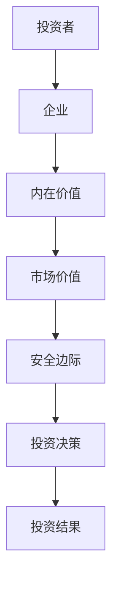
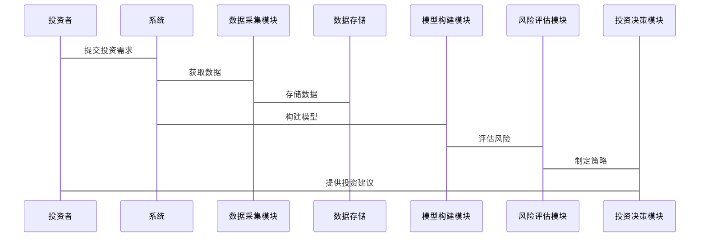

                 

# 价值投资在数字时代的应用与挑战

## 关键词：价值投资、数字时代、人工智能、大数据、投资策略、金融科技

## 摘要：  
随着数字技术的飞速发展，价值投资在金融领域的应用也在不断演变。本文将深入探讨价值投资的核心理念、数字时代带来的新机遇与挑战，以及如何利用大数据和人工智能等技术优化投资决策。通过分析实际案例和系统设计，本文为读者提供了一种新的视角，以应对数字时代的价值投资挑战。

---

## 第一部分: 价值投资的基本概念与数字时代背景

### 第1章: 价值投资的核心理念

#### 1.1 价值投资的定义与特点
- **1.1.1 价值投资的定义**  
  价值投资是一种以企业内在价值为基础的投资策略，强调以低于内在价值的价格买入优质资产，长期持有，等待市场重新认识其价值。

- **1.1.2 价值投资的核心特点**  
  价值投资强调安全边际、长期视角和逆向思维。安全边际是指买入价格低于内在价值，确保投资的安全性；长期视角关注企业的长期价值而非短期波动；逆向思维则是在市场恐慌时寻找机会。

- **1.1.3 价值投资与其它投资策略的对比**  
  与趋势投资、技术分析等策略相比，价值投资更注重基本面分析和长期价值，而非市场的短期波动或技术指标。

#### 1.2 价值投资的核心理念
- **1.2.1 投资的本质：企业价值的发现与投资**  
  价值投资的核心是发现被市场低估的企业，通过深入分析企业的财务状况、行业地位和竞争优势，评估其内在价值。

- **1.2.2 价值投资的三大支柱：安全边际、内在价值、市场先生**  
  安全边际确保投资的本金安全；内在价值是企业的真正价值；市场先生的波动性为投资者提供了买入和卖出的机会。

- **1.2.3 价值投资的长期视角**  
  长期视角是价值投资的核心，短期波动不会影响企业的长期价值，真正的价值会在时间中显现。

### 第2章: 数字时代的价值投资背景

#### 2.1 数字化转型对金融行业的影响
- **2.1.1 数字化转型的定义与内涵**  
  数字化转型是指利用数字技术（如大数据、人工智能、区块链等）重构业务模式、流程、文化、战略和组织，以创造新的价值。

- **2.1.2 数字化转型对金融行业的具体影响**  
  数字化转型使得金融行业更加高效、透明和智能化。大数据和人工智能的应用提高了投资决策的准确性和效率，同时降低了成本。

- **2.1.3 数字化转型带来的投资机会与挑战**  
  数字化转型带来了新的投资机会，如金融科技公司、数字化商业模式的企业等。同时，技术的快速变化也带来了市场波动性和不确定性的增加。

#### 2.2 价值投资在数字时代的演变
- **2.2.1 传统价值投资的局限性**  
  传统价值投资主要依赖于财务分析和经验判断，难以应对数据爆炸和信息复杂性的挑战。

- **2.2.2 数字化时代对价值投资的机遇与挑战**  
  机遇：大数据和人工智能为价值投资提供了新的工具和方法，能够更精准地评估企业价值。挑战：技术的应用需要大量的数据和计算资源，同时市场的波动性增加。

- **2.2.3 数字化时代价值投资的新特点**  
  数字化时代的价值投资更加注重数据驱动的分析，结合传统基本面分析和量化分析，实现更精准的投资决策。

### 第3章: 价值投资的核心概念与联系

#### 3.1 核心概念的原理
- **3.1.1 内在价值的计算方法**  
  内在价值是企业未来现金流的现值，可以通过DCF（Discounted Cash Flow）模型计算。

- **3.1.2 安全边际的定义与作用**  
  安全边际是指买入价格与内在价值的差额，确保在市场波动时仍能获得正收益。

- **3.1.3 市场先生的波动性与投资机会**  
  市场先生的波动性为投资者提供了低价买入和高价卖出的机会，价值投资者应利用市场的非理性波动。

#### 3.2 核心概念的属性特征对比
- **3.2.1 内在价值与市场价值的对比**  
  内在价值是企业的真正价值，市场价值是市场的定价结果，两者可能长期偏离。

- **3.2.2 安全边际与风险的对比**  
  安全边际降低了投资风险，而市场波动性增加了短期风险。

- **3.2.3 长期投资与短期波动的对比**  
  长期投资关注企业的长期价值，短期波动受市场情绪影响较大。

#### 3.3 ER实体关系图架构的Mermaid流程图

### 第4章: 价值投资的数学模型与公式

#### 4.1 内在价值的计算公式
$$ V = \frac{CF}{r - g} $$
其中：
- \( V \) 表示内在价值
- \( CF \) 表示未来现金流
- \( r \) 表示折现率
- \( g \) 表示现金流增长率

#### 4.2 安全边际的计算公式
$$ \text{安全边际} = \text{内在价值} - \text{市场价格} $$

#### 4.3 价值投资的数学模型举例
$$ \text{投资收益} = \text{内在价值} \times \text{安全边际} $$

### 第5章: 价值投资的系统分析与架构设计方案

#### 5.1 问题场景介绍
- **5.1.1 数字时代价值投资的主要问题**  
  数据爆炸、信息复杂性和市场波动性增加，传统价值投资方法难以应对。

- **5.1.2 系统设计的目标与范围**  
  设计一个基于大数据和人工智能的价值投资系统，实现企业价值评估、市场分析和投资决策。

#### 5.2 系统功能设计
- **5.2.1 数据采集模块**  
  采集企业的财务数据、行业数据和市场数据，构建数据仓库。

- **5.2.2 模型构建模块**  
  使用机器学习算法构建企业价值评估模型，预测企业的未来现金流和内在价值。

- **5.2.3 风险评估模块**  
  评估投资组合的风险，包括市场风险、流动性风险和信用风险。

- **5.2.4 投资决策模块**  
  结合模型预测和市场分析，制定投资策略，优化投资组合。

#### 5.3 系统架构设计的Mermaid图

#### 5.4 系统接口设计
- **5.4.1 数据接口**  
  数据采集模块与外部数据源接口，获取实时数据。

- **5.4.2 模型接口**  
  模型构建模块与投资决策模块接口，提供评估结果。

#### 5.5 系统交互的Mermaid序列图

---

## 第二部分: 数字时代价值投资的应用与挑战

### 第6章: 价值投资在数字时代的应用

#### 6.1 数据驱动的价值评估
- **6.1.1 大数据在企业价值评估中的应用**  
  使用大数据技术分析企业的财务数据、行业趋势和市场动态，提高价值评估的准确性。

- **6.1.2 人工智能在投资决策中的应用**  
  通过机器学习算法预测市场趋势和企业价值，优化投资策略。

#### 6.2 数字化工具的优势
- **6.2.1 提高效率**  
  数字化工具能够快速处理大量数据，提高投资分析的效率。

- **6.2.2 增强准确性**  
  通过算法和模型，数字化工具能够提供更准确的企业价值评估和市场预测。

#### 6.3 实际案例分析
- **6.3.1 案例一：人工智能辅助价值投资**  
  某投资机构利用机器学习算法分析企业的财务数据和市场数据，成功发现一家被低估的公司，获得超额收益。

- **6.3.2 案例二：大数据驱动的投资策略**  
  某基金公司利用大数据技术分析行业的未来趋势，成功投资于一家快速增长的科技公司。

### 第7章: 价值投资的挑战与应对策略

#### 7.1 数字时代的主要挑战
- **7.1.1 数据的准确性和完整性**  
  数据的质量直接影响投资决策的准确性，数据的不完整可能导致错误的结论。

- **7.1.2 市场的波动性和不确定性**  
  数字化时代的市场波动性增加，投资风险也相应增加。

- **7.1.3 技术的应用成本**  
  大数据和人工智能技术的应用需要大量的计算资源和专业人才，增加了投资机构的成本。

#### 7.2 应对策略
- **7.2.1 加强数据质量管理**  
  建立完善的数据采集和处理流程，确保数据的准确性和完整性。

- **7.2.2 提高技术应用能力**  
  投资机构需要加强技术团队建设，提高大数据和人工智能技术的应用能力。

- **7.2.3 加强风险管理**  
  建立完善的风险管理体系，降低市场波动性和技术应用带来的风险。

---

## 第三部分: 价值投资的未来展望与总结

### 第8章: 价值投资的未来展望

#### 8.1 金融科技的发展趋势
- **8.1.1 人工智能的进一步应用**  
  人工智能在投资决策中的应用将更加深入，算法将更加复杂和精准。

- **8.1.2 区块链技术的崛起**  
  区块链技术将改变金融行业的基础设施，提高交易的透明度和安全性。

#### 8.2 数字时代价值投资的新趋势
- **8.2.1 多策略结合**  
  未来的价值投资将结合多种策略，如量化分析、基本面分析和行为分析，实现更精准的投资决策。

- **8.2.2 数据驱动的个性化投资**  
  利用大数据技术，实现个性化的投资策略，满足不同投资者的需求。

### 第9章: 总结与展望

#### 9.1 总结
- 数字化时代为价值投资带来了新的机遇和挑战，大数据和人工智能技术的应用提高了投资决策的效率和准确性。
- 价值投资的核心理念在数字化时代依然重要，但需要结合新技术实现优化和创新。

#### 9.2 展望
- 未来的价值投资将更加依赖于数据和技术，投资者需要具备更强的数据分析能力和技术应用能力。
- 金融科技的发展将继续推动价值投资的演变，投资者需要保持开放和学习的态度，以应对未来的挑战。

---

## 作者：AI天才研究院/AI Genius Institute & 禅与计算机程序设计艺术 /Zen And The Art of Computer Programming

---

**注意：**  
以上内容仅为目录大纲和部分章节内容，实际文章需要根据每个章节的要求，详细展开内容，包括实际案例分析、数学公式推导、系统设计实现等。

